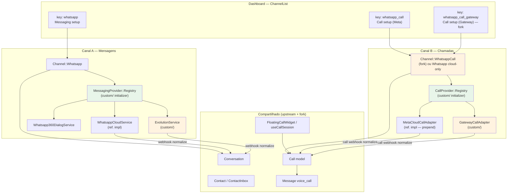
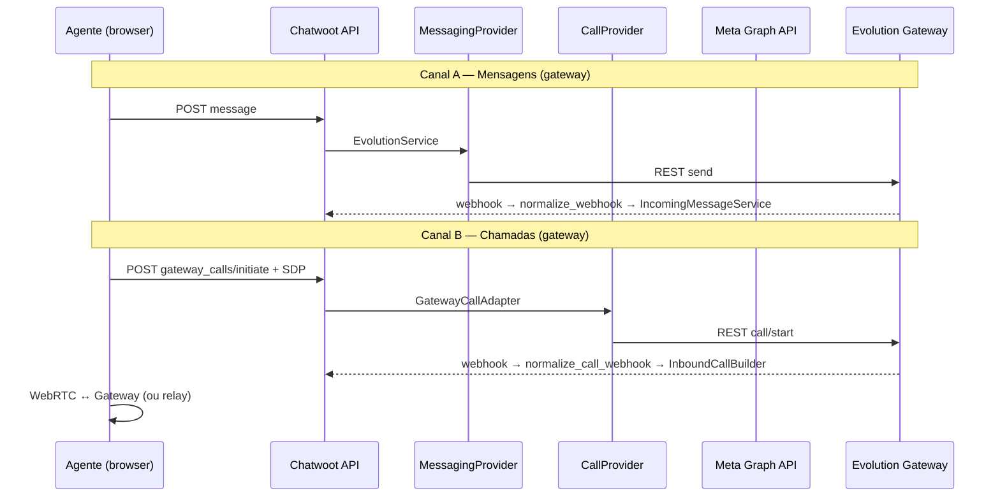
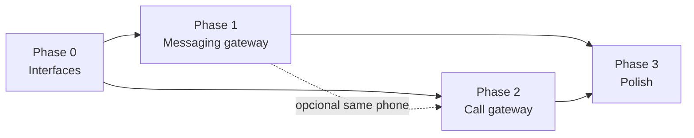

# Arquitetura dual-channel: WhatsApp mensagens + chamadas com providers alternativos

Documento **mestre** de arquitetura para o fork Chatwoot. Define dois canais **independentes** na UI e produto — mensagens WhatsApp e chamadas WhatsApp — cada um com **registry de providers** extensível, usando as implementações **oficiais Meta** como referência e permitindo **gateways não oficiais** (Evolution, Baileys, CPaaS) em ambos os eixos.

**Relacionados:**

- [architecture-current-whatsapp.md](./architecture-current-whatsapp.md) — estado atual de mensagens
- [provider-coupling-and-extensibility.md](../whatsapp-voice/provider-coupling-and-extensibility.md) — acoplamento de voz
- [generic-whatsapp-call-channel.md](./generic-whatsapp-call-channel.md) — canal genérico de chamadas via gateway
- [implementation-plan-second-whatsapp-provider.md](./implementation-plan-second-whatsapp-provider.md) — plano de segundo provider de mensagens
- [whatsapp-voice/README.md](../whatsapp-voice/README.md) — índice voz oficial
- [fork-strategy.mdc](../../.cursor/rules/fork-strategy.mdc) — disciplina de branch e merge

---

## 1. Visão do produto

### Dois canais independentes

O operador configura **dois inboxes distintos** quando precisa de mensagens e voz via WhatsApp, cada um com provider próprio:

| Canal (UI) | `ChannelList` key | Modelo backend | Propósito |
|------------|-------------------|----------------|-----------|
| **WhatsApp** (mensagens) | `whatsapp` | `Channel::Whatsapp` | Texto, mídia, templates, campanhas, CSAT |
| **WhatsApp Call** (voz) | `whatsapp_call` (oficial) ou `whatsapp_call_gateway` (fork) | `Channel::Whatsapp` (Meta) **ou** `Channel::WhatsappCall` (fork) | Apenas chamadas de voz in-app |

Hoje o Chatwoot já expõe essa **separação na UI** (`whatsapp` vs `whatsapp_call` vs `voice`/Twilio). A generalização alvo:

1. **Canal A — Mensagens:** qualquer `MessagingProvider` registrado (`whatsapp_cloud`, `default`/360dialog, `evolution`, …).
2. **Canal B — Chamadas:** qualquer `CallProvider` registrado (`meta_cloud`, `gateway_evolution`, …).

Os canais **não compartilham** inbox, webhook de voz ou wizard de setup — apenas podem **referenciar o mesmo número** de telefone (decisão de produto; ver §6).

### Padrão de referência

As implementações **oficiais Meta** servem de **template de contrato**, não de acoplamento:

- **Mensagens:** `Whatsapp::Providers::WhatsappCloudService` + `IncomingMessageWhatsappCloudService`
- **Chamadas:** `Enterprise::Whatsapp::Providers::WhatsappCloudService` (prepend) + `useWhatsappCallSession`

Providers alternativos **implementam as mesmas interfaces**, traduzindo para REST/webhook do gateway.

### Objetivos de engenharia

- Adaptar ao código existente com **fricção mínima** (reuso de `Call`, builders, widgets).
- **Merge-safe** para sync com `chatwoot/chatwoot` (`custom/`, `prepend_mod_with`, `# FORK:`).
- Documentar contratos que **ambos os lados** (backend Ruby + frontend JS) podem implementar.

---

## 2. Estado atual Chatwoot

### Mensagens — acoplamento parcial

`Channel::Whatsapp` já tem dispatch de provider:

```64:70:app/models/channel/whatsapp.rb
  def provider_service
    if provider == 'whatsapp_cloud'
      Whatsapp::Providers::WhatsappCloudService.new(whatsapp_channel: self)
    else
      Whatsapp::Providers::Whatsapp360DialogService.new(whatsapp_channel: self)
    end
  end
```

| Aspecto | Situação |
|---------|----------|
| Envio | ✅ `BaseService` — `send_message`, `send_template`, `sync_templates`, `validate_provider_config` |
| Recebimento | ⚠️ Switch por provider no job (`IncomingMessageService` vs `IncomingMessageWhatsappCloudService`) |
| Webhook | ⚠️ Formato Meta nested vs flat 360dialog; assinatura HMAC só cloud |
| Features cloud-only | Campanhas, CSAT, embedded signup, SMB echoes, voice PTT |

Ver detalhes em [architecture-current-whatsapp.md](./architecture-current-whatsapp.md).

### Voz — dois stacks quase independentes

| Stack | Canal | Modelo de mídia | API agente |
|-------|-------|-----------------|------------|
| **Twilio** | `Channel::TwilioSms` + `voice_enabled` | PSTN / conferência (SDK Twilio) | `ConferenceController`, `VoiceAPI` |
| **WhatsApp nativo** | `Channel::Whatsapp` + `whatsapp_cloud` + `calling_enabled` | WebRTC browser↔Meta | `WhatsappCallsController`, SDP |

`Channel::Whatsapp` **mistura** mensagens e voz no mesmo modelo quando `provider == 'whatsapp_cloud'`:

```46:62:app/models/channel/whatsapp.rb
  def voice_enabled?
    voice_calling_supported? &&
      provider_config['calling_enabled'].present? &&
      account.feature_enabled?('channel_voice')
  end

  def voice_calling_supported?
    provider == 'whatsapp_cloud'
  end
```

O tile **WhatsApp Call (Beta)** cria outro inbox `Channel::Whatsapp` via embedded signup e chama `enable_whatsapp_calling` — canal de setup separado, **mesmo STI**.

### O que já está separado

| Camada | Mensagens | Chamadas |
|--------|-----------|----------|
| UI setup | `Whatsapp.vue` / `CloudWhatsapp.vue` | `WhatsappCall.vue` (`whatsapp_call` key) |
| Twilio PSTN | — | `voice` key → `Channel::TwilioSms` |
| Modelo `Call` | — | Enum `provider: { twilio, whatsapp }` compartilhado |
| Widgets | Thread de conversa | `FloatingCallWidget`, `VoiceCall.vue` (compartilhados) |
| Tempo real | `message.created` | ActionCable `voice_call.*` (WhatsApp) ou `message.updated` (Twilio) |

### Conclusão do estado atual

- **Mensagens:** padrão provider existe; falta **registry** e **normalizer** de webhook genérico.
- **Voz:** camadas compartilhadas (`Call`, builders); **sem interface** formal; WhatsApp calls acoplados a Meta Graph + `useWhatsappCallSession`.
- **UI:** já há precedente de **dois tiles WhatsApp** (`whatsapp` + `whatsapp_call`).

---

## 3. Padrão alvo (Target Architecture)



### Princípios

1. **Registry injetado** em `custom/` — evita editar `PROVIDERS` / `provider_service` no OSS (ou um `# FORK:` mínimo delegando ao registry).
2. **Adapters finos** — toda lógica Meta/Evolution fica nos services; canal delega.
3. **Normalizers de webhook** — convertem payload externo → **formato interno canônico** antes dos serviços incoming existentes.
4. **Shared domain** — `Contact`, `Conversation`, `Call`, mensagens `voice_call`, Pinia `calls.js` permanecem agnósticos.

---

## 4. Interfaces propostas

### 4.1 Backend — `MessagingProvider::Base`

Evolução formal de `Whatsapp::Providers::BaseService` + extensões para webhook.

```ruby
# custom/lib/messaging_provider/base.rb (contrato documentado; OSS permanece BaseService)
module MessagingProvider
  class Base
    def initialize(channel:); @channel = channel; end

    # Outbound
    def send_message(phone_number, message); end      # => provider_message_id
    def send_template(phone_number, template_info, message); end
    def media_url(media_id); end                      # opcional por provider

    # Sync & config
    def sync_templates; end
    def validate_provider_config; end                 # => boolean
    def error_message(response); end

    # Webhook (novo — crítico para gateways)
    def normalize_webhook(params); end                # => CanonicalInboundPayload | nil
    def webhook_signature_valid?(request); end      # => boolean
    def register_webhooks!(callback_url); end         # opcional
    def teardown_webhooks!; end                       # opcional

    # Capabilities (para UI / feature gates)
    def capabilities
      { templates: true, media: true, interactive: true, campaigns: false, voice_ptt: false }
    end
  end

  # Payload interno mínimo após normalize_webhook
  CanonicalInboundPayload = Data.define(
    :contacts, :messages, :statuses, :call_events, :raw_provider
  )
end
```

**Implementações de referência:**

| Provider key | Classe | Notas |
|--------------|--------|-------|
| `whatsapp_cloud` | `Whatsapp::Providers::WhatsappCloudService` | Envio; normalizer = pass-through nested Meta |
| `default` | `Whatsapp::Providers::Whatsapp360DialogService` | Flat payload |
| `evolution` | `Custom::Whatsapp::Providers::EvolutionService` | REST Evolution + normalizer Baileys |

### 4.2 Backend — `CallProvider::Base`

Contrato novo; espelha métodos do prepend Enterprise em `WhatsappCloudService`.

```ruby
# custom/lib/call_provider/base.rb
module CallProvider
  class Base
    def initialize(channel:); @channel = channel; end

    # Lifecycle / registro
    def validate_credentials!; end
    def enable_calling!; end                        # Meta: update_calling_status + webhook subscribe
    def disable_calling!; end
    def register_webhooks!(callback_url); end

    # Signaling (WebRTC-style)
    def initiate_call(to_phone:, sdp_offer:, metadata: {}); end  # => { call_id:, sdp_answer?: }
    def pre_accept_call(call_id:, sdp_answer:); end              # Meta-specific; noop em gateways
    def accept_call(call_id:, sdp_answer:); end
    def reject_call(call_id:); end
    def terminate_call(call_id:); end

    # Inbound
    def normalize_call_webhook(params); end         # => CallWebhookEvent(s)
    def call_webhook_signature_valid?(request); end

    # WebRTC helpers
    def ice_servers; Call.default_ice_servers; end
    def supports_call_permission_request?; false; end
    def send_call_permission_request(to_phone:, body:); end  # só Meta

    def capabilities
      { inbound: true, outbound: true, recording: true, permission_request: false }
    end
  end

  CallWebhookEvent = Data.define(
    :event,           # :connect, :terminate, :status
    :call_id, :from, :to,
    :sdp_offer, :sdp_answer, :status, :end_reason
  )
end
```

### 4.3 Frontend — registry de sessão

```javascript
// custom/.../callSessionRegistry.js
export const callSessionRegistry = {
  whatsapp: () => useWhatsappCallSession(),           // ref. impl Meta
  whatsapp_gateway: () => useGatewayCallSession(),    // fork
  twilio: () => useTwilioCallSession(),               // existente via SDK
};

// useWebRtcCallSession(callsAPI) — core extraído de useWhatsappCallSession
// GatewayCallsAPI | WhatsappCallsAPI implementam: initiate, accept, reject, terminate, show, uploadRecording
```

```javascript
// messagingProviderCapabilities.js (fork)
export const MESSAGING_PROVIDER_KEYS = {
  WHATSAPP_CLOUD: 'whatsapp_cloud',
  DEFAULT: 'default',
  EVOLUTION: 'evolution',
};
```

---

## 5. Mapeamento: oficial → adapter pattern

### 5.1 Mensagens Meta → referência

| Método / fluxo | Referência upstream | Gateway (Evolution) |
|----------------|---------------------|---------------------|
| `send_message` | `WhatsappCloudService#send_message` → Graph `/messages` | `EvolutionService#send_message` → `POST /message/sendText` |
| `send_template` | Graph template message | Lista local / texto livre se gateway não surface templates |
| `sync_templates` | `fetch_whatsapp_templates` WABA | Noop ou sync REST gateway |
| `validate_provider_config` | GET `message_templates` | GET connection state / instance status |
| `normalize_webhook` | Identity (job usa `IncomingMessageWhatsappCloudService`) | `GatewayNormalizer` → flat `{ contacts, messages, statuses }` |
| Incoming | `WhatsappEventsJob#handle_message_events` | Mesmo job após normalize → `IncomingMessageService` |

### 5.2 Chamadas Meta → referência

| Método / fluxo | Referência upstream | Gateway |
|----------------|---------------------|---------|
| `initiate_call` | `WhatsappCloudService#initiate_call` → Graph `/calls` | `GatewayCallAdapter#initiate_call` → REST gateway |
| `pre_accept` / `accept` | Graph `action: pre_accept/accept` + SDP | Gateway-specific ou skip pre_accept |
| `reject` / `terminate` | Graph `action: reject/terminate` | REST hangup |
| Inbound | `Enterprise::Webhooks::WhatsappEventsJob` `field=calls` | `GatewayCallsJob` + `normalize_call_webhook` |
| Frontend | `useWhatsappCallSession` → `/whatsapp_calls` | `useGatewayCallSession` → `/gateway_calls` |
| ICE | `Call.default_ice_servers` + Meta STUN | `CallProvider#ice_servers` (gateway pode expor TURN) |
| Permissão outbound | `send_call_permission_request` interactive | `supports_call_permission_request?` → false; UX alternativa |

### 5.3 Diagrama de adapters



---

## 6. Separação de canais na UI

### ChannelList e ChannelFactory

Estado atual (`ChannelList.vue`):

- `whatsapp` → wizard mensagens
- `whatsapp_call` → embedded signup Meta + auto-enable calling
- `voice` → Twilio PSTN (não confundir com WhatsApp in-app)

**Evolução fork:**

| key | Componente setup | `channel_type` | Provider examples |
|-----|------------------|----------------|-------------------|
| `whatsapp` | `Whatsapp.vue` (+ card Evolution) | `Channel::Whatsapp` | `whatsapp_cloud`, `default`, `evolution` |
| `whatsapp_call` | `WhatsappCall.vue` | `Channel::Whatsapp` | `whatsapp_cloud` only |
| `whatsapp_call_gateway` | `WhatsappCallGateway.vue` (`custom/`) | `Channel::WhatsappCall` | `gateway_evolution` |

### Feature flags

| Flag | Escopo |
|------|--------|
| `channel_whatsapp` (implícito) | Tile whatsapp |
| `channel_voice` | Qualquer inbox com `voice_enabled?` |
| `channel_whatsapp_call_gateway` (fork, opcional) | Tile gateway call |

### Mesmo número em dois inboxes?

**Decisão recomendada: permitir, sem merge automático.**

| Abordagem | Prós | Contras |
|-----------|------|---------|
| **A — Dois inboxes, mesmo `phone_number`** | Alinha com UI atual (2 tiles); providers independentes; merge-safe | `ContactInbox` distintos; agente escolhe inbox ao responder; histórico de voz separado do de texto |
| **B — Um inbox, dois providers** | Histórico unificado | Viola independência; acopla webhook; alto conflito upstream |
| **C — Vinculação explícita (`linked_channel_id`)** | UX pode unificar conversas no futuro | Complexidade extra; não necessário no MVP |

**MVP:** A — reutilizar unique index em `channel_whatsapp.phone_number` **por canal**; para `Channel::WhatsappCall`, tabela própria ou `provider_config['phone_number']` sem unique global cross-table (validar no fork).

Conversas de **texto** ficam no inbox mensagens; **calls** geram `Call` + `voice_call` message no inbox de voz. Cross-link opcional na sidebar (fase 3).

### Wizards por provider

- **Meta messaging:** embedded signup / manual IDs (existente)
- **Gateway messaging:** URL, API key, instance, QR polling (`Custom::Whatsapp::ConnectionService`)
- **Meta calling:** `WhatsappCall.vue` + `enable_whatsapp_calling` (existente)
- **Gateway calling:** credenciais gateway + test call + webhook URL (`Custom::WhatsappCall::SetupService`)

---

## 7. Estratégia fork merge-safe

Alinhada a [fork-strategy.mdc](../../.cursor/rules/fork-strategy.mdc) e [fork-merge-conflicts.mdc](../../.cursor/rules/fork-merge-conflicts.mdc).

### Onde vive cada peça

| Prioridade | Local | Exemplos |
|------------|-------|----------|
| 1 — Preferido | `custom/` overlay | `EvolutionService`, `GatewayCallAdapter`, `GatewayNormalizer`, controllers, Vue wizards |
| 2 | `prepend_mod_with` / Enterprise module | Registry hook em `Channel::Whatsapp`, `WhatsappEventsJob` router |
| 3 | `# FORK:` mínimo no OSS | Uma linha em `provider_service` delegando a `MessagingProvider::Registry.fetch(provider)` |
| 4 — Evitar | Editar corpo de serviços cloud | Não modificar `WhatsappCloudService` para gateway |

### Extension points sem forkar corpo de `Channel::Whatsapp`

```ruby
# custom/config/initializers/messaging_provider_registry.rb
MessagingProvider::Registry.register('evolution') do |channel|
  Custom::Whatsapp::Providers::EvolutionService.new(whatsapp_channel: channel)
end

# custom/app/models/custom/channel/whatsapp.rb
module Custom::Channel::Whatsapp
  def provider_service
    MessagingProvider::Registry.fetch(provider, self) || super
  end
end
Channel::Whatsapp.prepend(Custom::Channel::Whatsapp)
```

```ruby
# custom/config/initializers/call_provider_registry.rb
CallProvider::Registry.register('gateway_evolution') do |channel|
  Custom::CallProvider::EvolutionAdapter.new(channel: channel)
end
```

### Frontend fork

- Novos componentes em `custom/app/javascript/...` (se autoload configurado) **ou** arquivos upstream com `// FORK:` import único
- Registry JS em `custom/`; **um** `// FORK:` em `useCallSession.js` para delegar ao registry

### Inventário FORK

```bash
rg "FORK:" app enterprise custom config
bin/fork-inventory   # gera doc/fork-divergences.txt
```

### O que **não** fazer

- Duplicar `WhatsappCloudService` inteiro no fork
- Acoplar gateway de mensagens ao `WhatsappEventsJob` Enterprise (`field=calls`)
- Commitar em `develop`

---

## 8. Fases de implementação

| Fase | Escopo | Entregáveis | Esforço |
|------|--------|-------------|---------|
| **0 — Contratos (fork only)** | Interfaces + registries vazios; docs; prepend hooks | `MessagingProvider::Base`, `CallProvider::Base`, initializers, `# FORK:` delegators | 1 sem |
| **1 — Gateway mensagens** | Evolution (ou piloto) texto + status | `EvolutionService`, normalizer, wizard, job dispatch | 2–3 sem |
| **2 — Gateway chamadas** | Só se gateway expõe voice API | `Channel::WhatsappCall`, `GatewayCallAdapter`, `GatewayCallsController`, `useGatewayCallSession` | 3–5 sem |
| **3 — Polish** | Mídia, templates gateway, cross-link UI, health/QR | Fases 2–3 de [effort-estimate-and-phases.md](./effort-estimate-and-phases.md) | 2–4 sem |

**Phase 0** não altera comportamento upstream — apenas prepara extensão.

**Phase 2** pré-requisito: confirmação documentada de API de voz do gateway ([official-vs-unofficial-restrictions.md](./official-vs-unofficial-restrictions.md) §4).

Dependências entre fases:



---

## 9. Riscos upstream

Arquivos de **alto churn** no upstream WhatsApp/voice — minimizar edits; preferir `custom/` + prepend.

| Arquivo / área | Churn | Estratégia fork |
|----------------|-------|-----------------|
| `app/models/channel/whatsapp.rb` | Alto | Prepend `Custom::Channel::Whatsapp`; evitar editar OSS |
| `app/services/whatsapp/providers/whatsapp_cloud_service.rb` | Alto | Referência only; gateway em `custom/` |
| `enterprise/.../whatsapp_cloud_service.rb` (calls) | Médio-alto | Referência; `CallProvider` em `custom/` |
| `app/jobs/webhooks/whatsapp_events_job.rb` | Alto | Prepend router: `normalize → super` |
| `enterprise/.../whatsapp_events_job.rb` | Médio | Não acoplar gateway aqui |
| `app/javascript/.../useWhatsappCallSession.js` | Alto | Extrair `useWebRtcCallSession` no fork; upstream continua wrapper |
| `useCallSession.js` | Médio | Um `// FORK:` registry |
| `ChannelList.vue` / `ChannelFactory.vue` | Médio | `# FORK:` push tile gateway ou componente wrapper |
| `config/routes.rb` | Alto | Rotas gateway em `custom/config/routes.rb` ou engine |
| `WhatsappCallsController` | Médio | Paralelo `GatewayCallsController` em `custom/` |

**Mitigação:** sync frequente `develop` ← upstream; rebase `main`; grep `FORK:` pós-merge.

---

## 10. Comparação: dois canais vs um canal só

| Critério | **Dois canais (recomendado)** | **Um canal (`Channel::Whatsapp` único)** |
|----------|-------------------------------|------------------------------------------|
| Independência de providers | Mensagem Evolution + voz Meta (ou vice-versa) | Força mesmo `provider` ou lógica bifurcada no model |
| APIs não oficiais | Gateway mensagens **não** precisa implementar voz | Tentação de "inbox único" quebra quando voz ausente |
| UI / operação | Alinha com tiles existentes (`whatsapp` + `whatsapp_call`) | Confunde agente ("este inbox liga ou não?") |
| Webhooks | URLs distintas; normalizers separados | Multiplexar `messages` + `calls` no mesmo endpoint — frágil |
| Merge upstream | Extensão por novo `channel_type` ou tile; OSS untouched | Edita `voice_enabled?`, `provider_service`, jobs — conflitos |
| Histórico | Conversas vs calls separados (clareza) | Unificado mas heterogêneo |
| Twilio | Permanece canal `voice` PSTN separado | Mesma confusão se misturado |

**Veredito:** para gateways não oficiais, **dois canais** espelham a realidade do produto (mensagens estáveis ≠ voz experimental), reutilizam o precedente UI do Chatwoot, e reduzem superfície de conflito no sync upstream.

---

## Apêndice — checklist de implementação

### Backend

- [ ] `MessagingProvider::Registry` + `CallProvider::Registry` em `custom/`
- [ ] Prepend `Channel::Whatsapp#provider_service`
- [ ] Modelo `Channel::WhatsappCall` (fork) com `call_provider` string
- [ ] Normalizers webhook mensagem e chamada
- [ ] Controllers REST: reusar padrão `WhatsappCallsController` ou generalizar

### Frontend

- [ ] Tile `whatsapp_call_gateway` + wizard
- [ ] Card Evolution em `Whatsapp.vue`
- [ ] `callSessionRegistry` + `useWebRtcCallSession` extract
- [ ] `getVoiceCallProvider()` estendido para `Channel::WhatsappCall`

### Operação

- [ ] Feature flags documentadas
- [ ] `doc/fork-divergences.txt` atualizado após cada fase
- [ ] Validar contrato voice com gateway antes Phase 2

---

*Última atualização: jun/2026 — fork Chatwoot.*
