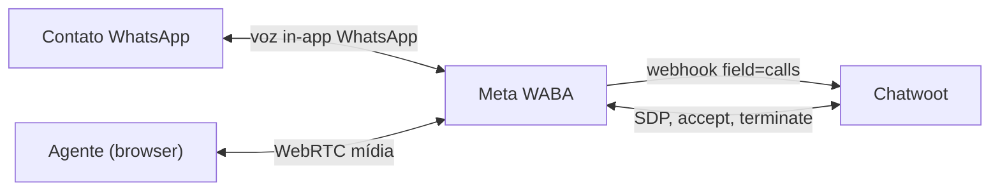
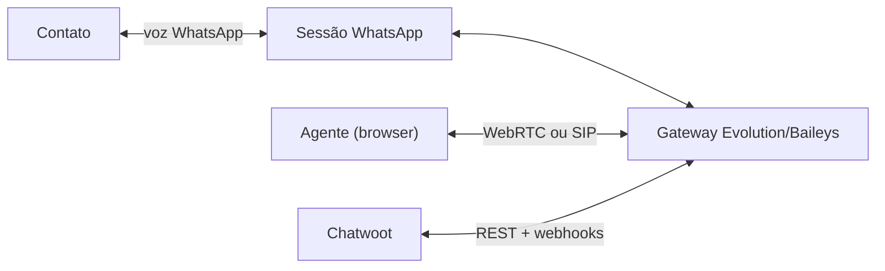
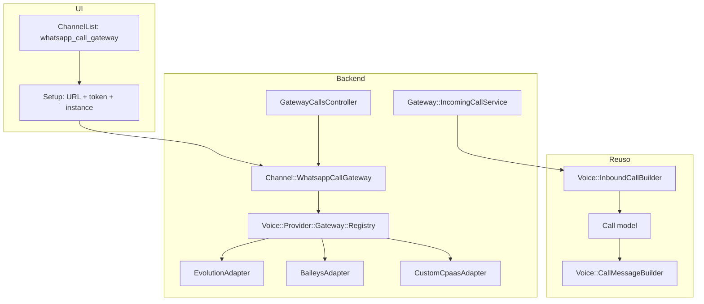
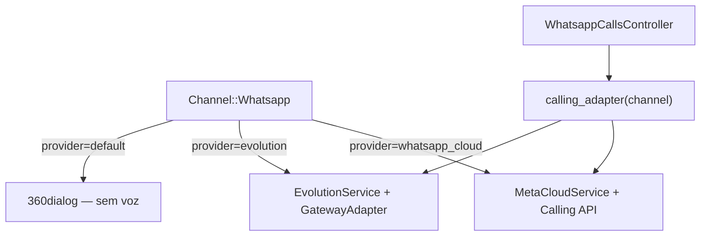
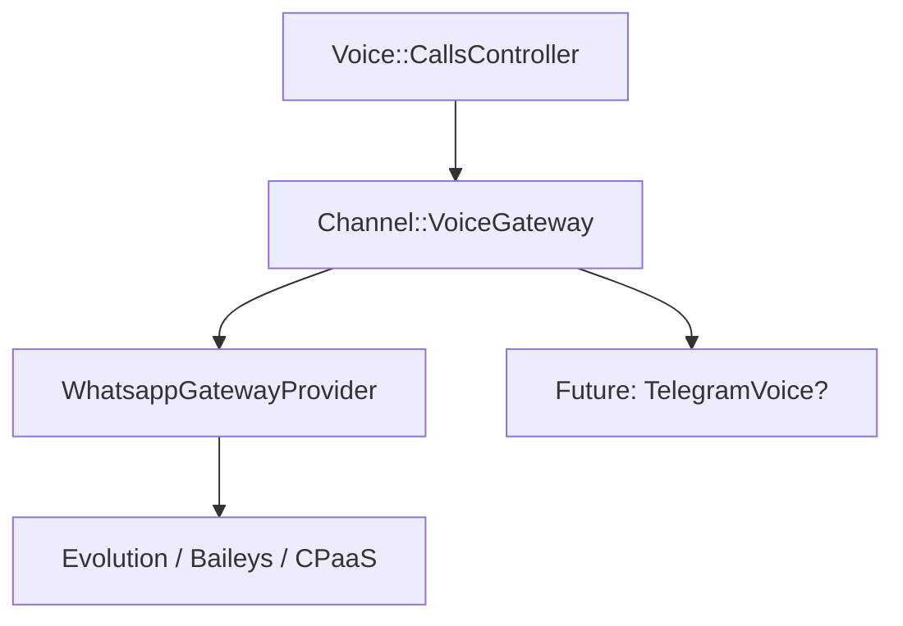
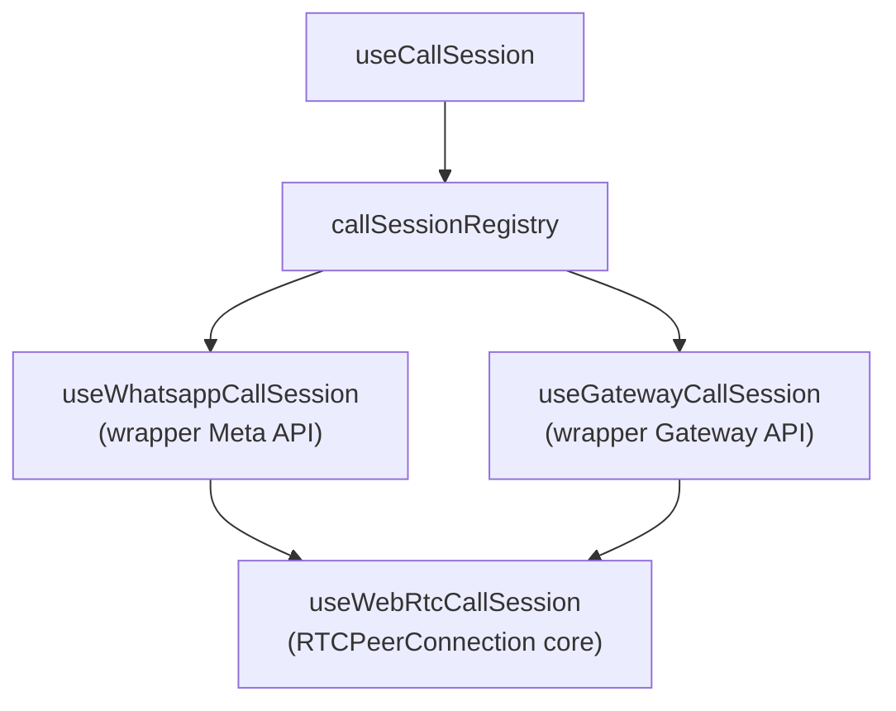
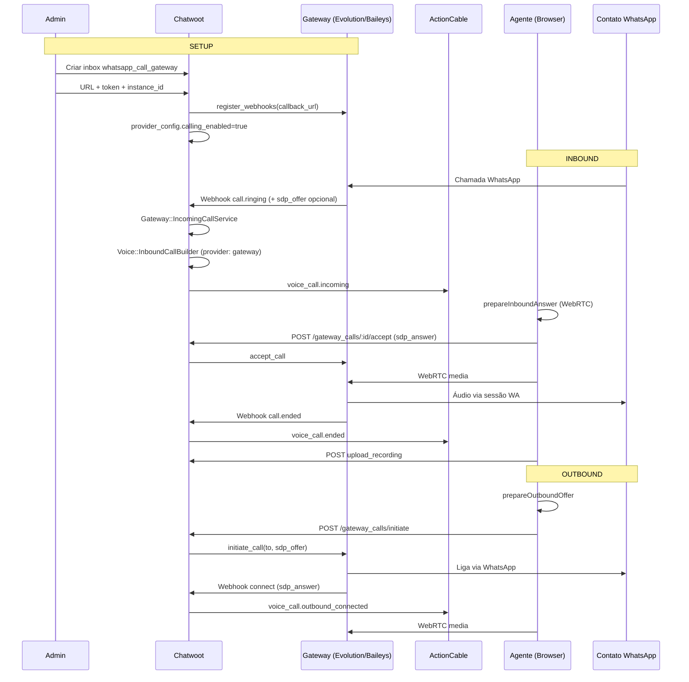

# Canal genérico de chamadas WhatsApp via API não oficial

Análise de viabilidade e arquitetura para um canal de **chamadas de voz WhatsApp** no dashboard Chatwoot, alimentado por **APIs não oficiais** (Evolution API, Baileys gateway, CPaaS customizado, etc.) — **não** a Meta Cloud Calling API.

Documentação relacionada (stack oficial):

- [architecture-and-flow.md](../whatsapp-voice/architecture-and-flow.md) — fluxo Meta + WebRTC browser↔Meta
- [provider-coupling-and-extensibility.md](../whatsapp-voice/provider-coupling-and-extensibility.md) — acoplamento atual e reuso
- [second-provider-strategy.md](../whatsapp-voice/second-provider-strategy.md) — segundo provider **compatível com Meta Calling API** (CPaaS proxy)
- [twilio-vs-whatsapp-native.md](../whatsapp-voice/twilio-vs-whatsapp-native.md) — por que Twilio Voice não substitui WhatsApp in-app

---

## 1. Visão do produto

### Objetivo

Oferecer ao agente a **mesma experiência de produto** do canal **"WhatsApp Call (Beta)"** existente:

- Receber chamadas inbound com popup (`FloatingCallWidget`)
- Iniciar chamadas outbound a partir da conversa
- Histórico na thread como mensagem `content_type: voice_call`
- Áudio no navegador (microfone + WebRTC ou SDK equivalente)

A diferença é o **backend de sinalização e mídia**: em vez de Meta Graph API (`field=calls`, SDP offer/answer via WABA), um **gateway de terceiros** que mantém sessão WhatsApp via Baileys/Evolution e expõe chamadas por API própria.

### Premissa crítica

> **Antes de implementar, confirmar com o provider alvo se voice é suportado e qual o modelo de mídia.**

A maioria das integrações não oficiais foca em **mensagens** (texto, mídia, templates). Chamadas de voz são **opcionais, experimentais ou inexistentes** na API pública.

| Provider típico | Mensagens | Chamadas de voz | Modelo provável |
|-----------------|-----------|-----------------|-----------------|
| Evolution API | ✅ Baileys | ⚠️ Variável / instável | Webhook + REST; voz pode exigir módulo/plugin ou versão específica |
| Baileys (lib) | ✅ | ⚠️ Via `call` events na lib | Gateway hospeda WebRTC ou encaminha para SIP |
| 360dialog | ✅ Cloud | ❌ Sem Calling API | Não aplicável |
| CPaaS custom | Depende | Depende | Contrato próprio — única fonte de verdade |
| Meta Cloud (oficial) | ✅ | ✅ Calling API | Browser↔Meta WebRTC — **referência atual no Chatwoot** |

**Assunções documentadas (validar por provider):**

1. O gateway aceita **inbound call events** via webhook (caller, call_id, opcionalmente SDP ou URL de join).
2. O agente negocia mídia via **WebRTC para o gateway** (não diretamente para Meta) **ou** via **click-to-call** onde o gateway conecta os legs.
3. Outbound é disparado por REST (`POST /call` ou similar) com `to` + metadados de conversa.
4. Não há `call_permission_request` Meta — opt-in outbound pode ser inexistente ou manual.
5. Estabilidade e ToS: risco operacional e de conta WhatsApp.

---

## 2. Registro de canais na UI (estado atual)

### ChannelList.vue

Três entradas relevantes para voz:

| `key` | Título (i18n) | Canal backend | Propósito |
|-------|---------------|---------------|-----------|
| `whatsapp` | WhatsApp | `Channel::Whatsapp` | Mensagens (Cloud ou 360dialog) |
| `whatsapp_call` | WhatsApp Call (Beta) | `Channel::Whatsapp` (`whatsapp_cloud`) | Embedded Signup + auto `enable_whatsapp_calling` |
| `voice` | Voice | `Channel::TwilioSms` | PSTN Twilio — **não** WhatsApp in-app |

```98:103:app/javascript/dashboard/routes/dashboard/settings/inbox/ChannelList.vue
  channels.push({
    key: 'whatsapp_call',
    title: t('INBOX_MGMT.ADD.AUTH.CHANNEL.WHATSAPP_CALL.TITLE'),
    description: t('INBOX_MGMT.ADD.AUTH.CHANNEL.WHATSAPP_CALL.DESCRIPTION'),
    icon: 'i-woot-whatsapp',
  });
```

### ChannelFactory.vue

Mapeia `sub_page` → componente de setup:

```17:31:app/javascript/dashboard/routes/dashboard/settings/inbox/ChannelFactory.vue
const channelViewList = {
  ...
  whatsapp: Whatsapp,
  whatsapp_call: WhatsappCall,
  ...
  voice: Voice,
};
```

`WhatsappCall.vue` é um wrapper fino sobre `WhatsappEmbeddedSignup` com `enable-calling-on-complete` — **100% Meta Embedded Signup**, não aplicável a gateway não oficial.

### ChannelItem.vue — gates

| Canal | Condição `isActive` |
|-------|---------------------|
| `voice` | `enabledFeatures.channel_voice` |
| `whatsapp_call` | `channel_voice` **e** `window.chatwootConfig.whatsappAppId` configurado |
| Demais | feature flag por canal ou sempre ativo |

Badges: `whatsapp_call` e `voice` exibem Beta + voice badge quando `channel_voice` está ativo.

### Feature flags

- `channel_voice` (`FEATURE_FLAGS.CHANNEL_VOICE`) — gate comum para Twilio Voice e WhatsApp Calling
- Não existe flag separada para gateway não oficial; sugerido no fork: `channel_whatsapp_gateway` (rollout gradual) ou reusar `channel_voice`

### Como adicionar canal gateway no fork

**Opção UI-A — Nova key dedicada (recomendado para MVP fork):**

```
whatsapp_call_gateway  →  ChannelFactory → WhatsappCallGateway.vue
```

- Setup: API URL, token, instance ID, webhook URL gerada pelo Chatwoot
- Gate: `channel_voice` (+ flag opcional `channel_whatsapp_gateway`)
- **Sem** dependência de `whatsappAppId` / Embedded Signup

**Opção UI-B — Estender `whatsapp_call` com seletor de provider:**

- Mesma entrada na lista; primeiro passo: "Oficial (Meta)" vs "Gateway (API customizada)"
- Menos tiles na lista; mais complexidade no wizard
- Risco de confusão para admins

**Opção UI-C — Estender canal `whatsapp` existente:**

- Tab "Provider" no setup de mensagens + tab Calls
- Acopla messaging e voice no mesmo inbox — bom se Evolution for **mensagens + voz** no mesmo instance

---

## 3. Realidade técnica — API não oficial vs Meta Calling

### Stack oficial (referência)



- Sinalização: Graph API Calls (`pre_accept`, `accept`, `terminate`, `initiate`)
- Mídia: **P2P browser ↔ Meta** (STUN/TURN configurável)
- Chatwoot não transita áudio

### Stack gateway não oficial (padrão comum)



**Diferenças que impactam implementação:**

| Aspecto | Meta Calling (oficial) | Gateway não oficial |
|---------|------------------------|---------------------|
| SDP offer/answer | Formato Meta Graph API | Formato do gateway (pode ser WebRTC padrão, URL de sala, ou ausente) |
| Endpoint REST | `/whatsapp_calls/*` acoplado | Novo controller ou genérico `/gateway_calls/*` |
| Webhook | `WhatsappEventsJob` `field=calls` | Rota dedicada; payload proprietário |
| ICE servers | `Call.default_ice_servers` + Meta | Servidores do **gateway** (TURN do CPaaS) |
| Permissão outbound | `call_permission_request` template | Geralmente **não existe** |
| Gravação | Upload client-side pós-chamada | Pode ser no gateway ou inexistente |
| Mensagens | Mesmo inbox WhatsApp Cloud | Pode ser mesmo instance Evolution ou canal separado |

### Cenários de capacidade do provider

1. **Sem voz** — só mensagens → canal de chamadas **inviável**; parar análise.
2. **Click-to-call** — gateway liga para contato; agente atende via web phone ou SIP → UX diferente; reuso parcial da UI.
3. **WebRTC browser↔gateway** — mais próximo do stack atual; reuso alto de `useWhatsappCallSession` com API injetável.
4. **SIP bridge** — agente precisa softphone ou integração Twilio-like → desvia do padrão WebRTC atual.

---

## 4. Três opções de arquitetura

### Opção A — `Channel::WhatsappCallGateway` + adapter de provider

Novo modelo STI (`channel_whatsapp_call_gateways`), inbox dedicado **voice-first**, registry de adapters.



| | |
|---|---|
| **Prós** | Separação clara do `Channel::Whatsapp` oficial; setup sem Meta; adapters plugáveis em `custom/`; menor risco em merge upstream |
| **Contras** | Novo modelo + migration; inbox separado de mensagens (a menos que se ligue manualmente); duplicação de tile na UI |
| **Acoplamento** | Baixo com OSS WhatsApp Cloud |
| **Esforço MVP** | **4–6 semanas** (adapter + webhook + WebRTC + UI setup) |
| **Melhor quando** | Voice via gateway **sem** usar Cloud API para mensagens, ou voice-only |

### Opção B — Estender `Channel::Whatsapp` com `provider` enum

Adicionar `evolution`, `baileys_gateway`, etc. ao `PROVIDERS`, prepend em `custom/` para `voice_calling_supported?` e `provider_service`.



| | |
|---|---|
| **Prós** | Mesma conversa/contact_inbox para mensagens e chamadas; reutiliza inbox WhatsApp; alinha com [second-provider-strategy.md](../whatsapp-voice/second-provider-strategy.md) se API for **Meta-like** |
| **Contras** | `provider_config` heterogêneo; validação complexa; Evolution messaging + voice no mesmo canal mistura stacks muito diferentes; edits em `Channel::Whatsapp` exigem `# FORK:` ou prepend |
| **Acoplamento** | **Alto** com modelo WhatsApp upstream |
| **Esforço MVP** | **3–5 semanas** se gateway expõe API SDP-compatível; **6+** se payload divergir muito |
| **Melhor quando** | Um único instance Evolution/Baileys faz **mensagens e voz** e você quer um inbox unificado |

### Opção C — `Channel::VoiceGateway` genérico (mensagens opcionais)

Abstração acima de WhatsApp: canal de voz com `provider_registry`, mensagens opcionais via concern.



| | |
|---|---|
| **Prós** | Máxima extensibilidade; contrato único `Voice::Provider::Base`; prepara 3º provider |
| **Contras** | Over-engineering para fork MVP; novo domínio STI; refactor de `getVoiceCallProvider`, rotas, settings |
| **Acoplamento** | Médio — código novo em `custom/`, pouca edição OSS |
| **Esforço MVP** | **6–8 semanas** |
| **Melhor quando** | Roadmap com múltiplos gateways não-Meta ou voz além de WhatsApp |

### Recomendação para o fork

| Cenário | Opção |
|---------|--------|
| Gateway não oficial, voice separado ou MVP rápido | **A** |
| Evolution como canal único mensagens+voz | **B** (com adapters em `custom/`) |
| Plataforma multi-gateway longo prazo | **C** após validar A |

**Recomendação padrão: Opção A** em `custom/` — `Channel::WhatsappCallGateway` + `Voice::Provider::Gateway::*`, tile UI `whatsapp_call_gateway`, espelhando UX do Beta oficial sem Embedded Signup.

---

## 5. Reuso do codebase atual

### Pode reutilizar (alto valor)

| Componente | Notas |
|------------|-------|
| `Call` model | Novo enum `gateway: 2` ou `whatsapp_gateway: 2`; `meta` guarda SDP/ICE do gateway |
| `Voice::InboundCallBuilder` | Já aceita `provider:` e `extra_meta`; ajustar `source_id_for_provider` para gateway (prepend) |
| `Voice::OutboundCallBuilder` | Se outbound conversation-scoped |
| `Voice::CallMessageBuilder` | Mensagens `voice_call` na thread |
| `FloatingCallWidget` | Agnóstico de provider se store expõe `provider` |
| `calls.js` (Pinia) | `teardownByProvider` — adicionar case gateway |
| `useCallSession.js` | Ponto de extensão — registry em vez de `isWhatsappCall` |
| Feature `channel_voice` | Gate comum |
| ActionCable `voice_call.*` | Reusar eventos se payload incluir `provider: 'gateway'` |

### Deve substituir / criar

| Componente oficial | Substituto gateway |
|--------------------|-------------------|
| Meta SDP flow (`pre_accept` / `accept`) | Adapter `GatewayAdapter#accept(call_id, sdp)` |
| `WhatsappCloudService` métodos `*_call` | `Voice::Provider::Gateway::EvolutionAdapter` etc. |
| `WhatsappEventsJob` `field=calls` | `Webhooks::GatewayCallsController` + job em `custom/` |
| `WhatsappCallsController` | `GatewayCallsController` em `custom/` **ou** controller genérico com strategy |
| `enable_whatsapp_calling` / Meta settings | `enable_gateway_calling!` — valida credenciais gateway, registra webhook |
| `useWhatsappCallSession` (acoplado `/whatsapp_calls`) | `useGatewayCallSession` ou `useWebRtcCallSession({ api })` |
| `call_permission_request` | Remover ou substituir por aviso UX / fluxo manual |
| `WhatsappEmbeddedSignup` | Wizard: API URL, API key, instance name, webhook secret |

### Interface proposta — adapter de gateway

```ruby
# custom/app/services/voice/provider/gateway/base.rb
module Voice::Provider::Gateway::Base
  # Lifecycle
  def validate_credentials!; end
  def register_webhooks!(callback_url); end

  # Signaling (WebRTC-style gateways)
  def initiate_call(to_phone:, sdp_offer:, metadata: {}); end   # => { call_id:, sdp_answer?: }
  def accept_call(call_id:, sdp_answer:); end
  def reject_call(call_id:); end
  def terminate_call(call_id:); end

  # Inbound normalization — convert webhook payload to internal shape
  def normalize_inbound_connect(payload); end   # => { call_id:, from:, sdp_offer?:, ice_servers?: }
  def normalize_terminate(payload); end

  # Optional
  def ice_servers; end  # default Call.default_ice_servers
end
```

Serviços finos em `custom/`:

- `Gateway::IncomingCallService` — espelha `Whatsapp::IncomingCallService` → `InboundCallBuilder`
- `Gateway::CallService` — espelha `Whatsapp::CallService` → adapter

---

## 6. Frontend — padrão genérico de provider

### Estado atual

- `getVoiceCallProvider()` — mapeia `channel_type` → `twilio` | `whatsapp` apenas
- `useCallSession` — branch `isWhatsappCall` → `useWhatsappCallSession`
- Componentes importam `useWhatsappCallSession` diretamente (`ConversationCallButton`, `VoiceCallButton`, `VoiceCall.vue`)

### Evolução sugerida



**`useWebRtcCallSession(callsAPI)`** — extrair ~400 linhas de `useWhatsappCallSession.js`:

- `callsAPI.initiate / accept / reject / terminate / show / uploadRecording`
- Lógica `RTCPeerConnection`, gravação, beacon terminate
- ICE servers vindos do backend (gateway-specific)

**`useGatewayCallSession`** — thin wrapper:

```javascript
// custom/.../useGatewayCallSession.js
import GatewayCallsAPI from '.../gatewayCallsAPI';
import { useWebRtcCallSession } from '.../useWebRtcCallSession';

export function useGatewayCallSession() {
  return useWebRtcCallSession(GatewayCallsAPI);
}
```

**Registry em `useCallSession`:**

```javascript
const WEBRTC_PROVIDERS = [
  VOICE_CALL_PROVIDERS.WHATSAPP,
  VOICE_CALL_PROVIDERS.WHATSAPP_GATEWAY,
];

const sessionByProvider = {
  [VOICE_CALL_PROVIDERS.WHATSAPP]: useWhatsappCallSession,
  [VOICE_CALL_PROVIDERS.WHATSAPP_GATEWAY]: useGatewayCallSession,
};
```

**`inbox.js`:**

```javascript
if (channelType === 'Channel::WhatsappCallGateway')
  return VOICE_CALL_PROVIDERS.WHATSAPP_GATEWAY;
```

### Wizard de setup (não Embedded Signup)

| Campo | Descrição |
|-------|-----------|
| Nome do inbox | Padrão Chatwoot |
| Gateway base URL | ex. `https://evolution.example.com` |
| API token | Header Authorization |
| Instance ID | Sessão WhatsApp no gateway |
| Provider type | `evolution` \| `baileys` \| `custom` (seleciona adapter) |
| Webhook URL | Read-only — gerada pelo Chatwoot após criar canal |
| Inbound enabled | Toggle (espelha `inbound_calls_enabled`) |

Settings pós-criação: página `GatewayCallingPage.vue` (espelho de `WhatsappCallingPage.vue` sem chamadas Meta).

---

## 7. Comparação: Oficial vs Gateway genérico vs Twilio Voice

| Dimensão | WhatsApp Call (Meta oficial) | Gateway genérico (não oficial) | Twilio Voice |
|----------|------------------------------|------------------------------|--------------|
| Onde toca | App WhatsApp do contato | App WhatsApp (via sessão gateway) | Telefone PSTN / Twilio |
| Mídia agente | WebRTC → Meta | WebRTC → gateway (típico) | Twilio SDK / conferência |
| Setup UI | Embedded Signup + `whatsappAppId` | API URL + token + instance | Credenciais Twilio |
| Canal UI | `whatsapp_call` | `whatsapp_call_gateway` (proposto) | `voice` |
| Modelo backend | `Channel::Whatsapp` | `Channel::WhatsappCallGateway` (proposto) | `Channel::TwilioSms` |
| Opt-in outbound | `call_permission_request` | Ausente / custom | N/A |
| ToS / risco | Baixo (oficial) | **Alto** (banimento, instabilidade) | Baixo |
| Esforço fork | Já existe (EE) | 4–6 sem MVP | Já existe (EE) |
| Substitui um ao outro? | — | **Não** substitui oficial | **Não** substitui WhatsApp in-app |

---

## 8. Diagrama end-to-end proposto (Opção A)



---

## 9. Fases de implementação (fork)

### Fase 0 — Validação (1 semana)

- [ ] Documentar API do provider alvo (endpoints voz, webhooks, SDP)
- [ ] PoC manual: gateway liga/desliga chamada fora do Chatwoot
- [ ] Decidir Opção A vs B com base em messaging compartilhado

### Fase MVP (3–4 semanas)

- [ ] `custom/app/models/channel/whatsapp_call_gateway.rb` + migration
- [ ] `Voice::Provider::Gateway::{Evolution,Custom}Adapter`
- [ ] Webhook controller + job async
- [ ] `GatewayCallsController` (accept/reject/terminate/initiate)
- [ ] Enum `Call.provider` `:whatsapp_gateway`
- [ ] `useWebRtcCallSession` + `useGatewayCallSession`
- [ ] Tile `whatsapp_call_gateway` + wizard setup
- [ ] Inbound E2E: ring → accept → áudio

### Paridade (2–3 semanas)

- [ ] Outbound initiate + `outbound_connected` cable
- [ ] Gravação upload
- [ ] `GatewayCallingPage` settings
- [ ] Tratamento de falhas / busy / no_answer
- [ ] Métricas e logs `[GATEWAY CALL]`

### Pós-MVP (opcional)

- [ ] Unificar rotas `/voice_calls` genérico
- [ ] Registry frontend/backend multi-provider
- [ ] Vincular inbox gateway a inbox mensagens (mesmo contact)

---

## 10. Riscos

| Risco | Impacto | Mitigação |
|-------|---------|-----------|
| **ToS Meta / banimento** | Alto | Documentar; decisão de negócio; preferir oficial quando possível |
| **Provider sem API de voz estável** | Bloqueante | Fase 0 obrigatória |
| **Divergência de payload entre gateways** | Médio | Adapter por provider; não god webhook job |
| **Sem `call_permission_request`** | Médio | UX: desabilitar outbound ou aviso; não replicar template Meta |
| **TURN/firewall** | Médio | ICE servers do gateway; doc para admins |
| **Merge upstream** | Médio | Código em `custom/`; FORK mínimo em `inbox.js`, `useCallSession` |
| **Regressão WhatsApp oficial** | Alto | Não alterar paths `whatsapp_cloud` sem testes EE |

---

## 11. Viabilidade — veredito

| Pergunta | Resposta |
|----------|----------|
| É viável no fork? | **Sim, condicional** — depende do provider expor voz com API utilizável |
| Reuso do stack oficial? | **~60%** produto (Call, builders, widget, store); **~0%** sinalização Meta |
| Twilio ajuda? | **Não** para WhatsApp in-app |
| Esforço realista | **4–6 semanas** MVP (Opção A) com 1 gateway conhecido |
| Recomendação | **Opção A** em `custom/` + `useWebRtcCallSession` extraído |

---

## 12. Mapa de arquivos sugerido (`custom/`)

| Arquivo | Responsabilidade |
|---------|------------------|
| `custom/app/models/channel/whatsapp_call_gateway.rb` | STI, `voice_enabled?`, config |
| `custom/app/services/voice/provider/gateway/base.rb` | Contrato adapter |
| `custom/app/services/voice/provider/gateway/evolution_adapter.rb` | Evolution API |
| `custom/app/services/gateway/incoming_call_service.rb` | Webhook → builders |
| `custom/app/services/gateway/call_service.rb` | accept/terminate |
| `custom/app/controllers/webhooks/gateway/calls_controller.rb` | Entrada webhook |
| `custom/app/controllers/api/v1/accounts/gateway_calls_controller.rb` | API agente |
| `custom/app/javascript/.../useGatewayCallSession.js` | Wrapper WebRTC |
| `custom/app/javascript/.../gatewayCallsAPI.js` | Client HTTP |
| `custom/app/javascript/.../channels/WhatsappCallGateway.vue` | Wizard setup |

Edições pontuais com `// FORK:` ou `# FORK:`:

- `app/javascript/dashboard/helper/inbox.js`
- `app/javascript/dashboard/composables/useCallSession.js`
- `app/javascript/dashboard/routes/dashboard/settings/inbox/ChannelList.vue`
- `app/javascript/dashboard/routes/dashboard/settings/inbox/ChannelFactory.vue`
- `config/routes.rb` (rotas webhook + API)
