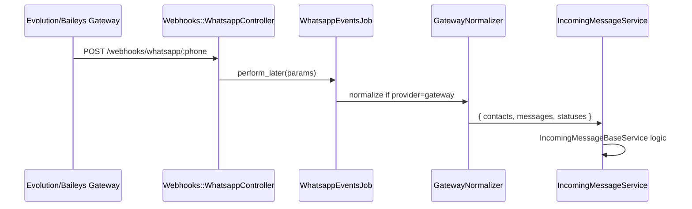
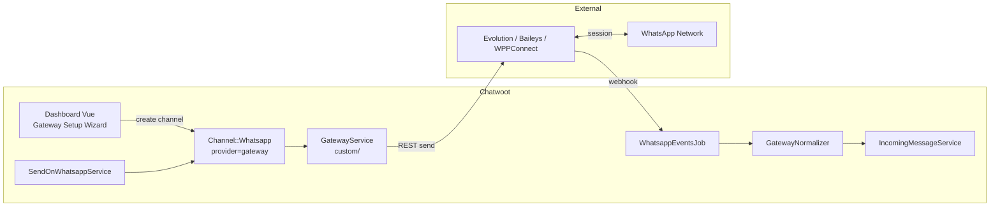

# Plano de implementação — segundo provider WhatsApp

Arquitetura recomendada para adicionar um gateway não oficial no fork, seguindo padrões existentes (360dialog, NotificaMe).

---

## Recomendação: estender `Channel::Whatsapp`, não novo `Channel::*`

Segue o padrão 360dialog + plano NotificaMe:

```ruby
# custom/ — exemplo conceitual
PROVIDERS = %w[default whatsapp_cloud gateway].freeze  # FORK

def provider_service
  case provider
  when 'whatsapp_cloud' then Whatsapp::Providers::WhatsappCloudService.new(...)
  when 'gateway'        then Custom::Whatsapp::Providers::GatewayService.new(...)
  else Whatsapp::Providers::Whatsapp360DialogService.new(...)
  end
end
```

---

## Componentes sugeridos (fork `custom/`)

| Classe | Responsabilidade |
|--------|------------------|
| `Custom::Whatsapp::Providers::GatewayService` | Envio: adaptar para REST do gateway |
| `Custom::Whatsapp::Webhooks::GatewayNormalizer` | `params` gateway → formato interno flat |
| `Custom::Whatsapp::IncomingMessageGatewayService` | Ou reutilizar `IncomingMessageService` se normalizado |
| `Custom::Whatsapp::ConnectionService` | QR, status sessão, webhook register no gateway |
| `Custom::Whatsapp::TemplatesAdapter` | Lista local ou noop |

---

## Webhook adapter

Opção A (preferida): normalizer no job **antes** do incoming:



Opção B: rota dedicada `/webhooks/whatsapp_gateway/:instance_id` — mais isolamento, mais surface area.

---

## Diagrama — adapter architecture completo



---

## Frontend

- Novo card em `Whatsapp.vue` (fork): "Gateway / Evolution"
- Form: nome inbox, URL base, API key/token, instance name
- Step 2: exibir QR (polling `GET /instance/connectionState` ou equivalente)
- Sem `WhatsappCall.vue` — chamadas não suportadas via gateway na maioria dos casos

---

## Voz

Ver [provider-coupling-and-extensibility.md](../whatsapp-voice/provider-coupling-and-extensibility.md) e [generic-whatsapp-call-channel.md](./generic-whatsapp-call-channel.md). Chamadas nativas exigem Meta Calling API + WebRTC browser↔Meta. Gateways Baileys **não** expõem equivalente estável. Alternativa: canal **Twilio Voice** (PSTN) — não é chamada WhatsApp in-app.

---

## Estratégia fork

| Prioridade | Onde |
|------------|------|
| 1 | `custom/app/services/...` — provider + normalizer |
| 2 | `prepend_mod_with` em `WhatsappEventsJob` se Enterprise não aplicável |
| 3 | Edição mínima `Channel::Whatsapp#provider_service` com `# FORK:` |
| 4 | Vue em `custom/` ou componente novo referenciado com `// FORK:` em `Whatsapp.vue` |

Evitar editar `WhatsappCloudService` / `IncomingMessageWhatsappCloudService`.

---

## Fases (resumo)

Ver [effort-estimate-and-phases.md](./effort-estimate-and-phases.md) para estimativas detalhadas.

1. **MVP mensagens** — envio texto, normalizer webhook, inbox setup
2. **Mídia + templates** — upload/download, sync ou bypass
3. **Interativos + operação** — botões/listas, health, reconexão QR
4. **Chamadas** — não recomendado para não oficial; projeto separado se gateway suportar
