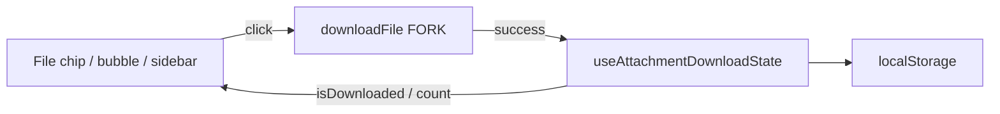

# Attachment Download State — Documentação

Estado visual **local** (browser) para anexos de arquivo já baixados, com contagem por agente — facilita fluxos de impressão em sequência.

**Estado:** implementado (MVP) · 16/jul/2026

| Área | Status |
|------|--------|
| Persistência `localStorage` por account + user | ✅ |
| Contagem de downloads por `attachmentId` | ✅ |
| Chip de arquivo na mensagem | ✅ |
| Bubble de arquivo (mensagem só anexo) | ✅ |
| Sidebar Shared files (+ filtro / progresso) | ✅ |
| Imagens / áudio / galeria / media sidebar | ✅ |
| Preview na lista de conversas | ✅ |
| Mark as done / Clear mark | ✅ |
| Sync multi-device / backend | ❌ fora do escopo |
| i18n | ✅ EN only (regra do fork) |

---

## Por onde começar

| Perfil | Documento |
|--------|-----------|
| **Visão / status** | Este README |
| **O que foi entregue no código** | [current-state.md](./current-state.md) |
| **Por que localStorage** | [implementation-decision-tree.md](./implementation-decision-tree.md) |
| **UX / superfícies** | [ui-design.md](./ui-design.md) |
| **Plano as-built + arquivos** | [implementation-plan.md](./implementation-plan.md) |
| **Conformidade com rules** | [rules-compliance-review.md](./rules-compliance-review.md) |
| **Próximos passos** | [improvements-backlog.md](./improvements-backlog.md) |

---

## Decisões fechadas

| Tópico | Decisão |
|--------|---------|
| Persistência | Só browser (`localStorage`) |
| Escopo de chave | `attachmentDownloadState::{accountId}::{userId}` |
| Payload | `{ count, lastDownloadedAt }` por attachment id |
| Superfícies MVP | File chip, File bubble, SharedAttachments Files |
| Download path | `customDashboard/helper/downloadFile` (same-origin FORK) |
| Feedback | Ícone/label no próprio anexo; toast só em erro |
| i18n | **Somente EN** |
| Fork | Composable em `custom/` + thin `// FORK:` nos Vue upstream |

---

## Fluxo (resumo)

---

## Problema de produto

Agentes baixam vários PDFs/docs em sequência para imprimir. Sem mudança visual após o download, ficam confusos sobre quais já trataram. O estado “baixado” (com contagem) é o proxy prático — o browser não expõe evento de impressão.
