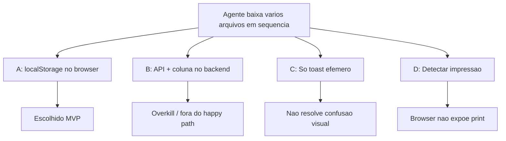

# Attachment Download State — Árvore de decisão

Comparação de abordagens para indicar visualmente que um anexo de arquivo já foi baixado (caso de uso: impressão em sequência).

**Decisões fechadas:** 16/jul/2026.

---

## Pergunta central

> Como o agente sabe quais arquivos da conversa já baixou, sem confundir PDFs similares na hora de imprimir?

---

## Opções avaliadas

### A — Estado local no browser (RECOMENDADA / MVP)

**Ideia:** Após download bem-sucedido, gravar `count` + `lastDownloadedAt` em `localStorage` scoped por account + user. UI muda ícone/label.

| Prós | Contras |
|------|---------|
| Zero backend / migration | Não sincroniza entre devices |
| Merge-safe (`custom/` + FORK fino) | Limpar dados do site apaga histórico |
| Resolve o caso de impressão na mesma máquina | Contagem é “baixou”, não “imprimiu” |
| Contagem útil para re-downloads | — |

**Veredito:** ✅ MVP entregue.

---

### B — Persistência no servidor

**Ideia:** Tabela `attachment_download_events` ou flag por user/attachment.

| Prós | Contras |
|------|---------|
| Sync multi-device | Migration, API, jobs, retenção |
| Auditoria cross-browser | Fora do MVP / chatwoot-core happy path |

**Veredito:** ❌ Não no MVP. Reavaliar só se produto exigir sync.

---

### C — Toast / feedback efêmero apenas

**Ideia:** `useAlert('Downloaded')` sem estado persistido.

| Prós | Contras |
|------|---------|
| Implementação mínima | Não ajuda ao voltar à lista de anexos |
| — | Cliente pediu mudança visual no anexo |

**Veredito:** ❌ Insuficiente (toast só em erro no MVP).

---

### D — Detectar impressão

**Ideia:** Hook `beforeprint` / integração com diálogo de print.

| Prós | Contras |
|------|---------|
| Alinha com “já imprimi” | Não confiável cross-browser; não cobre “baixei para imprimir depois” |

**Veredito:** ❌ Inviável como sinal de produto.

---

## Decisões secundárias

| # | Pergunta | Decisão |
|---|----------|---------|
| 1 | Só flag ou contagem? | **Contagem** + timestamp |
| 2 | Escopo da key? | `accountId` + `userId` |
| 3 | Quais tipos de anexo? | **Só file** (PDF/docs/zip) |
| 4 | Superfícies? | Chip + bubble + sidebar Shared files |
| 5 | Como baixar no chip/bubble? | Trocar `<a href>` por `downloadFile` FORK |
| 6 | Limpar no logout? | Não no MVP |
| 7 | Specs? | Não (regra do core) |

---

## Anti-padrões evitados

- God component misturando storage + UI de três superfícies
- Estado só em `data()` local (não sincronizaria chip ↔ sidebar)
- Backend prematuro para preferência de UI
- Editar upstream sem `// FORK:`
