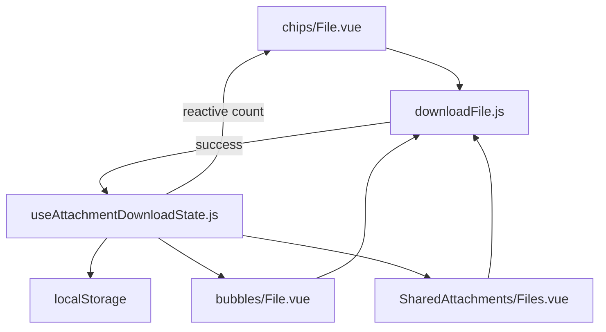

# Attachment Download State — UI Design

Especificação visual do MVP, alinhada a `components-next` + Tailwind tokens do dashboard.

---

## Princípios

- Feedback **no próprio anexo** (não toast no happy path)
- Tailwind only; cores `n-slate` / `n-teal`
- Strings via **i18n EN**
- Lógica em composable; componentes finos
- Sem cards novos; reusa chip / bubble / sidebar existentes

---

## Referências no projeto

| Padrão | Arquivo | Reuso |
|--------|---------|-------|
| Download same-origin | `customDashboard/helper/downloadFile.js` | Fetch blob + trigger download |
| Loading por id | `SharedAttachments/Files.vue` | `downloadingId` |
| Toast de erro | `useAlert` | Falhas de download |
| File chip visual | `chips/File.vue` | Ícone + nome truncado |
| File bubble | `bubbles/File.vue` + `BaseAttachment.vue` | Card + action button |

---

## Arquitetura de componentes

---

## Estados visuais

| Estado | Chip | Bubble | Sidebar |
|--------|------|--------|---------|
| Nunca baixado | Ícone `i-lucide-download` slate | Label `Download` | Ícone download (hover) |
| Baixando | Ícone pulse / disabled | Botão `disabled` | `is-loading` no NextButton |
| Baixado (1×) | `i-lucide-check` teal; chip `opacity-80`; tooltip `Downloaded` | Label `Downloaded` | Check teal sempre visível; tooltip `Downloaded` |
| Baixado (N×) | Tooltip `Downloaded · N×` | Label `Downloaded · N×` | Tooltip `Downloaded · N×` |

Clique de novo **sempre** baixa de novo e incrementa a contagem.

---

## i18n (EN)

### `CONVERSATION.*`

| Key | Texto |
|-----|-------|
| `DOWNLOAD` | Download |
| `DOWNLOADED` | Downloaded |
| `DOWNLOADED_COUNT` | Downloaded · {count}× |
| `DOWNLOAD_AGAIN` | Download again (reservado; unused no MVP) |

### `CONVERSATION_SIDEBAR.SHARED_FILES.*`

| Key | Texto |
|-----|-------|
| `DOWNLOAD` | Download file |
| `DOWNLOADED` | Downloaded |
| `DOWNLOADED_COUNT` | Downloaded · {count}× |
| `DOWNLOAD_AGAIN` | Download again |
| `DOWNLOAD_ERROR` | Could not download the file. Please try again. |

---

## Acessibilidade

- Chip/sidebar: `aria-label` = mesmo texto do tooltip
- Botão chip: `type="button"`, `disabled` durante download
- Bubble: `action.disabled` durante download (`BaseAttachment`)

---

## Fora do escopo visual

- Badge “Printed”
- Overlay em imagens/galeria
- Preferência em Settings
- Animação elaborada além de pulse no loading do chip
