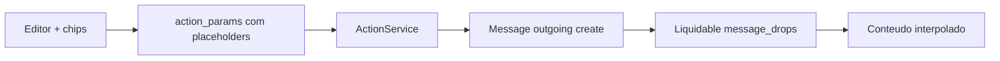

# Automation message variables — Documentação

Chips + prévia de variáveis Liquid nas ações **Enviar mensagem** e **Adicionar nota privada** da Automação, alinhadas ao motor já existente (`Liquidable` no `Message`).

**Estado:** implementado (MVP + polish) · ago/2026

| Área | Status |
|------|--------|
| Liquid backend (`contact`, `conversation`, `agent`, `inbox`, `account`) | ✅ |
| Alias `contact.phone` → `phone_number` | ✅ |
| Drop `rule` / `macro` | ✅ |
| UX chips + prévia + cursor + filtros | ✅ |
| Email ao time + workflow Liquid | ✅ |
| i18n en + pt_BR | ✅ |
| Specs custom | ✅ |
| Docs `doc/feature/automation-message-variables/` | ✅ |
| HSM WhatsApp | ❌ fora de escopo |

---

## Por onde começar

| Perfil | Documento |
|--------|-----------|
| **Visão / status** | Este README |
| **Regras de negócio** | [business-rules.md](./business-rules.md) |
| **Estado do código** | [current-state.md](./current-state.md) |
| **Por que esta abordagem** | [implementation-decision-tree.md](./implementation-decision-tree.md) |
| **Plano as-built** | [implementation-plan.md](./implementation-plan.md) |
| **Próximos passos** | [improvements-backlog.md](./improvements-backlog.md) |

---

## Problema

Admins não descobriam facilmente que `{{contact.name}}` etc. já funcionam na Automação (só o menu `{{` do editor). Nas regras de conversa, chips + prévia deixam as variáveis óbvias. Além disso, a UI listava `contact.phone`, que o Liquid não resolvia (`phone_number`).

---

## Solução (resumo)

1. Manter interpolação **Liquid** no `before_create` do Message.
2. Adicionar chips + hint + prévia sob o editor nas ações `textarea`.
3. Alias `ContactDrop#phone` e drop `rule` quando a automação está executando.
4. Corrigir `MESSAGE_VARIABLES` para `contact.phone_number`.

---

## Decisões fechadas

| Tópico | Decisão |
|--------|---------|
| Motor | Liquid existente (não copiar `gsub` das workflow rules) |
| Ações | `send_message` e `add_private_note` |
| `conversation.id` | Continua = display_id (semântica Liquid) |
| Fork | `custom/` + FORK mínimo em `ContactDrop` |

---

*Última atualização: 2026-08-05*
