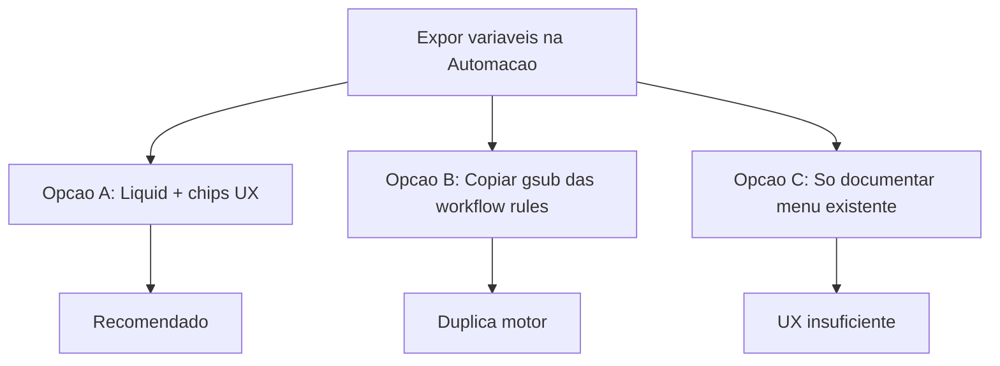

# Automation message variables — Árvore de decisão

## Opção A — Liquid existente + chips/prévia (RECOMENDADA)

**Ideia:** Não reinventar interpolação; o Message já processa Liquid em outgoing. Melhorar descoberta (chips) e fechar gaps (`phone`, `rule.name`).

| Prós | Contras |
|------|---------|
| Zero mudança no ActionService | Semântica `conversation.id` = display_id (histórico) |
| Reusa drops / custom attributes | Agent vazio se sem assignee |
| Alinha ReplyBox e Automação | — |

**Veredito:** ✅ escolhida.

## Opção B — Interpolator custom como workflow rules

Descartada: dois motores para a mesma sintaxe `{{}}`, risco de drift (`phone` vs `phone_number`, ids).

## Opção C — Só docs / i18n

Descartada: admin ainda não vê chips; bug `contact.phone` permanece.

## Decisões auxiliares

| Pergunta | Decisão |
|----------|---------|
| Novo interpolator? | Não |
| `rule` drop? | Sim via `Current.executed_by` |
| `conversation.id` interno? | Não no MVP |
