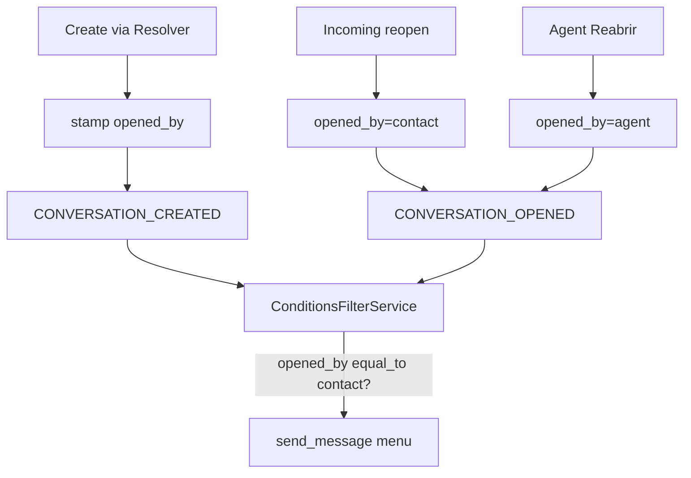

# Automation `opened_by` — Documentação

Condição configurável nas regras de **Automação** para filtrar por **quem abriu** a conversa (contato vs origem), evitando menu de boas-vindas quando a empresa inicia ou o agente clica em Reabrir.

**Estado:** implementado (MVP) · review pós-teste OK · ago/2026

| Área | Status |
|------|--------|
| Persistência `additional_attributes['opened_by']` | ✅ |
| Stamp na criação (Resolver + callers) | ✅ contact / agent / phone (+ Wavoip/voice) |
| Stamp na reabertura (incoming / agente / Wavoip) | ✅ |
| Condição na Automação (UI + backend) | ✅ `conversation_created` + `conversation_opened` |
| i18n en + pt_BR | ✅ |
| Specs custom | ✅ (17 examples) |
| Review pós-teste (bugs + docs) | ✅ |
| Migration / coluna nova | ❌ desnecessário |
| Expor em todos os eventos de automação | ❌ fora do MVP |
| Backfill de conversas antigas | ❌ fora do MVP |

---

## Por onde começar

| Perfil | Documento |
|--------|-----------|
| **Visão / status** | Este README |
| **Regras de negócio** | [business-rules.md](./business-rules.md) |
| **Estado do código** | [current-state.md](./current-state.md) |
| **Por que esta abordagem** | [implementation-decision-tree.md](./implementation-decision-tree.md) |
| **Plano as-built** | [implementation-plan.md](./implementation-plan.md) |
| **Próximos passos** | [improvements-backlog.md](./improvements-backlog.md) |

---

## Problema

Regras de boas-vindas em **Conversa Criada** / **Conversa Aberta** disparavam para qualquer abertura:

- Origem inicia pelo WhatsApp Web/celular → menu
- Agente clica **Reabrir** → menu
- Contato inicia → menu (único caso desejado)

Não havia parâmetro nas condições para o admin decidir.

---

## Solução (resumo)

1. Gravar `opened_by` = `contact` | `agent` | `phone` no episódio atual de abertura.
2. Expor condição **Aberto por** só em `conversation_created` e `conversation_opened`.
3. Admin adiciona `Aberto por` = `Contato` nas regras de boas-vindas.

---

## Decisões fechadas

| Tópico | Decisão |
|--------|---------|
| Persistência | `conversations.additional_attributes['opened_by']` (sem migration) |
| Valores | `contact` · `agent` · `phone` |
| Uma chave | `opened_by` na criação **e** reabertura (quem causou o episódio atual) |
| Eventos na UI | Só `conversation_created` + `conversation_opened` |
| Regras antigas | Sem a condição = comportamento inalterado |
| Conversas sem stamp | `equal_to contact` não casa (seguro) |
| Fork | `custom/` + `# FORK:` mínimo (`Current`, `filter_keys.yml`, `Resolver.prepend_mod_with`, constants FE) |

---

## Go-live / uso operacional

1. Hard refresh no dashboard (assets já buildados).
2. Editar regras **boas vindas (Conversa Criada)** e **(Conversa Aberta)**.
3. Adicionar condição: **Aberto por** → **Igual a** → **Contato**.
4. Smoke: origem WhatsApp Web (não envia menu); Reabrir agente (não envia); contato inicia (envia).

---

## Índice

| Documento | Conteúdo |
|-----------|----------|
| [business-rules.md](./business-rules.md) | Quem é origem/destino; quando stamp; quando filtrar |
| [current-state.md](./current-state.md) | Mapa de arquivos, hooks, limitações |
| [implementation-decision-tree.md](./implementation-decision-tree.md) | Opções avaliadas e vereditos |
| [implementation-plan.md](./implementation-plan.md) | Fases as-built, arquivos, testes |
| [improvements-backlog.md](./improvements-backlog.md) | P1/P2 abertos |

---

*Última atualização: 2026-08-05 — review pós-teste + correções Wavoip/Current*
