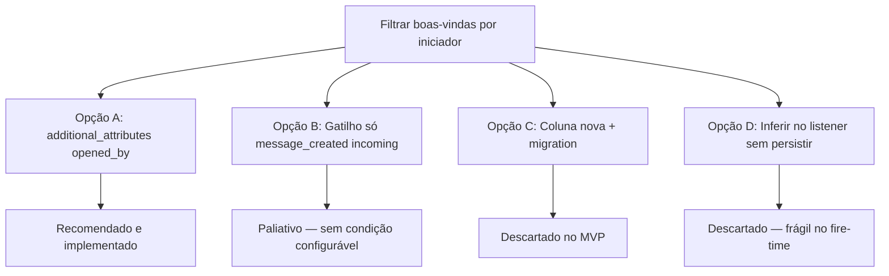

# Automation `opened_by` — Árvore de decisão

Comparação de abordagens para distinguir **quem iniciou/reabriu** a conversa e expor isso nas condições da Automação.

**Atualizado ago/2026** — MVP implementado.

---

## Pergunta central

> Como o admin configura “enviar menu só se o contato iniciou”, sem quebrar regras existentes?

---

## Opções avaliadas

### Opção A — `additional_attributes['opened_by']` + condição na Automação (RECOMENDADA)

**Ideia:** Persistir quem causou o episódio; registrar em `filter_keys.yml` + allowlist + UI; admin escolhe o filtro.

| Prós | Contras |
|------|---------|
| Configurável por regra | Conversas antigas sem valor |
| Sem migration | Precisa stamp em vários hooks |
| Reusa `ConditionsFilterService` | Edits mínimos FORK em YAML/Current/Resolver |
| Zero breaking em regras sem a condição | — |

**Veredito:** ✅ implementado.

---

### Opção B — Trocar gatilho para `message_created` + `message_type=incoming`

**Ideia:** Só reagir a mensagem do contato.

| Prós | Contras |
|------|---------|
| Sem backend novo | Menu pode repetir a cada msg do contato |
| — | Não resolve “Reabrir” sem gambiarra de etiqueta |
| — | Admin não tem parâmetro explícito “iniciado por” |

**Veredito:** ❌ paliativo operacional; não atende o requisito de condição configurável.

---

### Opção C — Coluna `opened_by` / `initiated_by` na tabela

**Veredito:** ❌ MVP — JSONB `additional_attributes` basta; coluna só se houver query/report pesado depois.

---

### Opção D — Inferir no `AutomationRuleListener` sem gravar

**Ideia:** No fire de `conversation_opened`, olhar `Current.user` / última mensagem.

| Prós | Contras |
|------|---------|
| Sem atributo | Async dispatcher perde contexto |
| — | Delayed re-check sem `changed_attributes` |
| — | Difícil auditar / depurar |

**Veredito:** ❌ descartado.

---

## Decisões de produto (fechadas)

### 1. Um atributo ou dois (`initiated_by` + `last_reopened_by`)?

**Decisão: um — `opened_by`.**  
Sempre = quem causou o episódio atual (create ou reopen). UI mais simples.

### 2. Valores: `contact|origin` ou `contact|agent|phone`?

**Decisão: três valores.**  
Boas-vindas usam `contact`; origem fica auditável (agente vs WhatsApp Web/celular).

### 3. Em quais eventos expor a condição?

**Decisão: só `conversation_created` + `conversation_opened`.**  
Resolve o bug das boas-vindas sem poluir “Conversa Atualizada” (ex.: reatribuir agente).

### 4. Default quando ausente?

**Decisão: não inventar `contact`.**  
Evita falso positivo em dados legados; admin adiciona a condição só onde precisa.

### 5. Fork strategy

**Decisão:** lógica em `custom/` + `prepend_mod_with`; FORK mínimo em `Current`, `filter_keys.yml`, `Conversations::Resolver`, constants FE.
