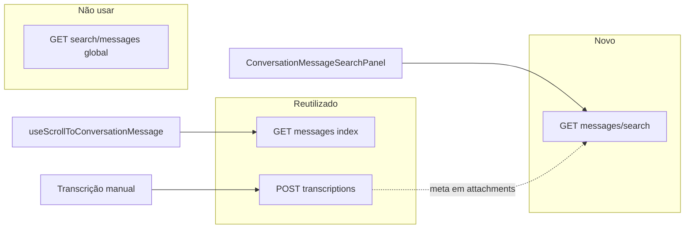

# API — Pesquisa in-conversation

> Documento de apoio. O contrato vigente está no [plano consolidado](./implementation-plan.md); detalhes divergentes abaixo são históricos.

Matriz de endpoints: o que é novo, o que reutiliza, e o que muda por fase (A → B → C → P1/P2).

**Relacionado:** [implementation-decision-tree.md](./implementation-decision-tree.md) D3 · [implementation-plan.md](./implementation-plan.md) · [audio-transcription-search.md](./audio-transcription-search.md)

---

## Resumo executivo

| Pergunta | Resposta |
|----------|----------|
| Quantos endpoints novos? | **1** — `GET .../messages/search` |
| Áudio transcrito precisa de rota nova? | **Não** — Fase C altera só o finder SQL |
| Scroll para mensagem antiga? | **Não** — reutiliza `GET .../messages` (`before`/`after`) |
| Transcrever áudio na busca? | **Não** — `POST /transcriptions` já persiste em `attachments.meta` |

---

## Endpoint novo (Fase A)

### `GET .../conversations/:conversation_id/messages/search`

| Campo | Valor |
|-------|-------|
| **Método** | `GET` |
| **Path completo** | `/api/v1/accounts/:account_id/conversations/:conversation_id/messages/search` |
| **Auth** | Mesma sessão/API token do dashboard |
| **Autorização** | `Conversations::BaseController#conversation` → Pundit `show?` |
| **Implementação** | `MessagesController#search` via `prepend_mod_with` + `# FORK:` em `routes.rb` |
| **Estado** | ✅ Implementado (ver [implementation-plan.md](./implementation-plan.md)) |

| Param | Tipo | Obrigatório | Descrição |
|-------|------|-------------|-----------|
| `q` | string | sim | Termo de busca (mín. 2 chars — `422` se inválido) |
| `page` | integer | não | Paginação (default `1`, 15 por página) |
| `from` | string | não | Filtro: `contact`, `agent`, `private`, `contact:N`, `agent:N` |

#### Respostas

| Status | Quando |
|--------|--------|
| `200` | Busca ok (lista vazia é válida) |
| `401` / `403` | Sem auth ou sem acesso à conversa |
| `404` | `conversation_id` inexistente |
| `422` | `q` blank, &lt; 2 caracteres ou `page` inválido |
| `429` | Rate limit (30 req/min por user+conversa) |

#### Corpo de resposta

Reutilizar partial `api/v1/models/_message.json.jbuilder` + campo opcional `matched_on`:

```json
{
  "payload": [
    {
      "id": 123,
      "content": "texto da mensagem",
      "matched_on": "content",
      "message_type": 0,
      "created_at": 1710000000,
      "private": false,
      "sender": { "id": 1, "name": "Maria", "type": "contact" },
      "attachments": []
    }
  ],
  "meta": {
    "current_page": 1,
    "has_more": true,
    "max_results": 100,
    "search_engine": "ilike_unaccent"
  }
}
```

**Notas:**
- Sem `total_count` / `total_pages` — paginação via `has_more` apenas.
- `search_engine`: `ilike` | `ilike_unaccent` | `gin` | `opensearch`.
- Com `unaccent` + flag `search_with_gin`, o finder usa ILIKE unaccent (índice trigram) e reporta `ilike_unaccent`.

#### Cliente frontend

**Arquivo:** `app/javascript/dashboard/api/conversationMessageSearch.js`

```javascript
// GET ${accountScoped}/conversations/${conversationId}/messages/search
search({ conversationId, query, page = 1, from, signal }) { ... }
```

---

## Endpoints reutilizados (sem rota nova)

### Fase B — carregar janela para scroll

```
GET /api/v1/accounts/:account_id/conversations/:conversation_id/messages
    ?before=:message_id
    &after=:message_id
```

| Campo | Valor |
|-------|-------|
| **Controller** | `MessagesController#index` (upstream) |
| **Finder** | `MessageFinder` — `messages_between` / `messages_before` |
| **Cliente** | `MessageApi.getPreviousMessages` em `api/inbox/message.js` |
| **Uso** | `useScrollToConversationMessage` quando `#message{id}` não está no DOM |
| **Merge** | Mutation fork `INSERT_MESSAGES_AROUND` (só frontend/store) |

Não criar endpoint dedicado para “mensagens em torno de um ID” — o `index` já cobre.

---

### Transcrição de áudio (persistência — não é busca)

```
POST /api/v1/accounts/:account_id/transcriptions
```

| Campo | Valor |
|-------|-------|
| **Controller** | `custom/app/controllers/api/v1/accounts/transcriptions_controller.rb` |
| **Persistência** | `attachments.meta` (`transcribed_text` + `transcription.text`) |
| **Relação com busca** | Fase C do finder **lê** o que este endpoint já gravou |

A busca **não** dispara transcrição. Áudio sem transcrição não aparece nos resultados (Fase C).

---

## Endpoints que NÃO usar

| Endpoint | Motivo |
|----------|--------|
| `GET /api/v1/accounts/:account_id/search/messages` | Pesquisa **global**; limite 3 meses; sem `conversation_id`; ILIKE não busca transcrição (D3) |
| `GET /api/v1/accounts/:account_id/conversations/search` | Busca **conversas** por display_id/contato — não mensagens na thread |
| `GET .../messages/search/transcriptions` | Rejeitado (D16) — query unificada no finder |
| Client-side só no Vuex | Só ~20 mensagens carregadas — inaceitável (D3 opção D) |

---

## Matriz por fase

| Fase | Funcionalidade | Endpoint | Novo? |
|------|----------------|----------|-------|
| **A** | Busca texto no painel lateral | `GET .../messages/search` | ✅ |
| **A** | Paginação “carregar mais” | `GET .../messages/search?page=N` | ❌ (mesmo) |
| **A** | Validação `q` inválido | `422` no `search` | ❌ |
| **B** | Scroll mensagem antiga | `GET .../messages?before=&after=` | ❌ |
| **B** | Toast mensagem não encontrada | — (só FE) | ❌ |
| **B** | Merge no store | — (mutation fork) | ❌ |
| **C** | Busca em transcrição | `GET .../messages/search` (finder OR) | ❌ |
| **C** | Badge mic / snippet áudio | Mesmo JSON + UI | ❌ |
| **P1** | Filtro remetente | `search?from=contact:N` | ❌ |
| **P1** | `matched_on` no JSON | Mesma resposta | ❌ |
| **P1** | Excluir mensagens deletadas | Filtro no finder | ❌ |
| **P1** | Assunto de e-mail | Filtro no finder | ❌ |
| **P2** | OpenSearch scoped | Mesmo endpoint, strategy interna | ❌ |
| **P2** | Limite 100 resultados | `meta` na mesma resposta | ❌ |
| **P2** | Rate limit | Middleware/controller no `search` | ❌ |

---

## Evolução do finder (mesma rota)

```
Fase A   →  WHERE content ILIKE :pattern
Fase C   →  OR attachments.meta (audio) ILIKE :pattern
P1.1     →  GIN @@ to_tsquery (flag search_with_gin)
P2.1     →  OpenSearch com conversation_id no where
```

Nenhuma fase exige segunda rota de busca.

---

## Implementação backend (checklist)

### Rota (`config/routes.rb`)

```ruby
# dentro de resources :messages
# FORK: in-conversation message search
collection { get :search }
```

### Controller prepend

```ruby
# custom/app/controllers/custom/api/v1/accounts/conversations/messages_controller.rb
# → finder direto (sem service intermediário)
finder = Custom::ConversationMessageSearchFinder.new(...)
@messages = finder.perform
```

### View

**Arquivo:** `app/views/api/v1/accounts/conversations/messages/search.json.jbuilder`

`payload` + `meta` (`current_page`, `has_more`, `max_results`, `search_engine`).

---

## Diagrama



---

## Referências no código (estado atual)

| Peça | Arquivo |
|------|---------|
| Rotas messages | `config/routes.rb` ~L152 |
| Messages index | `app/controllers/api/v1/accounts/conversations/messages_controller.rb` |
| MessageFinder | `app/finders/message_finder.rb` |
| Pesquisa global | `app/controllers/api/v1/accounts/search_controller.rb` |
| Transcrições fork | `custom/app/controllers/api/v1/accounts/transcriptions_controller.rb` |
| Cliente mensagens | `app/javascript/dashboard/api/inbox/message.js` |
| Jbuilder mensagem | `app/views/api/v1/models/_message.json.jbuilder` |
| Attachment meta | `app/models/attachment.rb#audio_metadata` |
