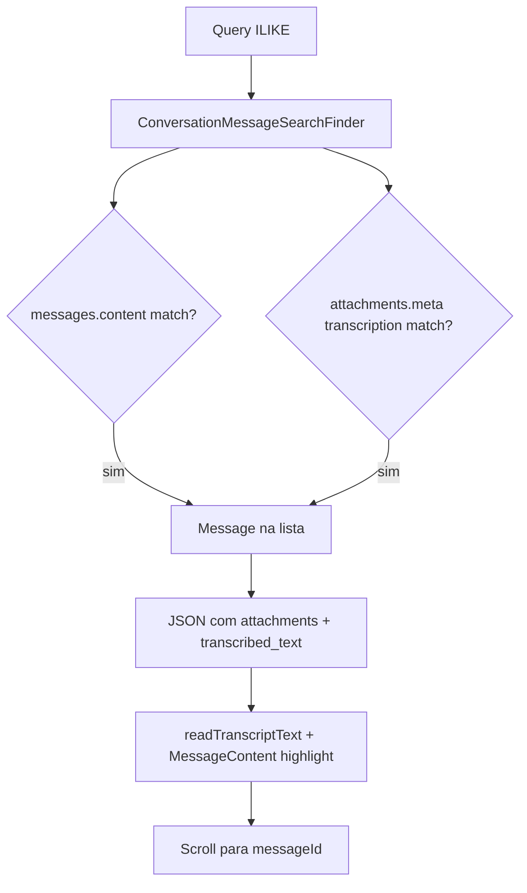

# Pesquisa em áudios transcritos — análise e integração no plano

> Documento de apoio. A decisão consolidada inclui transcrição já na primeira entrega; veja o [plano consolidado](./implementation-plan.md).

Como incluir transcrições de áudio na pesquisa in-conversation, alinhado ao modelo de dados existente (Groq manual + OpenAI Enterprise).

**Relacionado:** [audio-transcription-current-state.md](../audio-transcription/audio-transcription-current-state.md) · [implementation-plan.md](./implementation-plan.md)

---

## 1. Onde o texto vive (resumo)

| Caminho | Trigger | Provider | Persistência |
|---------|---------|----------|--------------|
| **Fork (ativo)** | Clique orelha → `POST /transcriptions` | Groq | `attachments.meta` |
| **Enterprise (desativado no fork)** | Upload áudio → job | OpenAI | **Mesmo** `attachments.meta` |

Ambos usam `Custom::TranscriptionMetadata.write_transcription`:

```ruby
meta['transcription'] = { 'text' => '...', 'state' => 'success', ... }
meta['transcribed_text'] = '...'  # legado + OpenSearch
```

**Não** é gravado em `messages.content`. Mensagens só-áudio têm `content` vazio ou irrelevante.

Leitura unificada (backend/frontend):

```ruby
Custom::TranscriptionMetadata.read_text(attachment)
# meta['transcription']['text'] || meta['transcribed_text']
```

---

## 2. Gap atual — pesquisa global vs in-conversation

| Motor | `messages.content` | Transcrição em `attachments.meta` |
|-------|-------------------|-----------------------------------|
| `SearchService` ILIKE | ✅ | ❌ |
| `SearchService` GIN | ✅ | ❌ |
| Enterprise OpenSearch | ✅ | ✅ (`attachments.transcribed_text`) |
| **Plano MVP original** (só `content`) | ✅ | ❌ |

No fork self-hosted (sem OpenSearch), áudios transcritos **não aparecem** na pesquisa global SQL — mas o UI global (`MessageContent`, `TranscribedText`) já sabe exibi-los quando o backend devolve a mensagem.

**Oportunidade:** a pesquisa in-conversation pode ser **mais completa** que a global SQL desde o MVP, incluindo transcrições.

---

## 3. Decisão de arquitetura backend

### Opções avaliadas

| # | Abordagem | Prós | Contras |
|---|-----------|------|---------|
| A | **OR no finder** (`content` + join `attachments`) | Uma query; paginação simples; merge-safe em `custom/` | `DISTINCT` necessário; duplicata se vários áudios |
| B | Duas queries + `UNION` | Separação clara | Paginação difícil; ordenação frágil |
| C | Copiar texto para `messages.content` na transcrição | Busca trivial | Duplica dado; quebra bolhas; **rejeitado** |
| D | Só OpenSearch | Paridade Enterprise | Não cobre self-hosted fork |

**Decisão:** **A** — estender `Custom::ConversationMessageSearchFinder` com `left_joins(:attachments)` e condição OR.

### Por que não mudar o `SearchService` global no MVP?

- Escopo fork: in-conversation é feature nova em `custom/`
- `SearchService` upstream é arquivo de alto churn
- Alinhar global SQL depois (P1 opcional) extraindo fragmento SQL partilhado

---

## 4. Implementação backend proposta

### 4.1 Finder — query unificada

**Arquivo:** `custom/app/finders/custom/conversation_message_search_finder.rb`

```ruby
module Custom
  class ConversationMessageSearchFinder
    SEARCHABLE_TYPES = %w[incoming outgoing template].freeze
    AUDIO_FILE_TYPE = Attachment.file_types[:audio].freeze

    pattr_initialize [:conversation!, :query!]

    def perform
      pattern = "%#{sanitized_query}%"

      conversation.messages
                  .left_joins(:attachments)
                  .where(message_type: SEARCHABLE_TYPES)
                  .where(search_predicate, pattern: pattern, audio_type: AUDIO_FILE_TYPE)
                  .distinct
                  .reorder('messages.created_at DESC')
    end

    private

    def sanitized_query
      query.to_s.strip.gsub(/[%_\\]/) { |m| "\\#{m}" } # escape ILIKE wildcards
    end

    def search_predicate
      <<~SQL.squish
        messages.content ILIKE :pattern
        OR (
          attachments.file_type = :audio_type
          AND attachments.meta->>'transcribed_text' ILIKE :pattern
        )
        OR (
          attachments.file_type = :audio_type
          AND attachments.meta->'transcription'->>'text' ILIKE :pattern
        )
      SQL
    end
  end
end
```

**Notas:**

- `left_joins` — mensagens só texto continuam a funcionar sem attachment
- `distinct` — evita duplicar mensagem com múltiplos attachments
- Duas chaves JSON — alinhado a `TranscriptionMetadata.read_text` (Groq + OpenAI legado)
- `file_type = audio` — não pesquisar transcrições em attachments de outro tipo
- Áudio **sem** transcrição (`meta` vazio) — não entra no OR de attachment
- Escape `%`/`_` — evita wildcards acidentais na query do utilizador

### 4.2 Service — sem mudança de contrato

`ConversationSearchService` continua a paginar o scope do finder. Sem lógica de transcrição no service (responsabilidade única no finder).

### 4.3 API response — incluir attachments no payload

Reutilizar partial de mensagem existente (`_message.json.jbuilder` → `push_event_data`).

Para áudio, `audio_metadata` já expõe:

```ruby
transcribed_text: meta['transcribed_text']
transcription_state: meta.dig('transcription', 'state')
```

O frontend **já recebe** transcrição nos resultados — sem novo campo obrigatório.

### 4.4 Campo opcional `matched_on` (P1, não MVP)

Para UX (ícone microfone só quando match foi na transcrição):

```json
{
  "id": 123,
  "content": "",
  "matched_on": "transcription",
  "attachments": [{ "file_type": "audio", "transcribed_text": "..." }]
}
```

**MVP:** frontend infere — `!content.trim() && audioAttachment?.transcribed_text` contém termo (highlight já em `MessageContent`).

**P1:** finder pode expor `select` com `CASE WHEN ... THEN 'transcription' ELSE 'content' END` ou pós-processamento Ruby — só se inferência for insuficiente.

### 4.5 Eager loading (performance)

No controller ou service, após paginação:

```ruby
@messages = scope.includes(:attachments, :sender)
```

Evita N+1 na serialização JSON.

---

## 5. Frontend — o que muda

| Peça | Mudança |
|------|---------|
| `ConversationMessageSearchResultItem.vue` | Espelhar `SearchResultMessageItem` para áudio; `readTranscriptText` + `TranscribedText` |
| `MessageContent.vue` | ⚠️ Só para texto com `content` preenchido; **não** confiar para áudio após camelCase |
| `SearchResultMessageItem.vue` | ✅ **Referência obrigatória** para bloco áudio + `TranscribedText` |
| `useTranscriptText.js` | Snippet, highlight e `isTranscriptionMatch` |
| Badge `i-lucide-mic` | Quando match é só transcrição (UX-M33) |
| API client | **Sem mudança** — mesmo endpoint `q` |

Garantir camelCase na resposta (`useCamelCase` no composable de busca).

### 5.1 Workaround snippet (até P1.15 corrigir upstream)

Passar `content` sintético para `MessageContent`:

```javascript
const displayMessage = computed(() => {
  if (message.content?.trim()) return message;
  const text = readTranscriptText(audioAttachment.value);
  return { ...message, content: text };
});
```

**Nota:** `MessageContent.vue` (upstream) usa snake_case em attachments — incompatível com camelCase após transformação:

```javascript
// upstream — não funciona após useCamelCase deep
const audioAttachment = props.message.attachments?.find(a => a.file_type === 'audio');
return audioAttachment?.transcribed_text || '';
```

---

## 6. Fluxo completo (texto + áudio transcrito)



---

## 7. Casos de teste manual

| # | Cenário | Esperado |
|---|---------|----------|
| 1 | Texto normal no body | Aparece; highlight no content |
| 2 | Áudio transcrito Groq; termo só na transcrição | Aparece; snippet da transcrição; badge mic |
| 3 | Áudio sem transcrição | **Não** aparece |
| 4 | Áudio `state: processing` sem text | **Não** aparece |
| 5 | Termo no content **e** na transcrição | Uma linha (distinct) |
| 6 | Re-transcrição `force_refresh` | Novo texto pesquisável |
| 7 | Mensagem deletada com content substituído | Comportamento MVP: pode aparecer pelo content "deleted" — P1.4 exclui |

---

## 8. Alinhamento futuro com pesquisa global (opcional P1)

Extrair módulo reutilizável:

**Arquivo:** `custom/lib/custom/message_search/content_predicate.rb`

```ruby
module Custom::MessageSearch
  module ContentPredicate
    def self.sql(alias_messages: 'messages', alias_attachments: 'attachments')
      # mesmo SQL do finder
    end
  end
end
```

Usar em:
1. `ConversationMessageSearchFinder` (MVP)
2. `SearchService#filter_messages_with_like` via `prepend_mod_with` (P1 — corrige global SQL)

Não fazer no MVP — YAGNI até segunda necessidade.

---

## 9. Impacto no plano de fases

| Fase | Alteração |
|------|-----------|
| **Fase A Backend** | Finder só `content` ILIKE |
| **Fase B Frontend** | `INSERT_MESSAGES_AROUND` + scroll robusto |
| **Fase C Backend** | Finder com join + OR transcrição |
| **Fase C UI** | Result item com mic badge + `TranscribedText` |
| **Test plan** | +4 casos áudio (secção 7) |
| **Backlog** | Transcrição na Fase C (P0-C) |

---

## 10. Resumo executivo

| Pergunta | Resposta |
|----------|----------|
| Mudar backend? | **Sim** — só o finder (uma query unificada) |
| Novo endpoint? | **Não** — ver [api-endpoints.md](./api-endpoints.md) |
| Novo campo na BD? | **Não** — dados já em `attachments.meta` |
| Mesclar Groq + OpenAI? | **Sim** — mesma leitura JSON |
| Frontend novo? | Mínimo — `readTranscriptText` + bloco como `SearchResultMessageItem` |
| Mais completo que global SQL? | **Sim** — no fork sem OpenSearch |
