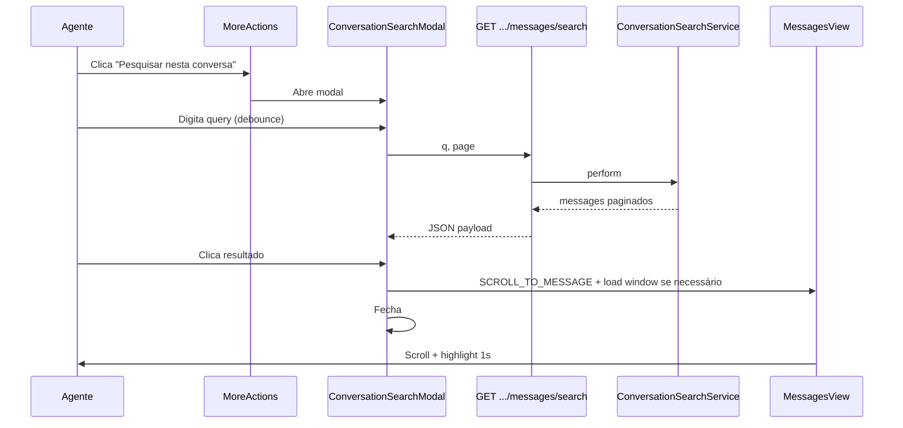

# Árvore de decisões — Pesquisa in-conversation

> Registro das alternativas avaliadas. As decisões vigentes estão no [plano consolidado](./implementation-plan.md).

Decisões de produto e arquitetura para a busca de mensagens dentro da conversa aberta.

---

## D1 — Onde fica o ponto de entrada?

| Opção | Prós | Contras |
|-------|------|---------|
| **A. Menu ⋮ (`MoreActions`)** ✅ | Consistente com transcrição/mute; já no header da captura | Mais um clique que atalho dedicado |
| B. Barra fixa no header | Sempre visível | Polui header; foge do padrão atual |
| C. Command bar (⌘K) | Power users | Descoberta baixa; sem escopo explícito de conversa |
| D. Reaproveitar `ConversationView#onSearch` | Código morto existe | Ainda precisa de trigger no menu |

**Decisão:** **A** — item no dropdown `MoreActions`, ícone `i-lucide-search`, abre modal.

---

## D2 — Formato da UI

| Opção | Prós | Contras |
|-------|------|---------|
| **A. Modal (Dialog)** ✅ | Igual `EmailTranscriptModal`; foco na busca; fecha ao selecionar | Cobre parte da conversa |
| B. Painel slide-over | Mantém conversa visível | Mais complexo; sem precedente forte no header |
| C. Inline no header | Compacto | Pouco espaço para resultados |
| D. Redirecionar para `/search` com filtros | Zero backend novo | Sai do contexto; UX ruim |

**Decisão:** **A** — `Dialog` (`components-next/dialog/Dialog.vue`) com input + lista scrollável.

**Revisão:** não usar `EmailTranscriptModal` como base — Options API legado. Seguir `ShareContactDialog.vue`.

---

## D3 — Backend: qual estratégia de API?

| Opção | Prós | Contras |
|-------|------|---------|
| A. Estender `GET /search/messages` com `conversation_id` | Reusa `SearchService`, GIN, OpenSearch | Mistura semântica global vs. local; limite 3 meses; autorização extra |
| **B. Novo `GET /conversations/:id/messages/search`** ✅ | Escopo claro; autorização via conversa; histórico completo | Novo endpoint + service |
| C. Adicionar `q` ao `MessageFinder` | Um controller só | Finder vira híbrido paginação+busca; sem GIN/OpenSearch |
| D. Só client-side no Vuex | Sem backend | Só mensagens já carregadas (~20); inaceitável |

**Decisão:** **B** — serviço dedicado `Custom::Messages::ConversationSearchService` em `custom/`, rota collection no resource `messages` com `# FORK:` em `routes.rb`.

**Contrato API:** [api-endpoints.md](./api-endpoints.md) — único endpoint novo; Fases B/C/P1 evoluem finder e params na mesma rota.

**Motivo:** conversa pode ter anos de histórico; `message_base_query` corta em 3 meses. Escopo e permissão ficam explícitos.

---

## D4 — Motor de busca SQL no MVP

| Opção | Prós | Contras |
|-------|------|---------|
| **A. ILIKE (mesmo que `filter_messages_with_like`)** ✅ | Simples; funciona em todo self-hosted | Performance em conversas enormes |
| B. GIN `@@ to_tsquery` | Índice existente (`search_with_gin`) | Sintaxe frágil; palavras compostas |
| C. OpenSearch scoped | Paridade Enterprise | Infra opcional; mais moving parts |

**Decisão MVP:** **A** — `WHERE conversation_id = ? AND content ILIKE ?`, ordenado por `created_at DESC`, paginação 15.

**Fase 2 (opcional):** respeitar `search_with_gin` / OpenSearch se flag ativa — espelhar `SearchService#filter_messages`.

---

## D5 — Filtros no modal (horário, remetente)

| Opção | Prós | Contras |
|-------|------|---------|
| **A. Só texto (`q`)** ✅ | MVP mínimo; escopo já é uma conversa | Menos poder que pesquisa global |
| B. Reusar `SearchFilters` completo | Paridade com `/search` | UI pesada; remetente/inbox redundantes |
| C. Só filtro de remetente | Útil em grupos | Mais UI; pode vir depois |

**Decisão:** **A** para MVP. Label do modal deixa claro: "Pesquisar nesta conversa".

---

## D6 — Ao clicar em um resultado

| Opção | Prós | Contras |
|-------|------|---------|
| **A. Fechar modal + `SCROLL_TO_MESSAGE`** ✅ | Permanece na conversa; reusa highlight | Precisa garantir mensagem no DOM |
| B. `router.push` com `?messageId=` | Reusa fluxo da pesquisa global | Reload desnecessário se já na conversa |
| C. Só highlight sem scroll | Simples | Mensagem fora da viewport |

**Decisão:** **A**, com sub-fluxo:

1. Se `document.getElementById('message' + id)` existe → scroll + highlight
2. Senão → `MessageApi.getPreviousMessages({ before: id+100, after: id-100 })` → merge no store → scroll

Extrair lógica para `useScrollToConversationMessage` em `app/javascript/dashboard/composables/fork/` (não em `custom/`).

---

## D7 — Onde colocar código (fork workflow)

| Camada | Local | Marker |
|--------|-------|--------|
| Finder | `custom/app/finders/custom/conversation_message_search_finder.rb` | — |
| Service | `custom/app/services/custom/messages/conversation_search_service.rb` | — |
| Controller | `prepend_mod_with` em `MessagesController` | módulo em `custom/app/controllers/custom/...` |
| Rota | `config/routes.rb` | `# FORK:` 1 linha |
| Dialog / Form / Item | `app/javascript/dashboard/components/widgets/conversation/ConversationMessageSearch/` | — |
| Composables | `app/javascript/dashboard/composables/fork/` | — |
| API client | `app/javascript/dashboard/api/fork/` | — |
| Hook menu | `MoreActions.vue` | `# FORK:` bloco autocontido |
| i18n | `en` + `pt_BR` em `conversation.json` | Regra do projeto |

**Decisão revisada:** Ruby em `custom/`; **JavaScript NÃO em `custom/`** (path inexistente no Vite). Frontend segue padrão `ShareContact/` + `composables/fork/`.

---

## D8 — Store Vuex dedicado?

| Opção | Prós | Contras |
|-------|------|---------|
| **A. Estado local no modal (ref)** ✅ | Escopo curto; sem poluir `conversationSearch` | Sem cache entre aberturas |
| B. Novo módulo `conversationMessageSearch` | Separado da busca global | Overhead para MVP |
| C. Reusar `conversationSearch/messageSearch` | Menos código | Payload global; filtros errados |

**Decisão:** **A** — composable `useConversationMessageSearch` com `ref` para query, results, loading, page.

---

## D9 — Mínimo de caracteres

| Opção | Valor | Nota |
|-------|-------|------|
| Pesquisa global `SearchInput` | 2+ chars ou número | Placeholder diz 3 |
| **MVP in-conversation** ✅ | **2+ chars** (igual global) | Consistência |

---

## D10 — Permissões

- Mesmas permissões de leitura da conversa (já garantidas pelo `Conversations::BaseController`)
- Não exigir `advanced_search` (Enterprise paywall)
- Não exigir feature flag nova no MVP

---

## D11 — Estados de feedback (UX)

| Opção | Prós | Contras |
|-------|------|---------|
| **A. Todos os estados explícitos no MVP** ✅ | Confiança do agente; evita scroll silencioso | Mais i18n e lógica no Dialog |
| B. Só lista + empty | Menos código | Frustração em falhas |

**Decisão:** **A** — idle/hint, loading na lista, empty, error toast, jumping na thread, toast `MESSAGE_NOT_FOUND`. Ver [ux-improvements.md](./ux-improvements.md) UX-M10–M27.

---

## D12 — Teclado e atalhos

| Fase | Decisão |
|------|---------|
| **MVP** | Esc fecha dialog; foco automático no input |
| **P1** | ⌘F / Ctrl+F + command bar + Enter com único resultado |
| **P2** | ↑↓ + Enter na seleção ativa |

**Decisão MVP:** Esc + autofocus apenas. Atalhos globais na conversa ficam fora do MVP para evitar conflito com find do browser sem `preventDefault` bem testado.

---

## D13 — Loading ao saltar para mensagem antiga

| Opção | Prós | Contras |
|-------|------|---------|
| **A. Indicador na thread** ✅ | Agente vê que algo acontece | Pequeno hook em MessagesView |
| B. Spinner no dialog até scroll completar | Simples | Dialog já fechou — inconsistente |
| C. Nenhum indicador | Menos código | Parece que não funcionou |

**Decisão:** **A** — barra/spinner discreto no topo de `MessagesView` via flag `isJumpingToMessage` (UX-M26).

---

## D14 — Filtro de remetente

| Fase | Decisão |
|------|---------|
| MVP | Sem filtros — só texto |
| P1 | Dropdown Todas / Cliente / Agente / Notas privadas |

**Motivo:** in-conversation o filtro de remetente é mais útil que inbox/horário da pesquisa global.

---

## D15 — Formato do container de resultados

| Opção | MVP | P3 |
|-------|-----|-----|
| Modal central top | ✅ | — |
| Painel lateral | — | Avaliar se modal gerar reclamação |

**Decisão:** Modal no MVP; painel lateral só como experimento P3 (UX-P3.1).

---

## D16 — Pesquisa em transcrições de áudio

| Opção | Prós | Contras |
|-------|------|---------|
| A | Só `messages.content` | Simples | **Perde** áudios transcritos (caso de uso real no fork) |
| **B. OR no finder** (`content` + `attachments.meta`) ✅ | Uma query; dados já na BD; cobre Groq + OpenAI | `DISTINCT`; join attachments |
| C | Copiar transcrição para `messages.content` | Busca trivial | Duplica dado; altera bolhas |
| D | Endpoint separado `/search/transcriptions` | Separação | Duas UIs; pior UX |

**Decisão:** **B** — query unificada em `ConversationMessageSearchFinder`.

**Entrega:** Fase C do [implementation-plan.md](./implementation-plan.md) (Fase A usa só `content` ILIKE para happy path mais rápido).

**Chaves JSON:** `meta->>'transcribed_text'` OR `meta->'transcription'->>'text'`, só `file_type = audio`.

**Não** alterar `SearchService` global no MVP. Alinhamento opcional P1 via módulo SQL partilhado.

Detalhe: [audio-transcription-search.md](./audio-transcription-search.md).

---

## D17 — Notas privadas na busca

| Opção | Decisão |
|-------|---------|
| A. Incluir todas (agente com `show?` na conversa) | ✅ MVP |
| B. Excluir `private: true` para não-admins | P1 — alinhar a `MessageFinder#filter_internal_messages` |

**MVP:** sem filtro extra — permissão de conversa já garante acesso. **P1:** reavaliar com policy de inbox (ver P1.16 no backlog).

---

## D18 — Mensagens deletadas

**MVP:** podem aparecer (content vira string i18n "deleted").  
**P1:** excluir `content_attributes->>'deleted' = 'true'` no finder (P1.3).

---

## D19 — Paridade OpenSearch (Enterprise)

**MVP:** ILIKE scoped — contas com OpenSearch terão busca in-conversation **menos** abrangente que global até P2.  
**P2:** strategy OpenSearch com `conversation_id` no `where` (P2.1).

---

## Diagrama de fluxo (decisão final)

