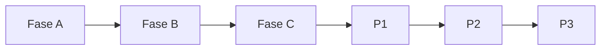

# Plano de implementação — Pesquisa de mensagens na conversa (completo)

Plano mestre com **todas** as melhorias: Releases 1–6 (Fases A/B/C + P1/P2/P3).

Alinhado a [rules-compliance-review.md](./rules-compliance-review.md), [ui-design.md](./ui-design.md), [ux-improvements.md](./ux-improvements.md), [improvements-backlog.md](./improvements-backlog.md), [audio-transcription-search.md](./audio-transcription-search.md) e [api-endpoints.md](./api-endpoints.md).

**Pré-requisitos:** [current-state.md](./current-state.md) · [implementation-decision-tree.md](./implementation-decision-tree.md) · [api-endpoints.md](./api-endpoints.md)

---

## Objetivo

1. Agente abre menu ⋮ → **"Pesquisar nesta conversa"**
2. `Dialog` com busca em **texto da mensagem e transcrições de áudio**
3. Clique no resultado: scroll + highlight 1s (com loading na thread se necessário)
4. Paginação 15/página; fork merge-safe; i18n en + pt_BR

---

## Fases de entrega (pós-reavaliação)

Evitar “big bang” com 32 itens UX-M de uma vez. Alinhado a `chatwoot-core.mdc` (happy path primeiro).

### Fase A — Happy path (entregar primeiro)

- Backend: finder (só `content` ILIKE) + service + `prepend_mod_with` + rota + jbuilder
- `conversationMessageSearch.js` + `useConversationMessageSearch.js`
- Dialog + Form + ResultItem (texto; highlight em `MessageContent`)
- Item no `MoreActions` + i18n mínimo (`MENU_LABEL`, `PLACEHOLDER`, `EMPTY`)
- Clique → `SCROLL_TO_MESSAGE` (mensagem já no DOM)

### Fase B — Robustez (obrigatório antes de produção)

- `useScrollToConversationMessage.js`
- Mutation fork `INSERT_MESSAGES_AROUND` (ver §2.2)
- Toast `MESSAGE_NOT_FOUND` (não `scrollToBottom`)
- Loading discreto na thread (`isJumpingToMessage`)
- Validação `422` para `q` blank ou &lt; 2 chars
- Remover código morto `ConversationView#showSearchModal`

### Fase C — Polish UX + áudio

- Finder: OR transcrição em `attachments.meta`
- ResultItem: badge mic + bloco áudio (`readTranscriptText` + `TranscribedText`)
- Demais UX-M* (privada, responsivo, empty com `{query}`, etc.)

Ver [improvements-backlog.md](./improvements-backlog.md) para mapeamento P0 → fase.

---

## Escopo MVP

### In scope — técnico

- `GET .../conversations/:id/messages/search?q=&page=` — ver [api-endpoints.md](./api-endpoints.md)
- `Custom::ConversationMessageSearchFinder` — **query unificada** (ver secção Fase 1)
- `Custom::Messages::ConversationSearchService` + `includes(:attachments, :sender)`
- `MessagesController.prepend_mod_with` + rota `# FORK:`
- Pesquisa em:
  - `messages.content` (incoming, outgoing, template)
  - `attachments.meta` — `transcribed_text` e `transcription.text` (só `file_type: audio`)
- Merge scroll (`INSERT_MESSAGES_AROUND`)
- Limpeza `ConversationView` código morto

### In scope — UI/UX

- Itens UX-M* distribuídos pelas Fases A/B/C — ver [ux-improvements.md](./ux-improvements.md)
- **Fase C — UX-M33:** badge `i-lucide-mic` quando resultado é match em transcrição
- Snippet áudio via `readTranscriptText` + bloco como `SearchResultMessageItem` (não só `MessageContent`)

### Out of scope (apenas Fase A)

- Assunto e-mail, GIN, OpenSearch, transcrição no finder — entram nas fases C / P1 / P2
- `matched_on` explícito na API — P1.4
- ⌘F, filtros remetente, specs — P1 / P3

**Roadmap completo:** Fases A → B → C (MVP) · P1 · P2 · P3 — ver § "Roadmap completo".

---

## Arquitetura

```
GET .../messages/search?q=
  └── MessagesController#search
        └── ConversationSearchService#perform
              └── ConversationMessageSearchFinder#perform
                    ├── messages.content ILIKE
                    └── attachments.meta (audio) ILIKE  ← transcrição Groq/OpenAI

JSON message + attachments.transcribed_text
  └── ConversationMessageSearchResultItem
        ├── MessageContent (highlight)
        └── mic badge se match transcrição
```

---

## Fase 1 — Backend

### 1.1 Finder (query unificada)

**Arquivo:** `custom/app/finders/custom/conversation_message_search_finder.rb`

Responsabilidade única: montar scope com texto **e** transcrição.

```ruby
module Custom
  class ConversationMessageSearchFinder
    SEARCHABLE_TYPES = %w[incoming outgoing template].freeze
    AUDIO_FILE_TYPE = Attachment.file_types[:audio].freeze

    pattr_initialize [:conversation!, :query!]

    def perform
      return Message.none if sanitized_query.blank?

      pattern = "%#{sanitized_query}%"

      conversation.messages
                  .left_joins(:attachments)
                  .where(message_type: SEARCHABLE_TYPES)
                  .where(search_predicate, pattern: pattern, audio_type: AUDIO_FILE_TYPE)
                  .distinct
                  .reorder('messages.created_at DESC')
    end

    private

    def sanitized_query
      query.to_s.strip.gsub(/[%_\\]/) { |m| "\\#{m}" }
    end

    def search_predicate
      <<~SQL.squish
        messages.content ILIKE :pattern
        OR (
          attachments.file_type = :audio_type
          AND attachments.meta->>'transcribed_text' ILIKE :pattern
        )
        OR (
          attachments.file_type = :audio_type
          AND attachments.meta->'transcription'->>'text' ILIKE :pattern
        )
      SQL
    end
  end
end
```

**Alinhamento com transcrição fork:**

| Origem | Chave em `meta` | Coberta |
|--------|-----------------|---------|
| Groq manual | `transcription.text` + `transcribed_text` | ✅ |
| OpenAI Enterprise | idem via `TranscriptionMetadata.write_transcription` | ✅ |
| Áudio sem transcrição | `meta` vazio | Excluído (OR falso) |
| `state: processing` sem text | sem texto | Excluído |

Detalhes: [audio-transcription-search.md](./audio-transcription-search.md).

### 1.2 Service

**Arquivo:** `custom/app/services/custom/messages/conversation_search_service.rb`

```ruby
def perform
  return Message.none if query.blank?

  Custom::ConversationMessageSearchFinder
    .new(conversation: conversation, query: query)
    .perform
    .includes(:attachments, :sender)
    .page(page)
    .per(PER_PAGE)
end
```

### 1.3 Controller prepend

- `invalid_query?` → 422
- `params.permit(:q, :page)`
- View: partial `_message.json.jbuilder` (attachments com `transcribed_text`)

### 1.4 Rota

```ruby
# FORK: in-conversation message search
collection { get :search }
```

---

## Fase 2 — Frontend infra

### 2.1 `useConversationMessageSearch.js`

- Debounce 500ms; mínimo 2 caracteres
- `useCamelCase` nos resultados (attachments: `transcribedText`, `fileType`)
- Helper `isTranscriptionMatch(message, query)`:

```javascript
import { readTranscriptText } from 'dashboard/composables/fork/useTranscriptText';

export const isTranscriptionMatch = (message, query) => {
  if (message.content?.trim()) return false;
  const audio = message.attachments?.find(a => a.fileType === 'audio');
  const text = readTranscriptText(audio);
  return text.toLowerCase().includes(query.toLowerCase());
};
```

### 2.2 `useScrollToConversationMessage.js`

**Problema atual:** `MessagesView#onScrollToMessage` chama `scrollToBottom()` se `#message{id}` não existe — UX incorreta.

**Fluxo:**

1. Fechar dialog
2. Se elemento no DOM → `emitter.emit(BUS_EVENTS.SCROLL_TO_MESSAGE, { messageId })`
3. Senão → `MessageApi.getPreviousMessages({ conversationId, before, after })` com janela em torno do ID
4. Commit mutation fork `INSERT_MESSAGES_AROUND` (merge + sort por `created_at`, sem duplicatas)
5. `$nextTick` → emit scroll
6. Se ainda falhar → `useAlert` com `CONVERSATION.MESSAGE_SEARCH.MESSAGE_NOT_FOUND`

**Não usar:**

| Mutation | Motivo |
|----------|--------|
| `SET_MISSING_MESSAGES` | **Replace** `chat.messages = data` — perde mensagens já carregadas |
| `SET_PREVIOUS_CONVERSATIONS` | Só `unshift` — inadequado para janela centrada num ID |

**Nova mutation fork** em `app/javascript/dashboard/store/modules/conversations/index.js`:

```javascript
// FORK: merge message window around search target without replacing loaded history
[types.INSERT_MESSAGES_AROUND](_state, { id, data }) {
  const chat = _state.allConversations.find(c => c.id === id);
  if (!chat || !data?.length) return;
  const existingIds = new Set(chat.messages.map(m => m.id));
  const merged = [...chat.messages, ...data.filter(m => !existingIds.has(m.id))];
  chat.messages = merged.sort(
    (a, b) => new Date(a.created_at) - new Date(b.created_at)
  );
},
```

Registrar `INSERT_MESSAGES_AROUND` em `mutation-types.js`.

---

## Fase 3 — UI

### ConversationMessageSearchResultItem.vue

**Texto normal:** `MessageContent` com `search-term` e `author`.

**Áudio transcrito — não confiar só em `MessageContent`:** após `useCamelCase`, attachments ficam em camelCase (`fileType`, `transcribedText`), mas `MessageContent` lê `file_type` / `transcribed_text`. A pesquisa global contorna isso com bloco separado em `SearchResultMessageItem`.

**Padrão obrigatório** (espelhar global):

```vue
<MessageContent
  v-if="message.content?.trim()"
  :message="message"
  :search-term="query"
  :author="authorName"
/>

<template v-else-if="audioAttachment">
  <MessageContent
    :message="{ ...message, content: transcriptSnippet }"
    :search-term="query"
    :author="authorName"
  />
  <div v-if="isTranscriptionMatch(message, query)" class="flex items-center gap-1.5 mt-1 text-n-slate-11">
    <Icon icon="i-lucide-mic" class="size-3.5" />
    <span class="text-xs">{{ t('CONVERSATION.MESSAGE_SEARCH.MATCH_TRANSCRIPTION') }}</span>
  </div>
  <TranscribedText v-if="showTranscriptLabel" :text="transcriptSnippet" />
</template>
```

```javascript
import { readTranscriptText } from 'dashboard/composables/fork/useTranscriptText';

const audioAttachment = computed(() =>
  message.attachments?.find(a => a.fileType === 'audio' || a.file_type === 'audio')
);
const transcriptSnippet = computed(() => readTranscriptText(audioAttachment.value));
```

Alternativa mínima: passar `content` pré-preenchido com `readTranscriptText(audio)` para `MessageContent` quando `!message.content?.trim()`.

### Demais componentes

Ver [ui-design.md](./ui-design.md) e [ux-improvements.md](./ux-improvements.md).

---

## Fase 4 — i18n

Namespace completo em **Fase C** (§ Fase C — i18n). Fase A entrega apenas chaves mínimas (`MENU_LABEL`, `PLACEHOLDER`, `EMPTY`, `TITLE`).

---

## Matriz de reutilização

| Peça | Reuso na pesquisa + áudio |
|------|---------------------------|
| `TranscriptionMetadata.read_text` | Lógica espelhada no SQL do finder |
| `MessageContent.vue` | Highlight em **texto**; para áudio usar `readTranscriptText` + bloco como `SearchResultMessageItem` |
| `useTranscriptText.js` | Deteção match transcrição no FE |
| `TranscribedText.vue` | Label opcional nos resultados |
| `SearchResultMessageItem.vue` | **Referência obrigatória** para bloco áudio + `TranscribedText` |

---

## Test plan — áudio transcrito (Fase C)

1. Transcrever áudio manualmente (orelha) com termo único
2. Pesquisar termo → aparece com badge mic
3. Pesquisar termo que só existe noutra mensagem texto → não mistura
4. Áudio não transcrito → não aparece para nenhum termo do áudio
5. Clique no resultado áudio → scroll + highlight na bolha correta

---

## Roadmap completo

Plano incremental com **todas** as melhorias documentadas em [improvements-backlog.md](./improvements-backlog.md) e [ux-improvements.md](./ux-improvements.md).

| Release | Fase | Escopo | Ref backlog |
|---------|------|--------|-------------|
| **1** | A | Happy path — busca texto, dialog, menu | P0-A |
| **2** | B | Scroll robusto, merge Vuex, toasts | P0-B |
| **3** | C | Áudio transcrito + polish UX-M* | P0-C |
| **4** | P1 | Atalhos, filtros, backend avançado | P1.* |
| **5** | P2 | OpenSearch, navegação teclado, cache | P2.* |
| **6** | P3 | Painel lateral, analytics, specs, a11y | P3.* |



---

## Fase A — Happy path (Release 1)

### Backend

| # | Tarefa | Arquivo / nota |
|---|--------|----------------|
| A-B1 | Rota `collection { get :search }` | `config/routes.rb` `# FORK:` |
| A-B2 | `prepend_mod_with` + action `#search` | `custom/.../messages_controller.rb` |
| A-B3 | `ConversationSearchService` | `custom/app/services/custom/messages/` |
| A-B4 | Finder **só `content` ILIKE** (sem join attachments ainda) | `custom/app/finders/custom/conversation_message_search_finder.rb` |
| A-B5 | `includes(:attachments, :sender)` | service |
| A-B6 | Escape wildcards `%`/`_` | finder `sanitized_query` |
| A-B7 | View `search.json.jbuilder` | espelhar `index.json.jbuilder` |
| A-B8 | Validação `422` se `q` blank ou &lt; 2 | controller |

### Frontend

| # | Tarefa | Arquivo / nota |
|---|--------|----------------|
| A-F1 | API client | `api/fork/conversationMessageSearch.js` |
| A-F2 | Composable busca (debounce 500ms, page) | `composables/fork/useConversationMessageSearch.js` |
| A-F3 | `ConversationMessageSearchDialog.vue` | shell Dialog + estados |
| A-F4 | `ConversationMessageSearchForm.vue` | Input + emit search |
| A-F5 | `ConversationMessageSearchResultItem.vue` | texto + `MessageContent` |
| A-F6 | Hook `MoreActions` — item antes de transcrição | `# FORK:` |
| A-F7 | i18n mínimo | `MENU_LABEL`, `PLACEHOLDER`, `EMPTY`, `TITLE` |
| A-F8 | Clique → `SCROLL_TO_MESSAGE` (mensagem no DOM) | sem composable de carga ainda |

### UX (Fase A)

| ID | Item |
|----|------|
| UX-M1 | Item menu ⋮ + ícone `i-lucide-search` |
| UX-M3 | `defineExpose({ open, close })` |
| UX-M16–M18 | Autor, snippet highlight, timestamp |
| UX-M20–M21 | Hover, `@click` sem `router-link` |
| UX-M22–M23 | Fechar dialog + scroll |

### Critérios de aceite — Fase A

- [ ] Menu abre dialog; busca texto em `messages.content`
- [ ] Paginação 15/página; "carregar mais" append
- [ ] `422` para query inválida
- [ ] Clique scrolla se mensagem já carregada na thread

---

## Fase B — Robustez (Release 2)

### Backend

Sem endpoint novo — reutiliza `GET .../messages?before=&after=` ([api-endpoints.md](./api-endpoints.md)).

### Frontend

| # | Tarefa | Arquivo / nota |
|---|--------|----------------|
| B-F1 | `useScrollToConversationMessage.js` | composable fork |
| B-F2 | Mutation `INSERT_MESSAGES_AROUND` | `conversations/index.js` + `mutation-types.js` |
| B-F3 | Flag `isJumpingToMessage` | `MessagesView.vue` `# FORK:` barra loading |
| B-F4 | Toast `MESSAGE_NOT_FOUND` | `useAlert` + i18n |
| B-F5 | Remover `showSearchModal` / `onSearch` | `ConversationView.vue` |
| B-F6 | Limpar prop `conversation-id` ignorada | `ConversationHeader` / `MoreActions` (se aplicável) |

### UX (Fase B)

| ID | Item |
|----|------|
| UX-M14–M15 | Erro API + query curta (422) |
| UX-M24 | Highlight ~1s (`route.query.messageId`) |
| UX-M25–M27 | Carga histórico, loading thread, toast falha |
| UX-M28–M29 | Carregar mais; manter query no dialog |

### Critérios de aceite — Fase B

- [ ] Mensagem fora do DOM → carrega janela → scroll (nunca `scrollToBottom` silencioso)
- [ ] Falha após carga → toast `MESSAGE_NOT_FOUND`
- [ ] Loading visível na thread durante salto
- [ ] Código morto `ConversationView` removido

---

## Fase C — Polish + áudio (Release 3)

### Backend

| # | Tarefa | Nota |
|---|--------|------|
| C-B1 | Finder: `left_joins(:attachments)` + OR transcrição | SQL completo §1.1 |
| C-B2 | `distinct` + tipos `incoming`/`outgoing`/`template` | excluir `activity` |
| C-B3 | Notas privadas incluídas (sem filtro extra MVP) | D17 |

### Frontend

| # | Tarefa | Nota |
|---|--------|------|
| C-F1 | `isTranscriptionMatch` + badge mic | `readTranscriptText` |
| C-F2 | Bloco áudio no ResultItem | espelhar `SearchResultMessageItem` |
| C-F3 | `TranscribedText` opcional | label transcrição |
| C-F4 | UX-M4–M13, M19, M30–M32 | ver checklist abaixo |

### UX (Fase C) — checklist completo MVP

| ID | Item | Implementação |
|----|------|---------------|
| UX-M4 | Foco automático no input | `@open` / `onMounted` |
| UX-M5 | Esc fecha dialog | Dialog handler |
| UX-M6 | Hint "2+ caracteres" | abaixo do input |
| UX-M8 | `position="top"` + `width="lg"` | Dialog props |
| UX-M9 | Responsivo `max-w-[calc(100vw-2rem)]` | classes |
| UX-M10–M13 | Idle, loading lista, empty `{query}`, erro | estados no Dialog |
| UX-M19 | Badge nota privada | `i-lucide-lock-keyhole` |
| UX-M30–M32 | aria-label, foco pós-fechar, contraste highlight | a11y mínimo |
| UX-M33–M35 | Badge mic, snippet transcrição, highlight termo | Fase C |
| UX-M36 | `AudioChip` mini no resultado (opcional) | como pesquisa global |

### i18n — namespace completo MVP

```json
"MESSAGE_SEARCH": {
  "MENU_LABEL": "...",
  "TITLE": "...",
  "DESCRIPTION": "...",
  "PLACEHOLDER": "...",
  "HINT": "Type 2 or more characters to search",
  "EMPTY": "No messages found for '{query}'",
  "LOAD_MORE": "...",
  "MESSAGE_NOT_FOUND": "Could not locate this message in the conversation history",
  "SEARCHING": "Searching messages...",
  "ERROR": "Search failed. Please try again.",
  "QUERY_TOO_SHORT": "Enter at least 2 characters to search",
  "JUMPING": "Loading message...",
  "MATCH_TRANSCRIPTION": "Match in audio transcription",
  "OPEN_RESULT": "Open message from {author}, {time}"
}
```

`en` + `pt_BR` em `conversation.json`.

### Critérios de aceite — Fase C (+ test plan áudio)

- [ ] Termo só em `messages.content` → highlight no texto
- [ ] Termo só em transcrição Groq → snippet + badge mic
- [ ] Áudio sem transcrição → não aparece
- [ ] `distinct` — sem duplicata com múltiplos attachments
- [ ] Transcrição OpenAI legada → mesmo comportamento
- [ ] Todos os critérios UX-MVP em [ux-improvements.md](./ux-improvements.md#critérios-de-aceite-ux-mvp)
- [ ] Test plan áudio abaixo + [audio-transcription-search.md](./audio-transcription-search.md) §7

---

## Fase P1 — Pós-MVP (Release 4)

### Backend (mesma rota `messages/search`)

| # | Tarefa | Ref |
|---|--------|-----|
| P1-B1 | GIN / `search_with_gin` no finder | P1.1 |
| P1-B2 | Assunto e-mail no predicate | P1.2 / UX-P1.7 |
| P1-B3 | Excluir `content_attributes.deleted` | P1.3 / UX-P1.8 |
| P1-B4 | Campo `matched_on: content \| transcription` | P1.4 |
| P1-B5 | Módulo SQL partilhado + `SearchService` prepend | P1.5 |
| P1-B6 | Query param `from=contact:N \| agent:N` | P1.13 / UX-P1.9 |
| P1-B7 | Filtro privadas alinhado a `MessageFinder` | P1.16 / D17 |
| P1-B8 | Rate limit leve no `search` | P1.17 |

### Frontend

| # | Tarefa | Ref |
|---|--------|-----|
| P1-F1 | ⌘F / Ctrl+F na conversa | UX-P1.1 |
| P1-F2 | `CMD_SEARCH_IN_CONVERSATION` | UX-P1.2 |
| P1-F3 | Tooltip menu com atalho | UX-P1.3 |
| P1-F4 | Ícone 🔍 opcional no header | UX-P1.4 |
| P1-F5 | Contador "N mensagens encontradas" | UX-P1.5 |
| P1-F6 | Filtro remetente no Form | UX-P1.9–P1.10 |
| P1-F7 | Enter com único resultado | UX-P1.11 |
| P1-F8 | Highlight via emitter `HIGHLIGHT_MESSAGE` | P1.6 / UX-P1.12 |
| P1-F9 | Limpar `messageId` da URL pós-highlight | P1.7 / UX-P1.13 |
| P1-F10 | Hint "inclui áudios transcritos" | UX-M34 / P1.18 |
| P1-F11 | Corrigir `MessageContent` upstream (opcional) | P1.15 |

### Critérios de aceite — P1

- [ ] ⌘F abre dialog sem conflito com browser find (testado)
- [ ] Filtro remetente reduz resultados corretamente
- [ ] GIN ativo quando flag `search_with_gin`
- [ ] Mensagens deletadas não aparecem
- [ ] `matched_on` correto quando API expõe campo

---

## Fase P2 — Médio prazo (Release 5)

### Backend

| # | Tarefa | Ref |
|---|--------|-----|
| P2-B1 | OpenSearch scoped `conversation_id` | P2.1 / D19 |
| P2-B2 | Limite 100 resultados + meta | P2.8 |
| P2-B3 | Constante `Search::DEFAULT_PER_PAGE` | P2.10 |

### Frontend

| # | Tarefa | Ref |
|---|--------|-----|
| P2-F1 | Navegação ↑↓ entre resultados | UX-P2.1–P2.2 |
| P2-F2 | `role="listbox"` / `aria-activedescendant` | UX-P2.3 |
| P2-F3 | Buscas recentes por conversa (3–5) | UX-P2.4 |
| P2-F4 | Cache query `sessionStorage` por `conversationId` | UX-P2.5 |
| P2-F5 | Scroll infinito no dialog | UX-P2.6 |
| P2-F6 | Modo busca só ao Enter (toggle) | UX-P2.7 |

### Critérios de aceite — P2

- [ ] Enterprise com OpenSearch: paridade qualidade com pesquisa global
- [ ] Teclado ↑↓ + Enter funciona nos resultados
- [ ] Buscas recentes persistem por conversa na sessão

---

## Fase P3 — Polish (Release 6)

| # | Tarefa | Ref |
|---|--------|-----|
| P3-1 | Painel lateral slide ~320px (experimento) | UX-P3.1 |
| P3-2 | Analytics `SEARCH_IN_CONVERSATION` | UX-P3.3 |
| P3-3 | Empty state ilustrado + dicas | UX-P3.4 |
| P3-4 | Specs RSpec (finder, service, controller) + Vitest (composables, Dialog) | P3.4 |
| P3-5 | `prefers-reduced-motion` no dialog | P3.5 / UX-P3.2 |

---

## Débitos upstream (limpar quando possível)

| Item | Fase sugerida |
|------|---------------|
| `MessagesView#onScrollToMessage` → `scrollToBottom` | B |
| `MessageContent` snake/camel attachments | P1.15 |
| `SearchInput` placeholder "3" vs validação 2 | não replicar no fork |
| `EmailTranscriptModal` legado | não usar |
| `ConversationView` código morto | B |

---

## Ordem de entrega (completa)

| # | Release | Entrega |
|---|---------|---------|
| 1 | A | Backend texto + API + Dialog + menu + scroll (DOM) |
| 2 | B | `INSERT_MESSAGES_AROUND` + scroll composable + toasts + cleanup |
| 3 | C | Finder transcrição + UX-M completo + i18n + testes áudio |
| 4 | P1 | Atalhos + filtros + GIN + deleted + `matched_on` |
| 5 | P2 | OpenSearch + teclado + cache + scroll infinito |
| 6 | P3 | Painel lateral + analytics + specs + a11y polish |

---

## Critérios de aceite globais

### Funcional

- [ ] Busca texto + transcrição (Fase C+)
- [ ] Paginação e merge scroll sem perda de mensagens (Fase B+)
- [ ] Autorização via conversa — sem endpoint paralelo inseguro
- [ ] Um endpoint novo apenas (`messages/search`)

### UX

- [ ] [ux-improvements.md](./ux-improvements.md) — critérios MVP (Fase C)
- [ ] [ui-design.md](./ui-design.md) — anti-padrões respeitados
- [ ] [rules-compliance-review.md](./rules-compliance-review.md) — camadas e fork workflow

### Performance

- [ ] `includes(:attachments, :sender)` — sem N+1
- [ ] ILIKE aceitável no MVP; GIN/OpenSearch em P1/P2 se necessário
- [ ] Escape wildcards ILIKE
