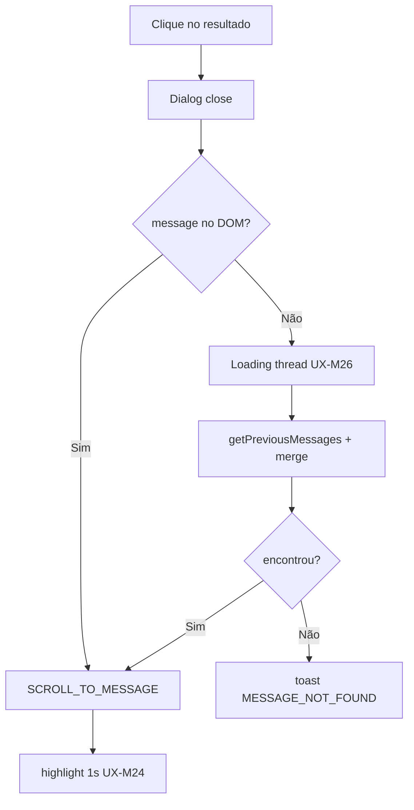

# Backlog de melhorias — Pesquisa in-conversation

Itens técnicos e de UX fora do MVP ou refinamentos pós-entrega.

**Documento mestre de UX:** [ux-improvements.md](./ux-improvements.md) — IDs `UX-M*`, `UX-P1.*`, `UX-P2.*`, `UX-P3.*`

Prioridade: **P0** bloqueante · **P1** importante · **P2** nice-to-have · **P3** polish

---

## P0 — Corrigir no MVP (técnico + UX obrigatório)

| # | Item | Tipo | Ref UX |
|---|------|------|--------|
| P0.1 | Merge de mensagens ao scroll (não `SET_MISSING_MESSAGES` replace) | Técnico | UX-M25 |
| P0.2 | Toast quando mensagem não encontrada (não `scrollToBottom`) | UX | UX-M27 |
| P0.3 | Validação `q` no controller (422) | Técnico | UX-M14, UX-M15 |
| P0.4 | Caminhos frontend em `widgets/` + `composables/fork/` | Fork | — |
| P0.5 | `Dialog` components-next, não `EmailTranscriptModal` | UI | — |
| P0.6 | Foco automático no input ao abrir | UX | UX-M4 |
| P0.7 | Esc fecha dialog | UX | UX-M5 |
| P0.8 | Hint "2+ caracteres" (não 3) | UX | UX-M6 |
| P0.9 | Loading na lista durante busca | UX | UX-M11 |
| P0.10 | Empty state com `{query}` | UX | UX-M13 |
| P0.11 | Badge nota privada no result item | UX | UX-M19 |
| P0.12 | Highlight 1s pós-clique na bolha | UX | UX-M24 |
| P0.13 | Loading discreto na thread ao saltar | UX | UX-M26 |
| P0.14 | Dialog responsivo viewport estreito | UX | UX-M9 |
| P0.15 | Item do menu antes de "Enviar transcrição" | UX | UX-M1 |
| P0.16 | **Finder: ILIKE em transcrição** (`attachments.meta`) | Técnico | UX-M33 |
| P0.17 | `includes(:attachments, :sender)` na resposta | Técnico | — |
| P0.18 | Badge mic + snippet transcrição no result item | UX | UX-M33 |
| P0.19 | Escape wildcards `%`/`_` na query ILIKE | Técnico | — |

---

## P1 — Pós-MVP curto prazo

### Técnico / backend

| # | Item | Ref UX |
|---|------|--------|
| P1.1 | GIN / `search_with_gin` no finder | — |
| P1.2 | Assunto de e-mail no subject | UX-P1.7 |
| P1.3 | Excluir mensagens deletadas do índice | UX-P1.8 |
| P1.4 | Campo API `matched_on: content \| transcription` | UX-M33 |
| P1.5 | Alinhar `SearchService` ILIKE global (módulo SQL partilhado) | [audio-transcription-search.md](./audio-transcription-search.md) §8 |
| P1.6 | Highlight via emitter (sem `route.query`) | UX-P1.12 |
| P1.7 | Limpar `messageId` da URL após highlight | UX-P1.13 |

### UX / descoberta

| # | Item | Ref UX |
|---|------|--------|
| P1.7 | `CMD_SEARCH_IN_CONVERSATION` command bar | UX-P1.2 |
| P1.8 | ⌘F / Ctrl+F na conversa | UX-P1.1 |
| P1.9 | Tooltip no menu com atalho | UX-P1.3 |
| P1.10 | Contador "N mensagens encontradas" | UX-P1.5 |
| P1.11 | Enter com único resultado → salto direto | UX-P1.11 |
| P1.12 | Filtro remetente (Todas/Cliente/Agente/Privadas) | UX-P1.9 |
| P1.13 | Ícone busca opcional no header | UX-P1.4 |
| P1.14 | Hint "inclui áudios transcritos" no dialog | UX-M34 |

---

## P2 — Médio prazo

| # | Item | Tipo | Ref UX |
|---|------|------|--------|
| P2.1 | OpenSearch scoped `conversation_id` | Técnico | — |
| P2.2 | Navegação ↑↓ + Enter nos resultados | UX | UX-P2.1, UX-P2.2 |
| P2.3 | `role="listbox"` / `aria-activedescendant` | a11y | UX-P2.3 |
| P2.4 | Buscas recentes por conversa (3–5) | UX | UX-P2.4 |
| P2.5 | Cache última query (`sessionStorage`) | UX | UX-P2.5 |
| P2.6 | Scroll infinito no dialog | UX | UX-P2.6 |
| P2.7 | Modo busca só ao Enter | UX | UX-P2.7 |
| P2.8 | Limite 100 resultados + mensagem | UX/Técnico | UX-P2.8 |
| P2.9 | Índice `(conversation_id, created_at)` | Técnico | — |
| P2.10 | Constante compartilhada `PER_PAGE` | Técnico | — |

---

## P3 — Polish

| # | Item | Ref UX |
|---|------|--------|
| P3.1 | Painel lateral (slide) em vez de modal | UX-P3.1 |
| P3.2 | Analytics `SEARCH_IN_CONVERSATION` | UX-P3.3 |
| P3.3 | Empty state ilustrado + dicas | UX-P3.4 |
| P3.4 | Specs RSpec + Vitest | Técnico |
| P3.5 | `prefers-reduced-motion` no dialog | a11y |

---

## Débitos upstream (não bloquear fork)

| Item | Local | Nota |
|------|-------|------|
| Placeholder "3 caracteres" vs código "2+" | `SearchInput.vue` | Não replicar no fork |
| `EmailTranscriptModal` Options API | legado | — |
| `ConversationView` código morto | `showSearchModal` | Remover na entrega |
| `MoreActions` prop `conversation-id` ignorada | `ConversationHeader` | Limpar na entrega |
| `MessagesView` scrollToBottom em falha | `onScrollToMessage` | Corrigir via composable fork |

---

## Diagrama — fluxo de scroll (P0)

---

## Como usar este backlog

1. **MVP:** todos os itens **P0** + critérios em [ux-improvements.md](./ux-improvements.md#critérios-de-aceite-ux-mvp)
2. **Release 2:** P1 agrupado por tema (atalhos → filtros → backend)
3. **Release 3+:** P2/P3 conforme feedback de produção
