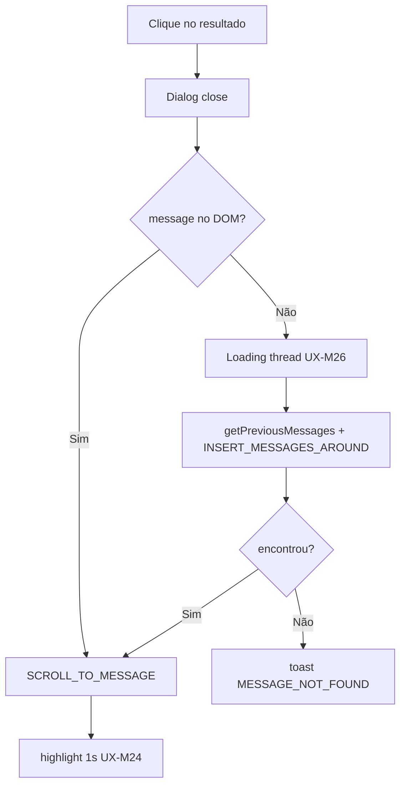

# Backlog de melhorias — Pesquisa in-conversation

> Catálogo histórico. A priorização vigente está no [plano consolidado](./implementation-plan.md) §13.

Itens técnicos e de UX fora do MVP ou refinamentos pós-entrega.

**Documento mestre de UX:** [ux-improvements.md](./ux-improvements.md) — IDs `UX-M*`, `UX-P1.*`, `UX-P2.*`, `UX-P3.*`

Prioridade: **P0** bloqueante · **P1** importante · **P2** nice-to-have · **P3** polish

---

## P0 por fase de entrega

### P0-A — Happy path (Fase A)

| # | Item | Tipo | Ref UX |
|---|------|------|--------|
| P0-A.1 | Caminhos frontend `widgets/` + `composables/fork/` | Fork | — |
| P0-A.2 | `Dialog` components-next, não `EmailTranscriptModal` | UI | — |
| P0-A.3 | Validação `q` no controller (422) | Técnico | UX-M14, UX-M15 |
| P0-A.4 | Item menu antes de "Enviar transcrição" | UX | UX-M1 |
| P0-A.5 | `includes(:attachments, :sender)` na resposta | Técnico | — |
| P0-A.6 | Escape wildcards `%`/`_` na query ILIKE | Técnico | — |

### P0-B — Robustez (Fase B) — bloqueante para produção

| # | Item | Tipo | Ref UX |
|---|------|------|--------|
| P0-B.1 | Mutation `INSERT_MESSAGES_AROUND` (não `SET_MISSING_MESSAGES`) | Técnico | UX-M25 |
| P0-B.2 | Toast `MESSAGE_NOT_FOUND` (não `scrollToBottom`) | UX | UX-M27 |
| P0-B.3 | Loading discreto na thread ao saltar | UX | UX-M26 |
| P0-B.4 | Remover `ConversationView` código morto (`showSearchModal`) | Técnico | — |

### P0-C — Polish + áudio (Fase C)

| # | Item | Tipo | Ref UX |
|---|------|------|--------|
| P0-C.1 | **Finder: ILIKE em transcrição** (`attachments.meta`) | Técnico | UX-M33 |
| P0-C.2 | Badge mic + snippet (`readTranscriptText`) | UX | UX-M33 |
| P0-C.3 | Foco automático no input ao abrir | UX | UX-M4 |
| P0-C.4 | Esc fecha dialog | UX | UX-M5 |
| P0-C.5 | Hint "2+ caracteres" (não 3) | UX | UX-M6 |
| P0-C.6 | Loading na lista durante busca | UX | UX-M11 |
| P0-C.7 | Empty state com `{query}` | UX | UX-M13 |
| P0-C.8 | Badge nota privada no result item | UX | UX-M19 |
| P0-C.9 | Highlight 1s pós-clique na bolha | UX | UX-M24 |
| P0-C.10 | Dialog responsivo viewport estreito | UX | UX-M9 |

---

## P0 legado (referência cruzada)

A tabela P0 original foi fatiada em **P0-A / P0-B / P0-C** acima. Itens antigos P0.1–P0.19 mapeiam assim:

| Antigo | Novo |
|--------|------|
| P0.1 | P0-B.1 |
| P0.2 | P0-B.2 |
| P0.3 | P0-A.3 |
| P0.4 | P0-A.1 |
| P0.5 | P0-A.2 |
| P0.6–P0.15, P0.18 | P0-C.3–P0-C.10 |
| P0.16–P0.17, P0.19 | P0-C.1–P0-C.2, P0-A.5–P0-A.6 |

---

## P1 — Pós-MVP curto prazo

### Técnico / backend

| # | Item | Ref UX |
|---|------|--------|
| P1.1 | GIN / `search_with_gin` no finder | — |
| P1.2 | Assunto de e-mail no subject | UX-P1.7 |
| P1.3 | Excluir mensagens deletadas do índice | UX-P1.8 |
| P1.4 | Campo API `matched_on: content \| transcription` | UX-M33 |
| P1.5 | Alinhar `SearchService` ILIKE global (módulo SQL partilhado) | [audio-transcription-search.md](./audio-transcription-search.md) §8 |
| P1.6 | Highlight via emitter (sem `route.query`) | UX-P1.12 |
| P1.7 | Limpar `messageId` da URL após highlight | UX-P1.13 |
| P1.15 | Corrigir `MessageContent` upstream (snake + camel) | Débito upstream; fork usa `readTranscriptText` |
| P1.16 | Filtro notas privadas alinhado a `MessageFinder#filter_internal_messages` | D17 |
| P1.17 | Rate limit leve no endpoint search (opcional) | D19 |

### UX / descoberta

| # | Item | Ref UX |
|---|------|--------|
| P1.8 | `CMD_SEARCH_IN_CONVERSATION` command bar | UX-P1.2 |
| P1.9 | ⌘F / Ctrl+F na conversa | UX-P1.1 |
| P1.10 | Tooltip no menu com atalho | UX-P1.3 |
| P1.11 | Contador "N mensagens encontradas" | UX-P1.5 |
| P1.12 | Enter com único resultado → salto direto | UX-P1.11 |
| P1.13 | Filtro remetente (Todas/Cliente/Agente/Privadas) | UX-P1.9 |
| P1.14 | Ícone busca opcional no header | UX-P1.4 |
| P1.18 | Hint "inclui áudios transcritos" no dialog | UX-M34 |

---

## P2 — Médio prazo

| # | Item | Tipo | Ref UX |
|---|------|------|--------|
| P2.1 | OpenSearch scoped `conversation_id` | Técnico | D19 |
| P2.2 | Navegação ↑↓ + Enter nos resultados | UX | UX-P2.1, UX-P2.2 |
| P2.3 | `role="listbox"` / `aria-activedescendant` | a11y | UX-P2.3 |
| P2.4 | Buscas recentes por conversa (3–5) | UX | UX-P2.4 |
| P2.5 | Cache última query (`sessionStorage`) | UX | UX-P2.5 |
| P2.6 | Scroll infinito no dialog | UX | UX-P2.6 |
| P2.7 | Modo busca só ao Enter | UX | UX-P2.7 |
| P2.8 | Limite 100 resultados + mensagem | UX/Técnico | UX-P2.8 |
| P2.9 | Índice `(conversation_id, created_at)` | Técnico | — |
| P2.10 | Constante compartilhada `PER_PAGE` | Técnico | — |

---

## P3 — Polish

| # | Item | Ref UX |
|---|------|--------|
| P3.1 | Painel lateral (slide) em vez de modal | UX-P3.1 |
| P3.2 | Analytics `SEARCH_IN_CONVERSATION` | UX-P3.3 |
| P3.3 | Empty state ilustrado + dicas | UX-P3.4 |
| P3.4 | Specs RSpec + Vitest | Técnico |
| P3.5 | `prefers-reduced-motion` no dialog | a11y |

---

## Débitos upstream (não bloquear fork)

| Item | Local | Nota |
|------|-------|------|
| Placeholder "3 caracteres" vs código "2+" | `SearchInput.vue` | Não replicar no fork |
| `EmailTranscriptModal` Options API | legado | — |
| `ConversationView` código morto | `showSearchModal` | Remover na Fase B |
| `MoreActions` prop `conversation-id` ignorada | `ConversationHeader` | Limpar na entrega |
| `MessagesView` scrollToBottom em falha | `onScrollToMessage` | Corrigir via composable fork (Fase B) |
| `MessageContent` snake_case em attachments | `MessageContent.vue` | Fork usa `readTranscriptText`; corrigir upstream em P1.15 |

---

## Diagrama — fluxo de scroll (P0-B)

---

## Como usar este backlog

O plano mestre com **todas** as tarefas por release está em [implementation-plan.md](./implementation-plan.md) § "Roadmap completo".

1. **Fase A:** P0-A → demo funcional
2. **Fase B:** P0-B → production-ready (scroll)
3. **Fase C:** P0-C + critérios UX restantes
4. **Release 4:** P1 — atalhos, filtros, backend avançado
5. **Release 5:** P2 — OpenSearch, teclado, cache
6. **Release 6:** P3 — polish, analytics, specs
