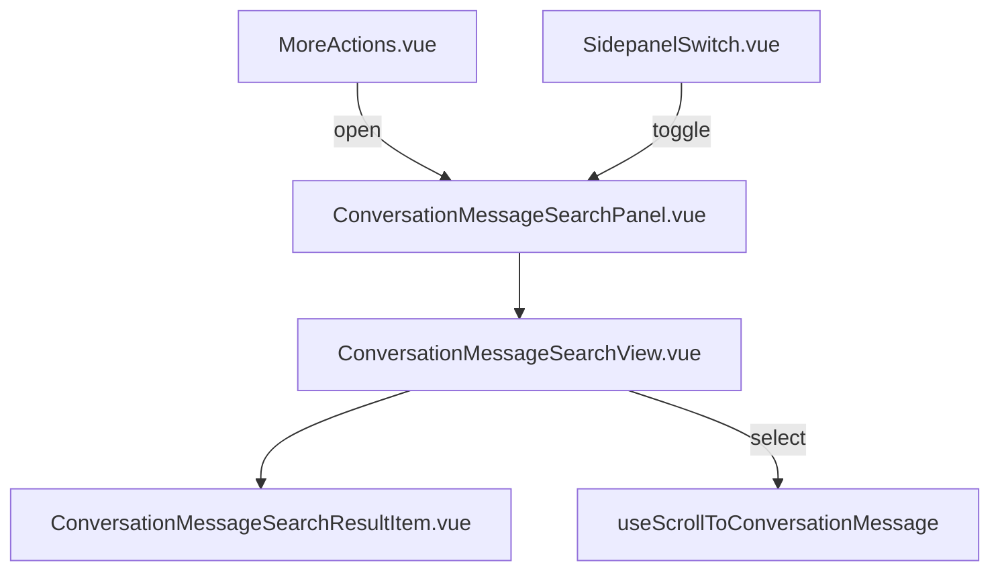

# UI Design — Pesquisa de mensagens na conversa

> Referência visual. Escopo e estrutura vigentes estão no [plano consolidado](./implementation-plan.md).

Especificação visual e de interação alinhada ao dashboard Chatwoot, `vue-frontend.mdc` e [ux-improvements.md](./ux-improvements.md).

**Relacionado:** [rules-compliance-review.md](./rules-compliance-review.md) · [implementation-plan.md](./implementation-plan.md)

---

## Princípios

- **Tailwind only** — sem CSS custom, sem scoped CSS, sem inline styles no código novo
- **Composition API** + `<script setup>`
- **components-next** para primitivos (`Dialog`, `Button`, `Input`, `Icon`)
- **widgets/conversation/** para feature acoplada ao header (padrão `ShareContact/`)
- **i18n** — nenhuma string bare; `en` + `pt_BR`
- Ícones do menu **MoreActions**: **Lucide** (`i-lucide-*`)
- **Feedback explícito** em todos os estados — ver [ux-improvements.md](./ux-improvements.md)

---

## Referências visuais no projeto

| Padrão | Arquivo | O que reutilizar |
|--------|---------|------------------|
| Item menu ⋮ | `MoreActions.vue` | `actionMenuItems` + `DropdownMenu` |
| Modal moderno | `ShareContactDialog.vue` | `Dialog` + `defineExpose({ open, close })` |
| Shell dialog | `components-next/dialog/Dialog.vue` | `width`, `overflow-y-auto`, `@close`, Esc |
| Campo de busca | `components-next/input/Input.vue` | Ícone search, placeholder i18n, autofocus |
| Snippet com highlight | `MessageContent.vue` | `searchTerm` + `author` |
| Empty / loading | `SearchResultSection.vue` | Padrão visual — chaves i18n próprias |
| Resultado clicável | `CardLayout` / `SearchResultMessageItem` | Hover — **sem** `router-link` |
| Load more | `SearchView.vue` | `NextButton` slate faded sm |
| Loading thread | `MessagesView.vue` | Barra/spinner discreto ao saltar (UX-M26) |
| Áudio transcrito | `useTranscriptText.js` + `TranscribedText.vue` | Snippet + label transcrição |
| Resultado áudio global | `SearchResultMessageItem.vue` | `AudioChip` + `TranscribedText` |
| ~~Modal legado~~ | ~~`EmailTranscriptModal.vue`~~ | **Não usar** |

Backend transcrição: [audio-transcription-search.md](./audio-transcription-search.md).

---

## Arquitetura de componentes



| Arquivo | Responsabilidade |
|---------|------------------|
| `ConversationMessageSearchPanel.vue` | Shell painel lateral; `open`/`close` via `useConversationMessageSearchPanel` |
| `ConversationMessageSearchView.vue` | Input, filtros, resultados, infinite scroll, analytics |
| `ConversationMessageSearchResultItem.vue` | Linha: autor, snippet texto **ou** transcrição, hora, badge private/mic |
| `useConversationMessageSearch.js` | API, paginação, loading, erros, rate limit |
| `useConversationMessageSearchPanel.js` | Estado `is_message_search_panel_open` em `useUISettings` |
| `useScrollToConversationMessage.js` | Merge + scroll + highlight + toast falha |

---

## Armadilha: MessageContent e attachments camelCase

`SearchView` aplica `useCamelCase(..., { deep: true })`. `MessageContent` lê `attachment.file_type` e `transcribed_text` (snake_case).

Na pesquisa global, áudio transcrito é renderizado em `SearchResultMessageItem` via `attachment.transcribedText` + `TranscribedText.vue` — **não** via `MessageContent`.

**Regra para ResultItem in-conversation:**

1. Texto com `content` → `MessageContent` normal
2. Áudio / transcrição → `readTranscriptText(audio)` como snippet; badge mic; opcional `TranscribedText`
3. Não assumir que `MessageContent` resolve transcrição após camelCase

Ver [implementation-plan.md](./implementation-plan.md) § Fase 3 e [audio-transcription-search.md](./audio-transcription-search.md) §5.1.

---

## MoreActions — novo item

**Ordem:** inserir **antes** de "Enviar transcrição" (UX-M1).

```javascript
// FORK: in-conversation message search
{
  icon: 'i-lucide-search',
  label: t('CONVERSATION.MESSAGE_SEARCH.MENU_LABEL'),
  action: 'search_in_conversation',
  value: 'search_in_conversation',
}
```

```vue
<ConversationMessageSearchDialog
  ref="messageSearchDialogRef"
  :conversation-id="currentChat.id"
  @select="handleMessageSearchSelect"
/>
```

---

## Dialog — layout e comportamento

| Propriedade | Valor | Motivo |
|-------------|-------|--------|
| `type` | `edit` | Busca exploratória — sem confirm obrigatório |
| `width` | `lg` | Snippets legíveis |
| `overflow-y-auto` | `true` | Lista longa |
| `show-confirm-button` | `false` | Fechar com X / Esc / outside |
| `show-cancel-button` | `false` | Idem |
| `position` | `top` | Thread visível atrás (UX-M8) |

### Responsivo (UX-M9)

```html
<!-- classes no container do dialog ou prop width condicional -->
class="w-full max-w-lg sm:max-w-lg max-w-[calc(100vw-2rem)]"
```

### Wireframe

```
┌─────────────────────────────────────────────┐
│  Pesquisar nesta conversa              [X]  │
│  Encontre mensagens no histórico atual      │
├─────────────────────────────────────────────┤
│  🔍  [ Pesquisar mensagens...           ]   │
│  Digite 2 ou mais caracteres para pesquisar │
│  Inclui mensagens de áudio transcritas      │
├─────────────────────────────────────────────┤
│  ┌─ 🎤 Transcrição de áudio ─────────────┐  │
│  │ Maria escreveu: ...termo destacado... │  │
│  │ Match em transcrição de áudio         │  │
│  │                          há 2 dias    │  │
│  └───────────────────────────────────────┘  │
│  ┌─ 🔒 Nota privada ─────────────────────┐  │
│  │ Você escreveu: ...termo destacado...  │  │
│  │                          há 2 dias    │  │
│  └───────────────────────────────────────┘  │
│  ┌───────────────────────────────────────┐  │
│  │ Maria escreveu: ...termo...           │  │
│  │                          há 1 semana │  │
│  └───────────────────────────────────────┘  │
│         [ Carregar mais ]                     │
└─────────────────────────────────────────────┘

Thread (parcialmente visível atrás)
┌─────────────────────────────────────────────┐
│ ▓▓▓▓ carregando mensagem... (UX-M26)        │
│  ... mensagens ...                           │
└─────────────────────────────────────────────┘
```

---

## Estados da UI (MVP)

| Estado | Condição | UI | ID UX |
|--------|----------|-----|-------|
| Idle | Dialog aberto, query vazia | Hint abaixo do input | UX-M6 |
| Too short | `0 < query.length < 2` | Hint; sem API | UX-M15 |
| Loading | Request em flight | `woot-loading-state` na lista | UX-M11 |
| Results | `results.length > 0` | Lista `ResultItem` | UX-M12 |
| Empty | Busca ok, zero hits | Ícone info + `EMPTY` | UX-M13 |
| Error | 4xx/5xx | `useAlert` | UX-M14 |
| Jumping | Pós-clique, carregando histórico | Barra no topo da thread | UX-M26 |

---

## Result item — tokens Tailwind

| Elemento | Classes |
|----------|---------|
| Container | `rounded-xl border border-n-weak bg-n-solid-1 hover:bg-n-slate-2 dark:hover:bg-n-solid-3 cursor-pointer` |
| Padding | `px-4 py-3` (área de toque UX-M20) |
| Autor | via `MessageContent` — `text-n-slate-11 font-medium` |
| Timestamp | `text-sm text-n-slate-11 flex-shrink-0` |
| Match transcrição | `i-lucide-mic` + `text-xs text-n-slate-11` (UX-M33) |
| Private badge | `text-n-amber-11` + `i-lucide-lock-keyhole` (UX-M19) |
| Lista | `space-y-2` |

### Estrutura do item

```vue
<button
  type="button"
  class="w-full text-start rounded-xl border ..."
  :aria-label="t('CONVERSATION.MESSAGE_SEARCH.OPEN_RESULT', { author, time })"
  @click="emit('select', message)"
>
  <div class="flex justify-between gap-2 mb-1">
  <PrivateBadge v-if="message.private" />
  <span>{{ dynamicTime(message.createdAt) }}</span>
  </div>
  <MessageContent :author="..." :message="message" :search-term="query" />
</button>
```

---

## Teclado (MVP)

| Tecla | Ação |
|-------|------|
| **Esc** | Fecha dialog (UX-M5) |
| **Tab** | Navegação natural; sem trap permanente (UX-M31) |

**P1:** ↑↓ entre resultados, Enter para selecionar, ⌘F para abrir — ver [ux-improvements.md](./ux-improvements.md).

---

## Interação pós-seleção

1. `close()` imediato (UX-M22)
2. Se mensagem no DOM → `SCROLL_TO_MESSAGE` (UX-M23)
3. Senão → loading thread (UX-M26) → merge → scroll
4. `router.replace({ query: { messageId } })` → highlight 1s (UX-M24)
5. Falha → `useAlert(MESSAGE_NOT_FOUND)` (UX-M27)

---

## i18n — namespace `CONVERSATION.MESSAGE_SEARCH`

Ver lista completa em [ux-improvements.md](./ux-improvements.md#i18n-mvp-chaves-adicionais).

Arquivos:
- `app/javascript/dashboard/i18n/locale/en/conversation.json`
- `app/javascript/dashboard/i18n/locale/pt_BR/conversation.json`

---

## O que não fazer

- Popover em vez de Dialog
- `SearchInput` com filtros Enterprise / buscas recentes globais
- `EmailTranscriptModal` como template
- `router-link` nos resultados
- Scroll silencioso para o fim da conversa
- Strings hardcoded
- Hover-only sem suporte a toque

---

## Roadmap visual (pós-MVP)

| Fase | Mudança de UI |
|------|----------------|
| P1 | Contador de resultados; filtro remetente; tooltip ⌘F |
| P2 | Navegação ↑↓; buscas recentes por conversa; scroll infinito |
| P3 | Painel lateral opcional em vez de modal central |

Detalhes: [ux-improvements.md](./ux-improvements.md)
