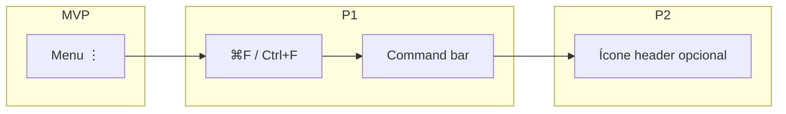
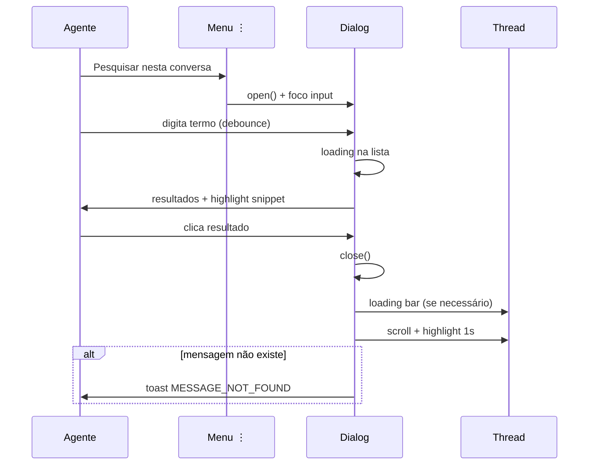

# Melhorias de UI/UX — Pesquisa in-conversation

Consolidação de todas as sugestões de experiência do usuário, organizadas por fase de entrega.

**Relacionado:** [ui-design.md](./ui-design.md) · [implementation-plan.md](./implementation-plan.md) · [improvements-backlog.md](./improvements-backlog.md)

---

## Princípios UX

1. **Contexto preservado** — agente não deve perder de vista a conversa nem a posição no histórico.
2. **Feedback explícito** — nenhuma ação silenciosa (especialmente scroll falho ou busca vazia).
3. **Paridade com padrões existentes** — debounce, highlight e empty states alinhados à pesquisa global (`/search`).
4. **Progressive disclosure** — MVP pelo menu ⋮; atalhos e filtros avançados nas fases seguintes.
5. **Mobile-first nos toques** — áreas clicáveis generosas; dialog responsivo.

---

## Nota sobre escopo MVP

O catálogo UX-M* descreve o **estado desejado completo**. A implementação deve seguir [implementation-plan.md](./implementation-plan.md) **Fases A → B → C**, não entregar os 32 itens num único PR.

---

## Mapa de prioridades

| Fase | Escopo UX | Doc de referência |
|------|-----------|-------------------|
| **MVP-A** | Menu, dialog, busca, lista, clique (mensagem no DOM) | [implementation-plan.md](./implementation-plan.md) Fase A |
| **MVP-B** | Scroll robusto, toast falha, loading thread | Fase B |
| **MVP-C** | Áudio, badges, estados polish | Fase C |
| **P1** | Atalhos, contador, filtros remetente | Este doc § P1 |
| **P2** | Navegação ↑↓, buscas recentes, cache query, scroll infinito | Este doc § P2 |
| **P3** | Painel lateral, analytics, polish a11y avançado | Este doc § P3 |

---

## MVP — incluir na primeira entrega

### Entrada e descoberta

| # | Melhoria | Implementação |
|---|----------|---------------|
| UX-M1 | Item no menu **antes** de "Enviar transcrição" | Ordem em `actionMenuItems` — busca = consulta, transcrição = exportação |
| UX-M2 | Ícone `i-lucide-search` + label i18n clara | `CONVERSATION.MESSAGE_SEARCH.MENU_LABEL` |
| UX-M3 | Abrir via `defineExpose({ open })` | Mesmo padrão `ShareContactDialog` — sem navegação de rota |

### Dialog e input

| # | Melhoria | Implementação |
|---|----------|---------------|
| UX-M4 | **Foco automático** no input ao abrir | `onMounted` / callback `@open` do Dialog → `inputRef.focus()` |
| UX-M5 | **Esc** fecha o dialog | Handler no Dialog / `onKeydown` — não propaga para a conversa |
| UX-M6 | Hint inicial: *"Digite 2 ou mais caracteres"* | Texto abaixo do input quando `query.length < 2` — **não** "3 caracteres" |
| UX-M7 | Debounce **500ms** enquanto digita | Igual `SearchInput.vue` global |
| UX-M8 | `position="top"` + `width="lg"` | Thread parcialmente visível atrás do dialog |
| UX-M9 | Responsivo: `max-w-[calc(100vw-2rem)]` em viewport estreito | Classe condicional ou `width="md"` em mobile |

### Estados de feedback

| # | Estado | UI |
|---|--------|-----|
| UX-M10 | Idle (sem query) | Hint M6; sem spinner |
| UX-M11 | Buscando | `woot-loading-state` na área da lista (não só no input) |
| UX-M12 | Com resultados | Lista scrollável + contagem opcional simples no título |
| UX-M13 | Zero resultados | Ícone `i-lucide-info` + `EMPTY` com `{query}` interpolado |
| UX-M14 | Erro API / 422 | `useAlert` — mensagens i18n distintas |
| UX-M15 | Query muito curta | Não disparar API; manter hint M6 |

### Linha de resultado (`ResultItem`)

| # | Elemento | Fonte |
|---|----------|-------|
| UX-M16 | Autor + "escreveu:" | `MessageContent.vue` |
| UX-M17 | Snippet com termo em **negrito** | `searchkey--highlight` via `MessageContent` |
| UX-M18 | Timestamp relativo | `dynamicTime(createdAt)` |
| UX-M19 | Badge **nota privada** | Ícone `i-lucide-lock-keyhole` + `SEARCH.PRIVATE` se `message.private` |
| UX-M20 | Hover / active | `hover:bg-n-slate-2`; `cursor-pointer`; `py-3` (área de toque) |
| UX-M21 | Sem `router-link` | `@click` → emit `select` |

### Pós-seleção (salto para mensagem)

| # | Melhoria | Implementação |
|---|----------|---------------|
| UX-M22 | Dialog fecha **imediatamente** ao clicar | `close()` antes do scroll |
| UX-M23 | Scroll suave até a bolha | `BUS_EVENTS.SCROLL_TO_MESSAGE` |
| UX-M24 | **Highlight ~1s** na mensagem | `route.query.messageId` → `Message.vue#setupHighlightTimer` |
| UX-M25 | Carregar histórico se mensagem fora do DOM | `useScrollToConversationMessage` + merge no store |
| UX-M26 | **Loading na thread** durante carga | Flag `isJumpingToMessage` — barra fina no topo de `MessagesView` ou spinner discreto |
| UX-M27 | Toast se mensagem não encontrada | `MESSAGE_NOT_FOUND` — **nunca** `scrollToBottom()` silencioso |

### Paginação

| # | Melhoria | Implementação |
|---|----------|---------------|
| UX-M28 | Botão **"Carregar mais"** no rodapé da lista | `NextButton` slate faded sm — visível se `results.length === page * 15` |
| UX-M29 | Manter query e scroll position no dialog ao carregar mais | Append results; não resetar input |

### Acessibilidade (MVP mínimo)

| # | Item |
|---|------|
| UX-M30 | `aria-label` no item do menu e no botão de resultado |
| UX-M31 | Foco retorna à conversa após fechar dialog (não prender tab trap indefinidamente) |
| UX-M32 | Contraste do highlight via classes existentes do tema claro/escuro |

### Áudio transcrito (MVP)

| # | Melhoria | Implementação |
|---|----------|---------------|
| UX-M33 | Badge **microfone** quando match é só na transcrição | `isTranscriptionMatch()` + `i-lucide-mic` + i18n `MATCH_TRANSCRIPTION` |
| UX-M34 | Hint opcional: pesquisa inclui áudios transcritos | Subtítulo no Dialog (P1 se quiser manter MVP mínimo) |
| UX-M35 | Snippet da transcrição com highlight | `MessageContent` — já lê `transcribed_text` se content vazio |
| UX-M36 | Player áudio mini no resultado (opcional) | Reutilizar `AudioChip` com `show-transcribed-text="false"` — como pesquisa global |

### i18n MVP (chaves adicionais)

```json
"MESSAGE_SEARCH": {
  "MENU_LABEL": "...",
  "TITLE": "...",
  "DESCRIPTION": "...",
  "PLACEHOLDER": "...",
  "HINT": "Type 2 or more characters to search",
  "EMPTY": "No messages found for '{query}'",
  "LOAD_MORE": "...",
  "MESSAGE_NOT_FOUND": "Could not locate this message in the conversation history",
  "SEARCHING": "Searching messages...",
  "ERROR": "Search failed. Please try again.",
  "QUERY_TOO_SHORT": "Enter at least 2 characters to search",
  "JUMPING": "Loading message...",
  "MATCH_TRANSCRIPTION": "Match in audio transcription",
  "HINT_INCLUDES_AUDIO": "Includes transcribed audio messages"
}
```

---

## P1 — pós-MVP (alto retorno)

### Descoberta e atalhos

| # | Melhoria | Detalhe |
|---|----------|---------|
| UX-P1.1 | **⌘F / Ctrl+F** na conversa | `preventDefault` quando conversa aberta; abre dialog — documentar conflito com find do browser |
| UX-P1.2 | **Command bar** `CMD_SEARCH_IN_CONVERSATION` | Paridade com `CMD_SEND_TRANSCRIPT` |
| UX-P1.3 | Tooltip no menu com atalho | `"Pesquisar nesta conversa (⌘F)"` quando P1.1 existir |
| UX-P1.4 | Ícone 🔍 opcional no header | Um clique a menos que ⋮ — só se header não ficar poluído |

### Informação nos resultados

| # | Melhoria | Detalhe |
|---|----------|---------|
| UX-P1.5 | **"N mensagens encontradas"** | Subtítulo ou badge no dialog |
| UX-P1.6 | Ícone de anexo se match em transcrição (Fase técnica P1.2) | `i-lucide-mic` ou chip áudio |
| UX-P1.7 | Linha de **assunto de e-mail** quando match no subject | Canais email |
| UX-P1.8 | Excluir ou rotular **mensagens deletadas** | Texto "Mensagem removida" ou ocultar |

### Filtros leves

| # | Melhoria | Detalhe |
|---|----------|---------|
| UX-P1.9 | Dropdown **Todas / Cliente / Agente / Notas privadas** | Um controle só — mais útil in-conversation que filtro de inbox |
| UX-P1.10 | Filtro persiste na sessão do dialog até fechar | Reset em `close()` |

### Interação avançada

| # | Melhoria | Detalhe |
|---|----------|---------|
| UX-P1.11 | **Enter** com único resultado → salto direto | Atalho sem clique |
| UX-P1.12 | Highlight via **emitter** dedicado | Desacoplar de `route.query.messageId` |
| UX-P1.13 | Limpar `messageId` da URL após highlight | Evitar re-highlight ao navegar |

---

## P2 — médio prazo

| # | Melhoria | Detalhe |
|---|----------|---------|
| UX-P2.1 | Navegação **↑ / ↓** entre resultados | Item ativo: `bg-n-alpha-2` ou `ring-n-brand` |
| UX-P2.2 | **Enter** na seleção ativa | Power users |
| UX-P2.3 | `role="listbox"` / `role="option"` / `aria-activedescendant` | a11y completa |
| UX-P2.4 | **Buscas recentes** por conversa (3–5 termos) | Versão reduzida de `RecentSearches.vue` |
| UX-P2.5 | **Cache da última query** ao reabrir (`sessionStorage` por `conversationId`) | |
| UX-P2.6 | **Scroll infinito** no dialog em vez de só "Carregar mais" | IntersectionObserver no último item |
| UX-P2.7 | Busca só ao **Enter** (modo opcional) | Reduz carga API em conversas enormes |
| UX-P2.8 | Limite de resultados + mensagem | *"Mostrando os 100 primeiros resultados"* |

---

## P3 — polish

| # | Melhoria | Detalhe |
|---|----------|---------|
| UX-P3.1 | **Painel lateral** (slide 320px) em vez de modal central | Thread sempre visível — avaliar após feedback do modal |
| UX-P3.2 | Animação de entrada do dialog | `transition` já no `Dialog.vue` — validar reduced-motion |
| UX-P3.3 | Analytics `CONVERSATION_EVENTS.SEARCH_IN_CONVERSATION` | Medir adoção |
| UX-P3.4 | Empty state ilustrado | Ícone maior + sugestão ("Tente outro termo ou verifique a ortografia") |

---

## Anti-padrões (não fazer)

| ❌ | Motivo |
|----|--------|
| Popover estreito para lista de resultados | Pouco espaço; difícil ler snippets |
| `SearchInput` global com filtros Enterprise | Paywall e UI pesada fora de contexto |
| `router-link` nos resultados | Agente já está na conversa |
| Scroll silencioso para o fim quando falha | UX frustrante — sempre toast |
| Placeholder "3 caracteres" com validação 2 | Inconsistência (débito upstream na `/search`) |
| Hover-only para ações críticas | Falha em touch devices |
| God component com busca + scroll + API no Dialog | Ver [rules-compliance-review.md](./rules-compliance-review.md) |

---

## Hierarquia de entrada (roadmap)



**Meta:** MVP pelo menu ⋮; P1 reduz fricção para usuários frequentes; P2 só se métricas justificarem ícone extra no header.

---

## Diagrama — fluxo UX completo (MVP)



---

## Critérios de aceite UX (MVP)

- [ ] Input recebe foco ao abrir dialog
- [ ] Esc fecha dialog
- [ ] Hint visível com query &lt; 2 caracteres
- [ ] Loading na lista durante busca
- [ ] Empty state com query interpolada
- [ ] Badge nota privada nos resultados aplicável
- [ ] Clique fecha dialog antes do scroll
- [ ] Highlight visível na bolha ~1s
- [ ] Loading discreto na thread ao carregar mensagem antiga
- [ ] Toast em falha de localização — sem scroll para o fim
- [ ] Dialog usável em viewport estreito (sem overflow horizontal)
- [ ] Área de toque mínima nos itens (`py-3`)
- [ ] Termo só em transcrição Groq → resultado + badge mic
- [ ] Áudio sem transcrição → não aparece na busca
- [ ] Snippet da transcrição com highlight no termo
