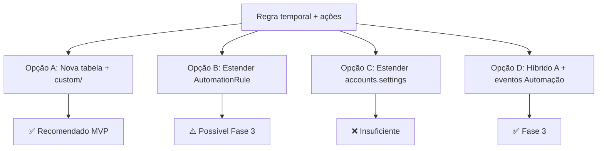

# Conversation Workflow Rules — Árvore de Decisão

Comparação de abordagens arquiteturais antes/durante implementação.

**Atualizado jun/2026**

---

## Pergunta central

> Onde modelar regras temporais (inatividade + agente não respondeu) e como executar ações?

---

## Opção A — `conversation_workflow_rules` em `custom/` (RECOMENDADA)

**Ideia:** entidade dedicada, scheduler próprio, UI em Fluxos de Conversa, ações via wrapper sobre `ActionService`.

| Prós | Contras |
|------|---------|
| Separação clara: temporal vs event-driven | Nova tabela + CRUD |
| Múltiplas regras, inbox, dedup nativos | Mais uma superfície para manter |
| Fork-friendly (`custom/` isolado) | Período de transição com legacy job |
| UI coesa no produto (“Fluxos de Conversa”) | |

**Veredito:** ✅ MVP Fase 1–2.

---

## Opção B — Estender `AutomationRule` com `duration_minutes`

**Ideia:** adicionar campos temporais à tabela existente; scheduler avalia subset de rules.

| Prós | Contras |
|------|---------|
| Reusa CRUD, validação, UI de Automação | Mistura gatilhos síncronos e cron no mesmo modelo |
| Zero duplicação de action whitelist | UX confusa (“evento” vs “tempo”) |
| | Migration arriscada em tabela core upstream |
| | Fork: editar OSS/Enterprise automation |

**Veredito:** ⚠️ só considerar se quiser **uma única tela** de regras; custo alto para fork.

---

## Opção C — Continuar em `accounts.settings` (JSON)

**Ideia:** array de regras em `settings` como `conversation_workflow_rules: []`.

| Prós | Contras |
|------|---------|
| Zero migration de tabela | Sem dedup executions estruturado |
| Menor diff inicial | JSON grande, difícil CRUD/auditoria |
| | Não escala para múltiplas regras + histórico |
| | Validação fraca vs tabela |

**Veredito:** ❌ insuficiente para multi-regra + dedup.

---

## Opção D — Híbrido (A + eventos Automação Fase 3)

**Ideia:** scheduler dispara eventos `conversation_agent_no_reply` / `conversation_inactivity_threshold`; admin configura **ações** na UI Automação.

| Prós | Contras |
|------|---------|
| Uma engine de ações (Automação) | Duas telas para operação completa |
| Condições ricas sem duplicar UI | Mais moving parts no dispatcher |
| Admins power-users já conhecem Automação | |

**Veredito:** ✅ evolução natural pós-MVP se times preferirem Automação para ações complexas.

---

## Decisões derivadas (incorporadas — ver README)

| # | Decisão | Valor |
|---|---------|-------|
| T1 | Modelo | **Opção A** — `conversation_workflow_rules` em `custom/` |
| T2 | Executor | `ConversationWorkflow::ActionService` |
| T3 | Multi-regra | Todas matching executam, salvo dedup |
| T4 | Legacy | `workflow_rules_migrated_at` → skip ResolutionJob |
| T5 | Condições | **Fase 2** — assignee, team, labels, priority |
| T6 | Status pending | MVP `open`; Fase 2.1 inclui `pending` |

---

*Última atualização: jun/2026 — alinhado com README e implementation-plan*
