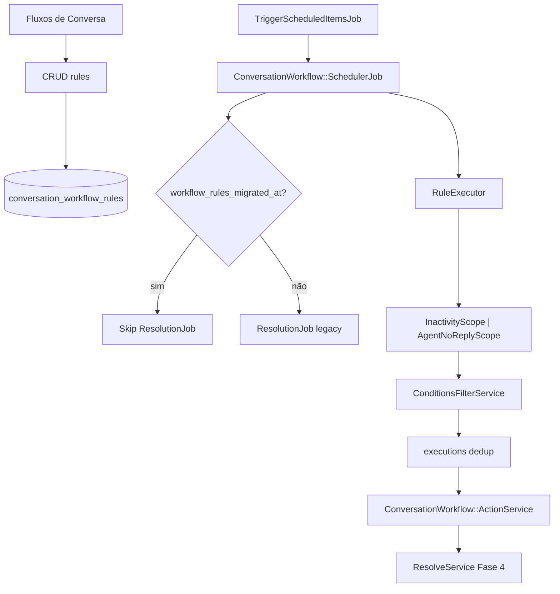

# Conversation Workflow Rules — Plano de implementação (Fork)

> Menu independente **Regras de conversa** (`/settings/conversation-rules`) — ver [current-state.md](./current-state.md).

Plano revisado com melhorias P0–P2 incorporadas.

**Pré-requisitos:** [README.md](./README.md) · [business-rules.md](./business-rules.md) · [implementation-decision-tree.md](./implementation-decision-tree.md)

---

## Context

Evoluir Fluxos de Conversa de config global para **regras multi-inbox** com dois gatilhos temporais, condições, ações ricas e migração segura do legacy.

## Objective

1. CRUD de regras + execução scheduler
2. `ConversationWorkflow::ActionService` + auditoria
3. Guard anti-duplo job legacy
4. Condições na Fase 2
5. Feature flag separada para `agent_no_reply`
6. i18n en + pt_BR
7. Roadmap Fase 3–4 (UI avançada, business hours, ResolveService, Automação)

---

## Scope

### In Scope

| Fase | Entrega |
|------|---------|
| 0 | Sign-off T1–T6 |
| 1 | Models, scopes, executor, wrapper, dedup, scheduler, índices, legacy guard |
| 2 | API, UI, condições, feature flag, unattended link, tiered SLA doc |
| 2.1 | `pending` status, filtros opcionais waiting |
| 3 | Business hours, job per-message (opcional) |
| 4 | ResolveService + required attrs; eventos Automação (Opção D) |

### Out of Scope inicial

- Specs automatizados (salvo pedido)
- Alterar Captain pending job

---

## Project Rules Applied

| Regra | Aplicação |
|-------|-----------|
| `custom/` | Models, services, jobs, controllers, Vue, migrations índices |
| `# FORK:` mínimo | Scheduler hook, skip legacy job, UI mount |
| `ConversationWorkflow::ActionService` | Wrapper obrigatório |
| i18n | en + pt_BR |
| Tiered SLA | N regras, não engine de tiers |
| `bin/fork-inventory` | Após markers |

---

## Architecture



---

## Data model

### `conversation_workflow_rules`

| Coluna | Tipo | Notas |
|--------|------|-------|
| `account_id` | FK | |
| `name`, `description` | string/text | |
| `active` | boolean | default true |
| `position` | integer | |
| `trigger_type` | enum | `conversation_inactivity` \| `agent_no_reply` |
| `duration_minutes` | integer | 10..1439856 |
| `inbox_ids` | jsonb | null = all |
| `ignore_waiting` | boolean | inatividade |
| `resolve_on_match` | boolean | inatividade |
| `message` | text | template cliente |
| `conditions` | jsonb | Fase 2 |
| `actions` | jsonb | pode incluir `counts_as_agent_reply` |
| `options` | jsonb | Fase 2.1: `require_no_first_reply`, `statuses[]` |

### `conversation_workflow_rule_executions`

| Coluna | Tipo |
|--------|------|
| `conversation_workflow_rule_id` | FK |
| `conversation_id` | FK |
| `waiting_since_epoch` | bigint nullable |
| `last_activity_epoch` | bigint nullable |
| `executed_at` | datetime |

**Unique:** `[rule_id, conversation_id, waiting_since_epoch]` (partial nulls conforme PG)

### `accounts.settings` (transição)

| Chave | Uso |
|-------|-----|
| `workflow_rules_migrated_at` | ISO timestamp — desliga legacy job |

### Índices (migration)

```sql
-- Preferir parcial se PG permitir; senão composto simples
CREATE INDEX idx_conv_workflow_waiting
  ON conversations (account_id, waiting_since)
  WHERE status = 0 AND waiting_since IS NOT NULL;

CREATE INDEX idx_conv_workflow_inactivity
  ON conversations (account_id, last_activity_at)
  WHERE status = 0;
```

---

## Backend (`custom/`)

| Arquivo | Responsabilidade |
|---------|------------------|
| `models/custom/conversation_workflow_rule.rb` | Validações, enums |
| `models/custom/conversation_workflow_rule_execution.rb` | Dedup |
| `services/custom/conversation_workflow/action_service.rb` | **Wrapper** ActionService |
| `services/custom/conversation_workflow/scopes/inactivity_scope.rb` | |
| `services/custom/conversation_workflow/scopes/agent_no_reply_scope.rb` | |
| `services/custom/conversation_workflow/rule_executor.rb` | Orquestração |
| `services/custom/conversation_workflow/conditions_filter.rb` | Delega ConditionsFilterService |
| `jobs/custom/conversation_workflow/scheduler_job.rb` | |
| `controllers/.../conversation_workflow_rules_controller.rb` | CRUD |
| `policies/.../conversation_workflow_rule_policy.rb` | administrator |

### `ConversationWorkflow::ActionService` (obrigatório)

```ruby
class ConversationWorkflow::ActionService < ActionService
  def initialize(rule, account, conversation)
    super(conversation)
    @rule = rule
    @account = account
    Current.executed_by = rule
  end

  def send_message(message)
    params = {
      content: message[0],
      private: false,
      content_attributes: {
        conversation_workflow_rule_id: @rule.id,
        counts_as_agent_reply: message[1] # opt-in
      }
    }
    Messages::MessageBuilder.new(nil, @conversation, params).perform
    clear_waiting_since_if_counts_as_reply!(message[1])
  end
  # demais ações delegam super com marcação workflow_rule_id onde aplicável
ensure
  Current.reset
end
```

### `# FORK:` upstream

```ruby
# app/jobs/trigger_scheduled_items_job.rb
# FORK: Custom::ConversationWorkflow::SchedulerJob.perform_later

# app/jobs/account/conversations_resolution_scheduler_job.rb
# FORK: skip accounts where settings['workflow_rules_migrated_at'].present?
```

### Feature flags

Registrar em `custom/config/features.yml` (ou `InstallationConfig`):

```yaml
- name: conversation_agent_no_reply_rules
  display_name: Agent No Reply Workflow Rules
  enabled: true
```

---

## Frontend

| Arquivo | Responsabilidade |
|---------|------------------|
| `ConversationWorkflowRulesList.vue` | Lista, toggle, ordem |
| `ConversationWorkflowRuleForm.vue` | Trigger, duration, inboxes, conditions, actions |
| Reutilizar | `AutomationActionInput`, `ConditionRow`, `DurationInput`, `MultiSelect` |
| Fase 2.5 | Badge link → fila Não atendidas + count preview |

**Ação `send_message`:** checkbox “Conta como resposta do agente” → `counts_as_agent_reply`.

Integração:

```javascript
// FORK: conversationWorkflow/index.vue — RulesList + manter RequiredAttributes
```

---

## Migration legacy

```ruby
# rake conversation_workflow:migrate_legacy
Account.with_auto_resolve.find_each do |account|
  next if account.settings['workflow_rules_migrated_at']

  ConversationWorkflowRule.create!(
    account: account,
    name: 'Auto-resolve (migrated)',
    trigger_type: :conversation_inactivity,
    duration_minutes: account.auto_resolve_after,
    message: account.auto_resolve_message,
    ignore_waiting: account.auto_resolve_ignore_waiting,
    resolve_on_match: true,
    actions: build_label_action(account.auto_resolve_label)
  )

  account.settings['workflow_rules_migrated_at'] = Time.current.iso8601
  account.save!
end
```

Manter leitura `auto_resolve_*` 1 release com log deprecation.

---

## Fases detalhadas

### Fase 0 — Sign-off (1 dia)

| # | Tarefa |
|---|--------|
| 0.1 | Confirmar T1–T6 ([decision-tree](./implementation-decision-tree.md)) |
| 0.2 | Confirmar D4 default (filtro opcional Fase 2.1) |
| 0.3 | Review fork inventory plan |

### Fase 1 — Backend core (4–6 dias)

| # | Tarefa | Done |
|---|--------|------|
| 1.1 | Migrations: rules, executions, índices conversations | Done |
| 1.2 | Models + validations | Done |
| 1.3 | `ActionService` wrapper + activity i18n keys | Done |
| 1.4 | Scopes inactivity + agent_no_reply | Done |
| 1.5 | RuleExecutor + dedup | Done |
| 1.6 | SchedulerJob | Done |
| 1.7 | `# FORK:` trigger + legacy skip | Done |
| 1.8 | Rake migrate_legacy | Done |

### Fase 2 — API + UI + condições (4–6 dias)

| # | Tarefa | Done |
|---|--------|------|
| 2.1 | CRUD API + policies | Done |
| 2.2 | RulesList + RuleForm | Done |
| 2.3 | Conditions (assignee, team, labels, priority) | Done |
| 2.4 | Feature flag `conversation_agent_no_reply_rules` | Done |
| 2.5 | UI unattended link + count | Done |
| 2.6 | `counts_as_agent_reply` no form send_message | Done |
| 2.7 | i18n en + pt_BR | Done |
| 2.8 | Documentar padrão tiered SLA (3 regras exemplo) | Done |

### Fase 2.1 — Refinamentos waiting (2–3 dias)

| # | Tarefa | Done |
|---|--------|------|
| 2.1.1 | Incluir `pending` em agent_no_reply (config `options.statuses`) | Done |
| 2.1.2 | Opção `require_no_first_reply` | Done |
| 2.1.3 | Fechar D4 com produto | Done |

### Fase 3 — Precisão e horário (opcional)

| # | Tarefa | Done |
|---|--------|------|
| 3.1 | Business hours — pausar elapsed time | Done |
| 3.2 | Job per-message: schedule on incoming, cancel on reply | Done |

### Fase 4 — Integrações profundas (opcional)

| # | Tarefa | Done |
|---|--------|------|
| 4.1 | `Conversations::ResolveService` + required attrs backend | Done |
| 4.2 | `skip_required_attributes: true` para workflow system resolve | Done |
| 4.3 | Eventos Automação: `conversation_inactivity_threshold`, `conversation_agent_no_reply` | Done |
| 4.4 | Doc fronteira SLA vs workflow | Done |

---

## How to test

### Tiered SLA (3 regras)

1. Regra A: agent_no_reply 15 min → add_label
2. Regra B: agent_no_reply 120 min → assign_team
3. Regra C: conversation_inactivity 1440 min → resolve
4. Validar cada tier dispara uma vez por episódio

### Legacy guard

1. Migrar conta → `workflow_rules_migrated_at` set
2. Cron roda → **ResolutionJob não** processa conta
3. Scheduler novo processa regras

### counts_as_agent_reply

1. Regra send_message com flag **off** → waiting continua
2. Com flag **on** → waiting zera

### Condições

1. Regra agent_no_reply + assignee null
2. Conversa atribuída → skip
3. Não atribuída → executa

---

## Risks (atualizado)

| Risco | Mitigação |
|-------|-----------|
| Duplo job | `workflow_rules_migrated_at` + FORK legacy skip |
| send_message loop | dedup + counts_as_agent_reply explícito |
| waiting_since = created_at | Filtros opcionais Fase 2.1 + doc |
| Performance | Índices compostos + BULK_ACTIONS_LIMIT |
| ActionService drift | Wrapper único + whitelist compartilhada |
| SLA vs workflow confusão | Doc Fase 4 § fronteira |

---

## Referências

| Área | Arquivo |
|------|---------|
| Auto-resolve | `app/jobs/conversations/resolution_job.rb` |
| waiting_since | `app/models/message.rb` |
| Automação wrapper | `app/services/automation_rules/action_service.rb` |
| UI automação | `AutomationRuleForm.vue` |
| Unattended | `store/modules/conversations/helpers.js` |

---

*Última atualização: jun/2026 — melhorias P0–P2 incorporadas*
