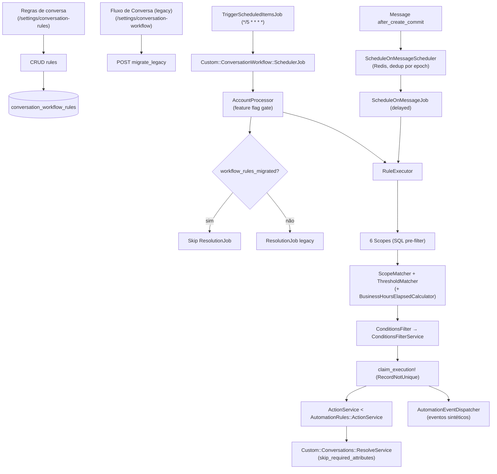

# Conversation Workflow Rules — Plano de implementação (Fork)

> Menu independente **Regras de conversa** (`/settings/conversation-rules`) — ver [current-state.md](./current-state.md).

Plano revisado com melhorias P0–P2 incorporadas.

**Pré-requisitos:** [README.md](./README.md) · [business-rules.md](./business-rules.md) · [implementation-decision-tree.md](./implementation-decision-tree.md)

---

## Context

Evoluir Fluxos de Conversa de config global para **regras multi-inbox** com seis gatilhos temporais, condições, ações ricas e migração segura do legacy.

## Objective

1. CRUD de regras + execução scheduler
2. `ConversationWorkflow::ActionService` + auditoria
3. Guard anti-duplo job legacy
4. Condições na Fase 2
5. Feature flag separada para `agent_no_reply`
6. i18n en + pt_BR
7. Roadmap Fase 3–4 (UI avançada, business hours, ResolveService, Automação)

---

## Scope

### In Scope

| Fase | Entrega |
|------|---------|
| 0 | Sign-off T1–T6 |
| 1 | Models, scopes, executor, wrapper, dedup, scheduler, índices, legacy guard |
| 2 | API, UI, condições, feature flag, unattended link, tiered SLA doc |
| 2.1 | `pending` status, filtros opcionais waiting |
| 3 | Business hours, job per-message (opcional) |
| 4 | ResolveService + required attrs; eventos Automação (Opção D) |

### Out of Scope inicial

- Specs automatizados (salvo pedido)
- Alterar Captain pending job

---

## Project Rules Applied

| Regra | Aplicação |
|-------|-----------|
| `custom/` | Models, services, jobs, controllers, Vue, migrations índices |
| `# FORK:` mínimo | Scheduler hook, skip legacy job, UI mount |
| `ConversationWorkflow::ActionService` | Wrapper obrigatório |
| i18n | en + pt_BR |
| Tiered SLA | N regras, não engine de tiers |
| `bin/fork-inventory` | Após markers |

---

## Architecture



---

## Data model

### `conversation_workflow_rules`

| Coluna | Tipo | Notas |
|--------|------|-------|
| `account_id` | FK | |
| `name`, `description` | string/text | |
| `active` | boolean | default true |
| `position` | integer | |
| `trigger_type` | enum | `conversation_inactivity` \| `agent_no_reply` \| `first_response_overdue` \| `unassigned_too_long` \| `pending_stale` \| `customer_no_reply` |
| `duration_minutes` | integer | 10..1439856 |
| `inbox_ids` | jsonb | null = all |
| `ignore_waiting` | boolean | inatividade |
| `resolve_on_match` | boolean | inatividade |
| `message` | text | template cliente |
| `conditions` | jsonb | assignee_id, team_id, labels, priority |
| `actions` | jsonb | pode incluir `counts_as_agent_reply` |
| `options` | jsonb | `require_no_first_reply`, `statuses[]`, `respect_business_hours` |

### `conversation_workflow_rule_executions`

| Coluna | Tipo |
|--------|------|
| `conversation_workflow_rule_id` | FK |
| `conversation_id` | FK |
| `waiting_since_epoch` | bigint nullable |
| `last_activity_epoch` | bigint nullable |
| `executed_at` | datetime |

**Unique:** `[rule_id, conversation_id, waiting_since_epoch]` (partial nulls conforme PG)

### `accounts.settings` (transição)

| Chave | Uso |
|-------|-----|
| `workflow_rules_migrated_at` | ISO timestamp — desliga legacy job |

### Índices (migration)

```sql
-- Open + waiting (agent_no_reply, first_response_overdue)
CREATE INDEX index_conv_workflow_waiting
  ON conversations (account_id, waiting_since)
  WHERE status = 0 AND waiting_since IS NOT NULL;

-- Open inactivity (conversation_inactivity)
CREATE INDEX index_conv_workflow_inactivity
  ON conversations (account_id, last_activity_at)
  WHERE status = 0;

-- Pending stale (status = 2)
CREATE INDEX index_conv_workflow_pending_stale
  ON conversations (account_id, last_activity_at)
  WHERE status = 2;

-- Unassigned too long
CREATE INDEX index_conv_workflow_unassigned
  ON conversations (account_id, created_at)
  WHERE status = 0 AND assignee_id IS NULL;
```

Migrations: `20260618130200_add_conversation_workflow_conversation_indexes.rb`,
`20260709120000_add_conversation_workflow_extended_trigger_indexes.rb`.
---

## Backend (`custom/`)

| Arquivo | Responsabilidade |
|---------|------------------|
| `custom/app/models/conversation_workflow_rule.rb` | Validações, 6 enums trigger_type, whitelist de ações/condições |
| `custom/app/models/conversation_workflow_rule_execution.rb` | Dedup — `record!` com índices parciais únicos |
| `custom/app/models/custom/account.rb` | `has_many :conversation_workflow_rules`, `workflow_rules_migrated?` |
| `custom/app/models/custom/message.rb` | Hook `after_create_commit` → `WorkflowRulesScheduler` |
| `custom/app/models/custom/message/workflow_rules_scheduler.rb` | Fan-out incoming/outgoing para `ScheduleOnMessageScheduler` |
| `custom/app/services/custom/conversation_workflow/account_processor.rb` | Itera regras ativas da conta com gate de feature flag |
| `custom/app/services/custom/conversation_workflow/rule_executor.rb` | Orquestração: scope → match → claim → pipeline → audit → events |
| `custom/app/services/custom/conversation_workflow/action_service.rb` | Subclass de `AutomationRules::ActionService`; webhook prefix `workflow_rule.*` |
| `custom/app/services/custom/conversation_workflow/scope_matcher.rb` | Elegibilidade por conversa pós-SQL (status, waiting_since, inbox_ids, etc.) |
| `custom/app/services/custom/conversation_workflow/threshold_matcher.rb` | Checagem de duration (calendar ou business hours) |
| `custom/app/services/custom/conversation_workflow/reference_timestamp.rb` | Timestamp de referência e atributos de dedup por trigger type |
| `custom/app/services/custom/conversation_workflow/conditions_filter.rb` | Wrapper de `AutomationRules::ConditionsFilterService` |
| `custom/app/services/custom/conversation_workflow/conditions_rule_adapter.rb` | Duck-typing de regra como AutomationRule para filtro de condições |
| `custom/app/services/custom/conversation_workflow/template_message_sender.rb` | Envia template via `MessageTemplates::Template::AutoResolve` |
| `custom/app/services/custom/conversation_workflow/migrate_legacy_service.rb` | Migração one-shot de `auto_resolve_*` → regra inatividade |
| `custom/app/services/custom/conversation_workflow/preview_count_service.rb` | `POST preview_count` — contagem de elegíveis sem salvar regra |
| `custom/app/services/custom/conversation_workflow/automation_event_dispatcher.rb` | Dispara eventos sintéticos para `AutomationRule`s na Automação |
| `custom/app/services/custom/conversation_workflow/business_hours_elapsed_calculator.rb` | Minutos úteis entre dois timestamps via `inbox.working_hours` |
| `custom/app/services/custom/conversation_workflow/schedule_on_message_scheduler.rb` | Agendamento Redis per-message com dedup por epoch de referência |
| `custom/app/services/custom/conversation_workflow/scopes/inactivity_scope.rb` | Open; cutoff em `last_activity_at` |
| `custom/app/services/custom/conversation_workflow/scopes/agent_no_reply_scope.rb` | `waiting_since` não nulo; statuses configuráveis |
| `custom/app/services/custom/conversation_workflow/scopes/first_response_overdue_scope.rb` | `first_reply_created_at IS NULL`; tem `waiting_since` |
| `custom/app/services/custom/conversation_workflow/scopes/unassigned_too_long_scope.rb` | Open, sem assignee; cutoff em `created_at` |
| `custom/app/services/custom/conversation_workflow/scopes/pending_stale_scope.rb` | Pending; cutoff em `last_activity_at` |
| `custom/app/services/custom/conversation_workflow/scopes/customer_no_reply_scope.rb` | Última mensagem outgoing; subquery de idade da msg |
| `custom/app/services/custom/conversations/resolve_service.rb` | Resolve com `skip_required_attributes: true` para sistema |
| `custom/app/jobs/custom/conversation_workflow/scheduler_job.rb` | Cron job (`scheduled_jobs`) → `AccountProcessor` |
| `custom/app/jobs/custom/conversation_workflow/schedule_on_message_job.rb` | Job por mensagem com delay; limpa chave Redis no `ensure` |
| `custom/app/controllers/api/v1/accounts/conversation_workflow_rules_controller.rb` | CRUD + `reorder`, `migrate_legacy`, `preview_count` |
| `custom/app/policies/conversation_workflow_rule_policy.rb` | Todas as ações requerem `administrator` |
| `lib/tasks/conversation_workflow.rake` | `conversation_workflow:migrate_legacy` |

### `Custom::ConversationWorkflow::ActionService` (obrigatório)

```ruby
class Custom::ConversationWorkflow::ActionService < AutomationRules::ActionService
  def perform
    @rule.actions.each do |action|
      @conversation.reload
      action = action.with_indifferent_access
      dispatch_action(action)
    rescue StandardError => e
      ChatwootExceptionTracker.new(e, account: @account).capture_exception
    end
  end

  private

  def dispatch_action(action)
    case action[:action_name]
    when 'send_message'
      send_message([action[:action_params]&.first, action[:counts_as_agent_reply]])
    when 'resolve_conversation'
      Custom::Conversations::ResolveService.new(conversation: @conversation, skip_required_attributes: true).perform
    else
      send(action[:action_name], action[:action_params])
    end
  end

  def send_message(message)
    content, counts_as_reply = parse_send_message_args(message)
    params = {
      content: content,
      private: false,
      content_attributes: {
        conversation_workflow_rule_id: @rule.id,
        counts_as_agent_reply: counts_as_reply == true
      }
    }
    Messages::MessageBuilder.new(nil, @conversation, params).perform
    clear_waiting_since_if_counts_as_reply!(counts_as_reply)
  end
  # send_webhook_event: prefix "workflow_rule.<trigger_type>"
  # send_attachment: loga warning e retorna sem enviar
  # Current.executed_by = @rule é setado por RuleExecutor#execute_pipeline (não aqui)
end
```

**Nota:** `Current.executed_by = @rule` e `Current.reset` são responsabilidade do `RuleExecutor#execute_pipeline` (bloco `ensure`), não do `ActionService`. O executor chama `ActionService.new(@rule, @account, conversation).perform` dentro desse bloco.

### `# FORK:` upstream

```ruby
# app/jobs/trigger_scheduled_items_job.rb
# FORK: Custom::ConversationWorkflow::SchedulerJob.perform_later

# app/jobs/account/conversations_resolution_scheduler_job.rb
# FORK: skip se account.workflow_rules_migrated?

# app/jobs/conversations/resolution_job.rb
# FORK: early return se account.workflow_rules_migrated?

# config/routes.rb
# FORK: resources :conversation_workflow_rules (+ reorder, migrate_legacy, preview_count)

# config/features.yml
# FORK: conversation_agent_no_reply_rules flag

# app/services/message_templates/template/auto_resolve.rb
# FORK: optional message: override para workflow template reuse

# app/javascript/dashboard/routes/dashboard/settings/settings.routes.js
# FORK: import + spread conversationRules.routes

# app/javascript/dashboard/components-next/sidebar/Sidebar.vue
# FORK: entrada "Regras de conversa" (conversation_rules_index, feature-flag gated)

# app/javascript/dashboard/routes/dashboard/settings/automation/constants.js
# FORK: eventos sintéticos conversation_inactivity_threshold, conversation_agent_no_reply, etc.
```

### Feature flags

Registrar em `config/features.yml`:

```yaml
- name: conversation_agent_no_reply_rules
  display_name: Agent No Reply Workflow Rules
  enabled: true
```

---

## Frontend

| Arquivo | Responsabilidade |
|---------|------------------|
| `conversationRules/index.vue` | Página principal: lista, tabs por trigger, form inline, feature-flag gate |
| `conversationRules/conversationRules.routes.js` | Rota `/settings/conversation-rules` → `conversation_rules_index` |
| `conversationRules/constants.js` | Tipos de trigger (6), `DEFAULT_WORKFLOW_RULE`, `DISALLOWED_ACTIONS` |
| `conversationRules/components/ConversationRulesList.vue` | Draggable rows, banners legacy/migrate, modais toggle/delete, reorder API |
| `conversationRules/components/ConversationRuleForm.vue` | Seções: Identificação, Gatilho, Escopo, Condições, Ações; `DurationInput` com unidade; validação inline |
| `conversationRules/components/ConversationRuleRow.vue` | Row com edit/clone/toggle/delete |
| `conversationRules/components/TriggerCardSelector.vue` | Cards selecionáveis por trigger type (6 tipos) |
| `conversationRules/components/DurationPresets.vue` | Botões de preset de duração rápida |
| `conversationRules/components/ConversationRulesEmptyState.vue` | Empty state quando não há regras |
| `conversationRules/components/ConversationRulesFeatureDisabled.vue` | Card exibido quando ambas feature flags estão off |
| `conversationRules/components/FormSection.vue` | Wrapper de seção para o form |
| `conversationRules/components/FormSwitchRow.vue` | Toggle row helper |
| `conversationRules/helpers/durationHelper.js` | Conversão de unidade de duração (`inferDurationUnit`, etc.) |
| `conversationRules/helpers/i18nHelper.js` | `getTieredSlaExample(tm)` — evita bug de `t(returnObjects)` |
| `conversationRules/helpers/triggerHelper.js` | `isInactivityTrigger`, `filterRulesByTab`, `getAvailableTriggers` |
| `api/conversationWorkflowRules.js` | API client: CRUD + `migrateLegacy`, `previewCount`, `reorder` |
| `composables/useWorkflowRule.js` | Estado do form, validação, watchers de trigger_type, `buildPayload` |
| Reutilizar | `ConditionRow` (automação), `AutomationActionInput` |

**Ação `send_message`:** checkbox "Conta como resposta do agente" → `counts_as_agent_reply`.

FORK no frontend:

```javascript
// FORK: conversationRules/index.vue — mount rules list (feature-flag gated)
// FORK: conversationWorkflow/index.vue — legacy AutoResolve + Required Attributes only
```

---

## Migration legacy

```ruby
# rake conversation_workflow:migrate_legacy
Account.with_auto_resolve.find_each do |account|
  next if account.settings['workflow_rules_migrated_at']

  ConversationWorkflowRule.create!(
    account: account,
    name: 'Auto-resolve (migrated)',
    trigger_type: :conversation_inactivity,
    duration_minutes: account.auto_resolve_after,
    message: account.auto_resolve_message,
    ignore_waiting: account.auto_resolve_ignore_waiting,
    resolve_on_match: true,
    actions: build_label_action(account.auto_resolve_label)
  )

  account.settings['workflow_rules_migrated_at'] = Time.current.iso8601
  account.save!
end
```

Manter leitura `auto_resolve_*` 1 release com log deprecation.

---

## Fases detalhadas

### Fase 0 — Sign-off (1 dia)

| # | Tarefa |
|---|--------|
| 0.1 | Confirmar T1–T6 ([decision-tree](./implementation-decision-tree.md)) |
| 0.2 | Confirmar D4 default (filtro opcional Fase 2.1) |
| 0.3 | Review fork inventory plan |

### Fase 1 — Backend core (4–6 dias)

| # | Tarefa | Done |
|---|--------|------|
| 1.1 | Migrations: rules, executions, índices conversations | Done |
| 1.2 | Models + validations | Done |
| 1.3 | `ActionService` wrapper + activity i18n keys | Done |
| 1.4 | Scopes inactivity + agent_no_reply | Done |
| 1.5 | RuleExecutor + dedup | Done |
| 1.6 | SchedulerJob | Done |
| 1.7 | `# FORK:` trigger + legacy skip | Done |
| 1.8 | Rake migrate_legacy | Done |

### Fase 2 — API + UI + condições (4–6 dias)

| # | Tarefa | Done |
|---|--------|------|
| 2.1 | CRUD API + policies | Done |
| 2.2 | RulesList + RuleForm | Done |
| 2.3 | Conditions (assignee, team, labels, priority) | Done |
| 2.4 | Feature flag `conversation_agent_no_reply_rules` | Done |
| 2.5 | UI unattended link + count | Done |
| 2.6 | `counts_as_agent_reply` no form send_message | Done |
| 2.7 | i18n en + pt_BR | Done |
| 2.8 | Documentar padrão tiered SLA (3 regras exemplo) | Done |

### Fase 2.1 — Refinamentos waiting (2–3 dias)

| # | Tarefa | Done |
|---|--------|------|
| 2.1.1 | Incluir `pending` em agent_no_reply (config `options.statuses`) | Done |
| 2.1.2 | Opção `require_no_first_reply` | Done |
| 2.1.3 | Fechar D4 com produto | Done |

### Fase 3 — Precisão e horário (opcional)

| # | Tarefa | Done |
|---|--------|------|
| 3.1 | Business hours — pausar elapsed time | Done |
| 3.2 | Job per-message: schedule on incoming, cancel on reply | Done |

### Fase 4 — Integrações profundas (opcional)

| # | Tarefa | Done |
|---|--------|------|
| 4.1 | `Conversations::ResolveService` + required attrs backend | Done |
| 4.2 | `skip_required_attributes: true` para workflow system resolve | Done |
| 4.3 | Eventos Automação: 6 sintéticos (um por trigger) | Done |
| 4.4 | Doc fronteira SLA vs workflow | Done |

---

## Runtime: per-message vs cron

Ver [current-state.md](./current-state.md) § Runtime. Resumo:

- **Per-message:** `agent_no_reply` / `first_response_overdue` (incoming), `customer_no_reply` (outgoing) — só com calendar time (`respect_business_hours` false).
- **Cron only:** `conversation_inactivity`, `unassigned_too_long`, `pending_stale`, e qualquer regra com business hours.

---

## How to test

### Tiered SLA (3 regras)

1. Regra A: agent_no_reply 15 min → add_label
2. Regra B: agent_no_reply 120 min → assign_team
3. Regra C: conversation_inactivity 1440 min → resolve
4. Validar cada tier dispara uma vez por episódio

### Legacy guard

1. Migrar conta → `workflow_rules_migrated_at` set
2. Cron roda → **ResolutionJob não** processa conta
3. Scheduler novo processa regras

### counts_as_agent_reply

1. Regra send_message com flag **off** → waiting continua
2. Com flag **on** → waiting zera

### Condições

1. Regra agent_no_reply + assignee null
2. Conversa atribuída → skip
3. Não atribuída → executa

---

## Risks (atualizado)

| Risco | Mitigação |
|-------|-----------|
| Duplo job | `workflow_rules_migrated_at` + FORK legacy skip |
| send_message loop | dedup + counts_as_agent_reply explícito |
| waiting_since = created_at | Filtros opcionais Fase 2.1 + doc |
| Performance | Índices compostos + BULK_ACTIONS_LIMIT |
| ActionService drift | Wrapper único + whitelist compartilhada |
| SLA vs workflow confusão | Doc Fase 4 § fronteira |

---

## Referências

| Área | Arquivo |
|------|---------|
| Auto-resolve | `app/jobs/conversations/resolution_job.rb` |
| waiting_since | `app/models/message.rb` |
| Automação wrapper | `app/services/automation_rules/action_service.rb` |
| UI automação | `AutomationRuleForm.vue` |
| Unattended | `store/modules/conversations/helpers.js` |

---

*Última atualização: jul/2026 — 6 gatilhos no schema, índices extended, runtime documentado*
