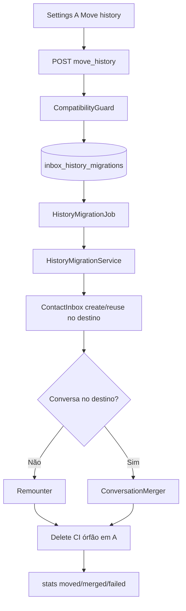

# Inbox History Migration — Documentação

Mover **todo o histórico** (conversas + mensagens) de uma caixa de entrada **A** para outra caixa **B** na mesma account (WhatsApp-like, API/Webhook, ou cross-channel entre esses dois), com remount da sessão de canal e merge quando o contato já existir em B.

**Estado:** implementado · 27/jul/2026

| Área | Status |
|------|--------|
| Move A → B (mesmo account, WhatsApp-like) | ✅ |
| Move A → B (mesmo account, API/Webhook → API) | ✅ |
| Move A → B cross-channel (WhatsApp ↔ API/Webhook, histórico) | ✅ |
| Providers: Cloud, Evolution, Evolution Go, Twilio WhatsApp | ✅ |
| Merge quando destino já tem conversa do peer | ✅ |
| Remount `ContactInbox` + `messages.inbox_id` | ✅ |
| Cleanup de `ContactInbox` órfão na origem | ✅ |
| Job assíncrono + status/stats + preview | ✅ |
| UI settings (aba Move history) | ✅ |
| Admin-only (`InboxPolicy#update?`) | ✅ |
| Outros canais (Telegram, Email, Widget, …) | ❌ Fora do escopo |
| Outbound garantido após cross-channel | ❌ Não é requisito (arquivo de leitura) |
| Sub-jobs por lote | ❌ Backlog P2 |
| i18n | ✅ EN only (regra do fork) |

---

## Por onde começar

| Perfil | Documento |
|--------|-----------|
| **Visão / status** | Este README |
| **O que foi entregue no código** | [current-state.md](./current-state.md) |
| **Por que esta abordagem** | [implementation-decision-tree.md](./implementation-decision-tree.md) |
| **Plano as-built + arquivos** | [implementation-plan.md](./implementation-plan.md) |
| **Próximos passos** | [improvements-backlog.md](./improvements-backlog.md) |

---

## Decisões fechadas

| Tópico | Decisão |
|--------|---------|
| Escopo | WA↔WA, API↔API, **e** WA↔API (histórico/leitura) |
| Conflito de peer | **Merge** mensagens/metadados na conversa existente em B; destruir conversa vazia em A |
| Identidade WA | `ContactInbox.create!` / reuse por `contact_id` (+ fallback JID de grupo Evolution↔Evolution Go) |
| Identidade API | **Preservar `source_id`** só em API→API; colisão com outro contato → peer `failed` |
| Identidade cross-family | **Nunca** copiar UUID/JID entre famílias; destino WA deriva telefone (sem phone → `failed`); destino API gera UUID novo |
| Idempotência API destino | Reusa `ContactInbox` existente do mesmo `contact_id` no destino (sem UUID órfão) |
| WA same-family sem phone | Preserva `source_id` válido; Twilio↔Cloud converte formato |
| Anti-steal | `ContactInbox.create!` próprio — **não** usa steal do `ContactInboxBuilder` |
| Merge destino resolved | Sempre considera conversas resolved no destino (não só `Resolver`) |
| Persistência de status | Tabela `inbox_history_migrations` (não `provider_config`) |
| Execução | `Custom::Inboxes::HistoryMigrationJob` (`queue_as :low`); falha fatal marca `failed` **sem** re-raise Sidekiq |
| UX | Aba **Move history**; preview count; toast+link ao concluir; aviso Evolution→Cloud grupos |
| Auth | Administrator (`authorize … :update?` em origem **e** destino) |
| Fork | Quase tudo em `custom/`; `# FORK:` / `// FORK:` mínimos em routes, controller except, Settings.vue, API client, channelActions |
| i18n | **Somente EN** |

---

## Fluxo (resumo)

---

## Índice

| Documento | Conteúdo |
|-----------|----------|
| [current-state.md](./current-state.md) | Inventário de arquivos, API, limites |
| [implementation-decision-tree.md](./implementation-decision-tree.md) | Opções avaliadas e decisões |
| [implementation-plan.md](./implementation-plan.md) | As-built: fases, arquivos, aceite, testes |
| [improvements-backlog.md](./improvements-backlog.md) | P1/P2 pós-MVP |

Cross-link: single-history fork ([conversation-single-history-per-channel](../conversation-single-history-per-channel/implementation-plan.md)) — `lock_to_single_conversation` + `Conversations::Resolver` influenciam o merge.

---

*Última atualização: 27/jul/2026*
