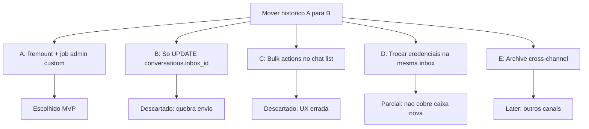

# Inbox History Migration — Árvore de decisão

Comparação de abordagens para **mover o histórico completo** de uma caixa WhatsApp para outra no fork Chatwoot.

**Decisões fechadas:** 25/jul/2026.

---

## Pergunta central

> Quando o usuário troca / reprovisiona a caixa de entrada WhatsApp, como mover todo o histórico de A para B de forma compatível com o modelo (`contact_inboxes`, envio outbound, single-history) e com as rules do fork?

---

## Opções avaliadas

### A — Remount + job admin em `custom/` (RECOMENDADA / MVP)

**Ideia:** Criar/obter `ContactInbox` em B, atualizar `conversation` + `messages` (+ reporting/SLA). Se já existir conversa do peer em B, **merge**. Status em tabela própria; UI nas settings da origem (padrão Evolution import).

| Prós | Contras |
|------|---------|
| Mantém outbound/`source_id` corretos | Só WhatsApp no v1 |
| Alinha com `Resolver` + single-history | Merge é mais complexo que skip |
| Overlay `custom/` + FORK mínimo | Job longo em inboxes grandes |
| Espelha import Evolution (admin + poll) | — |

**Veredito:** ✅ MVP entregue.

---

### B — Só `UPDATE conversations SET inbox_id = B`

| Prós | Contras |
|------|---------|
| Uma linha SQL | `contact_inbox_id` stale → webhook/envio quebram |
| | `messages.inbox_id` e reporting ficam em A |
| | Sem FK → corrupção silenciosa |

**Veredito:** ❌ Descartado.

---

### C — Estender `BulkActionsJob` / barra de seleção

| Prós | Contras |
|------|---------|
| UI já existe | Operação de operador, não migração de dados |
| | Sem progress/admin gate adequado |
| | Editar upstream high-churn |

**Veredito:** ❌ Descartado para o fluxo primário.

---

### D — Trocar phone/token na mesma inbox

| Prós | Contras |
|------|---------|
| Zero move de histórico | Não resolve “nova caixa” / novo channel row |
| | UNIQUE de phone/instance_name |

**Veredito:** ⚪ Ops útil, complementar — não substitui a feature.

---

### E — Archive / cópia cross-channel

| Prós | Contras |
|------|---------|
| Seguro para WA ↔ API (histórico legível) | Não garante outbound no destino |
| Reusa Remounter/Merger | Identity nativa nova no destino (UUID ou phone) |

**Veredito:** ✅ Entregue para **WhatsApp ↔ API/Webhook** (arquivo de leitura). Outros canais (Telegram, Email, …) permanecem backlog.

---

## Decisões de detalhe

| # | Pergunta | Decisão |
|---|----------|---------|
| 1 | Escopo de canal | WA↔WA, API↔API, e WA↔API (histórico) |
| 2 | Conflito de peer em B | **Merge** (não skip) |
| 3 | Onde guardar status | `inbox_history_migrations` (par de inboxes ≠ um channel) |
| 4 | Feature flag | Não no v1 — gate = admin + compatibilidade |
| 5 | Assignee sem membership em B | Limpar `assignee_id` |
| 6 | Grupos `@g.us` | Só Evolution family → Evolution family; grupo → API = UUID novo |
| 7 | Cross-channel outbound | **Não** é requisito de aceite |

---

## Rules do projeto aplicadas

| Rule | Aplicação |
|------|-----------|
| `fork-workflow.mdc` | Serviços/job/model/UI em `custom/`; routes + Settings + except list com FORK |
| `architecture.mdc` | Um service por ação; controller fino |
| `chatwoot-core.mdc` | Happy-path MVP; i18n EN; specs sob pedido (entregues em `spec/custom/`) |

---

*Última atualização: 25/jul/2026*
