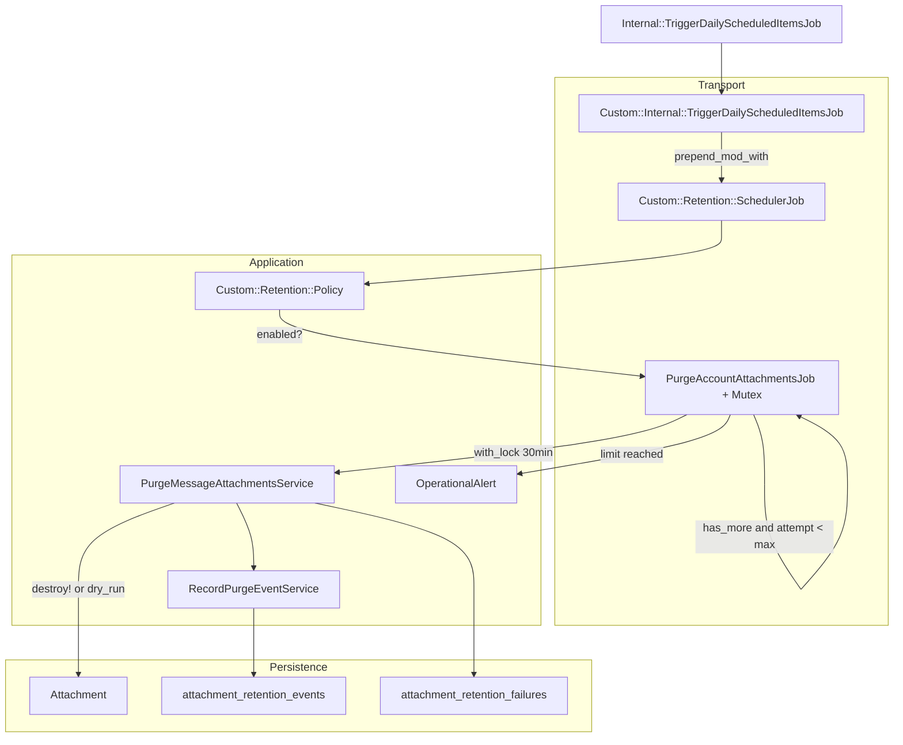

# Implementação — retenção de anexos

## Arquitetura v2



## Fluxo diário

1. `Internal::TriggerDailyScheduledItemsJob` roda à meia-noite UTC.
2. O prepend custom enfileira `Custom::Retention::SchedulerJob` se `Policy.enabled?`.
3. O scheduler processa contas com anexos elegíveis (blob **ou** `external_url` sem blob).
4. Para cada conta devida ao grupo do dia, enfileira `PurgeAccountAttachmentsJob` com jitter de 1–30 minutos.
5. O job por conta adquire mutex Redis e chama `PurgeMessageAttachmentsService#perform` (até `MAX_PURGE_PER_RUN` anexos).
6. Se `has_more: true`, re-enfileira em 1 minuto até `MAX_REENQUEUE_ATTEMPTS` (default 100).
7. Cada anexo processado gera linha em `attachment_retention_events` com `run_id` correlacionando a execução.

### Filas Sidekiq

| Job | Fila |
|-----|------|
| `SchedulerJob` | `housekeeping` |
| `PurgeAccountAttachmentsJob` | `purgable` |
| Purge Active Storage (Rails) | `active_storage_purge` |

## Scope SQL (anexos elegíveis)

```sql
LEFT JOIN active_storage_attachments
  ON active_storage_attachments.record_type = 'Attachment'
 AND active_storage_attachments.record_id = attachments.id
 AND active_storage_attachments.name = 'file'
WHERE active_storage_attachments.id IS NOT NULL
   OR (attachments.external_url IS NOT NULL AND attachments.external_url != '')
```

Exclui anexos em quarentena (`attachment_retention_failures.failure_count >= MAX_FAILURE_ATTEMPTS`).

## Retorno do service

```ruby
{
  deleted_count: Integer,
  has_more: Boolean,
  failed_count: Integer,
  bytes_freed: Integer
}
```

## Migrations (fork)

| Migration | Propósito |
|-----------|-----------|
| `20260622120000_fork_add_index_attachments_on_account_id_and_created_at` | Índice composto para purge por conta |
| `20260622130000_fork_create_attachment_retention_events` | Auditoria persistente |
| `20260622130100_fork_create_attachment_retention_failures` | Quarentena de falhas |
| `20260622140000_fork_nullify_account_on_attachment_retention_events` | Preserva auditoria ao excluir conta |

## Teste manual (dry-run)

```ruby
# Rails console
account = Account.find(1)
run_id = SecureRandom.uuid

with_modified_env MESSAGE_ATTACHMENT_RETENTION_ENABLED: 'true',
                  MESSAGE_ATTACHMENT_RETENTION_DRY_RUN: 'true' do
  GlobalConfig.clear_cache
  Custom::Retention::PurgeMessageAttachmentsService.new(account: account, run_id: run_id).perform
end

AttachmentRetentionEvent.where(run_id: run_id).pluck(:attachment_id, :status)
# => todos dry_run; Attachment.count inalterado
```

## Limitações conhecidas

- Sem UI no dashboard; config via ENV ou Super Admin.
- TTL global da instalação; sem override por conta.
- Mensagem permanece após purge do anexo.
- Purge automático da tabela `attachment_retention_events` via `PurgeRetentionAuditEventsJob` (diário, cutoff `AUDIT_RETENTION_DAYS`).
- Captain documents, gravações de voz e blobs Active Storage órfãos fora do escopo.

## Testes automatizados

```bash
bundle exec rails db:test:prepare
bundle exec rspec spec/custom/services/custom/retention/ spec/custom/jobs/custom/retention/
```

- [`spec/custom/services/custom/retention/policy_spec.rb`](../../../spec/custom/services/custom/retention/policy_spec.rb)
- [`spec/custom/services/custom/retention/purge_message_attachments_service_spec.rb`](../../../spec/custom/services/custom/retention/purge_message_attachments_service_spec.rb)
- [`spec/custom/services/custom/retention/operational_alert_spec.rb`](../../../spec/custom/services/custom/retention/operational_alert_spec.rb)
- [`spec/custom/jobs/custom/retention/purge_account_attachments_job_spec.rb`](../../../spec/custom/jobs/custom/retention/purge_account_attachments_job_spec.rb)
- [`spec/custom/jobs/custom/retention/scheduler_job_spec.rb`](../../../spec/custom/jobs/custom/retention/scheduler_job_spec.rb)
- [`spec/custom/jobs/custom/retention/purge_retention_audit_events_job_spec.rb`](../../../spec/custom/jobs/custom/retention/purge_retention_audit_events_job_spec.rb)
