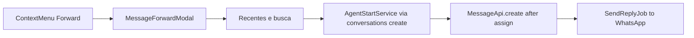

# Message Forward (pseudo-forward) — Documentação

Encaminhar mensagem **estilo WhatsApp** no dashboard Chatwoot, **sem** endpoint nativo Evolution Go / Node.

**Estado:** implementado (MVP) · 16/jul/2026 · ADR Go [§34](../whatsapp-provider/evolution-go/decisions.md)

| Área | Status |
|------|--------|
| API Evolution Go `/message/forward` | ❌ Não existe |
| Pseudo-forward via `POST …/messages` | ✅ |
| Context menu + modal de destino | ✅ |
| Badge “Forwarded” no dashboard | ✅ |
| Rótulo nativo “Encaminhada” no WhatsApp | ❌ (limitação da API) |
| i18n | ✅ EN only (regra do fork) |

---

## Por onde começar

| Perfil | Documento |
|--------|-----------|
| **Visão / status** | Este README |
| **O que foi entregue no código** | [current-state.md](./current-state.md) |
| **Por que pseudo-forward** | [implementation-decision-tree.md](./implementation-decision-tree.md) |
| **UX / componentes** | [ui-design.md](./ui-design.md) |
| **Plano as-built + arquivos** | [implementation-plan.md](./implementation-plan.md) |
| **Próximos passos** | [improvements-backlog.md](./improvements-backlog.md) |
| **Checklist E2E (Go)** | [../whatsapp-provider/evolution-go/validation-checklist.md](../whatsapp-provider/evolution-go/validation-checklist.md) |

---

## Decisões fechadas

| Tópico | Decisão |
|--------|---------|
| Abordagem | Pseudo-forward: copiar texto/anexos e criar mensagem nova no destino |
| Backend | Sem endpoint novo — reusa `messages#create` + `conversations#create` |
| Canais MVP | `Channel::Whatsapp` + `provider` `evolution_go` **ou** `evolution` |
| Destino | Mesmo inbox; 1..5 conversas/contatos |
| Entrada UI | Context menu da mensagem → modal |
| Badge | `content_attributes.forwarded` + chip em `Base.vue` |
| i18n | **Somente EN** |
| Fork | `custom/` + thin `// FORK:` em menu / `Message.vue` / `Base.vue` |

---

## Fluxo (resumo)

---

## Índice

| Documento | Conteúdo |
|-----------|----------|
| [current-state.md](./current-state.md) | Inventário de arquivos, metadados, limites |
| [implementation-decision-tree.md](./implementation-decision-tree.md) | Opções avaliadas e decisões |
| [ui-design.md](./ui-design.md) | Modal, menu, badge, i18n keys |
| [implementation-plan.md](./implementation-plan.md) | As-built: fases, arquivos, aceite |
| [improvements-backlog.md](./improvements-backlog.md) | P1/P2 pós-MVP |

Cross-link provider: [evolution-go/decisions.md §34](../whatsapp-provider/evolution-go/decisions.md) · [evolution-go/status.md](../whatsapp-provider/evolution-go/status.md)

---

*Última atualização: 13/ago/2026*
