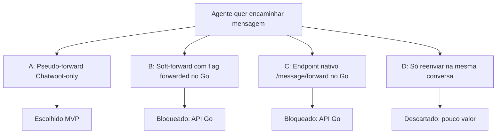

# Message Forward — Árvore de decisão

Comparação de abordagens para **encaminhar mensagem** a partir do dashboard Chatwoot quando a Evolution Go **não** oferece forward nativo.

**Decisões fechadas:** 16/jul/2026 · ADR Go §34.

---

## Pergunta central

> Como o agente encaminha uma mensagem (texto/mídia) para outro contato/conversa do mesmo inbox WhatsApp Evolution, com UX próxima do WhatsApp?

---

## Opções avaliadas

### A — Pseudo-forward no Chatwoot (RECOMENDADA / MVP)

**Ideia:** Copiar conteúdo + anexos e criar mensagem(ns) nova(s) via `POST …/messages`. Outbound usa o pipeline já existente (`SendReplyJob` → Evolution).

| Prós | Contras |
|------|---------|
| Não depende de mudança no Go/Node | Sem badge nativo “Encaminhada” no WhatsApp |
| Reusa create conversation/message | Fetch de mídia no browser (CORS/auth) |
| UX controlada no dashboard | É cópia, não forward criptográfico |
| `custom/` + thin FORK | — |

**Veredito:** ✅ MVP entregue.

---

### B — Soft-forward (`ContextInfo.Forwarded` / body `forwarded: true`)

**Ideia:** Pedir ao Evolution Go que aceite flag ao enviar; WhatsApp mostra “Encaminhada”.

| Prós | Contras |
|------|---------|
| Badge nativo no cliente | Exige patch/release do servidor Go |
| Ainda é cópia do conteúdo | Não está no swagger/Postman atual |

**Veredito:** ⏸️ backlog — depende de upstream.

---

### C — Forward nativo por `message key`

**Ideia:** `POST /message/forward` com key da mensagem original + número destino.

| Prós | Contras |
|------|---------|
| Paridade real com WhatsApp | Não implementado no Go hoje |
| Mídia sem reupload | Esforço L no provider |

**Veredito:** ⏸️ fora de escopo até a API existir.

---

### D — Reenviar só na mesma conversa

**Veredito:** ❌ descartado — não atende o caso de uso.

---

## Decisões de produto (fechadas)

### 1. Entrada UX

**Decisão:** Context menu → **Forward** (1 mensagem) **ou** **Select** (multi na timeline).

- Forward direto permanece o happy path de 1 mensagem
- Select entra em modo WhatsApp-like: checkboxes + barra no lugar do composer
- Até **10** mensagens, enviadas em ordem cronológica como cópias separadas
- Caption editável só no forward de 1 mensagem

### 2. Multi-destino

**Decisão:** Até **5** destinos por operação.

- Evita flood acidental
- Espelha limite prático do WhatsApp Web

### 3. Escopo de canal

**Decisão:** Só WhatsApp Evolution (`evolution_go` + `evolution`), mesmo inbox.

- Forward cross-inbox / SMS / e-mail → backlog
- Mesmo padrão de gate das reactions

### 4. Badge

**Decisão:** Badge **só no Chatwoot** (`content_attributes.forwarded`).

- Compensa ausência do rótulo WA
- Não inventar texto “Forwarded:” no body da mensagem

### 5. i18n

**Decisão:** **EN + pt_BR** (rule do fork: strings de produto do fork podem ter pt_BR; community mantém os demais idiomas).

### 6. Backend

**Decisão:** Sem endpoint novo no MVP.

- Fallback documentado: `MessageForwardService` + `POST …/forward` só se fetch/create falhar de forma estrutural

### 7. Navegação pós-envio

**Decisão:** Não redirecionar; toast apenas.

---

## Relação com features vizinhas

| Feature | Relação |
|---------|---------|
| [Share Contact Card](../share-contact-card/README.md) | Reuso de `Dialog` + `createContactSearcher` |
| Reactions (ADR §33) | Mesmo context menu e gate Evolution |
| Webcam / ReplyBox | Sem overlap — forward é na bolha, não no composer |

---

*Última atualização: 22/ago/2026*
