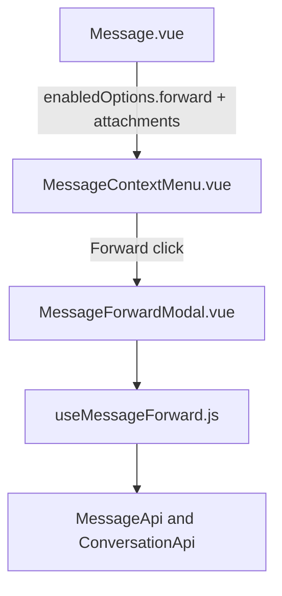

# Message Forward — UI Design

Especificação visual do MVP de encaminhar, alinhada ao dashboard (`components-next` + context menu).

---

## Princípios

- **Tailwind only** nos arquivos novos
- **Composition API** + `<script setup>` no modal
- Primitivos: `Dialog`, `Avatar`, `Icon` (Lucide no modal; Fluent no `MenuItem` legado)
- Strings via **i18n EN** (`CONVERSATION.FORWARD.*`)
- Feature em `custom/app/javascript/dashboard/` + alias `customDashboard`

---

## Referências no projeto

| Padrão | Arquivo | Reuso |
|--------|---------|-------|
| Modal shell | `components-next/dialog/Dialog.vue` | Confirm/cancel, `width="md"`, loading |
| Busca de contato | `ShareContactForm.vue` + `createContactSearcher` | Debounce + phone filter |
| Context menu | `MessageContextMenu.vue` | `MenuItem` + reactions FORK |
| Badge na bolha | `bubbles/Base.vue` (delete notice) | Chip discreto acima do conteúdo |

---

## Arquitetura de componentes



### Arquivos UI

| Arquivo | Responsabilidade |
|---------|------------------|
| `custom/.../forward/MessageForwardModal.vue` | Preview, recentes, busca, chips de seleção, confirm |
| `custom/.../composables/useMessageForward.js` | Lógica (não UI) |
| `MessageContextMenu.vue` | Item Forward + `ref` do modal |
| `Message.vue` | `forward` em `contextMenuEnabledOptions` |
| `Base.vue` | Badge Forwarded |

---

## Wireframe do modal

```
┌─────────────────────────────────────────┐
│ Forward message                         │
│ Choose up to 5 chats in this inbox…     │
├─────────────────────────────────────────┤
│ ┌ Preview ────────────────────────────┐ │
│ │ Message / 2 attachment(s)           │ │
│ │ Snippet of content…                 │ │
│ └─────────────────────────────────────┘ │
│ [Chip Alice ×] [Chip Bob ×]             │
│ ┌ Search ─────────────────────────────┐ │
│ │ Search contacts by name or phone    │ │
│ └─────────────────────────────────────┘ │
│ Recent chats                            │
│  ○ Avatar  Name                         │
│  ○ Avatar  Name                         │
│ 0 of 5 selected                         │
├─────────────────────────────────────────┤
│              [Cancel]  [Forward]        │
└─────────────────────────────────────────┘
```

### Comportamentos

| Zona | Comportamento |
|------|----------------|
| Preview | Até 120 chars; se só mídia → `ATTACHMENT_PREVIEW` |
| Chips | Clique remove da seleção |
| Busca vazia | Lista **Recent chats** (mesmo inbox, exclui conversa atual) |
| Busca ativa | Resultados de contato com telefone |
| Limite | Toast `MAX_DESTINATIONS` ao tentar o 6º |
| Confirm | Disabled se 0 selecionados ou `isForwarding` |
| Sucesso | Fecha modal; toast; **sem** navegação |

---

## Context menu

- Label: `CONVERSATION.CONTEXT_MENU.FORWARD`
- Ícone Fluent: `arrow-forward`
- Posição: após bloco de reactions, antes de Copy permalink / Delete
- Visível se `canForwardMessage` (inbox Evolution + conteúdo/anexo + `enabledOptions.forward`)

---

## Badge na bolha

```
↗ Forwarded
[conteúdo / anexos]
```

- Classes: `text-xs font-medium text-n-slate-11` + `i-lucide-forward`
- Condicional: `contentAttributes.forwarded`

---

## i18n (EN)

Namespace `CONVERSATION.FORWARD` em `app/javascript/dashboard/i18n/locale/en/conversation.json`:

| Key | Uso |
|-----|-----|
| `TITLE` / `DESCRIPTION` | Header do Dialog |
| `CONFIRM` / `CANCEL` | Footer |
| `PREVIEW_LABEL` / `ATTACHMENT_PREVIEW` | Preview |
| `SEARCH_*` / `RECENT` / `NO_*` | Listas |
| `SELECTION_HINT` / `MAX_DESTINATIONS` | Limites |
| `SUCCESS` / `PARTIAL` / `FAILED` | Toasts |
| `BADGE` | Chip na bolha |

Menu: `CONVERSATION.CONTEXT_MENU.FORWARD`.

---

## Acessibilidade / estados

- Dialog bloqueia confirm enquanto envia (`isLoading`)
- Falha parcial: toast com contagem ok/fail (não engole sucessos)
- Contatos sem telefone filtrados na busca (WhatsApp)

---

*Última atualização: 16/jul/2026*
