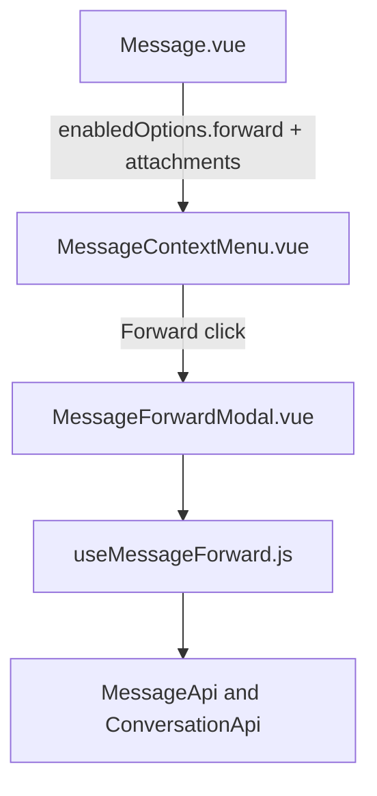

# Message Forward — UI Design

Especificação visual do MVP de encaminhar, alinhada ao dashboard (`components-next` + context menu).

---

## Princípios

- **Tailwind only** nos arquivos novos
- **Composition API** + `<script setup>` no modal
- Primitivos: `Dialog`, `Avatar`, `Icon` (Lucide no modal; Fluent no `MenuItem` legado)
- Strings via **i18n EN + pt_BR** (`CONVERSATION.FORWARD.*`)
- Feature em `custom/app/javascript/dashboard/` + alias `customDashboard`

---

## Referências no projeto

| Padrão | Arquivo | Reuso |
|--------|---------|-------|
| Modal shell | `components-next/dialog/Dialog.vue` | Confirm/cancel, `width="md"`, loading |
| Busca de contato | `ShareContactForm.vue` + `createContactSearcher` | Debounce + phone filter |
| Context menu | `MessageContextMenu.vue` | `MenuItem` + reactions FORK |
| Badge na bolha | `bubbles/Base.vue` (delete notice) | Chip discreto acima do conteúdo |

---

## Arquitetura de componentes



### Arquivos UI

| Arquivo | Responsabilidade |
|---------|------------------|
| `custom/.../forward/MessageForwardModal.vue` | Preview, caption, recentes, busca, chips de seleção, confirm |
| `custom/.../composables/useMessageForward.js` | Lógica (não UI) |
| `MessageContextMenu.vue` | Item Forward + `ref` do modal |
| `Message.vue` | `forward` em `contextMenuEnabledOptions` |
| `Base.vue` | Badge Forwarded |

---

## Wireframe do modal

```
┌─────────────────────────────────────────┐
│ Forward message                         │
│ Choose up to 5 chats in this inbox…     │
├─────────────────────────────────────────┤
│ ┌ Preview ────────────────────────────┐ │
│ │ Message / 2 attachment(s)           │ │
│ │ Snippet of content…                 │ │
│ └─────────────────────────────────────┘ │
│ Message text                            │
│ [ optional caption textarea         ]   │
│ [Chip Alice ×] [Chip Bob ×]             │
│ ┌ Search ─────────────────────────────┐ │
│ │ Search contacts by name or phone    │ │
│ └─────────────────────────────────────┘ │
│ Recent chats                            │
│  ○ Avatar  Name                         │
│  ○ Avatar  Name                         │
│ 0 of 5 selected                         │
├─────────────────────────────────────────┤
│              [Cancel]  [Forward]        │
└─────────────────────────────────────────┘
```

### Comportamentos

| Zona | Comportamento |
|------|----------------|
| Preview | Até 120 chars da origem; se só mídia → `ATTACHMENT_PREVIEW` |
| Caption | Texto enviado (pré-preenchido com o content da origem; editável) |
| Chips | Clique remove da seleção |
| Busca vazia | Lista **Recent chats** (mesmo inbox, exclui conversa atual) |
| Busca ativa | Resultados de contato com telefone **ou** grupo WhatsApp, filtrados pelo inbox |
| Limite | Toast `MAX_DESTINATIONS` ao tentar o 6º |
| Confirm | Disabled se 0 selecionados ou `isForwarding` |
| Sucesso | Fecha modal; toast; **sem** navegação |
| Falha parcial | Mantém destinos que falharam selecionados; toast com detalhe i18n |

---

## Context menu

- Label: `CONVERSATION.CONTEXT_MENU.FORWARD` — ícone Fluent `share`
- Label: `CONVERSATION.CONTEXT_MENU.SELECT` — ícone Fluent `checkmark-circle`
- Posição: após bloco de reactions, antes de Copy permalink / Delete
- Visível se `canForwardMessage` (inbox Evolution + conteúdo/anexo + `enabledOptions.forward`)
- **Select** só aparece quando o `provide` de seleção existe (MessagesView)

---

## Modo selecionar (multi)

```
[ ○ ]  bolha…
[ ● ]  bolha selecionada
…
┌─────────────────────────────────────────┐
│ ✕   3 selected              [Forward]   │
└─────────────────────────────────────────┘
```

| Comportamento | Detalhe |
|---------------|---------|
| Entrada | Context menu **Select** (já marca a mensagem atual) |
| Clique no círculo | Toggle (também com Shift para intervalo) |
| Clique no texto da bolha | Toggle; ignora `.skip-context-menu`, `a`, `img`, `audio`, `video`, `button` |
| Shift+clique | Marca o intervalo até a âncora (máx. 10) |
| Desmarcar a última | Permanece no modo Select (composer não volta) |
| Não encaminhável | Círculo visível, desabilitado |
| Composer | Substituído pela barra enquanto o modo está ativo |
| Escape / ✕ | Sai do modo, limpa seleção (Escape ignora se o dialog estiver aberto) |
| Forward na barra | Abre o modal com as N mensagens; caption escondida se N > 1 |
| Envio | Prepare 1× por destino; mensagens em ordem; falha de uma mensagem não aborta as seguintes daquele destino |
| Progresso | `SENDING_PROGRESS` enquanto envia |
| 1 destino OK | Toast com link **Open conversation** |

---

## Badge na bolha

```
↗ Forwarded
[conteúdo / anexos]
```

- Classes: `text-xs font-medium text-n-slate-11` + `i-lucide-forward`
- Condicional: `contentAttributes.forwarded`

---

## i18n (EN + pt_BR)

Namespace `CONVERSATION.FORWARD` em `app/javascript/dashboard/i18n/locale/{en,pt_BR}/conversation.json`:

| Key | Uso |
|-----|-----|
| `TITLE` / `TITLE_MULTI` / `DESCRIPTION` / `DESCRIPTION_MULTI` | Header do Dialog |
| `CONFIRM` / `RETRY` / `CANCEL` | Footer e barra (Retry após falha parcial) |
| `SELECTED_COUNT` / `MAX_MESSAGES` | Modo selecionar |
| `PREVIEW_LABEL` / `ATTACHMENT_PREVIEW` | Preview |
| `CAPTION_LABEL` / `CAPTION_PLACEHOLDER` | Texto editável |
| `SEARCH_*` / `RECENT` / `NO_*` | Listas |
| `SELECTION_HINT` / `MAX_DESTINATIONS` | Limites |
| `SUCCESS` / `PARTIAL` / `FAILED` | Toasts |
| `OPEN_CONVERSATION` | Link no toast (1 destino) |
| `SENDING_PROGRESS` | Progresso do lote |
| `ERRORS.*` | Detalhes do composable (`ForwardError`) |
| `BADGE` | Chip na bolha |

Menu: `CONVERSATION.CONTEXT_MENU.FORWARD` e `SELECT`.

Outros locales (community) **não** são atualizados neste fork.

---

## Acessibilidade / estados

- Dialog bloqueia confirm enquanto envia (`isLoading`) e mostra `SENDING_PROGRESS`
- Falha parcial: toast com contagem ok/fail; confirm vira Retry; destinos que falharam permanecem
- ✕ da barra tem `aria-label` de Cancel
- Shift+clique seleciona o intervalo até a âncora (só mensagens encaminháveis; máx. 10 + toast)
- Contatos sem telefone e que não são grupo WhatsApp filtrados na busca
- 4xx em `contactable_inboxes` omite o contato; 5xx/rede sobe `SEARCH_ERROR`
- Composer some no modo selecionar; Escape sai do modo (não se o dialog estiver aberto)

---

*Última atualização: 22/ago/2026*
