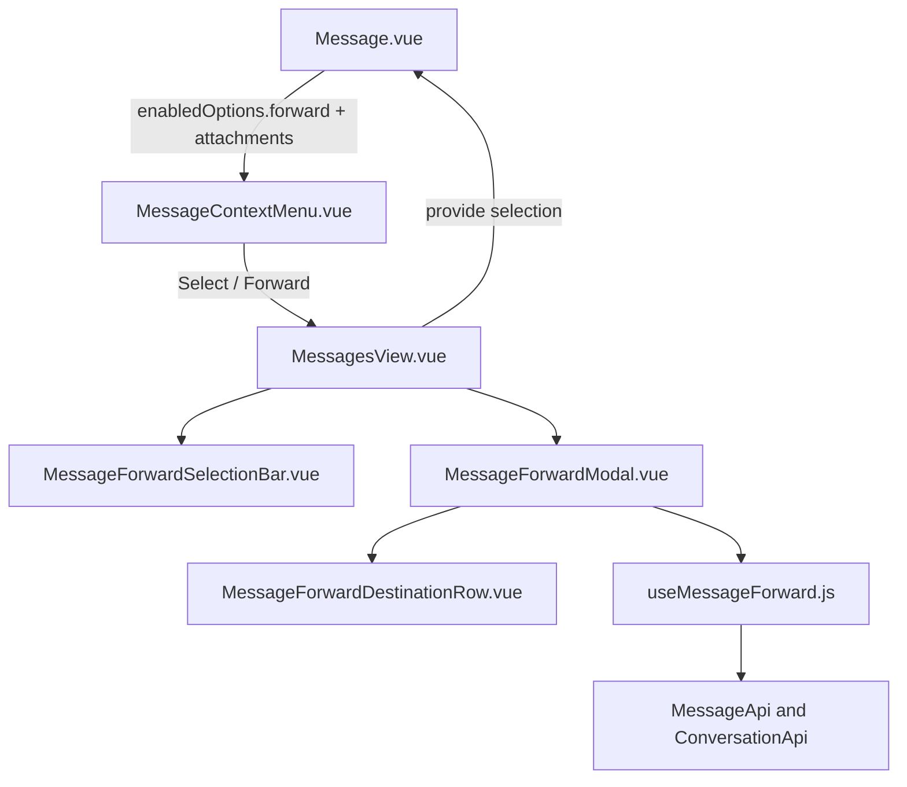

# Message Forward — UI Design

Especificação visual do encaminhar, alinhada ao dashboard (`components-next` + context menu).

---

## Princípios

- **Tailwind only** nos arquivos novos
- **Composition API** + `<script setup>` no modal e na barra
- Primitivos: `Dialog`, `Avatar`, `Icon`, `Checkbox`, `Spinner`, `Button`
- Strings via **i18n EN + pt_BR** (`CONVERSATION.FORWARD.*`)
- Feature em `custom/app/javascript/dashboard/` + alias `customDashboard`

---

## Referências no projeto

| Padrão | Arquivo | Reuso |
|--------|---------|-------|
| Modal shell | `components-next/dialog/Dialog.vue` | Confirm/cancel, `width="xl"`, loading. FORK: `max-h-[90vh] overflow-hidden` + slot `flex-1 min-h-0` — **não** passar `overflowYAuto` (rola o corpo inteiro e esconde o footer) |
| Checkbox | `components-next/checkbox/Checkbox.vue` | Timeline e lista de destinos (não inventar círculo custom) |
| Busca de contato | `createContactSearcher` | Debounce + phone/grupo filter |
| Context menu | `MessageContextMenu.vue` | `MenuItem` + reactions FORK |
| Badge na bolha | `bubbles/Base.vue` (delete notice) | Chip discreto acima do conteúdo |

---

## Arquitetura de componentes



### Arquivos UI

| Arquivo | Responsabilidade |
|---------|------------------|
| `custom/.../forward/MessageForwardModal.vue` | Preview, caption, recentes, busca, chips, lista com scroll, confirm |
| `custom/.../forward/MessageForwardDestinationRow.vue` | Linha de destino (Checkbox + avatar + badge de status) |
| `custom/.../forward/MessageForwardSelectionBar.vue` | Barra Cancelar / `n/10` / Encaminhar |
| `custom/.../composables/useMessageForward.js` | Lógica (não UI) |
| `custom/.../composables/useMessageForwardSelection.js` | Estado do modo selecionar |
| `MessageContextMenu.vue` | Item Forward + Select |
| `MessagesView.vue` | Provide, troca composer ↔ barra (Transition), modal |
| `Message.vue` | `forward` em `contextMenuEnabledOptions` + checkbox no modo select |
| `Base.vue` | Badge Forwarded |

---

## Wireframe do modal

```
┌───────────────────────────────────────────────────┐
│ Encaminhar 2 mensagens                            │
│ Escolha até 5 chats…                              │
├───────────────────────────────────────────────────┤
│ ┌ Preview ──────────────────────────────────────┐ │
│ │ 📎 snippet…                                   │ │
│ │ 📄 snippet…                                   │ │
│ └───────────────────────────────────────────────┘ │
│ [Chip Alice ×]                                    │
│ ┌ Search ───────────────────────────────────────┐ │
│ │ 🔍 Buscar contatos por nome ou telefone       │ │
│ └───────────────────────────────────────────────┘ │
│ Chats recentes  10                                │
│ ┌ lista (scroll interno) ───────────────────────┐ │
│ │ ☐  Avatar  Nome  [Aberta]                     │ │
│ │     +55 …                                     │ │
│ │ ☑  Avatar  Nome  [Pendente]                   │ │
│ └───────────────────────────────────────────────┘ │
│ 1 de 5 selecionados                               │
├───────────────────────────────────────────────────┤
│              [Cancelar]  [Encaminhar]             │
└───────────────────────────────────────────────────┘
```

Largura: `Dialog` `width="xl"` (`max-w-xl`). O shell do Dialog (FORK) limita o modal a `max-h-[90vh]`; o footer **Cancelar / Encaminhar** fica `shrink-0` e sempre visível.

### Layout e scroll

O dialog **não** rola como um todo. Cabeçalho, preview, busca, hint e botões ficam fixos; só a lista de contatos rola.

| Zona | Comportamento |
|------|----------------|
| Shell `Dialog.vue` | `max-h-[90vh] overflow-hidden`; form `flex flex-col min-h-0`; header e footer `shrink-0`; default slot `flex-1 min-h-0 overflow-hidden` |
| Conteúdo do modal | `flex h-full min-h-0 flex-col gap-3` |
| Preview (N msgs) | `max-h-28 shrink-0 overflow-y-auto` se o lote for longo |
| Busca | `shrink-0`; lupa e input no **mesmo** outline (`focus-within:outline-n-brand`) |
| Lista de contatos | `min-h-32 flex-1 overflow-y-auto` — ocupa o espaço restante e mostra barra de rolagem |
| Hint + footer | `shrink-0` |

**Por que o footer e a scrollbar sumiam:** duas causas juntas.

1. `tailwind.config.js` `content` não incluía `custom/app/javascript/**`. Classes só usadas no overlay (ex.: `max-h-[min(40vh,20rem)]`) **não eram emitidas**. A lista crescia sem teto, o `<dialog>` estourava a viewport e os botões ficavam abaixo da tela.
2. Mesmo com `max-h` na lista, o Dialog OSS tinha `overflow-visible` / altura `auto`. Sem `max-h` no shell + `min-h-0` na cadeia flex, o filho `flex-1 overflow-y-auto` nunca recebia altura limitada — não havia overflow, logo **não havia scrollbar**.

Correção: scan do overlay no Tailwind **e** FORK no `Dialog.vue` (altura máxima + overflow no slot, não no dialog inteiro).

**Busca desalinhada:** `input type="search"` desenha o anel de foco nativo só em volta do texto, deixando a lupa fora. O campo é `type="text"` com `border-0 outline-none ring-0`; o contorno fica no wrapper (`h-10` + `outline` + `focus-within:outline-n-brand`), mesmo padrão do TemplatesPicker.

### Comportamentos

| Zona | Comportamento |
|------|----------------|
| Preview | Até 120 chars; ícone por tipo (`message-square-text` / `image` / `file` / `paperclip`); se só mídia → `ATTACHMENT_PREVIEW` |
| Caption | Só com 1 mensagem; `resize-none`; texto enviado (pré-preenchido) |
| Chips | Avatar + nome; clique remove |
| Busca | Foco automático ao abrir; lupa + input no mesmo contorno; spinner inline; `type="text"` (não `search`) |
| Busca vazia | **Recent chats** (mesmo inbox, exclui conversa atual), ordenados por `last_activity_at` |
| Busca ativa | Contatos com telefone **ou** grupo WhatsApp, filtrados pelo inbox |
| Linha de destino | `Checkbox` do design system à esquerda; badge **Aberta** / **Pendente** / **Ativo** |
| Limite destinos | Linhas não selecionadas `opacity-40`; toast `MAX_DESTINATIONS` no 6º |
| Confirm | Disabled se 0 selecionados ou `isForwarding` |
| Envio | Lista de progresso por destinatário (spinner / check / alerta) |
| Sucesso | Fecha modal; toast; **sem** navegação |
| Falha parcial | Mantém destinos que falharam; confirm vira Retry |

---

## Context menu

- Label: `CONVERSATION.CONTEXT_MENU.FORWARD` — ícone Fluent `share`
- Label: `CONVERSATION.CONTEXT_MENU.SELECT` — ícone Fluent `checkmark-circle`
- Posição: após bloco de reactions, antes de Copy permalink / Delete
- Visível se `canForwardMessage` (inbox Evolution + conteúdo/anexo + `enabledOptions.forward`)
- **Select** só aparece quando o `provide` de seleção existe (MessagesView)

---

## Modo selecionar (multi)

```
    ☐   bolha…
    ☑   bolha selecionada (bg-n-brand/10)
…
┌─────────────────────────────────────────┐
│ ✕   2/10   2 selecionada(s)  [Encaminhar] │
└─────────────────────────────────────────┘
```

Checkbox só aparece **depois** de entrar no modo Select (não há checkbox fantasma no hover — isso gerava um retângulo vazio no espaço da conversa).

| Comportamento | Detalhe |
|---------------|---------|
| Entrada | Context menu **Select** (já marca a mensagem atual) |
| Controle | `Checkbox` do design system, inset da borda (`ps-2` + `ms-1`) |
| Clique no checkbox / texto da bolha | Toggle; ignora `.skip-context-menu`, `a`, `img`, `audio`, `video`, `button` |
| Shift+clique | Marca o intervalo até a âncora (máx. 10); dica no tooltip do badge `n/10` |
| Desmarcar a última | Permanece no modo Select (composer não volta) |
| Não encaminhável | Checkbox visível, desabilitado |
| Composer | Substituído pela barra (`Transition`); Cancelar é só ícone para caber no painel estreito |
| Escape / ✕ | Sai do modo, limpa seleção (Escape ignora se o dialog estiver aberto) |
| Forward na barra | Abre o modal com as N mensagens; caption escondida se N > 1 |
| Envio | Prepare 1× por destino; mensagens em ordem; falha de uma mensagem não aborta as seguintes daquele destino |
| Progresso | Lista por destinatário + `SENDING_PROGRESS` |
| 1 destino OK | Toast com link **Open conversation** |

---

## Badge na bolha

```
↗ Forwarded
[conteúdo / anexos]
```

- Classes: `text-xs font-medium text-n-slate-11` + `i-lucide-forward`
- Condicional: `contentAttributes.forwarded`

---

## i18n (EN + pt_BR)

Namespace `CONVERSATION.FORWARD` em `app/javascript/dashboard/i18n/locale/{en,pt_BR}/conversation.json`:

| Key | Uso |
|-----|-----|
| `TITLE` / `TITLE_MULTI` / `DESCRIPTION` / `DESCRIPTION_MULTI` | Header do Dialog |
| `CONFIRM` / `RETRY` / `CANCEL` | Footer e barra (Retry após falha parcial) |
| `SELECTED_COUNT` / `MAX_MESSAGES` / `SHIFT_HINT` | Modo selecionar (`SHIFT_HINT` = tooltip do badge) |
| `DESTINATIONS_LABEL` / `HAS_CONVERSATION` / `STATUS_OPEN` / `STATUS_PENDING` | Chips e badges da lista |
| `PREVIEW_LABEL` / `ATTACHMENT_PREVIEW` | Preview |
| `CAPTION_LABEL` / `CAPTION_PLACEHOLDER` | Texto editável |
| `SEARCH_*` / `RECENT` / `NO_*` | Listas |
| `SELECTION_HINT` / `MAX_DESTINATIONS` | Limites |
| `SUCCESS` / `PARTIAL` / `FAILED` | Toasts |
| `OPEN_CONVERSATION` | Link no toast (1 destino) |
| `SENDING_PROGRESS` | Progresso do lote |
| `ERRORS.*` | Detalhes do composable (`ForwardError`) |
| `BADGE` | Chip na bolha |

Menu: `CONVERSATION.CONTEXT_MENU.FORWARD` e `SELECT`.

Outros locales (community) **não** são atualizados neste fork.

---

## Acessibilidade / estados

- Dialog bloqueia confirm enquanto envia (`isLoading`)
- Lista de destinos: `role="listbox"`; linha `role="option"`
- Falha parcial: toast com contagem ok/fail; confirm vira Retry; destinos que falharam permanecem
- ✕ da barra tem `aria-label` de Cancel (label visual omitido no painel estreito)
- Shift+clique seleciona o intervalo até a âncora (só mensagens encaminháveis; máx. 10 + toast)
- Contatos sem telefone e que não são grupo WhatsApp filtrados na busca
- 4xx em `contactable_inboxes` omite o contato; 5xx/rede sobe `SEARCH_ERROR`
- Composer some no modo selecionar; Escape sai do modo (não se o dialog estiver aberto)
- Enter no campo de busca submete o form do Dialog se houver destinos

---

*Última atualização: 22/ago/2026*
