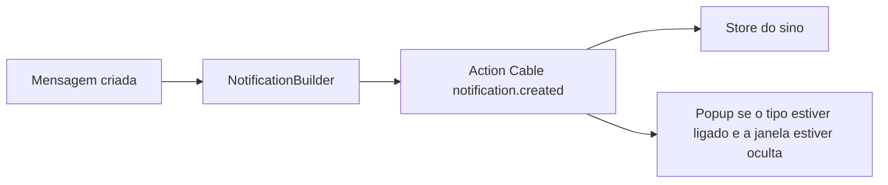

# Popup visual — Documentação

Aviso nativo do navegador (`new Notification`) quando chega um evento de notificação e o agente não está com aquela conversa aberta.

**Estado:** implementado e revisado · 28/set/2026

| Área | Status |
|------|--------|
| Coluna Popup na tabela de preferências | ✅ desktop + mobile |
| Persistência em `users.ui_settings` | ✅ por conta (`popup_notification_flags_by_account`) |
| Disparo no `notification.created` | ✅ omite só a conversa que já está aberta |
| Permissão do navegador no primeiro checkbox ou CTA explícito | ✅ |
| Chamada de voz (`voice_call_incoming`) | ❌ sem checkbox (popup já existe no Wavoip) |
| Push com a aba fechada | ❌ continua na coluna Notificação |
| i18n | ✅ en + pt_BR |

---

## Por onde começar

| Perfil | Documento |
|--------|-----------|
| **Visão / status** | Este README |
| **O que foi entregue no código** | [current-state.md](./current-state.md) |
| **Por que `ui_settings` e não uma flag de push** | [implementation-decision-tree.md](./implementation-decision-tree.md) |
| **Plano as-built + arquivos** | [implementation-plan.md](./implementation-plan.md) |
| **Próximos passos** | [improvements-backlog.md](./improvements-backlog.md) |

---

## Decisões fechadas

| Tópico | Decisão |
|--------|---------|
| Canal | `Notification` da página, não Web Push / service worker |
| Evento | `notification.created` (Action Cable), depois do gate de inbox |
| Quando mostrar | Janela oculta, ou visível numa conversa diferente |
| Persistência | `users.ui_settings.popup_notification_flags_by_account`, por conta, com rollback em erro |
| Padrão | Array vazio por conta — o agente marca o que quer |
| Janela visível | Mostra se conta ou conversa forem diferentes; omite somente a rota exata |
| Corpo | Texto da mensagem, sem repetir o nome que já está no título |
| Backend | Nenhum endpoint, migration ou flag em `notification_settings` |
| Voz | Sem checkbox; CTA explícito concede a permissão usada pelo popup Wavoip |
| Clique | `window.focus()` + rota da conversa (`account_id` + `display_id`) |
| i18n | **en + pt_BR** |
| Fork | Helper em `custom/` + `// FORK:` em `actionCable.js` e `NotificationPreferences.vue` |

---

## Fluxo (resumo)

---

## Problema de produto

A tabela de preferências só tinha e-mail e push. O som fica em outra seção e não mostra o conteúdo. O agente com o painel aberto, mas a janela em segundo plano no desktop, não via um aviso visual da mensagem. O popup cobre esse caso. Com o app do celular suspenso, o JavaScript para e este aviso não dispara.

---

*Última atualização: 28/set/2026*
