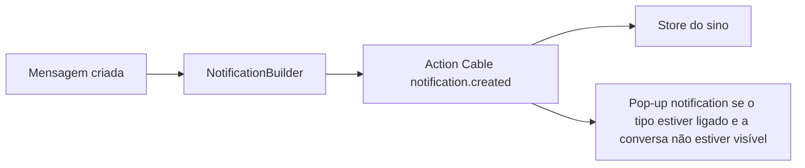

# Popup visual — Documentação

Aviso visual do sistema quando chega um evento de notificação e o agente não está com aquela conversa aberta. No desktop usa `new Notification`; no celular, se o construtor falhar, usa `ServiceWorkerRegistration.showNotification`.

**Estado:** implementado e revisado · 01/out/2026

| Área | Status |
|------|--------|
| Coluna “Pop-up notification” na tabela de preferências | ✅ desktop + mobile, rótulo fixo sem tradução |
| Persistência em `users.ui_settings` | ✅ por conta (`popup_notification_flags_by_account`) |
| Disparo no `notification.created` | ✅ omite só a conversa que já está aberta |
| Nova conversa com somente Pop-up marcado | ✅ o builder cria o evento mesmo sem e-mail/Push |
| Falha na exibição | ✅ aviso traduzido uma vez por sessão; não afirma que o SO exibiu o alerta |
| Permissão do navegador no primeiro checkbox ou CTA explícito | ✅ |
| Chamada de voz (`voice_call_incoming`) | ❌ sem checkbox (popup já existe no Wavoip) |
| Push com a aba fechada | ❌ continua na coluna Notificação |
| i18n | ✅ textos explicativos em en + pt_BR |

---

## Por onde começar

| Perfil | Documento |
|--------|-----------|
| **Visão / status** | Este README |
| **O que foi entregue no código** | [current-state.md](./current-state.md) |
| **Por que `ui_settings` e não uma flag de push** | [implementation-decision-tree.md](./implementation-decision-tree.md) |
| **Plano as-built + arquivos** | [implementation-plan.md](./implementation-plan.md) |
| **Próximos passos** | [improvements-backlog.md](./improvements-backlog.md) |

---

## Decisões fechadas

| Tópico | Decisão |
|--------|---------|
| Canal | Action Cable inicia o aviso; desktop usa `Notification` da página, mobile usa `showNotification` do service worker |
| Evento | `notification.created` (Action Cable), depois do gate de inbox |
| Quando mostrar | Janela oculta, ou visível numa conversa diferente |
| Persistência | `users.ui_settings.popup_notification_flags_by_account`, por conta, com rollback em erro |
| Padrão | Array vazio por conta — o agente marca o que quer |
| Janela visível | Mostra se conta ou conversa forem diferentes; omite somente a rota exata |
| Corpo | Texto da mensagem, sem repetir o nome que já está no título |
| Backend | Sem novo endpoint, migration ou flag em `notification_settings`; o overlay do `NotificationBuilder` considera a preferência Pop-up para criar `conversation_creation` |
| Voz | Sem checkbox; CTA explícito concede a permissão usada pelo popup Wavoip |
| Clique | Desktop foca a janela; o service worker prefere cliente da mesma conta e navega para a conversa |
| i18n | Textos explicativos em **en + pt_BR**; rótulo “Pop-up notification” fixo |
| Fork | Helper em `custom/` + `// FORK:` em `actionCable.js` e `NotificationPreferences.vue` |

---

## Fluxo (resumo)

---

## Problema de produto

A tabela de preferências só tinha e-mail e push. O som fica em outra seção e não mostra o conteúdo. O pop-up cobre o caso em que o painel está aberto, conectado e outra conversa está em exibição. Com o app do celular suspenso, o JavaScript para e este aviso não dispara; para receber com o app fechado é preciso ativar o Push neste dispositivo, liberar a permissão e selecionar os tipos de evento na coluna Push.

As preferências de Pop-up e de Push são independentes. A entrega visual também depende de permissão do navegador e da apresentação pelo sistema operacional; um aviso de falha aparece se a tentativa de exibição pelo painel falhar. A validação final em iOS/Android reais continua necessária antes de declarar a experiência móvel homologada.

---

*Última atualização: 01/out/2026*
