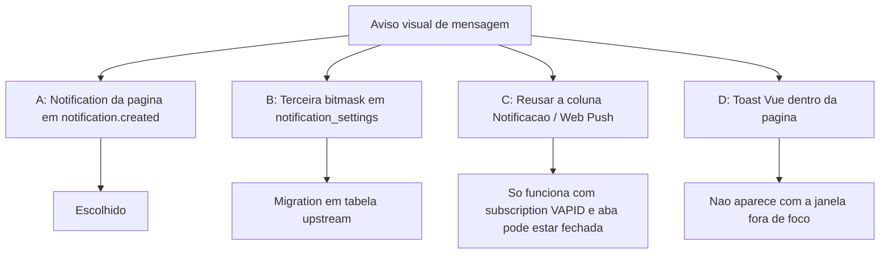

# Popup visual — Árvore de decisão

Comparação de abordagens para o aviso visual quando chega mensagem, no estilo do WhatsApp Web.

**Decisões fechadas:** 27/set/2026.

---

## Pergunta central

> Onde gravar a preferência e qual evento abre o popup, sem misturar com o push que já existe?

---

## Opções avaliadas

### A — `new Notification` no `notification.created` (escolhida)

**Ideia:** O websocket já entrega o evento por usuário. O cliente mostra o aviso do sistema se o tipo estiver em `ui_settings` e a janela estiver oculta.

| Prós | Contras |
|------|---------|
| Mesmo visual do WhatsApp Web | Não dispara com a página congelada |
| Payload já traz corpo e contato | Depende da permissão `Notification` |
| Sem migration | |

### B — Flag `popup_flags` em `notification_settings`

**Ideia:** Terceira bitmask FlagShihTzu, ao lado de e-mail e push.

| Prós | Contras |
|------|---------|
| Mesmo modelo das outras colunas | Tabela e controller são upstream |
| | O servidor não envia esse popup; a flag seria só preferência de UI |

Descartada. `ui_settings` já sincroniza entre aparelhos pela API de perfil.

### C — Reusar a coluna Notificação

**Ideia:** O checkbox de push também abriria o popup da página.

| Prós | Contras |
|------|---------|
| Nenhuma coluna nova | Push exige VAPID e service worker |
| | O agente não consegue ligar o popup sem ligar o push |

### D — Toast dentro do painel

**Ideia:** Balão Vue no canto, como o banner “Reconectado”.

| Prós | Contras |
|------|---------|
| Não pede permissão do SO | Some quando a janela não está em foco — o caso que o produto quer cobrir |

---

## Decisões derivadas

| Tópico | Escolha | Motivo |
|--------|---------|--------|
| Popup com a janela em foco | Mostra se a conversa aberta for outra | A URL `/conversations/<id>` é o que indica que o agente já está vendo aquela conversa |
| `voice_call_incoming` | Sem checkbox | Wavoip já chama `new Notification` |
| Permissão | Pedir ao marcar, não no toggle de push | O toggle registra subscription Web Push |
| Tag | Por `display_id` da conversa | Rajada substitui o aviso anterior |
