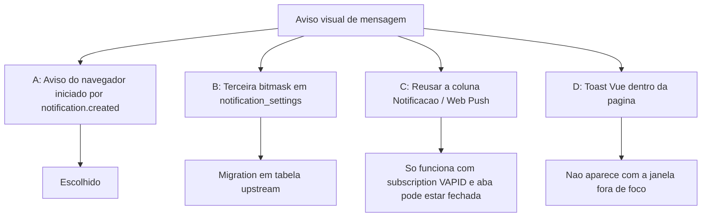

# Popup visual — Árvore de decisão

Comparação de abordagens para o aviso visual quando chega mensagem, no estilo do WhatsApp Web.

**Decisões revisadas:** 01/out/2026.

---

## Pergunta central

> Onde gravar a preferência e qual evento abre o popup, sem misturar com o push que já existe?

---

## Opções avaliadas

### A — Aviso nativo no `notification.created` (escolhida)

**Ideia:** O websocket já entrega o evento por usuário. O cliente mostra o aviso do sistema se o tipo estiver em `ui_settings` e aquela conversa não estiver visível. Usa `new Notification` no desktop e `registration.showNotification` como fallback no mobile.

| Prós | Contras |
|------|---------|
| Mesmo visual do WhatsApp Web | Não dispara com a página congelada |
| Payload já traz corpo e contato | Depende da permissão `Notification` |
| Sem migration | |

### B — Flag `popup_flags` em `notification_settings`

**Ideia:** Terceira bitmask FlagShihTzu, ao lado de e-mail e push.

| Prós | Contras |
|------|---------|
| Mesmo modelo das outras colunas | Tabela e controller são upstream |
| | O servidor não envia esse popup; a flag seria só preferência de UI |

Descartada. `ui_settings` já sincroniza entre aparelhos pela API de perfil.

### C — Reusar a coluna Notificação

**Ideia:** O checkbox de push também abriria o popup da página.

| Prós | Contras |
|------|---------|
| Nenhuma coluna nova | Push exige VAPID e service worker |
| | O agente não consegue ligar o popup sem ligar o push |

### D — Toast dentro do painel

**Ideia:** Balão Vue no canto, como o banner “Reconectado”.

| Prós | Contras |
|------|---------|
| Não pede permissão do SO | Some quando a janela não está em foco — o caso que o produto quer cobrir |

---

## Decisões derivadas

| Tópico | Escolha | Motivo |
|--------|---------|--------|
| Popup com a janela em foco | Mostra se a conversa aberta for outra | Conta e conversa são normalizadas pelo router em todas as rotas; o mesmo `display_id` pode existir em contas diferentes |
| `voice_call_incoming` | Sem checkbox próprio | Wavoip usa a permissão comum de notificações; uma ação explícita na tela permite concedê-la sem ativar Web Push |
| Permissão | Pedir ao marcar Popup ou pela ação explícita de alertas com painel aberto | O toggle Push registra a subscription Web Push e mantém opt-in próprio por dispositivo |
| Tag | Por tipo, `display_id` e `notification_id` | Corresponde à tag do Web Push do mesmo evento e evita colisões entre avisos distintos |
| Nova conversa somente Pop-up | O `NotificationBuilder` lê a preferência da conta antes de dispensar `conversation_creation` | Sem esse ajuste, não há `notification.created` quando e-mail e Push estão desligados |
| Conta do evento | Validar permissão de inbox para `account_id` da notificação | A conta atualmente aberta pode ser diferente da conta do evento |
| Evento de leitura | `notification.updated` / `notifications.read` | `conversation.read` é leitura pelo contato, não pelo agente |
| Identidade do aviso | Conta + ID da notificação | Não remover um aviso novo da mesma conversa |
| Limite do lote | Maior ID da seleção antes do update, aplicado também no SQL | Preservar notificações inseridas enquanto a leitura está em andamento |
| Intenção da ação | Nonce de uso único no worker, sem credenciais | Não transformar uma URL arbitrária em uma chamada de escrita; sessão e políticas continuam obrigatórias |
| Marcar como lida | Abrir a lista, não a conversa | A abertura da conversa atualiza last-seen e poderia marcar outras notificações |

As ações em notificações persistentes dependem do suporte de [`Notification.maxActions`](https://developer.mozilla.org/en-US/docs/Web/API/Notification/maxActions_static). A ausência de suporte mantém o clique comum. Resposta direta e silenciamento não fazem parte desta entrega. O candidato ainda precisa de integração, publicação e [homologação](./validation-report.md).
