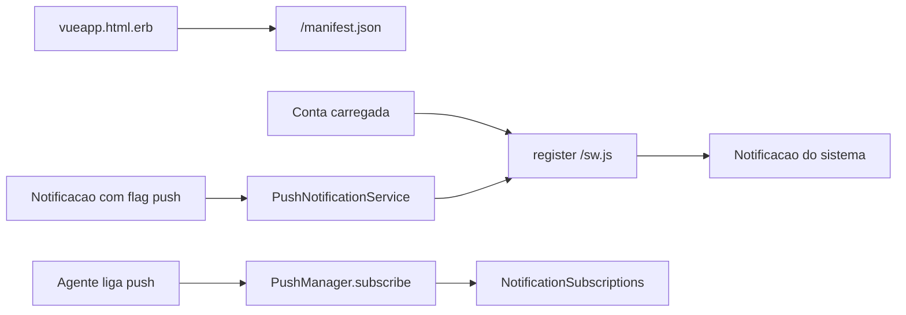

# PWA — Documentação

Shell instalável do painel: manifesto web, ícones e service worker de Web Push. O fork só acrescenta a detecção de iPhone/iPad fora do app instalado, para o aviso de chamada Wavoip.

**Estado:** herdado do upstream + aviso iOS no fork · 29/set/2026

| Área | Status |
|------|--------|
| Manifesto em `/manifest.json` | ✅ `standalone`, ligado por `DISPLAY_MANIFEST` |
| Ícones Apple / Android no layout do painel | ✅ |
| Service worker `/sw.js` | ✅ só `push` e `notificationclick` |
| Inscrição Web Push (VAPID) | ✅ depois do login, se a chave pública existir |
| Aviso iOS sem app na tela inicial | ✅ fork, em Preferências de notificação |
| Cache / offline | ❌ |
| Botão “Instalar app” | ❌ |
| Nome e cor da instalação no manifesto | ❌ texto fixo “Chatwoot” |

---

## Por onde começar

| Perfil | Documento |
|--------|-----------|
| **Visão / status** | Este README |
| **O que existe no código** | [current-state.md](./current-state.md) |
| **Por que o worker não faz cache** | [implementation-decision-tree.md](./implementation-decision-tree.md) |
| **Plano as-built + arquivos** | [implementation-plan.md](./implementation-plan.md) |
| **Próximos passos** | [improvements-backlog.md](./improvements-backlog.md) |

---

## Decisões fechadas

| Tópico | Decisão |
|--------|---------|
| Escopo | Painel instalável + push com a aba fechada. Sem app offline |
| Manifesto | Arquivo estático em `public/manifest.json` |
| Quando o HTML aponta o manifesto | `InstallationConfig` `DISPLAY_MANIFEST` (padrão `true`) |
| Service worker | `public/sw.js` escrito à mão. Sem `fetch` |
| Registro do worker | `pushHelper.js`, só se o browser tiver `serviceWorker` e `PushManager` |
| Momento do registro | Depois que a conta do agente carrega (`App.vue`) |
| Push | `Notification::PushNotificationService` + gem `web-push` + chaves VAPID |
| iOS | Aviso na tela de perfil quando o aparelho não está em `display-mode: standalone` |
| Workbox | `workbox-config.js` existe e **não** entra no build. Não gerar `sw.js` por ele |
| Fork | Sem overlay de manifesto. Um helper em `custom/` e um `// FORK:` na tela de perfil |

---

## Fluxo (resumo)

---

## Problema de produto

O painel precisa abrir como app na tela inicial do celular e receber aviso com a aba fechada. O Chatwoot upstream já entrega o manifesto e o worker de push. No iPhone, a API `Notification` da página só funciona com o site instalado; o fork avisa isso na tela de preferências, no contexto de chamada Wavoip.

O popup da página ([popup-notifications](../popup-notifications/README.md)) é outro canal: exige a aba viva. Com o PWA suspenso, esse popup não dispara.

---

*Última atualização: 29/set/2026*
