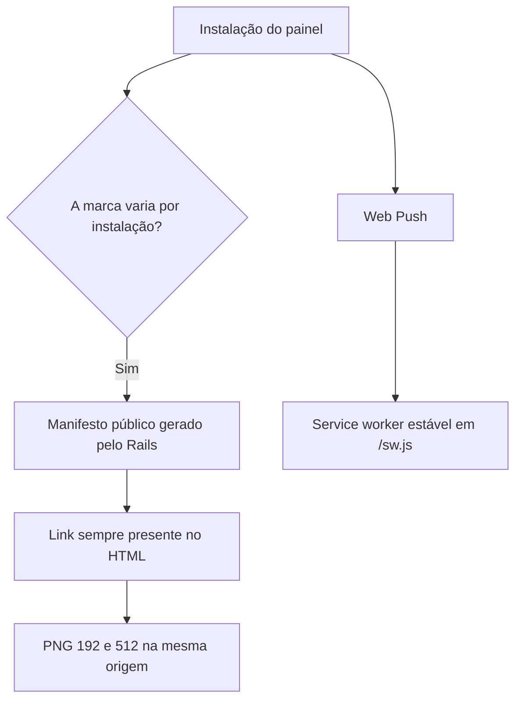

# PWA — decisões de implementação

Decisões do branch `fix/pwa-mobile-push`, 30/set/2026.

## Qual manifesto entregar?

O antigo `public/manifest.json` era estático e fixava o nome “Chatwoot”. O builder em `custom/` usa `INSTALLATION_NAME`, `BRAND_NAME` e as URLs configuradas para os ícones. `/manifest.webmanifest` é canônico; `/manifest.json` continua como alias. Remover o arquivo estático evita duas fontes de verdade.

O link do manifesto fica fora do bloco `DISPLAY_MANIFEST`: essa opção controla metadados padrão do Chatwoot, enquanto a instalação white-label precisa permanecer disponível. O manifesto mantém `id: "/"`, `start_url: "/"`, `scope: "/"` e `display: "standalone"`.

## Por que dois ícones?

O Chrome exige entradas de 192×192 e 512×512 para a promoção de instalação. Um favicon 512 acessível no servidor não atende ao critério se não estiver declarado no manifesto. As configurações `PWA_ICON_192_URL` e `PWA_ICON_URL` permitem trocar ambos sem editar código. Os arquivos informados devem ser PNGs quadrados reais, na origem do painel.

## Por que manter o worker sem cache offline?

O worker existente recebe eventos `push` e `notificationclick`, mesmo com a página fechada. O painel depende de API, autenticação e Action Cable; não há política de cache de sessão ou experiência offline implementada. `workbox-config.js` não entra no build: gerar `public/sw.js` por ele substituiria os handlers de Push.

O Chrome removeu a exigência de um handler `fetch` para instalação no Android. Registrar o worker na tela de login ou adicionar um handler vazio não corrige um manifesto ausente ou incompleto. O worker continua indispensável para Web Push, e seu registro ocorre após o carregamento da conta.

## Como o usuário instala?

No Android Chrome, o navegador oferece **Instalar** quando a página e o manifesto atendem aos critérios e o app ainda não está instalado. Um botão próprio com `beforeinstallprompt` não é necessário para a opção do menu. No iOS/iPadOS, o caminho é Safari → Compartilhar → Adicionar à Tela de Início. Um atalho comum no Chrome não comprova que a PWA foi instalada.

Push e Pop-up são canais distintos: Push usa o serviço do navegador e o worker; Pop-up usa a sessão aberta. A suspensão do WebSocket no celular é esperada e não deve ser contornada com polling em segundo plano.

Referências: [critérios de instalação do Chrome](https://web.dev/articles/install-criteria) e [remoção do requisito de `fetch` no Android](https://developer.chrome.com/blog/whats-new-in-web-on-android-io2023/).
