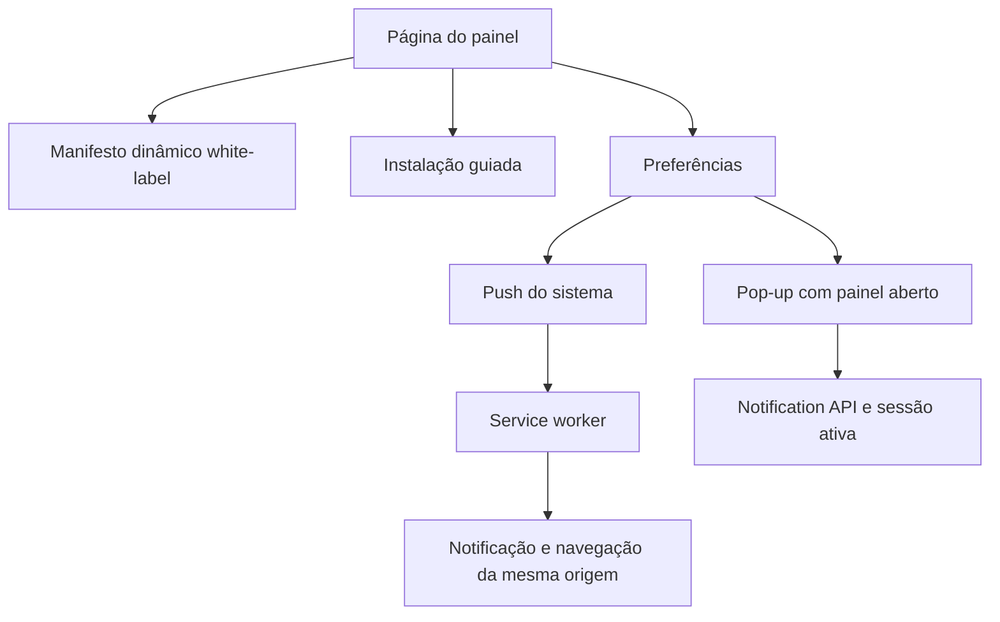
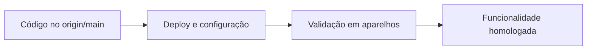

# PWA — decisões de implementação

## Separação de responsabilidades

Push e Pop-up não são equivalentes. Push usa inscrição, serviço do navegador e worker, podendo funcionar com a página fechada. Pop-up usa a página ativa e a conexão em tempo real. Por isso conceder permissão a Pop-up não cria automaticamente uma inscrição Push.

## Manifesto dinâmico e identidade estável

O manifesto fica em `custom/` porque nome e ícones variam por instalação. `/manifest.webmanifest` é canônico e `/manifest.json` é somente um alias; não existe arquivo estático concorrente. `id: "/"` preserva a identidade das instalações antigas. `prefer_related_applications: false` deixa explícita a preferência pela PWA.

O link e os metadados mínimos ficam fora de `DISPLAY_MANIFEST`. Essa configuração continua controlando apenas os metadados padrão do Chatwoot. Na revisão Icon Kitchen, os ícones regulares 192/512 são declarados como `any`, e os ícones adaptativos separados como `maskable`; o Apple Touch 180×180 e o favicon ficam no HTML. Se os valores maskable opcionais não estiverem configurados, o manifesto preserva as duas entradas anteriores `any maskable`. A borda externa dos novos maskables pode sofrer leve recorte, mas o símbolo central permanece na área segura.

## Instalação guiada

No Chromium, o evento `beforeinstallprompt` é guardado sem abrir UI automaticamente. O botão aparece somente enquanto existe um prompt utilizável e chama `prompt()` por clique. No iOS não há esse evento: a interface ensina o fluxo nativo do Safari. O menu do navegador permanece uma alternativa ao botão interno.

## Ciclo Push por dispositivo

O opt-in é persistido localmente para não transformar uma permissão já concedida em nova inscrição contra a escolha do usuário. No carregamento, uma inscrição optada é recriada se sumiu e sincronizada com o backend. Se a chave VAPID mudou, a inscrição antiga é removida remotamente quando possível, cancelada localmente e recriada. Operações são serializadas para impedir cliques concorrentes.

O worker é registrado com `updateViaCache: "none"`. Ele não implementa cache offline. No clique, URLs externas ou inválidas são substituídas pela raiz da própria origem; somente uma janela do painel (`/app`) da mesma origem é reutilizada e navegada antes de abrir outra.

## Extensão do fork

Lógica específica vive em `custom/`. Controllers e serviços Ruby usam `prepend_mod_with`; arquivos upstream mantêm apenas hooks/imports mínimos com `FORK:`. Essa organização reduz conflitos ao rebasear o fork sobre novas versões do Chatwoot.

## Separação entre integração e disponibilidade

O fluxo de conclusão possui três estados independentes:

Um commit integrado não altera o domínio até que uma nova imagem seja publicada. Da mesma forma, respostas HTTP corretas não comprovam a entrega final do Push: o aceite exige testes reais em Android e iOS com o aplicativo suspenso ou fechado.
