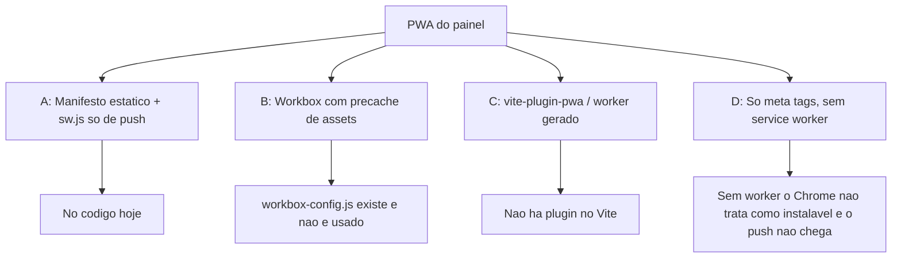

# PWA — Árvore de decisão

Comparação do que o código já faz para o painel instalável e para o push com a aba fechada.

**Decisões fechadas:** herdadas do upstream; o aviso iOS entrou com o Wavoip no fork. Inventário em 29/set/2026.

---

## Pergunta central

> O painel precisa de um app offline, ou basta instalar na tela inicial e receber Web Push?

---

## Opções avaliadas

### A — Manifesto estático + worker só de push (no código)

**Ideia:** `public/manifest.json` e `public/sw.js` servidos como arquivo público. O worker só mostra a notificação que o servidor já montou.

| Prós | Contras |
|------|---------|
| O painel Rails continua dono do HTML | Sem cache; cada abertura baixa o Vite de novo |
| Push não depende do build de assets | Manifesto não acompanha a marca da instalação |
| Pouca superfície no fork | Registro do worker espera a conta carregar |

É o que está em produção neste repositório.

### B — Workbox gerando `public/sw.js`

**Ideia:** `workbox-config.js` precacheia `public/**/*.{png,ico}` e grava em `public/sw.js`.

| Prós | Contras |
|------|---------|
| Cache de ícones | O destino é o mesmo arquivo do push |
| | Rodar o gerador apaga `push` e `notificationclick` |
| | Não há script npm/rake que chame esse config |

Descartada para o build. O arquivo fica na raiz como resquício. Não apontar o precompile para ele.

### C — Plugin de PWA no Vite

**Ideia:** Gerar manifesto e worker no `assets:precompile`.

| Prós | Contras |
|------|---------|
| Hash dos assets e atualização do worker | O worker de push deixa de ser um arquivo estável em `public/` |
| | Mistura cache de JS com o canal de notificação |

Não adotada. O dashboard já sai pelo Vite; o PWA continua fora desse pipeline.

### D — Só manifesto, sem worker

**Ideia:** Ícone na tela inicial, push por outro canal (FCM / popup).

| Prós | Contras |
|------|---------|
| Menos JS | Web Push do browser exige service worker |
| | O fluxo `browser_push` existente para de funcionar |

---

## Decisões derivadas

| Tópico | Escolha | Motivo |
|--------|---------|--------|
| Onde registrar o worker | `App.vue`, depois de `accounts/get` | A subscription usa o cookie de sessão (`auth.hasAuthCookie`) |
| Gate do registro | `serviceWorker` e `PushManager` | Browser sem push não ganha worker ocioso |
| Clique da notificação | `clients.matchAll` + `openWindow` | A URL absoluta vem de `app_account_conversation_url` |
| Aviso de iOS | Helper em `custom/`, um import na tela de perfil | A limitação é do Safari, não do worker. O texto cobre chamada Wavoip |
| Marca no manifesto | Arquivo estático “Chatwoot” | `DISPLAY_MANIFEST` liga ou desliga o bloco inteiro; não reescreve o JSON |
| Offline | Fora do escopo | O painel depende de API, Action Cable e sessão |
