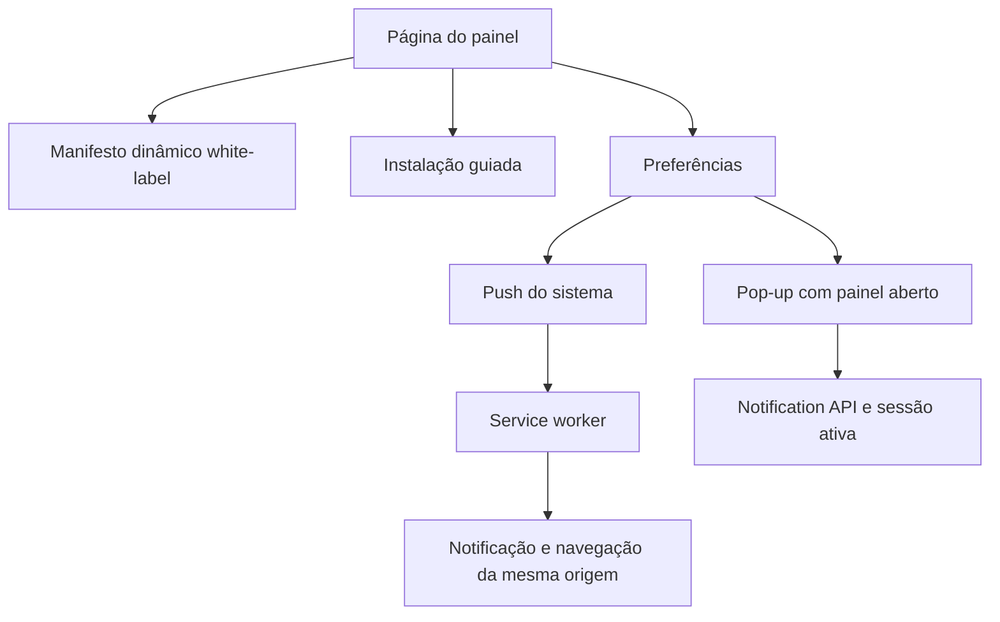
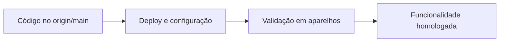

# PWA — decisões de implementação

## Confiabilidade de entrega e banner — 02/out/2026

- Inscrição recusada por autenticação → preservar e diagnosticar; inválida/expirada → remover. Logs usam provedor/HTTP/motivo de uma lista permitida, sem corpo arbitrário.
- Texto longo → reduzir somente título/corpo para caber no JSON de 3.900 bytes; preservar UTF-8, destino e destinatário. Metadados excessivos falham explicitamente.
- Payload inválido ou falha da apresentação normal → aviso genérico mínimo; falha final continua erro. Não usar Push silencioso nem repetir indefinidamente.
- Som/aviso sem banner → orientação do sistema após conferência fresca; bloqueio encontrado → ajuda correspondente. Nenhum reenvio ou pedido nativo automático.

Estas decisões estão no candidato `fix/mobile-notification-reliability`. A urgência Web Push não é a importância de uma categoria Android. A PWA não pode obrigar banners sobre outros aplicativos, alterar Banners/Foco do iOS ou garantir apresentação. [Arquitetura](./current-state.md#correções-mobile-e-banners--02out2026).

**Integração de 02/out/2026:** as decisões dos candidatos abaixo estão implementadas na `main` local até `063ee874a1`, sem publicação/build/deploy. Menções a branches candidatas são histórico. Homologação em aparelhos permanece pendente; [evidências](../popup-notifications/validation-report.md#integração-na-main-local--02out2026).

## Decisões da revisão assistida

- Consulta de instalação pendente → **Verificando**, sem consumir o prompt. Dez segundos sem conclusão → abortar requests, informar timeout e oferecer retry somente por clique.
- JSON/campos/ícone inválidos → configuração; rede/HTTP 5xx → conexão. Ambos impedem instalação direta até consulta válida, sem concluir que o navegador é incompatível.
- Diagnóstico fechado → invalidar a apresentação anterior. O envio já iniciado pode chegar, mas sua resposta não reabre o diálogo.
- Dispositivo inscrito + preferências carregadas + zero eventos Push + nenhuma gravação → orientação e link para seleção; nunca ativar eventos por conta própria.
- HTTPS inseguro / APIs ausentes / VAPID ausente → motivos distintos dentro do contrato de ambiente indisponível. Não são permissões negadas pelo usuário.
- Verificação, ativação, teste e desativação compartilham trava, mas exibem a atividade correta. Sem alteração das decisões de canais, sessão ou opt-out.

Estado e limites: [current-state.md](./current-state.md).

## Decisões do incremento mobile/diagnóstico

- Navegador mobile autenticado → promoção inline; standalone ou `appinstalled` → ocultar. Dispensa persistida → não reapresentar automaticamente, sem esconder as preferências.
- Evento de instalação disponível e sem erro verificável → prompt após clique. Sem evento → instruções; não inferir instalado/incompatível. Navegador integrado conhecido → copiar endereço e orientar Chrome/Safari.
- Testar → leitura fresca de ambiente/permissão/opt-out → inscrição ativa confirmada pelo helper → envio usando esse endpoint.
- Negada → ajuda; pendente → CTA que pede permissão; iOS fora da PWA → instalação; opt-out → ativação explícita; incompatível → limitação, não bloqueio.
- Aceito → perguntar ao usuário. **Não recebi** → conferir novamente sem envio; itens válidos → instruções de sistema/Foco, sem afirmar bloqueio detectado.
- 404 → recuperação explícita e outro clique para testar; 429 → aguardar; 401/403 → sessão/autorização; 422/502/rede/timeout → cadastro/envio/conexão.
- Resultados existem apenas no frontend; não há telemetria de confirmação de banner, credenciais no worker ou endpoints novos.

Instruções conferidas em [Chrome/web.dev](https://web.dev/articles/customize-install) e [Apple](https://support.apple.com/pt-br/guide/iphone/iphea86e5236/ios).

## Convite de permissão — decisão de 02/out/2026

- Convite próprio automático somente na primeira abertura autenticada da PWA; solicitação nativa exclusivamente após clique.
- Sem repetição automática após **Agora não**. Registro local versionado por usuário, sem dados secretos; armazenamento indisponível suprime o convite para evitar insistência.
- Inscrito ou opt-out explícito: sem convite. Bloqueado: instruções, nunca promessa de desbloqueio pelo aplicativo.
- Permissão e inscrição do dispositivo não substituem preferências dos eventos por conta.
- Retorno ao app reavalia o estado; permissão concedida exclusivamente para Pop-up não cria Push.
- Entrega desta etapa: branch candidata, sem merge/deploy. Ver [estado atual](./current-state.md).

## Separação de responsabilidades

Push e Pop-up não são equivalentes. Push usa inscrição, serviço do navegador e worker, podendo funcionar com a página fechada. Pop-up usa a página ativa e a conexão em tempo real. Por isso conceder permissão a Pop-up não cria automaticamente uma inscrição Push.

## Manifesto dinâmico e identidade estável

O manifesto fica em `custom/` porque nome e ícones variam por instalação. `/manifest.webmanifest` é canônico e `/manifest.json` é somente um alias; não existe arquivo estático concorrente. `id: "/"` preserva a identidade das instalações antigas. `prefer_related_applications: false` deixa explícita a preferência pela PWA.

O link e os metadados mínimos ficam fora de `DISPLAY_MANIFEST`. Essa configuração continua controlando apenas os metadados padrão do Chatwoot. Na revisão Icon Kitchen, os ícones regulares 192/512 são declarados como `any`, e os ícones adaptativos separados como `maskable`; o Apple Touch 180×180 e o favicon ficam no HTML. Se os valores maskable opcionais não estiverem configurados, o manifesto preserva as duas entradas anteriores `any maskable`. Os maskables foram recompostos com margem: o símbolo claro fica integralmente dentro do círculo mínimo de segurança.

## Instalação guiada

No Chromium, o evento `beforeinstallprompt` é guardado sem abrir UI automaticamente. O botão aparece somente enquanto existe um prompt utilizável e chama `prompt()` por clique. No iOS não há esse evento: a interface ensina o fluxo nativo do Safari. O menu do navegador permanece uma alternativa ao botão interno.

O console pode informar `Banner not shown` porque o app chamou `preventDefault()` para guardar o evento. Isso é esperado no fluxo guiado. O HTML mantém `mobile-web-app-capable` e `apple-mobile-web-app-capable` juntos para compatibilidade entre Chromium e Apple.

Quando o prompt não chega, o painel verifica se o manifesto e os PNGs 192/512 são acessíveis e distingue esses erros do estado genérico “o navegador ainda não ofereceu instalação”. Um manifesto válido não garante o evento: a decisão final depende também do estado do navegador e do aparelho.

## Ciclo Push por dispositivo

O opt-in é persistido localmente para não transformar uma permissão já concedida em nova inscrição contra a escolha do usuário. No carregamento, uma inscrição optada é recriada se sumiu e sincronizada com o backend. Se a chave VAPID mudou, a inscrição antiga é removida remotamente quando possível, cancelada localmente e recriada. Operações são serializadas para impedir cliques concorrentes.

Ao iniciar logout, o cliente bloqueia novas sincronizações, invalida a geração da sessão e aborta requests pendentes. A limpeza não espera a fila: tenta remoção local e remota, sem registrar worker novo, com limite total de dez segundos. Sync também tem timeout e cancelamento; verificações de geração impedem efeitos tardios, inclusive após outra sessão começar. Falhas são sanitizadas e não impedem o encerramento. Na retomada, o painel revalida permissão/inscrição, sem polling durante a suspensão.

O worker é registrado com `updateViaCache: "none"`. Ele não implementa cache offline. No clique, URLs externas ou inválidas são substituídas pela raiz da própria origem; somente uma janela do painel (`/app`) da mesma origem é reutilizada e navegada antes de abrir outra.

O registro correto precisa estar ativo antes de `subscribe()`; `navigator.serviceWorker.ready` de outro escopo não é suficiente. Navegação/foco rejeitados ou cliente desaparecido levam à abertura de nova janela. `/sw.js` importa o código Custom de `/notification-worker.js`.

## Segurança e ações no candidato

Revalidar acesso/preferências no job evita expor conteúdo após revogação. Validar browser Push antes do builder evita dados inválidos e transferências parciais. APIs de diagnóstico e leitura herdam autenticação/MFA; teste só envia ao próprio endpoint browser e não cria notificação real.

O worker não recebe credenciais nem chama APIs autenticadas. “Marcar como lida” produz nonce de uso único, válido por até 60 segundos; o frontend espera a sessão, consome a intenção e confere o destinatário. Sem login ou após expiração/reinício do worker, não há escrita automática. Essa ação abre a lista, evitando ler outras notificações via last-seen da conversa. “Abrir conversa” e o clique comum continuam indo até a conversa.

Esta revisão foi integrada à `main`, publicada no GitHub do fork e implantada no release `f58ca95d4d`. Build/smoke público concluídos; ver [evidências e homologação pendente](../popup-notifications/validation-report.md).

## Extensão do fork

Lógica específica vive em `custom/`. Controllers e serviços Ruby usam `prepend_mod_with`; arquivos upstream mantêm apenas hooks/imports mínimos com `FORK:`. Essa organização reduz conflitos ao rebasear o fork sobre novas versões do Chatwoot.

## Separação entre integração e disponibilidade

Releases de código no host não devem separar os uploads persistentes. Com Active Storage local, `storage` aponta para o mesmo diretório compartilhado em todos os releases, inclusive no rollback. A configuração PM2 valida esse vínculo antes de iniciar os processos. Validar manifesto e ícones não substitui testar um avatar antigo e um upload recente após o deploy.

O fluxo de conclusão possui três estados independentes:

Um commit integrado não altera o domínio até que uma nova imagem seja publicada. Da mesma forma, respostas HTTP corretas não comprovam a entrega final do Push: o aceite exige testes reais em Android e iOS com o aplicativo suspenso ou fechado.
