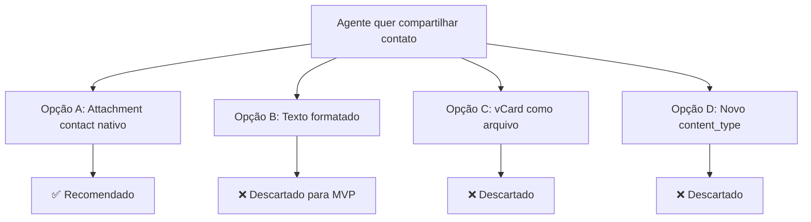
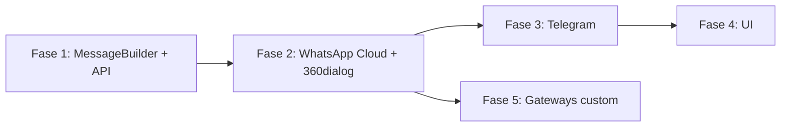

# Share Contact Card — Árvore de Decisão

Comparação de abordagens para implementar **envio de contact card pelo agente**, aproveitando o que já existe.

**Atualizado jun/2026** — decisões de produto fechadas; UI detalhada em [ui-design.md](./ui-design.md).

---

## Pergunta central

> Como o agente envia um contato do CRM para o cliente na conversa?



---

## Opções avaliadas

### Opção A — Reusar `Attachment` `file_type: contact` (RECOMENDADA)

**Ideia:** Criar mensagem outgoing com attachment `contact` (sem blob), espelhando o inbound. Estender send services para APIs nativas.

| Prós | Contras |
|------|---------|
| Reusa bubble `Contact.vue`, preview na lista, modelo `Attachment` | Exige mudanças em MessageBuilder + send services |
| Simétrico com inbound WhatsApp/Telegram | Gateway providers precisam adapter em `custom/` |
| UX nativa no app do cliente (card clicável) | Contato precisa ter telefone |
| `NON_FILE_TYPES` já inclui `contact` | — |

**Veredito:** ✅ única opção para MVP.

---

### Opção B — Mensagem de texto formatada

**Veredito:** ❌ MVP — útil só como fallback futuro para SMS/API.

### Opção C — Arquivo `.vcf`

**Veredito:** ❌ descartado.

### Opção D — Novo `content_type`

**Veredito:** ❌ descartado — `file_type: contact` já é o contrato.

---

## Decisões de produto (fechadas)

### 1. i18n: incluir `pt_BR` na mesma entrega?

**Decisão: Sim.**

- Fork usa pt_BR ativamente; `SAVE_CONTACT` e `SHARED_ATTACHMENT.CONTACT` já existem em `pt_BR/conversation.json`
- Adicionar chaves `CONVERSATION.SHARE_CONTACT.*` em **`en.json` + `pt_BR/conversation.json`**
- Demais idiomas: comunidade (regra do projeto)

---

### 2. Atalho para compartilhar o contato da conversa atual?

**Decisão: Sim.**

- Card destacado no topo do `ShareContactDialog` com um clique
- Fonte: `currentChat.meta.sender` (mesmo contato da conversa)
- Visível apenas se `phone_number` presente
- ComboBox abaixo para “outro contato” com separador `OR_SEARCH`
- **Não** substitui o picker — complementa para o caso mais comum (agente repassa contato de terceiro já cadastrado no CRM)

---

### 3. 360dialog no MVP ou só WhatsApp Cloud?

**Decisão: Incluir ambos no MVP (Cloud + 360dialog `default`).**

| Argumento | Detalhe |
|-----------|---------|
| Inbound 360dialog já trata `type: contacts` | `IncomingMessageService` compartilhado |
| Outbound usa mesmo endpoint `/messages` | Payload `type: contacts` idêntico à Cloud API |
| Esforço marginal | Extrair `build_whatsapp_contact_payload` compartilhado entre providers |
| Risco | Validar em sandbox 360dialog na Fase 2 — se falhar, capability `false` só para `default` |

Telegram permanece canal separado na Fase 3.

---

### 4. Echo coexistence WhatsApp — normalizer adicional?

**Decisão: Não no MVP.**

| Fato | Implicação |
|------|------------|
| `outgoing_echo` já existe em `IncomingMessageBaseService` | Echo de texto/mídia já tratado |
| Contact inbound já persiste via `create_contact_messages` | Echo de contact vindo do app WhatsApp funciona |
| Dedup por `source_id` | Mensagem enviada pelo Chatwoot não deve duplicar se `source_id` coincidir |
| Risco residual | Agente envia pelo Chatwoot **e** reencaminha pelo celular — edge case raro |

**Follow-up opcional (pós-MVP):** se duplicatas aparecerem, marcar echo com `content_attributes.external_echo` e ignorar reprocessamento.

---

## Decisão: escopo de canais (fases revisadas)



| Fase | Canais | Notas |
|------|--------|-------|
| **1** | — | Backend + contrato `shared_contact_id` |
| **2** | WhatsApp Cloud + 360dialog | Mesmo payload contacts |
| **3** | Telegram | `sendContact` |
| **4** | UI | Ver [ui-design.md](./ui-design.md) |
| **5** | Evolution, Z-API | `custom/` |

**Fora de escopo:** LINE, Facebook, Instagram, SMS.

---

## Decisão: UI (revisada após análise do codebase)

| Escolha | Componente / padrão |
|---------|---------------------|
| Modal | `components-next/dialog/Dialog.vue` |
| Busca | `ComboBox` + `createContactSearcher()` |
| Botão ReplyBox | `NextButton` `i-ph-address-book` (Phosphor, como barra existente) |
| Card atalho | Layout de `ContactMergeForm.vue` |
| Local dos arquivos | `widgets/conversation/ShareContact/` |
| Bubble resultado | `Contact.vue` existente — sem novo componente |

**Descartado:** `Popover` como container principal, ícones Lucide na barra, CSS custom.

→ Especificação completa: [ui-design.md](./ui-design.md)

---

## Decisão: onde colocar código (fork strategy)

| Prioridade | Uso nesta feature |
|------------|-------------------|
| `custom/` | Gateways Evolution/Z-API; capability `share_contact?` |
| `# FORK:` upstream mínimo | MessageBuilder, providers WhatsApp, Telegram send, ReplyBox, commons.js |
| Sem feature flag global | MVP direto |

---

## Decisão: contrato API

```json
POST /api/v1/accounts/:account_id/conversations/:id/messages
{
  "shared_contact_id": 123
}
```

- Não combinar com `attachments[]` no MVP
- Contato deve ter `phone_number`
- Inbox deve suportar capability

---

## Resumo final

| Dimensão | Escolha |
|----------|---------|
| Modelo | `Attachment` `file_type: contact` |
| API | `shared_contact_id` |
| Canais MVP | WhatsApp Cloud + 360dialog + Telegram |
| UI | Dialog + ComboBox + atalho contato atual |
| i18n | `en` + `pt_BR` |
| Echo | Sem normalizer extra no MVP |
| Gateways | Fase 5 em `custom/` |

→ [implementation-plan.md](./implementation-plan.md)
