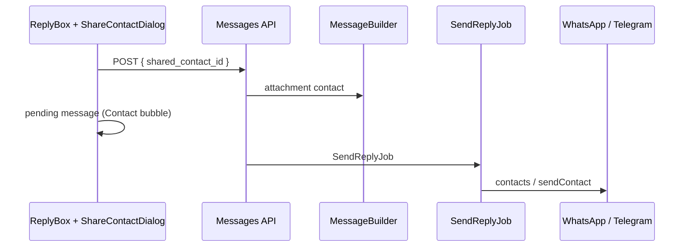

# Share Contact Card — Plano de Implementação (Chatwoot Fork)

Plano concreto para **envio de contact card pelo agente**, reutilizando inbound + UI existentes.

**Atualizado jun/2026** — decisões fechadas, UI alinhada ao codebase.

**Pré-requisitos:** [current-state.md](./current-state.md) · [implementation-decision-tree.md](./implementation-decision-tree.md) · [ui-design.md](./ui-design.md)

---

## Contexto

O Chatwoot já recebe e exibe contact cards em **WhatsApp** e **Telegram**. Falta o fluxo inverso: agente seleciona contato do CRM e envia card nativo.

## Objetivo

1. Agente compartilha contato da conta em conversas **WhatsApp** (Cloud + 360dialog) e **Telegram**
2. Atalho de **um clique** para o contato da conversa atual (quando tem telefone)
3. Cliente recebe card nativo; bubble outgoing = `Contact.vue` existente
4. i18n **en + pt_BR** na mesma entrega
5. Fork merge-safe (`custom/` para gateways, `# FORK:` mínimo no core)

## Escopo MVP

### In scope

- `shared_contact_id` na API de mensagens
- MessageBuilder → attachment `contact` + **E.164** em `fallback_title`
- WhatsApp Cloud + 360dialog outbound (`type: contacts`)
- Telegram outbound (`sendContact`) + **`business_connection_id`**
- UI: botão ReplyBox + Dialog + ComboBox + atalho contato atual
- **Guard `can_reply`** — botão oculto em WhatsApp fora da janela de sessão
- Pending message otimista com attachment `contact`
- i18n `en.json` + `pt_BR/conversation.json`
- **Melhorias MVP** (ver [improvements-backlog.md](./improvements-backlog.md)):
  - Outgoing sem "Salvar contato" em `Contact.vue`
  - Preview lista com "Shared contact" + ícone `contact`
  - Meta snake_case no bubble
  - Copy outgoing (`CONTACT_OUTGOING`)

### Out of scope

- LINE, Facebook, Instagram, SMS
- Múltiplos contatos por mensagem
- Feature flag global
- Normalizer extra para echo coexistence
- Gateways Evolution/Z-API (Fase 5)
- Specs automatizados (salvo pedido explícito)

---

## Decisões de produto (resumo)

| # | Pergunta | Decisão |
|---|----------|---------|
| 1 | pt_BR na entrega? | **Sim** — en + pt_BR |
| 2 | Atalho contato da conversa? | **Sim** — card no topo do Dialog |
| 3 | 360dialog no MVP? | **Sim** — junto com Cloud |
| 4 | Echo coexistence? | **Não no MVP** — follow-up se duplicar |

Detalhes: [implementation-decision-tree.md](./implementation-decision-tree.md)

---

## Arquitetura



---

## Fase 1 — Backend core

### 1.1 MessageBuilder

**Arquivo:** `app/builders/messages/message_builder.rb`

```ruby
# FORK: share contact card from CRM contact
def process_shared_contact
  contact_id = extract_shared_contact_id
  return if contact_id.blank?

  raise StandardError, 'Cannot mix shared contact with file attachments' if @attachments.present?
  raise StandardError, 'Channel does not support contact sharing' unless ChannelCapabilities.supports?(@conversation.inbox.channel)

  contact = @account.contacts.find_by(id: contact_id)
  raise StandardError, 'Contact not found' if contact.blank?
  raise StandardError, 'Contact phone number required' if contact.phone_number.blank?

  first_name, last_name = split_contact_name(contact.name)
  phone = normalized_share_phone(contact.phone_number)
  @message.attachments.build(
    account_id: @account.id,
    file_type: :contact,
    fallback_title: phone,
    meta: { firstName: first_name, lastName: last_name }.compact
  )
  # content vazio — preview da lista usa attachment (MVP-2)
end

def normalized_share_phone(phone_number)
  parsed = TelephoneNumber.parse(phone_number)
  parsed.valid? ? parsed.e164_number : phone_number
end
```

Chamar em `perform` após build, antes de `process_attachments`.

### 1.2 Capability helper

**Arquivo:** `custom/lib/channel_capabilities/share_contact.rb` (ou equivalente)

```ruby
module ChannelCapabilities
  SHARE_CONTACT_CHANNELS = %w[Channel::Whatsapp Channel::Telegram].freeze

  def self.supports?(channel)
    SHARE_CONTACT_CHANNELS.include?(channel.class.name)
  end
end
```

### 1.3 Critérios de done

- [ ] POST com `shared_contact_id` cria attachment `contact`
- [ ] Erro claro sem telefone / canal não suportado / mix com files
- [ ] Bubble `Contact.vue` renderiza outgoing

---

## Fase 2 — WhatsApp (Cloud + 360dialog)

### 2.1 Payload compartilhado

Extrair para concern ou helper (evitar duplicação):

```ruby
# lib/whatsapp/contact_message_payload_builder.rb ou em BaseService
def build_whatsapp_contact_payload(attachment)
  meta = attachment.meta || {}
  {
    name: {
      formatted_name: [meta['firstName'], meta['lastName']].compact.join(' ').presence || attachment.fallback_title,
      first_name: meta['firstName'],
      last_name: meta['lastName']
    }.compact,
    phones: [{ phone: attachment.fallback_title, type: 'CELL' }]
  }
end
```

### 2.2 WhatsappCloudService

```ruby
# FORK: share contact card
def send_message(phone_number, message)
  @message = message
  if contact_attachment?(message)
    send_contact_message(phone_number, message)
  elsif ...
```

`contact_attachment?` → `message.attachments.one? && message.attachments.first.contact?`

### 2.3 Whatsapp360DialogService

- Mesmo `send_contact_message` — endpoint `/messages` com `type: contacts`
- **Task de validação:** sandbox 360dialog antes de merge
- Se sandbox falhar: `ChannelCapabilities` exclui provider `default` temporariamente

### 2.4 Critérios de done

- [ ] Cloud: card nativo no WhatsApp do cliente
- [ ] 360dialog: idem (ou documentado bloqueio)
- [ ] `source_id` atualizado; falha → `failed`

---

## Fase 3 — Telegram

**Arquivo:** `app/services/telegram/send_attachments_service.rb`

1. Bucket `:contact` em `group_attachments_by_type`
2. `send_contact` via `POST .../sendContact`
3. Garantir `send_message_on_telegram` chama attachments quando só há contact (sem `outgoing_content`)

**Critérios de done:**

- [ ] Card no app Telegram
- [ ] Mensagem só-contact sem texto funciona

---

## Fase 4 — Frontend

**Especificação visual completa:** [ui-design.md](./ui-design.md) · **Melhorias:** [improvements-backlog.md](./improvements-backlog.md)

### 4.0 Ajustes em componentes existentes (MVP)

| Arquivo | Mudança |
|---------|---------|
| `bubbles/Contact.vue` | Ocultar Save Contact em outgoing; meta snake_case; copy outgoing |
| `ConversationCard/MessagePreview.vue` | Ícone `contact`; priorizar attachment type |
| `widgets/conversation/MessagePreview.vue` | Idem (legado, se em uso) |

### 4.1 Arquivos novos / alterados

| Arquivo | Ação |
|---------|------|
| `widgets/conversation/ShareContact/ShareContactDialog.vue` | Criar |
| `widgets/conversation/ShareContact/ShareContactForm.vue` | Criar |
| `widgets/WootWriter/ReplyBottomPanel.vue` | Botão `i-ph-address-book` |
| `widgets/conversation/ReplyBox.vue` | Wire dialog + `sendMessage` + **guard can_reply** |
| `api/inbox/message.js` | `shared_contact_id` em `buildCreatePayload` |
| `helper/commons.js` | Pending attachment `contact` |
| `i18n/locale/en/conversation.json` | Chaves `SHARE_CONTACT` + `CONTACT_OUTGOING` |
| `i18n/locale/pt_BR/conversation.json` | Traduções pt |

### 4.2 Fluxo ReplyBox

```javascript
// FORK: share contact card
async onShareContact(contact) {
  await this.sendMessage({
    conversationId: this.currentChat.id,
    message: '',
    sharedContactId: contact.id,
    sharedContactName: contact.name,
    sharedContactPhone: contact.phone_number,
    private: false,
  });
  this.$refs.shareContactDialog?.close();
}
```

### 4.3 Padrões UI obrigatórios

- `Dialog` width `md` — não Popover
- `ComboBox` + `createContactSearcher` — não busca custom
- `NextButton` slate faded sm — igual anexo/template
- Card atalho — layout `ContactMergeForm`
- Tailwind only, Composition API, i18n

### 4.4 Visibilidade do botão

Ver diagrama em [improvements-backlog.md § Diagrama](./improvements-backlog.md#diagrama--estados-do-botão-compartilhar-contato).

```javascript
// FORK: share contact card
const showShareContactButton = computed(() => {
  if (isOnPrivateNote.value || isEditorDisabled.value) return false;
  if (isATelegramChannel.value) return true;
  if (isAWhatsAppChannel.value) return currentChat.value?.can_reply;
  return false;
});
```

### 4.5 Critérios de done

- [ ] Botão só em WhatsApp/Telegram, oculto em nota privada
- [ ] WhatsApp: oculto quando `!can_reply`
- [ ] Atalho contato conversa + ComboBox outro contato
- [ ] Pending message mostra bubble antes da API
- [ ] Outgoing sem Save Contact; copy `CONTACT_OUTGOING`
- [ ] Preview lista = "Shared contact" + ícone
- [ ] pt_BR + en completos

---

## Fase 5 — Gateways (`custom/`)

| Entrega | Local |
|---------|-------|
| `send_contact_message` | `custom/.../evolution_service.rb` |
| Capability por provider | Registry |
| Normalizer echo gateway | Se necessário |

Ver [whatsapp-provider](../whatsapp-provider/README.md).

---

## Echo coexistence (pós-MVP, se necessário)

- Monitorar duplicatas de contact com mesmo `source_id`
- Se ocorrer: ignorar echo quando `content_attributes.external_echo` e attachment `contact` já existir
- **Não implementar preventivamente**

---

## Enterprise

```bash
rg "MessageBuilder|WhatsappCloudService|SendAttachmentsService" enterprise/
```

Espelhar ou `prepend_mod_with` se overrides existirem.

---

## Melhorias — referência completa

Todas as melhorias MVP, P1 e P2: [improvements-backlog.md](./improvements-backlog.md)

---

## Plano de testes manuais

### Funcional

1. Atalho — compartilhar contato da conversa (com telefone)
2. ComboBox — buscar e compartilhar outro contato do CRM
3. Contato sem telefone — UI bloqueia / API erro
4. WhatsApp Cloud + 360dialog — card nativo no cliente
5. Telegram — card nativo
6. Lista de conversas — “Shared contact” / “Contato compartilhado”
7. Regressão inbound — cliente compartilha contato, agente vê bubble
8. Outgoing — **sem** botão Save Contact no bubble do agente
9. WhatsApp fora de 24h — botão compartilhar **ausente**
10. Telegram Business — envio com `business_connection_id` ativo

### UI

1. Botão alinhado visualmente com anexo/microfone/template
2. Dialog responsivo, tema light/dark
3. Tooltip i18n no botão
4. Nota privada — botão ausente

### i18n

1. Interface em en
2. Interface em pt_BR

---

## Riscos e mitigações

| Risco | Mitigação |
|-------|-----------|
| 360dialog rejeita `contacts` | Sandbox antes merge; fallback capability |
| Pending message sem preview contact | Estender `createPendingMessage` |
| Meta snake_case vs camelCase | Padronizar outbound camelCase; opcional fix Contact.vue |
| Merge upstream ReplyBox | Blocos `// FORK:` isolados |

---

## Critérios de aceite

- [ ] Share via atalho + via busca
- [ ] WhatsApp Cloud + 360dialog + Telegram
- [ ] Bubble outgoing = inbound (`Contact.vue`) sem Save Contact
- [ ] Preview lista + ícone contact
- [ ] Guard `can_reply` WhatsApp
- [ ] E.164 no attachment
- [ ] en + pt_BR (incl. `CONTACT_OUTGOING`)
- [ ] Sem regressão inbound
- [ ] Lint OK nos arquivos alterados
- [ ] `FORK: share contact card` em divergências

---

## Estimativa revisada

| Fase | Esforço |
|------|---------|
| 1 — Backend | 2–3 h |
| 2 — WhatsApp (2 providers) | 3–4 h |
| 3 — Telegram | 1–2 h |
| 4 — UI (Dialog + atalho + pending + ajustes bubble/preview) | 5–6 h |
| QA + sandbox 360dialog | 2 h |
| **Total MVP** | **~2 dias** |
| 5 — Gateways | +0.5–1 dia/provider |

---

## Perguntas em aberto

**Nenhuma** — todas resolvidas em [implementation-decision-tree.md](./implementation-decision-tree.md).

---

## Referências

| Peça | Arquivo |
|------|---------|
| UI spec | [ui-design.md](./ui-design.md) |
| Melhorias | [improvements-backlog.md](./improvements-backlog.md) |
| Inbound WhatsApp | `app/services/whatsapp/incoming_message_base_service.rb` |
| Inbound Telegram | `app/services/telegram/incoming_message_service.rb` |
| Bubble | `components-next/message/bubbles/Contact.vue` |
| Reply bar | `components/widgets/WootWriter/ReplyBottomPanel.vue` |
| Contact search | `components-next/NewConversation/helpers/composeConversationHelper.js` |
| Merge UI ref | `components-next/Contacts/ContactsForm/ContactMergeForm.vue` |
| Dialog ref | `components-next/dialog/Dialog.vue` |
