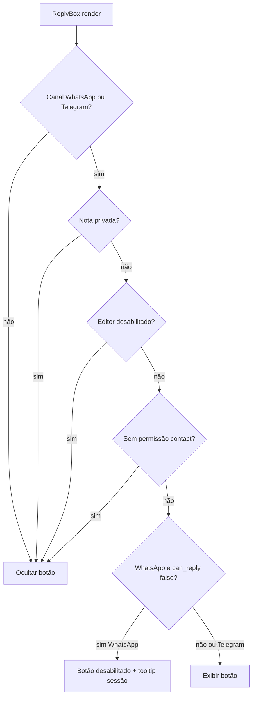

# Share Contact Card — Melhorias e Follow-ups

Itens identificados na revisão do plano (jun/2026). Os marcados como **MVP** devem entrar na primeira entrega, não ficar só no backlog.

---

## Legenda de prioridade

| Tag | Significado |
|-----|-------------|
| **MVP** | Incluir na primeira implementação |
| **P1** | Logo após MVP estável |
| **P2** | Backlog / valor incremental |

---

## MVP — obrigatório na primeira entrega

### MVP-1 · Esconder "Salvar contato" em mensagens outgoing

**Problema:** `Contact.vue` sempre exibe o botão **Save Contact**. Quando o agente envia o card, o contato já existe no CRM — o botão confunde.

**Solução:**

```javascript
// bubbles/Contact.vue
const { variant } = useMessageContext();
const showSaveAction = computed(
  () => variant.value !== MESSAGE_VARIANTS.AGENT && formattedPhoneNumber.value
);
```

Passar `:action="showSaveAction ? action : null"` ao `BaseAttachmentBubble`.

**Arquivos:** `components-next/message/bubbles/Contact.vue`

---

### MVP-2 · Preview correto na lista de conversas

**Problema:** `MessagePreview.vue` prioriza `message.content` sobre attachment. Com `content = contact.name` (plano atual), a lista mostra só o nome em vez de "Shared contact".

**Solução (recomendada — combinar A + B):**

**A)** Backend outbound: **não** preencher `message.content` (deixar `null`); preview cai no ramo `attachments`.

**B)** Frontend: em `MessagePreview.vue`, se `file_type === 'contact'`, usar `CHAT_LIST.ATTACHMENTS.contact.CONTENT` mesmo com `content` presente.

**C)** Adicionar ícone na lista:

```javascript
const attachmentIcons = {
  // ...
  contact: 'i-lucide-contact',
};
```

**Arquivos:** `MessageBuilder` (content vazio), `ConversationCard/MessagePreview.vue`, `widgets/conversation/MessagePreview.vue` (legado, se ainda usado)

---

### MVP-3 · Guard `can_reply` no WhatsApp

**Problema:** Fora da janela de 24h, `SendOnWhatsappService` força template — contact card não é template e falhará.

**Solução:**

```javascript
// ReplyBox.vue — showShareContactButton
showShareContactButton =
  (isAWhatsAppChannel || isATelegramChannel) &&
  !isOnPrivateNote &&
  !isEditorDisabled &&
  (isATelegramChannel || currentChat.can_reply);
```

Tooltip quando desabilitado por janela: `CONVERSATION.SHARE_CONTACT.DISABLED_SESSION_EXPIRED`.

**Arquivos:** `ReplyBox.vue`, `ReplyBottomPanel.vue` (prop + tooltip), i18n en + pt_BR

---

### MVP-4 · Normalização E.164 no backend

**Problema:** Números inconsistentes no CRM quebram envio WhatsApp/Telegram.

**Solução:** helper compartilhado antes de persistir attachment e antes do payload:

```ruby
# FORK: share contact card
def normalized_share_phone(phone_number)
  parsed = TelephoneNumber.parse(phone_number)
  parsed.valid? ? parsed.e164_number : phone_number
end
```

Usar em `process_shared_contact` para `fallback_title` e em `build_whatsapp_contact_payload` / `sendContact`.

**Arquivos:** `MessageBuilder`, payload builder WhatsApp, `SendAttachmentsService` Telegram

---

### MVP-5 · Meta snake_case no `Contact.vue`

**Problema:** Telegram inbound grava `first_name` / `last_name`; bubble só lê camelCase — nome vazio.

**Solução:**

```javascript
const contactName = computed(() => {
  const { meta } = attachment.value ?? {};
  const first = meta?.firstName ?? meta?.first_name ?? '';
  const last = meta?.lastName ?? meta?.last_name ?? '';
  return `${first} ${last}`.trim();
});
```

**Arquivos:** `bubbles/Contact.vue`

---

### MVP-6 · Copy do bubble em mensagens outgoing

**Problema:** `SHARED_ATTACHMENT.CONTACT` = "{sender} compartilhou um contato" com sender = agente soa estranho no thread.

**Solução:** omitir linha do sender em outgoing ou chave dedicada:

```json
"SHARED_ATTACHMENT": {
  "CONTACT": "{sender} has shared a contact",
  "CONTACT_OUTGOING": "You shared a contact"
}
```

Em `BaseAttachmentBubble` ou `Contact.vue`, escolher key por `variant`.

**Arquivos:** `Contact.vue`, `en.json`, `pt_BR/conversation.json`

---

### MVP-7 · Telegram `business_connection_id`

**Problema:** Modo Telegram Business exige `business_connection_id` nos envios — plano original não citava.

**Solução:** reutilizar `business_connection_body` existente em `SendAttachmentsService#send_contact`, igual a `sendDocument` / `sendMediaGroup`.

**Arquivos:** `telegram/send_attachments_service.rb`

---

## Diagrama — estados do botão "Compartilhar contato"



| Estado | UI |
|--------|-----|
| Canal não suportado | Botão oculto |
| Nota privada | Botão oculto |
| WhatsApp + `!can_reply` | Botão oculto **ou** desabilitado com tooltip (recomendado: oculto, igual template) |
| Telegram | Sem janela 24h — botão visível |
| Sem `contact_manage` (se adotado) | Botão oculto |

---

## P1 — logo após MVP

### P1-1 · Link "Editar contato" quando sem telefone

No atalho do Dialog, se conversa atual não tem telefone: mensagem `NO_PHONE_CURRENT` + link para aba do contato (`/contacts/:id`).

### P1-2 · Permissões `contact_manage`

- Backend: validar policy antes de `process_shared_contact`
- Frontend: esconder botão sem permissão

### P1-3 · Specs mínimos

| Spec | Cobertura |
|------|-----------|
| `message_builder_spec` | `shared_contact_id` → attachment contact; erro sem phone |
| `whatsapp_cloud_service_spec` | payload `type: contacts` |
| `send_attachments_service_spec` | ramo `sendContact` |

### P1-4 · Analytics

Evento `CONTACTS_EVENTS.SHARED_CONTACT` no clique de confirmar do Dialog.

---

## P2 — backlog

| ID | Melhoria | Notas |
|----|----------|-------|
| P2-1 | `org` no payload WhatsApp | `additional_attributes.company_name` |
| P2-2 | API pública `shared_contact_id` | Bots / API inbox |
| P2-3 | Echo dedup coexistence | Se duplicar `source_id` |
| P2-4 | Gateways Evolution `sendContact` | Fase 5 `custom/` |
| P2-5 | Feature flag por inbox | Rollout gradual |
| P2-6 | Múltiplos telefones por contato | WhatsApp suporta N phones |
| P2-7 | Atalho de teclado | Opcional |
| P2-8 | Aviso ao compartilhar contato = contato da conversa | Edge case raro |

---

## Payload WhatsApp — edge cases

```json
{
  "type": "contacts",
  "contacts": [{
    "name": {
      "formatted_name": "João Silva",
      "first_name": "João",
      "last_name": "Silva"
    },
    "org": { "company": "Acme Ltda" },
    "phones": [{ "phone": "+5511999999999", "type": "CELL" }]
  }]
}
```

| Caso | Tratamento |
|------|------------|
| Nome vazio | `formatted_name` = telefone E.164 |
| Só um token no nome | `first_name` preenchido, `last_name` omitido |
| Telefone inválido | Rejeitar no MessageBuilder antes de salvar |
| `org` ausente | Omitir chave (P2) |

---

## Critérios de aceite adicionais (MVP)

- [ ] Outgoing **sem** botão Save Contact
- [ ] Lista de conversas mostra "Shared contact" / ícone contact
- [ ] Botão oculto em WhatsApp fora de `can_reply`
- [ ] Telefone normalizado E.164 no attachment
- [ ] Nome exibe corretamente para inbound Telegram (snake_case)
- [ ] Copy outgoing não diz "{agente} compartilhou" de forma confusa
- [ ] Telegram Business envia com `business_connection_id` quando aplicável

---

*Integrado em [implementation-plan.md](./implementation-plan.md) e [ui-design.md](./ui-design.md).*
