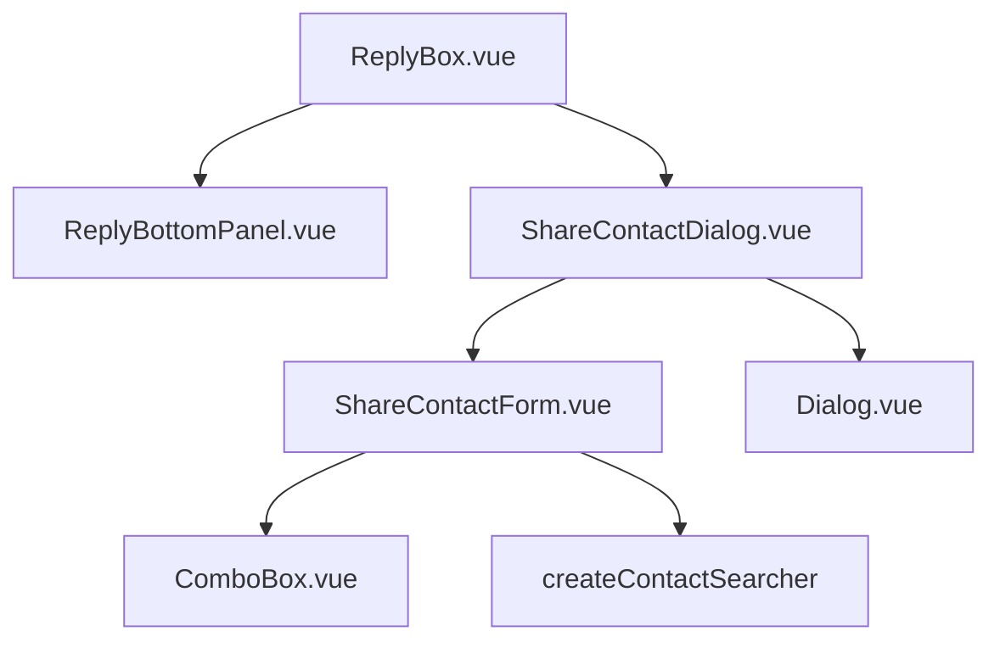

# Share Contact Card — UI Design

Especificação visual e de componentes para o envio de contact card, **alinhada aos padrões já usados no dashboard**.

---

## Princípios

- **Tailwind only** — sem CSS custom, sem scoped CSS, sem inline styles
- **Composition API** + `<script setup>`
- **components-next** para primitivos (`Button`, `Dialog`, `ComboBox`, `Avatar`)
- **widgets/conversation/** para feature acoplada ao `ReplyBox` (mesmo padrão de `WhatsappTemplates/`)
- **i18n** — nenhuma string bare no template
- Ícones do **ReplyBottomPanel**: família **Phosphor** (`i-ph-*`), não Lucide

---

## Referências visuais no projeto

| Padrão | Arquivo | O que reutilizar |
|--------|---------|------------------|
| Botão na barra do ReplyBox | `ReplyBottomPanel.vue` | `NextButton` `slate` `faded` `sm` + `v-tooltip.top-end` |
| Botão WhatsApp Templates | `ReplyBottomPanel.vue` L352–360 | Visibilidade condicional + `@click` emit |
| Modal de confirmação | `components-next/dialog/Dialog.vue` | Shell, footer confirm/cancel, `width="md"` |
| Busca de contato com API | `ContactMergeForm.vue` + `ComboBox` | `use-api-results`, `@search`, estados empty/loading |
| Helper de busca | `composeConversationHelper.js` | `createContactSearcher()` |
| Card de contato selecionado | `ContactMergeForm.vue` L93–110 | `Avatar` + nome + secondary line em `border-n-strong rounded-xl` |
| Footer de ação | `WhatsAppTemplateReply.vue` | `flex gap-2 justify-end` + `NextButton` faded cancel + submit |
| Bubble de mensagem (resultado) | `bubbles/Contact.vue` | Já renderiza outbound igual inbound — **não duplicar** |

---

## Arquitetura de componentes



### Arquivos novos (propostos)

| Arquivo | Responsabilidade |
|---------|------------------|
| `widgets/conversation/ShareContact/ShareContactDialog.vue` | Controla `Dialog` open/close, emite `share(contactId)` |
| `widgets/conversation/ShareContact/ShareContactForm.vue` | Atalho + ComboBox + validação telefone |

**Não criar** bubble novo — outbound usa `Contact.vue` existente.

---

## ReplyBottomPanel — botão de ação

Inserir **após** o botão de anexo (`i-ph-paperclip`), antes do microfone:

```vue
<!-- // FORK: share contact card -->
<NextButton
  v-if="showShareContactButton"
  v-tooltip.top-end="$t('CONVERSATION.SHARE_CONTACT.TOOLTIP')"
  icon="i-ph-address-book"
  slate
  faded
  sm
  @click="$emit('openShareContact')"
/>
```

### Props novas em `ReplyBottomPanel`

| Prop | Tipo | Regra |
|------|------|-------|
| `showShareContactButton` | Boolean | Ver [diagrama de estados](./improvements-backlog.md#diagrama--estados-do-botão-compartilhar-contato) |

```javascript
// ReplyBox.vue — // FORK: share contact card
showShareContactButton =
  !isOnPrivateNote &&
  !isEditorDisabled &&
  (isATelegramChannel || (isAWhatsAppChannel && currentChat.can_reply));
```

`ReplyBox.vue` computa e passa a prop; escuta `@open-share-contact` para abrir o dialog.

**WhatsApp fora de 24h:** botão **oculto** (mesmo padrão de bloqueio de envio livre). Tooltip reserva: `CONVERSATION.SHARE_CONTACT.DISABLED_SESSION_EXPIRED` se no futuro usar estado desabilitado em vez de oculto.

**Ícone:** `i-ph-address-book` — consistente com barra de ferramentas Phosphor (`i-ph-smiley-sticker`, `i-ph-paperclip`, `i-ph-whatsapp-logo`).

---

## ShareContactDialog — estrutura

### Shell

```vue
<Dialog
  ref="dialogRef"
  type="edit"
  width="md"
  :title="t('CONVERSATION.SHARE_CONTACT.MODAL.TITLE')"
  :description="t('CONVERSATION.SHARE_CONTACT.MODAL.DESCRIPTION')"
  :confirm-button-label="t('CONVERSATION.SHARE_CONTACT.MODAL.CONFIRM')"
  :cancel-button-label="t('CONVERSATION.SHARE_CONTACT.MODAL.CANCEL')"
  :disable-confirm-button="!selectedContactId || isSending"
  :is-loading="isSending"
  overflow-y-auto
  @confirm="handleShare"
  @close="handleClose"
>
  <ShareContactForm ... />
</Dialog>
```

Classes e tokens do `Dialog` existente — sem override de estilo.

---

## ShareContactForm — layout

### Bloco 1 — Atalho: contato da conversa (decisão: **sim**)

Exibido quando `conversationContact.phoneNumber` existe e inbox suporta share.

```
┌─────────────────────────────────────────────┐
│  Compartilhar contato desta conversa        │
│  ┌───────────────────────────────────────┐  │
│  │ [Avatar]  Nome do contato             │  │
│  │           +55 11 99999-9999           │  │
│  │                    [Compartilhar →]   │  │
│  └───────────────────────────────────────┘  │
│  ─────────── ou buscar outro ───────────    │
│  [ ComboBox busca API ]                     │
└─────────────────────────────────────────────┘
```

**Estilo do card** — copiar de `ContactMergeForm.vue`:

```vue
<div class="border border-n-strong h-[60px] gap-2 flex items-center rounded-xl p-3">
  <Avatar :name="..." :src="..." :size="32" rounded-full />
  <div class="flex flex-col w-full min-w-0 gap-1 flex-1">
    <span class="text-sm leading-4 truncate text-n-slate-12">{{ name }}</span>
    <span class="text-sm leading-4 truncate text-n-slate-11">{{ phoneNumber }}</span>
  </div>
  <Button variant="ghost" size="xs" :label="t('...QUICK_SHARE')" @click="..." />
</div>
```

- Separador visual: `text-xs text-n-slate-11` centralizado (padrão merge não tem, mas `text-n-slate-11` é o tom secundário do projeto)
- Se contato da conversa **não** tem telefone: card desabilitado + `MODAL.NO_PHONE_CURRENT`
- **P1:** link `MODAL.EDIT_CONTACT` → `/app/accounts/:id/contacts/:contactId` (nova aba)

### Bloco 2 — Buscar outro contato

Reuso direto do padrão `ContactMergeForm` / `ComboBox`:

```vue
<ComboBox
  id="share-contact-picker"
  use-api-results
  :model-value="selectedContactId"
  :options="contactOptions"
  :empty-state="isSearching ? t('...IS_SEARCHING') : t('...EMPTY_STATE')"
  :search-placeholder="t('...SEARCH_PLACEHOLDER')"
  :placeholder="t('...PLACEHOLDER')"
  :has-error="hasError"
  :message="errorMessage"
  class="[&>div>button]:bg-n-alpha-black2"
  @update:model-value="onSelect"
  @search="onSearch"
/>
```

### Mapeamento de opções ComboBox

```javascript
contactOptions = searchResults
  .filter(c => c.phoneNumber) // obrigatório para share
  .map(c => ({
    id: c.id,
    label: c.name,
    value: c.id,
    meta: {
      thumbnail: c.thumbnail,
      phoneNumber: c.phoneNumber,
      email: c.email,
    },
  }));
```

Contatos **sem telefone** na busca: exibir na lista com `disabled` visual via `description` + não selecionáveis (filtrar fora é mais simples no MVP).

### Busca

```javascript
import { createContactSearcher } from 'dashboard/components-next/NewConversation/helpers/composeConversationHelper';

const searchContacts = createContactSearcher();
// debounce 300ms — mesmo valor de SearchContactAgentSelector
```

Diferença do compose new conversation: filtrar **somente** `phoneNumber` presente (não email-only).

---

## Estados e feedback

| Estado | Comportamento |
|--------|---------------|
| Buscando | `ComboBox` empty-state `IS_SEARCHING` |
| Sem resultados | `EMPTY_STATE` |
| Enviando | `Dialog` `is-loading`, desabilita confirm |
| Sucesso | Fecha dialog + mensagem otimista no thread |
| Erro API | `useAlert(t('CONVERSATION.SHARE_CONTACT.ERROR'))` |
| Nota privada | Botão oculto (`showShareContactButton = false`) |

---

## Ajustes em componentes existentes (MVP)

### `Contact.vue` — outgoing e meta

| Mudança | Detalhe |
|---------|---------|
| Sem Save Contact em outgoing | `variant !== MESSAGE_VARIANTS.AGENT` |
| Meta snake_case | `first_name` / `last_name` fallback |
| Copy outgoing | `CONTACT_OUTGOING` em vez de `{sender} shared...` |

```vue
<!-- action só incoming -->
:action="showSaveAction ? action : null"
```

```javascript
const senderTranslationKey = computed(() =>
  variant.value === MESSAGE_VARIANTS.AGENT
    ? 'CONVERSATION.SHARED_ATTACHMENT.CONTACT_OUTGOING'
    : 'CONVERSATION.SHARED_ATTACHMENT.CONTACT'
);
```

### `MessagePreview.vue` — lista de conversas

1. Adicionar `contact: 'i-lucide-contact'` em `attachmentIcons`
2. Se `file_type === 'contact'`, usar `CHAT_LIST.ATTACHMENTS.contact.CONTENT` **mesmo com** `content` preenchido
3. Replicar no card legado se `widgets/conversation/MessagePreview.vue` ainda estiver em uso

**Backend alinhado:** outbound **sem** `message.content` — preview depende do attachment.

---

## Pending message (otimista)

Estender `createPendingMessage` em `helper/commons.js`:

```javascript
// // FORK: share contact card
if (data.sharedContactId) {
  pendingMessage.attachments = [{
    id: tempMessageId,
    file_type: 'contact',
    fallback_title: data.sharedContactPhone || '',
    meta: {
      firstName: data.sharedContactName,
    },
  }];
}
```

`ReplyBox` passa `sharedContactName` / `sharedContactPhone` do contato selecionado para preview imediato no `Contact.vue`.

---

## i18n (decisão: **en + pt_BR**)

### `en.json` — `CONVERSATION.SHARE_CONTACT`

```json
{
  "TOOLTIP": "Share contact",
  "ERROR": "Could not share contact. Try again.",
  "DISABLED_SESSION_EXPIRED": "Contact cards can only be sent during an active WhatsApp session",
  "MODAL": {
    "TITLE": "Share a contact",
    "DESCRIPTION": "Send a contact card the customer can save on their phone.",
    "CONFIRM": "Share",
    "CANCEL": "Cancel",
    "PLACEHOLDER": "Select a contact",
    "SEARCH_PLACEHOLDER": "Search by name or phone number",
    "EMPTY_STATE": "No contacts found",
    "IS_SEARCHING": "Searching...",
    "NO_PHONE": "Phone number required to share",
    "NO_PHONE_CURRENT": "This contact has no phone number",
    "EDIT_CONTACT": "Edit contact",
    "QUICK_SHARE": "Share",
    "OR_SEARCH": "Or search for another contact"
  }
}
```

`SHARED_ATTACHMENT.CONTACT_OUTGOING` em `en.json`:

```json
"SHARED_ATTACHMENT": {
  "CONTACT": "{sender} has shared a contact",
  "CONTACT_OUTGOING": "You shared a contact"
}
```

### `pt_BR/conversation.json` — mesmas chaves

Traduções em português na mesma entrega (fork usa pt_BR ativamente; chaves `SAVE_CONTACT` / `SHARED_ATTACHMENT` já existem).

**Regra upstream:** só `en.json` no OSS; no fork adicionar `pt_BR` em paralelo.

---

## O que **não** fazer na UI

| Anti-padrão | Motivo |
|-------------|--------|
| Novo bubble de preview no ReplyBox | `Contact.vue` já cobre |
| `Popover` para picker completo | `ContactMergeModal` usa Popover para merge simples; aqui precisamos Dialog + confirm |
| Ícone Lucide no ReplyBottomPanel | Barra usa Phosphor (`i-ph-*`) |
| CSS scoped / inline styles | Regra do projeto |
| Duplicar lógica de busca | Usar `createContactSearcher` |
| Picker na sidebar de contato | Fora do fluxo conversacional |

---

## Checklist de conformidade visual

- [ ] Botão `NextButton` slate faded sm com tooltip i18n
- [ ] Botão oculto em WhatsApp `!can_reply` e em nota privada
- [ ] `Dialog` components-next com width `md`
- [ ] `ComboBox` com `use-api-results` e classe `[&>div>button]:bg-n-alpha-black2`
- [ ] Card de contato `border-n-strong rounded-xl` + `Avatar` size 32
- [ ] Cores `text-n-slate-12` / `text-n-slate-11` para hierarquia
- [ ] Footer `flex gap-2 justify-end`
- [ ] Bubble resultante = `Contact.vue` (sem Save Contact em outgoing)
- [ ] Preview lista = "Shared contact" + ícone `i-lucide-contact`

---

*Ver [implementation-plan.md](./implementation-plan.md) e [improvements-backlog.md](./improvements-backlog.md).*
