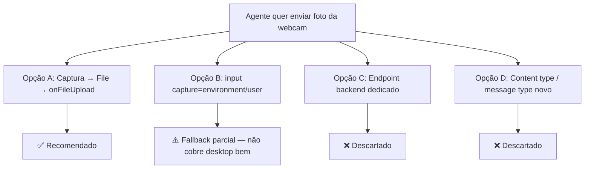
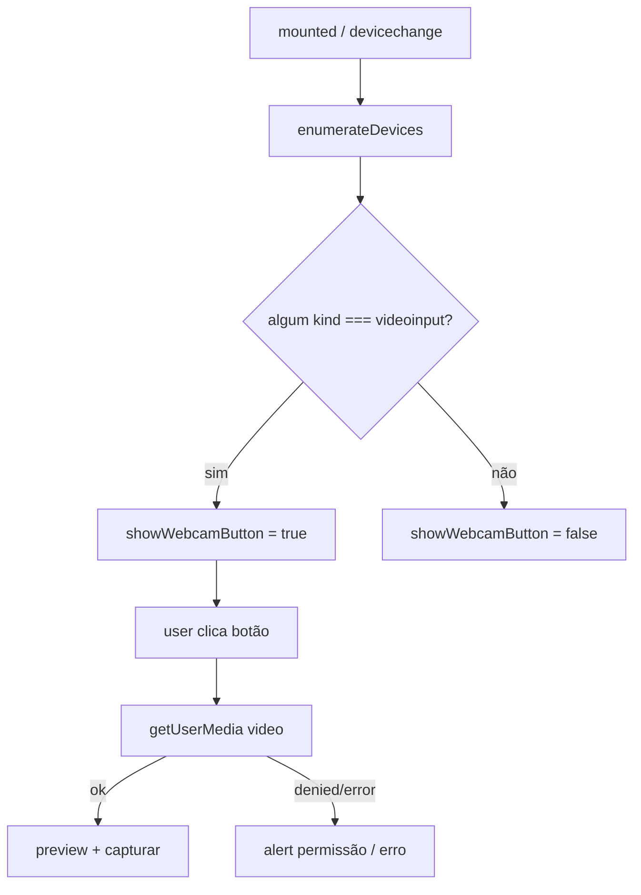

# Webcam Photo Capture — Árvore de Decisão

Comparação de abordagens para **tirar foto pela webcam e enviar no chat**.

**Atualizado jul/2026** — decisões de produto/técnicas fechadas para o MVP.

---

## Pergunta central

> Como o agente captura uma foto da webcam e envia como mensagem na conversa?

---

## Opções avaliadas

### Opção A — Captura MediaStream → `File` → pipeline de anexo (RECOMENDADA)

**Ideia:** Dialog com `<video>` + `getUserMedia`, capturar frame no canvas, gerar `File` JPEG, chamar `onFileUpload` como paperclip/áudio.

| Prós | Contras |
|------|---------|
| Zero backend | Precisa UI de preview/permissão |
| Reusa DirectUpload, preview, limites de canal | Só funciona com HTTPS/localhost |
| Espelha `AudioRecorder` | Cleanup de stream obrigatório |
| Merge-safe (poucos hooks FORK) | Detecção de device tem nuances de permission |

**Veredito:** ✅ única opção completa para desktop no MVP.

---

### Opção B — `<input type="file" accept="image/*" capture="user">`

**Ideia:** Abrir seletor nativo com hint de câmera.

| Prós | Contras |
|------|---------|
| Pouquíssimo código | Em desktop costuma abrir file picker, não webcam |
| Bom em mobile | Sem preview controlado no app |
| | Não atende o requisito “abrir webcam” do print |

**Veredito:** ❌ MVP desktop. Pode ser follow-up mobile se necessário.

---

### Opção C — Endpoint backend para upload de “webcam photo”

**Veredito:** ❌ descartado — attachment já cobre.

### Opção D — Novo `content_type` / message type

**Veredito:** ❌ descartado — imagem já é attachment padrão.

---

## Decisões de produto

| # | Pergunta | Decisão | Motivo |
|---|----------|---------|--------|
| 1 | Quando mostrar o botão? | Só se existir `videoinput` **e** `showFileUpload` (ou note) | Evita botão morto e canais sem imagem |
| 2 | Quando pedir permissão? | No clique (abrir dialog) | Listagem sem prompt; UX menos agressiva |
| 3 | Enviar automático ao capturar? | Não — capturar → confirmar → anexar | Evita envio acidental; usuário ainda clica Enviar |
| 4 | Formato da imagem? | `image/jpeg` (qualidade ~0.92) | Menor que PNG, aceito na maioria dos canais |
| 5 | Feature flag? | Não no MVP | Feature local/UI; igual share contact |
| 6 | i18n pt_BR na 1ª entrega? | **Sim** — en + pt_BR | Mesmo padrão Share Contact neste fork; UI do agente já em pt |
| 7 | Troca de câmera (front/back)? | Não no MVP | Happy path: device default |
| 8 | Vídeo / gravação? | Fora de escopo | Só foto estática |
| 9 | Durante gravação de áudio? | Esconder botão | Evita dois media flows |
| 10 | Resolução? | `ideal` 1280×720 | Reduz JPEG grande (TikTok 3 MB etc.) |

---

## Decisões técnicas

| # | Pergunta | Decisão |
|---|----------|---------|
| 1 | Onde vive a lógica? | Composable(s) — thin components |
| 2 | Onde vive a UI? | `widgets/conversation/WebcamCapture/` (como `ShareContact/`) |
| 3 | Overlay fork vs editar upstream? | Novos arquivos + `// FORK:` mínimo em BottomPanel/ReplyBox |
| 4 | `custom/` para JS? | **Não** — Share Contact e ReplyBox hooks ficam em `app/javascript/dashboard/...`; `custom/` é para providers |
| 5 | Ícone | `i-ph-camera` |
| 6 | Shell modal | `components-next/dialog/Dialog.vue` |
| 7 | Detecção | `enumerateDevices` + `devicechange`; ownership só no `ReplyBox.setup()` |
| 8 | Secure context | Se `!window.isSecureContext` ou sem `mediaDevices`, botão oculto |
| 9 | Footer do Dialog | Cancel + Use photo; Capture/Retake no corpo |

---

## Detecção de webcam — nuances

**Importante:**

- Antes da permissão, `label` pode ser `""`, mas a entrada `videoinput` ainda aparece na maioria dos browsers se houver hardware.
- Não chamar `getUserMedia` só para “descobrir” se existe câmera (pede permissão cedo demais).
- Após negar permissão, manter botão visível ou esconder na sessão — **MVP: manter visível + alert no clique**.

---

## Alinhamento com rules do projeto

| Rule | Como aplicamos |
|------|----------------|
| `fork-workflow` | Novos arquivos + hooks mínimos `FORK:`; não copiar classes upstream |
| `architecture` | Lógica em composable; transport (Vue) só wiring |
| `vue-frontend` | `<script setup>`, Tailwind only, i18n, sem CSS scoped novo |
| `chatwoot-core` | MVP happy path; sem specs a menos que pedido; só locale `en` |
| Anti-god-component | Não inchir `ReplyBox` — dialog + composable separados |

---

## Veredito final

**Opção A** com Dialog de captura, detecção via `enumerateDevices`, e reuso total do pipeline de anexo. Espelhar o FORK de Share Contact na toolbar.
