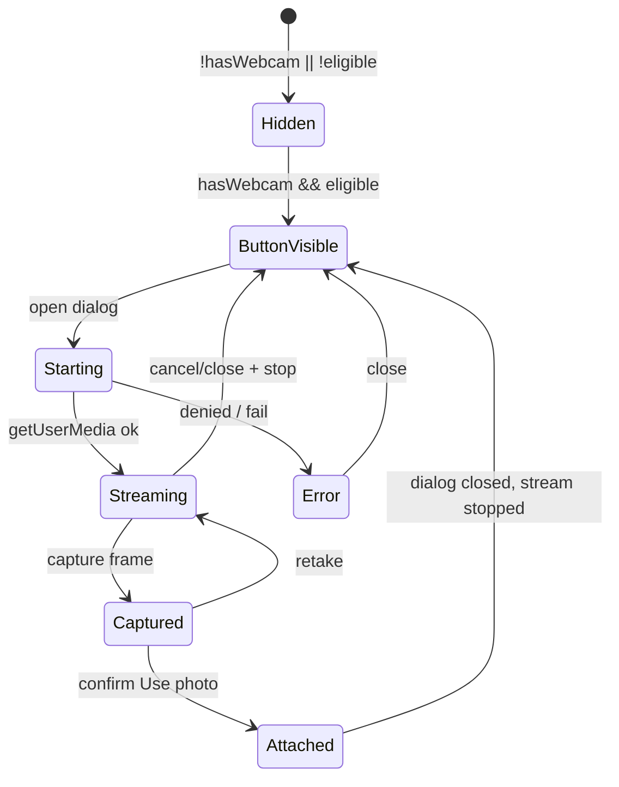

# Webcam Photo Capture — Melhorias e Follow-ups

Itens identificados na revisão do plano (jul/2026). Os marcados como **MVP** devem entrar na primeira entrega, não ficar só no backlog.

---

## Legenda de prioridade

| Tag | Significado |
|-----|-------------|
| **MVP** | Incluir na primeira implementação |
| **P1** | Logo após MVP estável |
| **P2** | Backlog / valor incremental |

---

## MVP — obrigatório na primeira entrega

### MVP-1 · Fechar path dos arquivos (sem ambiguidade `custom/`)

**Problema:** O plano deixa “dashboard **ou** `custom/`” em aberto. Isso atrasa implementação e gera divergência com Share Contact.

**Decisão:** Espelhar Share Contact (feature irmã no mesmo painel):

| Artefato | Path |
|----------|------|
| UI | `app/javascript/dashboard/components/widgets/conversation/WebcamCapture/` |
| Composables | `app/javascript/dashboard/composables/useWebcamAvailability.js` + `useWebcamCapture.js` |
| Hooks | `// FORK:` em `ReplyBottomPanel.vue` + `ReplyBox.vue` |
| i18n | `locale/en/conversation.json` (+ pt_BR se MVP-2) |

`custom/app/javascript/` fica para features de provider (Wavoip, Evolution). Webcam é UX do ReplyBox — mesmo lugar que `ShareContact/`.

**Arquivos de doc:** [implementation-plan.md](./implementation-plan.md), [implementation-decision-tree.md](./implementation-decision-tree.md), [ui-design.md](./ui-design.md)

---

### MVP-2 · i18n `pt_BR` na mesma entrega

**Problema:** O plano diz só `en`, mas Share Contact entregou **en + pt_BR**, e a UI do ambiente (prints) está em português. Agentes veriam tooltip/modal em inglês no meio do ReplyBox traduzido.

**Decisão:** Incluir `pt_BR/conversation.json` no MVP (mesmo critério do Share Contact). A rule “só inglês” continua válida para locales comunitários; pt_BR já é mantido neste fork para features próprias.

**Arquivos:** `en/conversation.json`, `pt_BR/conversation.json`

---

### MVP-3 · Integrar `useWebcamAvailability` no `setup()` existente do ReplyBox

**Problema:** O plano fala vagamente em “via setup ou data”. `ReplyBox.vue` já tem `setup()` Options API que retorna composables (`useUISettings`, `useCopilotReply`).

**Solução:**

```js
// ReplyBox.vue setup() — FORK: webcam photo capture
const { hasWebcam } = useWebcamAvailability();
return {
  // ...existing
  hasWebcam,
};
```

Computed Options API usa `this.hasWebcam` (ref auto-unwrap no template/computed do Options API quando retornado do setup — validar; se necessário `this.hasWebcam` como ref `.value` não aplica em computed Options se unwrap funcionar).

**Não** duplicar listener em `ReplyBottomPanel` — só `ReplyBox` decide `showWebcamButton`.

**Corrigir diagrama** em ui-design: remover `RBP --> C1`.

---

### MVP-4 · Shape do `onFileUpload` + guard de captura

**Problema:** `DirectUpload` / mixin esperam objeto com `.file` aninhado (`file.file`). O esboço está certo, mas falta:

1. Guard se `toBlob` retornar `null`
2. Esperar `video.videoWidth/Height > 0` (evento `loadedmetadata`) antes de permitir Capture
3. Nome de arquivo com `getUuid()` (padrão `AudioRecorder`), não só `Date.now()`

```js
const file = new File([blob], `webcam-${getUuid()}.jpg`, {
  type: 'image/jpeg',
});
this.onFileUpload({ name: file.name, type: file.type, size: file.size, file });
```

---

### MVP-5 · Limitar resolução no `getUserMedia`

**Problema:** Webcam 4K gera JPEG grande; TikTok limita imagem a 3 MB; WhatsApp também tem teto. O upload alerta depois, mas UX ruim.

**Solução (MVP):** constraints ideais, sem UI de qualidade:

```js
navigator.mediaDevices.getUserMedia({
  audio: false,
  video: {
    facingMode: 'user',
    width: { ideal: 1280 },
    height: { ideal: 720 },
  },
});
```

---

### MVP-6 · Conflito com gravação de áudio / editor ocupado

**Problema:** Plano não esconde o botão durante `isRecordingAudio` (ou copilot ativo). Dois media flows ao mesmo tempo confundem e competem por atenção.

**Solução:**

```js
showWebcamButton() {
  if (this.isEditorDisabled || this.isRecordingAudio) return false;
  if (!this.hasWebcam) return false;
  return this.showFileUpload || this.isOnPrivateNote;
}
```

Opcional: também `!this.copilot.isActive.value` (baixo custo).

---

### MVP-7 · Contrato claro do Dialog (Capture vs Confirm)

**Problema:** Wireframe mistura “Capture” e “Use photo” sem dizer qual fica no footer do `Dialog.vue`.

**Decisão (espelhar Share Contact):**

| Ação | Onde |
|------|------|
| Cancel | Footer do `Dialog` (`showCancelButton`) |
| Use photo | Footer confirm — `disableConfirmButton` até haver `capturedFile` |
| Capture / Retake | Corpo (`WebcamCaptureView`) |

Fluxo `@confirm` do Dialog → `emit('capture', file)` → `close()` → `stopStream()`.

No `@close` / unmount: sempre `stopStream()`.

---

### MVP-8 · Ownership da detecção só no ReplyBox

**Problema:** Diagrama em ui-design liga availability ao BottomPanel e ao ReplyBox.

**Decisão:** BottomPanel é burro — só `showWebcamButton` prop + emit. Availability + dialog vivem no ReplyBox.

---

## Revisão pós-implementação (jul/2026)

| Item | Status |
|------|--------|
| MVP-1 path dashboard | ✅ |
| MVP-2 en + pt_BR | ✅ (+ RETRY) |
| MVP-3 setup() ReplyBox | ✅ |
| MVP-4 shape upload / uuid / guards | ✅ |
| MVP-5 constraints 1280×720 | ✅ (`facingMode: { ideal: 'user' }`) |
| MVP-6 hide during audio | ✅ |
| MVP-7 Dialog footer contract | ✅ |
| MVP-8 ownership ReplyBox | ✅ |
| Race: fechar durante getUserMedia | ✅ corrigido (`startGeneration`) |
| Retry no estado de erro | ✅ |
| Refresh devices pós-permissão | ✅ (`@devices-granted`) |

---

## P1 — logo após MVP

### P1-1 · Após permissão concedida, re-refresh devices

~~Chamar `refreshDevices()` depois de `getUserMedia` ok~~ — **feito** via `@devices-granted` → `refreshWebcamDevices`.

### P1-2 · `navigator.permissions.query({ name: 'camera' })`

Se `denied`, tooltip “permission denied” sem abrir dialog (progressive enhancement; API nem sempre disponível).

### P1-3 · Downscale no canvas se ainda > limite do canal

Antes do `toBlob`, se `width > 1920`, escalar mantendo aspect — reduz falha em TikTok/WhatsApp.

### P1-4 · Lazy mount do dialog

`v-if="webcamDialogMounted"` só após primeiro open — evita custo quando nunca usam câmera.

### P1-5 · Specs mínimos dos composables

Mock `enumerateDevices` / `getUserMedia` / `toBlob` — só se o time pedir testes.

---

## P2 — backlog

| ID | Item |
|----|------|
| P2-1 | Seletor de câmera quando `videoinput.length > 1` |
| P2-2 | Preview espelhado (CSS) com JPEG não espelhado — decisão explícita de produto |
| P2-3 | Atalho de teclado |
| P2-4 | Feature flag de rollout |
| P2-5 | Fallback mobile com `<input capture="user">` |
| P2-6 | Gravação de vídeo curta |

---

## Matriz de teste — gaps a adicionar ao plano

| # | Caso | Esperado |
|---|------|----------|
| 12 | Página em HTTP (não secure) | Botão oculto |
| 13 | Durante `isRecordingAudio` | Botão oculto |
| 14 | Capture antes de video ready | Botão Capture disabled |
| 15 | Webcam 4K | JPEG razoável (constraints 1280×720) |
| 16 | Fechar pelo X / click outside / Cancel | LED apaga |
| 17 | Locale pt_BR | Tooltip/modal traduzidos |

---

## Diagrama de estados (MVP)



---

## Resumo executivo da revisão

| Severidade | Qtd | Ação |
|------------|-----|------|
| MVP (corrigir plano antes/durante code) | 8 | Incorporar nas docs / implementação |
| P1 | 5 | Pós-MVP imediato |
| P2 | 6 | Backlog |

**Não muda o veredito:** Opção A (File → `onFileUpload`) continua correta. As melhorias fecham ambiguidade de path, i18n, guards de UX e robustez da captura.

---

*Última atualização: jul/2026*
