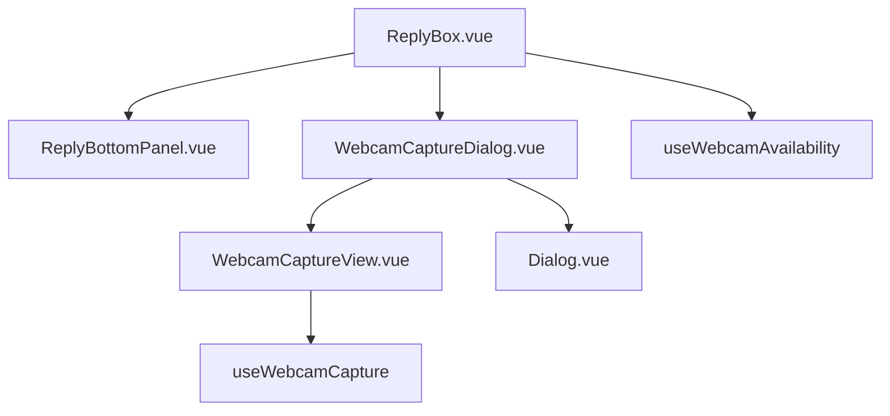

# Webcam Photo Capture — UI Design

Especificação visual e de componentes, alinhada aos padrões do dashboard e ao FORK de Share Contact.

---

## Princípios

- **Tailwind only** — sem CSS custom, sem scoped CSS, sem inline styles
- **Composition API** + `<script setup>`
- **components-next** para primitivos (`Button`, `Dialog`)
- **widgets/conversation/** para feature acoplada ao `ReplyBox`
- **i18n** — nenhuma string bare no template
- Ícones do **ReplyBottomPanel**: família **Phosphor** (`i-ph-*`)

---

## Referências visuais no projeto

| Padrão | Arquivo | O que reutilizar |
|--------|---------|------------------|
| Botão na barra | `ReplyBottomPanel.vue` | `NextButton` `slate` `faded` `sm` + `v-tooltip.top-end` |
| Share contact (FORK) | mesmo painel + `ShareContact/` | Prop `show*`, emit, Dialog no `ReplyBox` |
| Modal | `components-next/dialog/Dialog.vue` | Shell, footer confirm/cancel |
| Áudio → File | `AudioRecorder.vue` | Resultado vira `File` → `onFileUpload` |
| Preview anexo | `AttachmentsPreview.vue` | Já mostra thumb da imagem anexada |

---

## Arquitetura de componentes



**Ownership:** `useWebcamAvailability` só no `ReplyBox.setup()`. BottomPanel recebe `showWebcamButton` pronto.

### Arquivos novos (propostos)

| Arquivo | Responsabilidade |
|---------|------------------|
| `dashboard/composables/useWebcamAvailability.js` | `hasWebcam`, refresh, `devicechange` |
| `dashboard/composables/useWebcamCapture.js` | start/stop stream, capture frame → `File` |
| `widgets/conversation/WebcamCapture/WebcamCaptureDialog.vue` | Dialog open/close, emite `capture(file)` |
| `widgets/conversation/WebcamCapture/WebcamCaptureView.vue` | `<video>` + estados loading/error/preview |

**Não criar** bubble novo — a foto vira attachment de imagem padrão.

---

## ReplyBottomPanel — botão

Inserir **após** share contact (ou após paperclip se share contact oculto), **antes** do microfone:

```vue
<!-- FORK: webcam photo capture -->
<NextButton
  v-if="showWebcamButton"
  v-tooltip.top-end="$t('CONVERSATION.WEBCAM_CAPTURE.TOOLTIP')"
  icon="i-ph-camera"
  slate
  faded
  sm
  @click="$emit('openWebcamCapture')"
/>
```

### Props / emits

| Nome | Tipo | Origem |
|------|------|--------|
| `showWebcamButton` | Boolean | `ReplyBox` (hasWebcam && eligible && !disabled && !recordingAudio) |
| `openWebcamCapture` | emit | `ReplyBox` abre o dialog |

---

## Dialog — wireframe

```
┌─────────────────────────────────────────┐
|  Take a photo                        ✕  |
|  Capture an image from your webcam      |
|                                         |
|  ┌───────────────────────────────────┐  |
|  |                                   |  |
|  |         <video> preview           |  |
|  |      or captured             |  |
|  |                                   |  |
|  └───────────────────────────────────┘  |
|                                         |
|  [Retake]              [Use photo]      |
|  (só após captura)     (confirm)        |
└─────────────────────────────────────────┘
```

### Estados da view

| Estado | UI |
|--------|----|
| `idle` / starting | Skeleton ou spinner + “Starting camera…” |
| `streaming` | `<video autoplay playsinline muted>` + botão principal “Capture” |
| `captured` | `` do frame + “Retake” + confirm do Dialog “Use photo” |
| `error` | Mensagem i18n (permissão / sem device / genérico) + fechar |

### Comportamento

1. `open()` → `getUserMedia({ audio: false, video: { facingMode: 'user', width: { ideal: 1280 }, height: { ideal: 720 } } })`
2. Bind stream no `<video>`; Capture **disabled** até `loadedmetadata` / `videoWidth > 0`
3. **Capture** (corpo) → `canvas.drawImage(video)` → `toBlob('image/jpeg', 0.92)` → `File` (`webcam-${uuid}.jpg`); se blob `null`, erro genérico
4. Mostra preview estático; **parar tracks** ao capturar (apaga LED) — Retake reinicia stream
5. **Use photo** (footer confirm) → emit `capture(file)` → `ReplyBox` → `onFileUpload({ name, type, size, file })`
6. **Retake** (corpo) → limpa `capturedFile`, reinicia stream
7. **Close / Cancel / unmount** → `stopStream()` sempre

### Dialog API (espelhar ShareContact)

```js
const dialogRef = ref(null);
const open = () => dialogRef.value?.open();
defineExpose({ open });
```

| Ação | Onde |
|------|------|
| Cancel | Footer `Dialog` → close + stop stream |
| Use photo | Footer confirm — `disableConfirmButton` até `capturedFile` |
| Capture / Retake | Corpo `WebcamCaptureView` |

---

## ReplyBox — wiring

```js
// FORK: webcam photo capture
showWebcamButton() {
  if (this.isEditorDisabled || this.isRecordingAudio) return false;
  if (!this.hasWebcam) return false;
  return this.showFileUpload || this.isOnPrivateNote;
},
openWebcamCaptureDialog() {
  this.$refs.webcamCaptureDialog?.open();
},
onWebcamPhotoCaptured(file) {
  // mesmo shape do paste / audio
  this.onFileUpload({
    name: file.name,
    type: file.type,
    size: file.size,
    file,
  });
},
```

Template:

```vue
<!-- FORK: webcam photo capture -->
<WebcamCaptureDialog
  ref="webcamCaptureDialog"
  @capture="onWebcamPhotoCaptured"
/>
```

---

## i18n (`en` + `pt_BR`)

Arquivos:

- `app/javascript/dashboard/i18n/locale/en/conversation.json`
- `app/javascript/dashboard/i18n/locale/pt_BR/conversation.json`

```json
"WEBCAM_CAPTURE": {
  "TOOLTIP": "Take a photo",
  "MODAL": {
    "TITLE": "Take a photo",
    "DESCRIPTION": "Capture an image from your webcam to attach to this conversation.",
    "STARTING": "Starting camera…",
    "CAPTURE": "Capture",
        "RETAKE": "Retake",
        "RETRY": "Try again",
        "CONFIRM": "Use photo",
        "CANCEL": "Cancel"
  },
  "ERROR": {
    "PERMISSION": "Camera permission was denied. Allow access in the browser settings and try again.",
    "NOT_FOUND": "No camera was found on this device.",
    "GENERIC": "Could not open the camera. Please try again."
  }
}
```

`pt_BR` (espelho):

```json
"WEBCAM_CAPTURE": {
  "TOOLTIP": "Tirar uma foto",
  "MODAL": {
    "TITLE": "Tirar uma foto",
    "DESCRIPTION": "Capture uma imagem da webcam para anexar a esta conversa.",
    "STARTING": "Iniciando câmera…",
    "CAPTURE": "Capturar",
    "RETAKE": "Tirar de novo",
    "CONFIRM": "Usar foto",
    "CANCEL": "Cancelar"
  },
  "ERROR": {
    "PERMISSION": "A permissão da câmera foi negada. Autorize no navegador e tente de novo.",
    "NOT_FOUND": "Nenhuma câmera foi encontrada neste dispositivo.",
    "GENERIC": "Não foi possível abrir a câmera. Tente de novo."
  }
}
```

---

## Acessibilidade e UX

- Tooltip no botão da toolbar
- `playsinline` + `muted` no video (autoplay policies)
- Não espelhar horizontalmente por default em webcam “documental”; se espelhar no preview, **não** espelhar o JPEG final (ou documentar a escolha — MVP: preview espelhado opcional, arquivo sem mirror)
- Foco: ao abrir dialog, foco no botão Capture; ao capturar, no Confirm
- Não bloquear o editor enquanto o dialog está fechado

---

## Fora do escopo visual (MVP)

- Seletor de múltiplas câmeras
- Filtros / crop / anotações
- Flash / timer
- Gravação de vídeo
- Atalho de teclado dedicado
