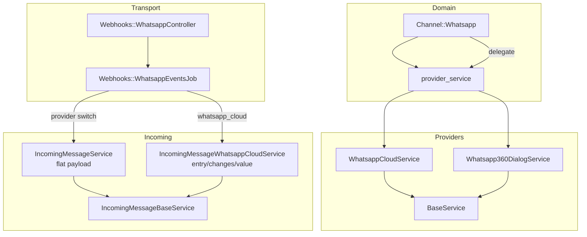

# Arquitetura atual do WhatsApp no Chatwoot

Como o Chatwoot abstrai (e onde não abstrai) providers WhatsApp hoje. Referências de código do fork em jun/2026.

**Status consolidado:** [STATUS.md](./STATUS.md)

---

## Estado fork (jun/2026) — overlay `custom/`

| Mecanismo | Provider | Estado |
|-----------|----------|--------|
| `PROVIDERS` + `# FORK:` | `evolution` | ✅ |
| `MessagingProvider::Registry` | `evolution` | ✅ |
| Prepend `provider_service` | `evolution` | ✅ |
| Prepend `WhatsappEventsJob` | `evolution` | ✅ |
| Prepend `MessageWindowService` | `evolution` | ✅ bypass 24h |
| Webhook `/webhooks/evolution/:instance_name` | `evolution` | ✅ |
| `evolution_go` | — | 📄 documentação apenas |

```29:33:app/models/channel/whatsapp.rb
  # FORK: evolution — Baileys gateway via Evolution API (custom/)
  PROVIDERS = %w[default whatsapp_cloud evolution].freeze
  validates :provider, inclusion: { in: PROVIDERS }
```

```14:18:custom/app/models/custom/channel/whatsapp.rb
  def provider_service
    service = MessagingProvider::Registry.resolve(provider, whatsapp_channel: self)
    return service if service
    super
  end
```

---

## Modelo upstream (referência OSS)

Corpo original no model — `default` e `whatsapp_cloud`; gateways usam prepend acima.

```66:71:app/models/channel/whatsapp.rb
  def provider_service
    if provider == 'whatsapp_cloud'
      Whatsapp::Providers::WhatsappCloudService.new(whatsapp_channel: self)
    else
      Whatsapp::Providers::Whatsapp360DialogService.new(whatsapp_channel: self)
    end
  end
```

| Campo / método | `default` | `whatsapp_cloud` | `evolution` (fork) |
|---|---|---|---|
| `provider_config` | `api_key` | Meta IDs + tokens | `base_url`, `api_key`, `instance_name`, … |
| Webhook | `/webhooks/whatsapp/:phone` | HMAC Meta | `/webhooks/evolution/:instance_name` |
| Chamadas | **false** | **true** (EE) | **false** |

**Nota:** 360dialog é BSP **oficial**. Serve como referência de segundo provider no mesmo STI.

---

## BaseService — contrato mínimo

```11:32:app/services/whatsapp/providers/base_service.rb
class Whatsapp::Providers::BaseService
  def send_message(_phone_number, _message); end
  def send_template(_phone_number, _template_info, _message); end
  def sync_template; end          # typo no comentário; implementação usa sync_templates
  def validate_provider_config; end
  def error_message; end
  # + helpers: process_response, create_button/list payloads
end
```

Implementações concretas também expõem `media_url`, `api_headers`; cloud adiciona CSAT template CRUD via `CsatTemplateService`.

---

## Diagrama — fluxo de providers e incoming



---

## Webhooks

- **Rota:** `POST/GET /webhooks/whatsapp/:phone_number` (`config/routes.rb`)
- **Controller:** `Webhooks::WhatsappController` — verificação Meta (`MetaTokenVerifyConcern`), assinatura HMAC só para `whatsapp_cloud`
- **Job:** `Webhooks::WhatsappEventsJob` — mutex por contato, echo `smb_message_echoes` (cloud), dispatch:

```79:86:app/jobs/webhooks/whatsapp_events_job.rb
  def handle_message_events(channel, params)
    case channel.provider
    when 'whatsapp_cloud'
      Whatsapp::IncomingMessageWhatsappCloudService.new(...).perform
    else
      Whatsapp::IncomingMessageService.new(...).perform
    end
  end
```

**Enterprise** (`enterprise/app/jobs/enterprise/webhooks/whatsapp_events_job.rb`): intercepta `field=calls` e `call_permission_reply` **antes** de mensagens — 100% formato Meta.

---

## Incoming messages

- **Base compartilhada:** `Whatsapp::IncomingMessageBaseService` — statuses, dedup Redis, contatos, mídia, reply context, unsupported
- **360dialog / flat payload:** `params` direto com `contacts` + `messages` (ver spec)
- **Cloud / nested:** `params[:entry][0][:changes][0][:value]` via `IncomingMessageWhatsappCloudService`
- Download de mídia: 360dialog usa URL direta; cloud faz GET intermediário na Graph API

---

## Envio

- `Whatsapp::SendOnWhatsappService` → `channel.send_message` / `channel.send_template`
- Janela 24h: `Conversations::MessageWindowService` força template fora da janela
- Campanhas one-off: **somente** `whatsapp_cloud` (`Whatsapp::OneoffCampaignService#validate_provider!`)

---

## Frontend — setup de inbox

| Componente | Função |
|---|---|
| `Whatsapp.vue` | Seleção: WhatsApp Cloud (embedded/manual) ou Twilio |
| `CloudWhatsapp.vue` | Manual: `provider: 'whatsapp_cloud'` + IDs Meta |
| `360DialogWhatsapp.vue` | Legado; acesso via `?provider=360dialog` (não no seletor principal) |
| `WhatsappEmbeddedSignup.vue` | OAuth Meta via `useWhatsappEmbeddedSignup` |
| `WhatsappCall.vue` / `whatsapp_call` | Canal separado no `ChannelFactory` — embedded signup + enable calling |
| `WhatsappCallingPage.vue` | Settings: enable/disable calling (só cloud) |

`inboxMixin.js`: `isAWhatsAppCloudChannel`, `is360DialogWhatsAppChannel`; voz via `getVoiceCallProvider()` → `'whatsapp'` se `voice_enabled`.

---

## 360dialog vs cloud — o que já existe vs cloud-only

| Área | default/360dialog | whatsapp_cloud |
|------|-------------------|----------------|
| Texto, mídia link, interativos | ✅ `Whatsapp360DialogService` | ✅ |
| Templates aprovados | ✅ sync `/configs/templates` + namespace | ✅ Graph sync |
| Status delivery | ✅ flat `statuses` | ✅ nested |
| Reply/context | Parcial (sem `whatsapp_reply_context` no 360) | ✅ |
| Voice messages (PTT) | ❌ | ✅ `voice: true` + content-type |
| Embedded signup | ❌ | ✅ |
| Campanhas | ❌ | ✅ |
| CSAT template API | ❌ | ✅ |
| Coexistence echoes | ❌ | ✅ |
| Chamadas | ❌ | ✅ Enterprise |

---

## Acoplamento Meta Cloud API (lista para novo provider)

| Feature | Arquivos-chave | Só cloud? |
|---|---|---|
| Graph API `/messages`, `/media` | `WhatsappCloudService` | Envio cloud |
| Templates WABA sync | `fetch_whatsapp_templates` → Graph | Sim |
| Embedded Signup | `EmbeddedSignupService`, `TokenExchangeService`, `FacebookApiClient` | Sim |
| Webhook WABA subscribe | `WebhookSetupService`, `FacebookApiClient#subscribe_waba_webhook` | Sim |
| Health / reauth | `HealthService`, `ReauthorizationService` | Sim |
| SMB message echoes | `WhatsappEventsJob#message_echo_event?` | Sim |
| Campanhas WhatsApp | `OneoffCampaignService` | Sim |
| CSAT templates auto | `CsatTemplateService` | Sim |
| Chamadas WebRTC | `Enterprise::Whatsapp::Providers::WhatsappCloudService`, `IncomingCallService` | Sim |
| Assinatura webhook | `Webhooks::WhatsappController#meta_signature_verification_required?` | Cloud / embedded |

---

## Extension points no fork (merge-safe)

O diretório `custom/` no fork já contém **`Custom::Whatsapp::Evolution::*`** (Evolution API Node, com fluxo principal de mensagens/operação implementado). **Evolution Go** (`evolution_go`) está documentado, mas ainda sem código — ver [evolution-go/coordination-with-evolution-api.md](./evolution-go/coordination-with-evolution-api.md).

| Mecanismo | Onde aplicar | Exemplo |
|-----------|--------------|---------|
| `custom/` overlay | Services, normalizers, Vue wizards | `Custom::Whatsapp::Providers::EvolutionService` |
| Prepend direto / `prepend_mod_with` | Model, jobs | `Channel::Whatsapp.prepend`, `Webhooks::WhatsappEventsJob.prepend_mod_with` |
| `# FORK:` mínimo | Constantes, imports UI | `PROVIDERS` (+ `evolution` hoje), import/card do provider em `Whatsapp.vue` |
| Registry (novo) | Dispatch provider | `MessagingProvider::Registry` em initializer `custom/` |

Hooks **já presentes** no upstream (usar, não duplicar):

```164:164:app/jobs/webhooks/whatsapp_events_job.rb
Webhooks::WhatsappEventsJob.prepend_mod_with('Webhooks::WhatsappEventsJob')
```

```233:233:app/services/whatsapp/providers/whatsapp_cloud_service.rb
Whatsapp::Providers::WhatsappCloudService.prepend_mod_with('Whatsapp::Providers::WhatsappCloudService')
```

Enterprise adiciona voz via prepend em `WhatsappCloudService` — referência para `CallProvider` no fork, não para mensagens gateway.

**Inventário de lacunas:** [gaps-and-blockers.md](./gaps-and-blockers.md).

---

## Recursos já implementados reutilizáveis

| Camada | Componente | Reuso para gateway |
|--------|------------|-------------------|
| Envio | `Whatsapp::SendOnWhatsappService` | ✅ após provider service |
| Incoming core | `IncomingMessageBaseService` | ✅ com payload normalizado |
| Incoming flat | `IncomingMessageService` | ✅ alvo do normalizer |
| Provider contract | `Whatsapp::Providers::BaseService` | ✅ herdar |
| Referência 2º provider | `Whatsapp360DialogService` | Padrão REST + flat webhook |
| Jobs | `SendReplyJob`, `TemplatesSyncSchedulerJob` | Parcial — sync só se gateway tiver templates |
| Contatos | `ContactInboxBuilder`, `IncomingMessageIdentifierHelper` | ✅ após normalizar phone/JID |
| Dedup | Redis mutex no job + `lock_message_source_id!` | ✅ |

---

## Conclusão

O padrão de provider existe para **envio** e validação, mas **recebimento** e features avançadas estão acoplados ao formato de payload (flat vs nested Meta) ou exclusivos do cloud. Um terceiro provider precisa de:

1. **Registry** ou prepend em `provider_service` para impedir fallback incorreto em 360dialog
2. **Normalizer** de webhook para entregar payload flat ao `IncomingMessageService`
3. **Bypass opcional** da janela 24h do Chatwoot quando o gateway não depender da regra Meta

Não editar `WhatsappCloudService` / `IncomingMessageWhatsappCloudService`. Ver [implementation-decision-tree.md](./implementation-decision-tree.md).
