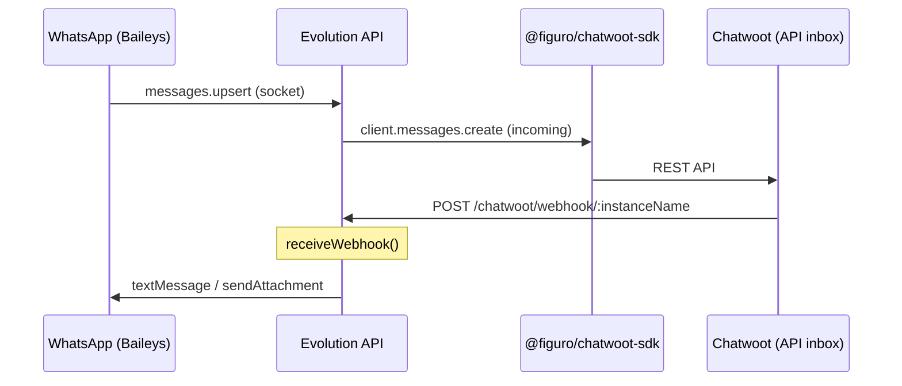

# Integração Evolution → Chatwoot (estado atual)

Como a Evolution API integra com o Chatwoot **hoje** — referência para entender o que **não** replicar e quais comportamentos **portar** para o provider nativo.

**Código-fonte:** `/root/evolution-api/src/api/integrations/chatbot/chatwoot/`

---

## Arquitetura atual



A Evolution é **cliente** do Chatwoot. O inbox criado é tipo **`api`**, não `Channel::Whatsapp`.

---

## Arquivos principais

| Arquivo | Linhas aprox. | Função |
|---------|---------------|--------|
| `services/chatwoot.service.ts` | ~2600 | Core: WA→CW e CW→WA |
| `controllers/chatwoot.controller.ts` | ~95 | Validação HTTP |
| `routes/chatwoot.router.ts` | ~45 | Rotas REST |
| `dto/chatwoot.dto.ts` | ~40 | Campos de configuração |
| `validate/chatwoot.schema.ts` | ~45 | JSON Schema |
| `utils/chatwoot-import-helper.ts` | — | Import contatos/mensagens |
| `libs/postgres.client.ts` | — | DB opcional para import |

**Hook Baileys:** `whatsapp.baileys.service.ts` chama `chatwootService.eventWhatsapp()` quando `CHATWOOT.ENABLED && localChatwoot?.enabled`.

---

## Rotas REST (Evolution)

Montadas em `/chatwoot` via `chatbot.router.ts`:

| Método | Rota | Handler |
|--------|------|---------|
| `POST` | `/chatwoot/set/:instanceName` | Salva config + opcional `autoCreate` |
| `GET` | `/chatwoot/find/:instanceName` | Lê config |
| `POST` | `/chatwoot/webhook/:instanceName` | **Recebe webhooks do Chatwoot** (outbound agente) |

Auth global Evolution: header `apikey`.

---

## Configuração (`ChatwootDto` / model Prisma `Chatwoot`)

Campos persistidos por instância Evolution — ver [provider-config-mapping.md](./provider-config-mapping.md) para mapeamento no inbox Chatwoot.

```typescript
// src/api/integrations/chatbot/chatwoot/dto/chatwoot.dto.ts
enabled?: boolean;
accountId?: string;      // conta Chatwoot — NÃO necessário no provider inverso
token?: string;          // token agente CW — NÃO necessário no provider inverso
url?: string;            // URL Chatwoot — NÃO necessário no provider inverso
nameInbox?: string;
signMsg?: boolean;
signDelimiter?: string;
number?: string;
reopenConversation?: boolean;
conversationPending?: boolean;
mergeBrazilContacts?: boolean;
importContacts?: boolean;
importMessages?: boolean;
daysLimitImportMessages?: number;
autoCreate?: boolean;
organization?: string;
logo?: string;
ignoreJids?: string[];
```

---

## Fluxo inbound (WhatsApp → Chatwoot)

1. Baileys recebe mensagem → `sendDataWebhook(MESSAGES_UPSERT)` (webhook genérico)
2. Se Chatwoot integration enabled → `chatwootService.eventWhatsapp('messages.upsert', ...)`
3. `eventWhatsapp()`:
   - Filtra `ignoreJids` (grupos `@g.us`, contatos `@s.whatsapp.net`, JIDs específicos)
   - Ignora `status@broadcast`
   - Extrai texto/mídia/reply
   - `createConversation()` via SDK (cache Redis, locks, reopen/pending)
   - `sendData()` → upload mídia + `client.messages.create`

**Identificadores:** suporta `addressingMode: 'lid'` — usa `remoteJidAlt` para phone quando LID.

---

## Fluxo outbound (Chatwoot → WhatsApp)

`receiveWebhook(instance, body)` processa payload **API channel** do Chatwoot:

| Campo webhook CW | Uso na Evolution |
|------------------|------------------|
| `body.content` | Texto (com conversão markdown `*`/`_`/`~`) |
| `body.message_type === 'outgoing'` | Dispara envio |
| `body.conversation.meta.sender.identifier` | Número destino (`chatId`) |
| `body.attachments` | `sendAttachment()` |
| `signMsg` + `signDelimiter` | Prefixa `*NomeAgente:*` |
| `body.content_attributes.deleted` | Apaga msg no WA |
| `source_id` prefix `WAID:` | Evita loop em echo |

Envio: `waInstance.textMessage({ number, text, quoted, delay })` ou mídia.

---

## Setup automático (`autoCreate` + `initInstanceChatwoot`)

Quando `autoCreate: true`:

1. Cria inbox Chatwoot `type: 'api'` com `webhook_url: {SERVER}/chatwoot/webhook/{instanceName}`
2. Cria contato bot `123456` (se `CHATWOOT.BOT_CONTACT`)
3. Envia mensagem `init` ou `init:{number}` para fluxo QR

**Comandos bot** (contato `123456`, outgoing):

| Comando | Ação |
|---------|------|
| `init` / `iniciar` | Conecta WhatsApp (QR) |
| `init:{number}` | Conecta com número |
| `status` | Estado da conexão |
| `disconnect` / `desconectar` | Logout |
| `clearcache` | Limpa cache Chatwoot |

No provider nativo: substituir por UI no wizard/settings do inbox (polling `connectionState` + `QRCODE_UPDATED`).

---

## Settings de instância (separados do Chatwoot)

Model `Setting` em Prisma — aplicados no Baileys, não no `ChatwootDto`:

| Campo | Efeito |
|-------|--------|
| `groupsIgnore` | Ignora grupos no socket **antes** de qualquer integração |
| `rejectCall` / `msgCall` | Rejeita chamadas |
| `alwaysOnline` | Presença online |
| `readMessages` | Marca como lida no WA |
| `readStatus` | Lê status |
| `syncFullHistory` | Histórico completo |

`groupsIgnore` ≠ `ignoreJids`: o primeiro é setting Baileys; o segundo filtra no `eventWhatsapp`.

---

## O que portar vs descartar

| Comportamento atual | Provider nativo |
|---------------------|-----------------|
| SDK Chatwoot (`@figuro/chatwoot-sdk`) | **Descartar** — Chatwoot é o servidor |
| Inbox tipo `api` | **Descartar** — usar `Channel::Whatsapp` |
| `receiveWebhook` (CW→EV) | **Descartar** — `EvolutionService#send_message` |
| `eventWhatsapp` (WA→CW via SDK) | **Substituir** — webhook Evolution → normalizer → `IncomingMessageService` |
| `signMsg` / `signDelimiter` | **Portar** — no `EvolutionService` antes de `sendText` |
| `reopenConversation` / `conversationPending` | **Portar** — lógica no Chatwoot (conversas) |
| `ignoreJids` | **Portar** — filtro no normalizer |
| `mergeBrazilContacts` | **Portar** — `ContactInboxBuilder` / normalizer phone |
| `importContacts` / `importMessages` | **Fase posterior** — APIs `findContacts` / `findMessages` |
| Bot `123456` + comandos | **Substituir** — UI conexão no inbox |
| Integração Chatwoot na Evolution | **Manter desabilitada** quando usar provider nativo |
