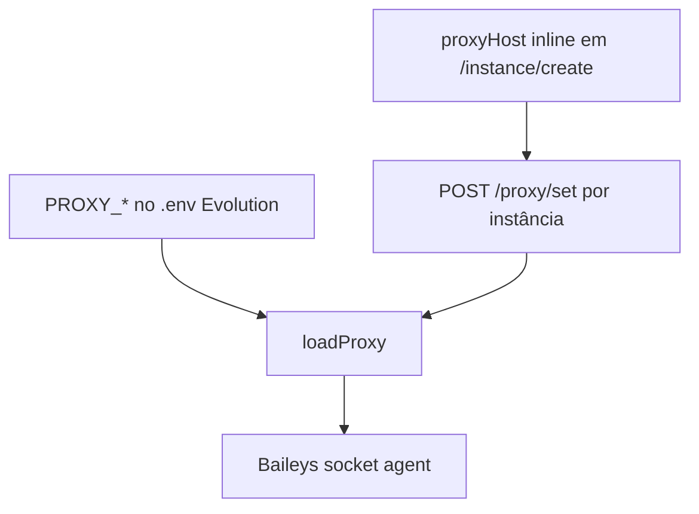

# Análise da implementação Evolution → Chatwoot

Leitura detalhada do código em `/root/evolution-api/src/api/integrations/chatbot/chatwoot/` — pontos de comportamento **não cobertos** ou **incompletos** na documentação anterior.

**Arquivo central:** `services/chatwoot.service.ts` (~2635 linhas)  
**Hook Baileys:** `whatsapp.baileys.service.ts`  
**Import:** `utils/chatwoot-import-helper.ts`  
**Versão local analisada:** Evolution API **2.3.6** (`/root/evolution-api`) — validar paridade com o servidor de produção antes de implementar.

---

## 1. Arquitetura real — duas pontes

A integração não é só webhook bidirecional. São **três canais** de comunicação:

```mermaid
flowchart TB
  WA[Baileys socket]
  EV[Evolution API]
  CW_API[Chatwoot REST API]
  CW_WH[Chatwoot webhook → Evolution]
  CW_PG[(PostgreSQL Chatwoot)]

  WA -->|eventWhatsapp| EV
  EV -->|@figuro/chatwoot-sdk| CW_API
  CW_WH -->|receiveWebhook| EV
  EV -->|chatwoot-import-helper| CW_PG
```

| Canal | Quando | Dependência |
|-------|--------|-------------|
| SDK REST | Toda mensagem/contato/conversa normal | `accountId`, `token`, `url` |
| Webhook CW→EV | Agente envia mensagem | Inbox tipo `api` |
| **SQL direto no Postgres CW** | Import histórico, labels, sync lost messages | `CHATWOOT_IMPORT_DATABASE_CONNECTION_URI` |

**Impacto no provider nativo:** import em massa e `syncLostMessages` **não replicam** só com API REST — a Evolution contorna limites do SDK escrevendo direto no banco Chatwoot. No fork: usar APIs públicas ou job dedicado; não assumir paridade sem implementar equivalente.

---

## 2. Identificadores e `source_id`

### Prefixo `WAID:`

Toda mensagem **inbound** criada no Chatwoot usa:

```
source_id = "WAID:" + body.key.id
```

Ex.: `WAID:3EB0XXXX`

### Loop prevention (outbound)

No `receiveWebhook`, antes de enviar ao WhatsApp:

```typescript
if (
  body.conversation.messages[0].source_id?.substring(0, 5) === 'WAID:' &&
  body.conversation.messages[0].id === body.id
) {
  return { message: 'bot' }; // não reenvia echo do inbound
}
```

**Provider nativo Chatwoot:** com `Channel::Whatsapp`, o `source_id` segue formato próprio (não `WAID:`). O loop é evitado pelo pipeline normal de outbound. Documentar que **não** usar prefixo `WAID:` no provider — era artefato da integração API channel.

### Mapeamento WA ↔ CW para reply/delete

Evolution persiste na **própria** tabela `Message` (Prisma):

- `chatwootMessageId`, `chatwootConversationId`, `chatwootInboxId`, `key` (JSON Baileys)

Usado em: `getQuotedMessage`, delete sync, `getReplyToIds`, `messages.read`.

**Provider nativo:** usar `message.source_id` do Chatwoot (= `key.id`) + tabela `messages` existente — **sem** tabela bridge Evolution.

---

## 3. Conversão de formatação (markdown)

### Inbound WA → Chatwoot (`eventWhatsapp`)

```typescript
bodyMessage
  .replaceAll(/\*((?!\s)([^\n*]+?)(?<!\s))\*/g, '**$1**')   // * → **
  .replaceAll(/_((?!\s)([^\n_]+?)(?<!\s))_/g, '*$1*')       // _ → *
  .replaceAll(/~((?!\s)([^\n~]+?)(?<!\s))~/g, '~~$1~~')     // ~ → ~~
```

### Outbound CW → WA (`receiveWebhook`)

Inverso:

```typescript
// * → _ , ** → * , ~~ → ~ , ` → ```
```

**Regra inbox:** `convert_markdown_outbound: true` — implementar **ambas** direções no normalizer (in) e `EvolutionService` (out).

---

## 4. Envio outbound — detalhes não documentados

| Comportamento | Código | Campo inbox sugerido |
|---------------|--------|----------------------|
| Delay aleatório 500–2000 ms antes de `sendText` | `receiveWebhook` ~1480 | `send_random_delay: true` |
| `textMessage(data, true)` — flag `isIntegration` | ~1488 | Sempre `true` no provider — evita re-entrada Chatwoot no Baileys |
| Templates CW (`message_type === 'template'`) | ~1563 | `send_templates_as_text` — já documentado |
| Newlines em template: `\\\r\n` → `\n` | ~1566 | Idem |
| Múltiplos attachments = loop por attachment | ~1441 | Suportar N anexos por mensagem CW |
| Áudio: `sendAttachment` usa `SendAudioDto` separado | ~1198 | Fase 2 — endpoint áudio Evolution |

### Erros de envio (`onSendMessageError`)

Cria mensagem **privada** na conversa CW:

| Erro | Mensagem |
|------|----------|
| HTTP 400 + `exists: false` | "número não está no WhatsApp" (i18n) |
| Outros | "mensagem não enviada" + erro |

**Regra inbox:** `notify_send_errors_private: true` — portar para o fork (nota privada ao falhar envio).

---

## 5. `createConversation` — lógica complexa

### Locks e cache (Redis)

| Chave | TTL | Uso |
|-------|-----|-----|
| `{instance}:createConversation-{remoteJid}` | 8h | Cache conversationId |
| `{instance}:lock:createConversation-{remoteJid}` | 30s | Mutex criação |

- Polling lock: 300 ms interval, timeout 5 s
- Double-check após adquirir lock

**Provider nativo:** Chatwoot já tem `ContactInboxBuilder` + mutex Redis em `IncomingMessageBaseService` — **não** portar locks Evolution; confiar no pipeline CW.

### Grupos (`@g.us`)

1. Busca `groupMetadata` → nome `"{subject} (GROUP)"`
2. Cria/atualiza **participante** como contato separado (JID participant)
3. Contato da **conversa** = JID do grupo (`isGroup: true`, `identifier: groupJid`)
4. Mensagem inbound de grupo — prefixo no texto:

```
**+55 (11) 9999-9999 - NomeParticipante:**

Corpo da mensagem
```

**Regra inbox:** se `groups_ignore: false`, suportar:
- `format_group_messages: true` — prefixo participante
- Contato grupo vs participante — decisão de produto (CW usa 1 conversa por contato)

### Sync contato

- Atualiza avatar se filename WA ≠ filename CW
- Atualiza nome se vazio ou igual ao chatId
- Variantes +55 para match de nome

### LID (`addressingMode: 'lid'`)

- Phone: `remoteJidAlt` quando não grupo
- Atualiza `contact.identifier` se diverge de `remoteJid`
- Merge contatos se update falha

**Provider nativo:** crítico no normalizer — já mencionado, reforçar testes LID.

---

## 6. Tipos de mensagem inbound — além de texto

`getTypeMessage` + `getMessageContent` convertem para **texto formatado** no Chatwoot:

| Tipo Baileys | Tratamento |
|--------------|------------|
| `conversation`, `extendedTextMessage` | Texto puro |
| `imageMessage`, `videoMessage`, `documentMessage` | Caption + mídia via `sendData` |
| `audioMessage` | Mídia (caption vazio) |
| `stickerMessage` | Mídia |
| `viewOnceMessageV2` | Extrai sub-mídia |
| `locationMessage`, `liveLocationMessage` | Texto + link Google Maps |
| `contactMessage`, `contactsArrayMessage` | vCard formatado |
| `listMessage` | Menu lista em markdown |
| `listResponseMessage` | Resposta de lista |
| `reactionMessage` | Mensagem com `contextInfo.stanzaId` |
| `externalAdReply` (ads) | Thumbnail 320×180 + título + body + URL |
| Ephemeral | Unwrap `ephemeralMessage.message` |

**Não documentado antes:** ads, listas, list response, view once, reações.

**Provider nativo:** Fase 2–3 no normalizer — MVP pode placeholder `unsupported` para tipos complexos.

---

## 7. Eventos WhatsApp além de `messages.upsert`

| Evento | Comportamento Evolution | Fase fork |
|--------|-------------------------|-----------|
| `messages.delete` | Deleta msg no CW se `MESSAGE_DELETE` env | 3 |
| `messages.edit` / `send.message.update` | **Nova** msg CW com prefixo "Mensagem editada:" — não edita original | 3 |
| `messages.read` | `POST .../update_last_seen` API pública CW | 3 |
| `connection.update` + `open` | Bot msg "conectado"; throttle 30 s | 1 (UI, não bot) |
| `qrcode.updated` | Imagem QR + pairing code `XXXX-XXXX` | 1 |
| `qrcode.updated` status 500 | Msg erro limite QR | 1 |
| `status.instance` | Bot msg com status instância | 2 |

### QR / Pairing code

```typescript
if (body?.qrcode?.pairingCode) {
  msgQrCode += `*Pairing Code:* ${code.substring(0,4)}-${code.substring(4,8)}`;
}
```

**UI inbox:** exibir pairing code além do QR — não estava na doc.

---

## 8. Bot contato `123456`

Requer `CHATWOOT.BOT_CONTACT=true` (env Evolution).

| Função | Detalhe |
|--------|---------|
| Contato fixo `123456` | Comandos operacionais |
| `init` / `init:{number}` | Conecta WA |
| `status`, `disconnect`, `clearcache` | Ops |
| QR enviado como **imagem** no bot (`createBotQr`) | Não só texto |
| Mensagens de sistema via `createBotMessage` | i18n |

**Provider nativo:** substituir por painel Conexão no settings — sem bot `123456`.

---

## 9. Labels / tags automáticas

`addLabelToContact(nameInbox, contactId)` — SQL direto no Postgres CW:

- Cria tag com nome do inbox (`nameInbox`)
- Associa ao contato (`taggings`)

Requer `CHATWOOT_IMPORT_DATABASE_CONNECTION_URI`.

**Não documentado.** Provider nativo: opcional via API labels CW ou feature omitida.

---

## 10. Import histórico — requisito Postgres

`isImportHistoryAvailable()` exige URI real:

```
CHATWOOT_IMPORT_DATABASE_CONNECTION_URI
```

### Fluxo import

1. `importContacts` → SQL bulk insert + labels
2. `importMessages` → buffer em memória → `importHistoryMessages` → SQL insert messages
3. `daysLimitImportMessages` filtra por data
4. `ignoreJids` aplicado no import
5. `isIgnorePhoneNumber`: grupos, `status@broadcast`, `0@s.whatsapp.net`
6. Após import: `updateContactAvatarInRecentConversations` (100 contatos)

### Defaults na criação instância **com** Chatwoot (`instance.controller.ts`)

| Campo | Default API create | Default UI Evolution |
|-------|-------------------|---------------------|
| `importContacts` | **true** | false |
| `importMessages` | **true** | false |
| `daysLimitImportMessages` | **60** | 7 |
| `autoCreate` | **true** | false |
| `mergeBrazilContacts` | false | false |

**Discrepância:** API create ≠ UI manager.

**Provider nativo:** import Fase 4 — provavelmente via API CW (mais lento), não SQL direto.

---

## 11. `syncLostMessages` — cron recuperação

Após conexão (`syncChatwootLostMessages` no Baileys):

- Cron: `0,30 * * * *` (a cada 30 min)
- Busca msgs CW últimas **6h** com `source_id` WAID
- Compara com Evolution DB — envia faltantes
- Requer Postgres CW + `DATABASE.SAVE_DATA.MESSAGE_UPDATE`

**Não documentado.** Provider nativo: considerar job reconciliação webhook falhos (opcional).

---

## 12. Variáveis de ambiente Evolution (globais)

Não são por instância — ficam no servidor Evolution:

| Env | Default | Efeito |
|-----|---------|--------|
| `CHATWOOT_ENABLED` | false | Master switch integração |
| `CHATWOOT_MESSAGE_READ` | false | Marca lida WA ao agente responder |
| `CHATWOOT_MESSAGE_DELETE` | false | Sync delete WA↔CW |
| `CHATWOOT_BOT_CONTACT` | **true** | Bot 123456 |
| `CHATWOOT_IMPORT_DATABASE_CONNECTION_URI` | — | SQL direto CW |
| `CHATWOOT_IMPORT_PLACEHOLDER_MEDIA_MESSAGE` | false | Placeholder mídia no import |

**Provider nativo:** equivalentes viram campos `provider_config` por inbox (já parcialmente documentado em `mark_read_on_reply`, `sync_delete_to_whatsapp`).

---

## 13. `findContact` — busca inteligente

- Individual: `POST /contacts/filter` com payload multi-variante (`getNumbers`, `getFilterPayload`)
- Grupo: `contacts.search` por identifier
- BR: `mergeBrazilContacts` — merge 13 vs 14 dígitos (+55)

`getNumbers` gera variantes com/sem 9º dígito para +55.

---

## 14. Reply threading — mecanismo

### Inbound → CW

1. `stanzaId` do `contextInfo`
2. Busca Evolution `Message` por `key.id` → `chatwootMessageId`
3. Seta `source_reply_id` + `content_attributes.in_reply_to`

### CW → WA

1. `content_attributes.in_reply_to` → busca Evolution Message → monta `Quoted` Baileys
2. Passa em `SendTextDto.quoted`

**Provider nativo:** usar `in_reply_to_external_id` nativo CW (= `key.id`) — sem tabela bridge se `source_id` = `key.id`.

---

## 15. Checklist — lacunas na documentação anterior

| # | Lacuna | Ação |
|---|--------|------|
| 1 | Prefixo `WAID:` e loop prevention | Documentado acima; provider usa `key.id` direto |
| 2 | Markdown bidirecional | Adicionar `convert_markdown_inbound` |
| 3 | Delay aleatório envio | Campo `send_random_delay` |
| 4 | Tipos: location, contact, list, ads, reaction, viewOnce | Normalizer fases 2–3 |
| 5 | Grupos: formatação participante | `format_group_messages` |
| 6 | `messages.edit` → nova msg | `handle_message_edits` |
| 7 | `messages.read` → last_seen | `sync_read_to_conversation` |
| 8 | QR pairing code | UI wizard |
| 9 | Bot 123456 + comandos | Substituir por UI — documentar equivalência |
| 10 | Labels/tags por inbox name | Opcional / omitir |
| 11 | Import via Postgres SQL | Fase 4 — abordagem diferente no fork |
| 12 | `syncLostMessages` cron | Opcional reconciliação |
| 13 | Env globals → inbox fields | Completar `inbox-business-rules.md` |
| 14 | `onSendMessageError` private notes | `notify_send_errors_private` |
| 15 | Defaults create instance ≠ UI | Nota para quem cria instância via API |
| 16 | Tabela bridge Message Evolution | Não necessária no provider nativo |
| 17 | `isIntegration=true` no send | Sempre no provider |
| 18 | Ephemeral unwrap | Normalizer |
| 19 | Duplicata import `getExistingSourceIds` | Dedup Redis CW já existe |
| 20 | Connection notification throttle 30s | UI debounce |
| 21 | Proxy test icanhazip + formato host vs proxyHost | `ApiClient#set_proxy` Fase 2 |

---

## 16. O que o provider nativo faz **melhor** (não portar)

| Evolution | Provider nativo |
|-----------|-----------------|
| Inbox API + webhook intermediário | `Channel::Whatsapp` nativo |
| Bot 123456 para QR | Wizard visual |
| SQL direto Postgres CW | APIs + jobs idempotentes |
| Locks Redis createConversation | Pipeline CW existente |
| Dupla config (Evolution CW + CW provider) | Config única no inbox |

---

## 17. Proxy — Baileys e operação

A integração Chatwoot legada **não** expõe proxy na UI — proxy é configuração **Evolution/Baileys**. No provider nativo, vira aba no settings do inbox (Fase 2).

### Hierarquia de config



| Camada | Prioridade | Gerenciado pelo fork |
|--------|------------|----------------------|
| `.env` `PROXY_HOST` etc. | Base — sobrescrito se instância tem proxy enabled | Não — doc operador Evolution |
| `POST /proxy/set` | Por instância — **preferido** | Sim — `ConnectionService#sync_proxy!` |
| Inline `instance/create` | Só na criação | Opcional no wizard Fase 2 |

### Validação e restart

- Evolution testa proxy com `icanhazip.com` antes de salvar (`proxy.controller.ts`)
- Protocolos: `http`, `https`, `socks4`, `socks5` via `makeProxyAgent.ts`
- Falha de proxy pode causar loop `connecting` — ver [troubleshooting.md](./troubleshooting.md)

### Discrepância doc vs código

| Endpoint | Campos |
|----------|--------|
| OpenAPI `/proxy/set` | `proxyHost`, `proxyPort`, … |
| Runtime `proxy.schema.ts` | `host`, `port`, … |
| `/instance/create` inline | `proxyHost`, `proxyPort`, … |

Detalhe: [documentation-links.md §6–7](./documentation-links.md).

---

## Referência rápida de arquivos

| Arquivo | Responsabilidade |
|---------|------------------|
| `chatwoot.service.ts` | 95% da lógica |
| `chatwoot-import-helper.ts` | Import SQL + dedup |
| `chatwoot.controller.ts` | Validação HTTP |
| `chatwoot.dto.ts` | Campos config |
| `whatsapp.baileys.service.ts` | Hooks eventos + cron sync |
| `instance.controller.ts` | Auto-setup CW ao criar instância |
| `env.config.ts` | Env globals CHATWOOT_* e `PROXY_*` |
| `proxy.controller.ts` | Set/find + testProxy |
| `proxy.schema.ts` | Validação body `/proxy/set` |
| `makeProxyAgent.ts` | Agent HTTP/SOCKS para Baileys |
