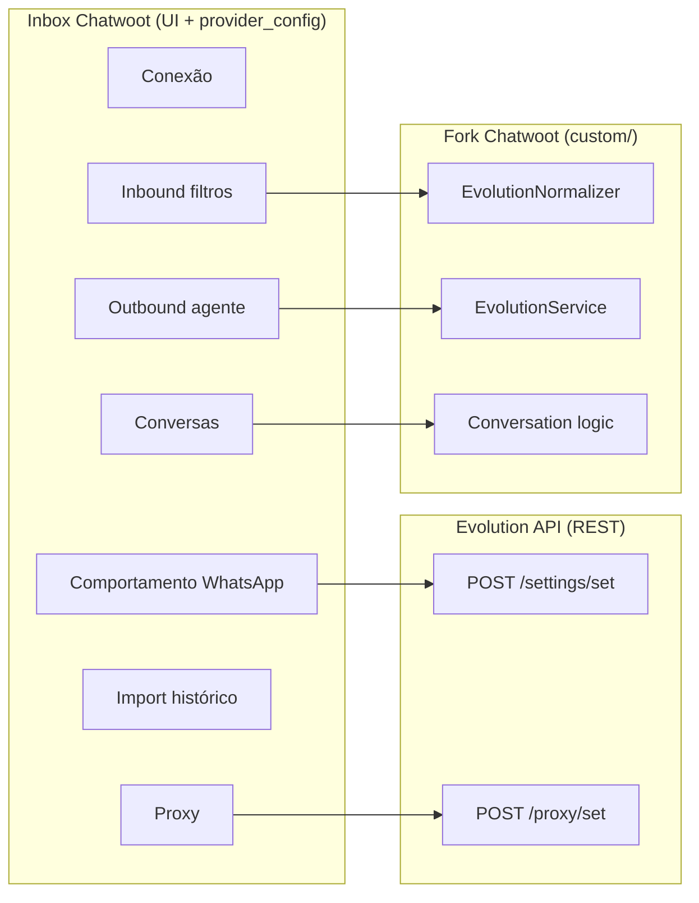
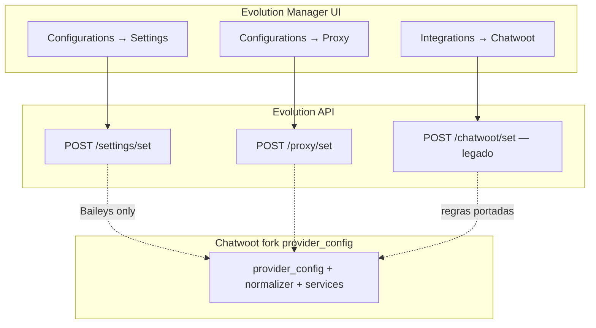

# Regras de negócio — Caixa de entrada Evolution

Todas as regras identificadas na integração Evolution→Chatwoot (`/root/evolution-api/src/api/integrations/chatbot/chatwoot/`) e nos **settings Baileys** da instância, mapeadas para campos configuráveis no inbox Chatwoot (`Channel::Whatsapp#provider_config` + UI).

**Objetivo:** cada regra útil da Evolution tem equivalente no inbox — com **defaults adaptados** ao fork (não cópia cega do Manager). Ver **[business-rules-adaptation.md](./business-rules-adaptation.md)**.

**Relacionados:** [provider-config-mapping.md](./provider-config-mapping.md) · [implementation-plan.md](./implementation-plan.md) · [validation-checklist.md](./validation-checklist.md)

---

## Escopo Fase 1 (atualizado)

Inclui **proxy opcional no wizard** e regras de conversa essenciais — ver [business-rules-adaptation.md](./business-rules-adaptation.md).

| Fase 1 (wizard + runtime) | Default fork aplicado | Fase 2+ (UI settings) |
|---------------------------|----------------------|------------------------|
| `base_url`, `api_key`, `instance_name` | — | — |
| **Proxy** (seção colapsável) | `proxy_enabled: false` | ✅ Editar em settings (aba **WhatsApp**) |
| QR + ActionCable | — | — |
| `groups_ignore: true` | fixo no create | ✅ toggle UI |
| Reabrir conversa resolvida | `inbox.lock_to_single_conversation` (Settings → Roteamento) | ✅ toggle nativo inbox |
| `send_templates_as_text: true` | — | — |
| Filtros hardcoded | `@g.us`, `status@broadcast`, `fromMe` | ✅ `ignore_jids` UI |
| `ignore_jids: ["@g.us"]` | em `provider_config` | ✅ editor textarea |

**Fase 2 UI (implementada — T2):** aba **WhatsApp** em Settings do inbox Evolution (`EvolutionSettingsPage.vue`) — `groups_ignore`, `sign_msg`, `sign_delimiter`, `reject_call`, `read_messages`, `conversation_pending`, `convert_markdown_*`, `ignore_jids`, proxy completo, badge `connection_status`. Reabrir conversa: **Settings → Configurações** (`lock_to_single_conversation`), não nesta aba. Sync ao salvar via `ConnectionService#sync_settings!` / `#sync_proxy!`. `api_key` e `proxy_password` masked no GET.

**Campos em `provider_config` sem toggle na UI** (defaults ativos no código): `send_random_delay`, `ignore_survey_links`, `merge_brazil_contacts`, `read_status`, `sync_full_history`, `always_online`, `msg_call`, `mark_read_on_reply`, `sync_delete_to_whatsapp`, `notify_send_errors_private`.

**Fase 3 (implementada):** reconnect QR (modal), logout/restart, alerta desconexão, `merge_brazil_contacts` no normalizer.  
**Fase 4 (parcial):** import via `ImportService` + job; UI import em `EvolutionSettingsPage`; auto-enqueue ao conectar se `import_contacts`/`import_messages` habilitados.

---

## Visão geral — onde cada regra vive



| Camada | Regras |
|--------|--------|
| **Evolution `/settings/set`** | Grupos, chamadas, presença, leitura, histórico |
| **Evolution `/proxy/set`** | Proxy HTTP/SOCKS |
| **Chatwoot fork (envio)** | Assinar mensagem, markdown, template→texto, marcar lida ao responder |
| **Chatwoot fork (inbound)** | `ignore_jids`, broadcast, echo, survey |
| **Chatwoot fork (conversas)** | Reabrir, pending, merge BR |
| **Chatwoot fork (fase 2+)** | Import contatos/mensagens, sync delete |

---

## Catálogo completo de regras

### Legenda

| Coluna | Significado |
|--------|-------------|
| **Campo** | Chave em `provider_config` (snake_case) |
| **Default** | Valor na criação do inbox |
| **Fase** | MVP = 1, completo = 2, opcional = 3+ |
| **Sync Evolution** | Se salvar dispara API Evolution |
| **Ref. código Evolution** | Onde a regra existe hoje |

---

## 1. Conexão (obrigatório — wizard)

| Campo | Tipo | Default | Fase | Sync | UI |
|-------|------|---------|------|------|-----|
| `base_url` | string | — | 1 | — | URL do servidor Evolution |
| `api_key` | string | — | 1 | — | **`AUTHENTICATION_API_KEY` global** do servidor Evolution (`.env`) — não o token UUID por instância do Manager |
| `instance_name` | string | — | 1 | — | Nome da instância Evolution |

| Campo runtime | Tipo | UI |
|---------------|------|-----|
| `connection_status` | enum | Badge: open / connecting / close |
| `instance_id` | string | Somente leitura (debug) |
| `phone_number` | channel | Preenchido após QR conectado |

### Segurança — `api_key` e senhas

| Regra | Implementação |
|-------|---------------|
| GET inbox/channel API | `api_key` e `proxy_password` **omitidos** ou `••••••••` |
| PATCH settings | Enviar `api_key` só quando usuário alterar (campo vazio = manter) |
| Logs / Sentry | Nunca logar envelope webhook completo (`apikey` no body); `apikey` removido do payload Sidekiq antes de `perform_later` |
| Resposta API (produção) | `ApiError#user_message` — detalhes upstream só em `Rails.logger` |
| Serializer | Prepend em `Channel::Whatsapp` ou controller inbox evolution |

Ver [decisions.md §15](./decisions.md).

---

## 2. Comportamento WhatsApp (settings Evolution)

Regras aplicadas no **socket Baileys** — sincronizar via `POST /settings/set/:instanceName`.

| Campo | Tipo | Default | Fase | Label UI (en) | O que faz | Ref. Evolution |
|-------|------|---------|------|---------------|-----------|----------------|
| `groups_ignore` | boolean | **`true`** | 1 | Ignore groups | Não processa mensagens de grupos (`@g.us`) no Baileys | `settings.schema.ts` · `whatsapp.baileys.service.ts` ~1156, 1434 |
| `reject_call` | boolean | `false` | 2 | Reject calls | Rejeita chamadas de voz/vídeo recebidas (`rejectCall`) | `whatsapp.baileys.service.ts` ~1730 |
| `msg_call` | string | `""` | 2 | Message when rejecting call | Envia texto automático ao receber chamada (se não vazio) | ~1734 |
| `always_online` | boolean | `false` | 2 | Always online | Mantém presença online (`markOnlineOnConnect`) | ~634 |
| `read_messages` | boolean | `false` | 2 | Mark incoming as read on WhatsApp | Marca como lida no WA ao receber mensagem | ~1199 |
| `read_status` | boolean | `false` | 3 | Read status updates | Lê stories/status do WhatsApp | `settings.schema.ts` |
| `sync_full_history` | boolean | `false` | 3 | Sync full message history | Sincroniza histórico completo ao conectar | `instance.controller.ts` |

**Doc Evolution:** [set-settings](https://docs.evolutionfoundation.com.br/evolution-api/set-settings)

† Fase 1: `groups_ignore: true` fixo no `POST /instance/create` — UI de settings na Fase 2.

### Nota: `groups_ignore` vs `ignore_jids`

| Regra | Camada | Efeito |
|-------|--------|--------|
| `groups_ignore` | Baileys (Evolution) | Grupo nunca entra no pipeline |
| `ignore_jids` com `@g.us` | Normalizer (Chatwoot) | Filtro redundante se `groups_ignore` falhar |

**Recomendação UI:** ao ativar "Ignorar grupos", setar `groups_ignore: true` **e** incluir `@g.us` em `ignore_jids`.

---

## 3. Proxy

Sincronizar via `POST /proxy/set/:instanceName`.

| Campo | Tipo | Default | Fase | Label UI |
|-------|------|---------|------|----------|
| `proxy_enabled` | boolean | **`false`** | **1**† | Enable proxy | Proxy Baileys — opcional no wizard | `proxy.controller.ts` |
| `proxy_host` | string | `""` | **1**† | Host |
| `proxy_port` | string | `""` | **1**† | Port |
| `proxy_protocol` | enum | `http` | **1**† | Protocol (`http`, `https`, `socks4`, `socks5`) |
| `proxy_username` | string | `""` | **1**† | Username |
| `proxy_password` | string | `""` | **1**† | Password (masked) |

† Fase 1: seção opcional no wizard; Fase 2: aba Proxy completa nos settings.

**Doc:** [set-proxy](https://docs.evolutionfoundation.com.br/evolution-api/set-proxy)

### Comportamento Evolution

| Aspecto | Detalhe |
|---------|---------|
| Efeito | Apenas tráfego **Baileys** (WhatsApp Web) — não REST Evolution ↔ Chatwoot |
| Validação | `POST /proxy/set` testa IP de saída via `icanhazip.com` antes de salvar |
| Protocolos | `http`, `https`, `socks4`, `socks5` |
| Desabilitar | `{ "enabled": false }` limpa campos no servidor |
| Pós-save | Pode exigir `POST /instance/restart` para socket aplicar proxy |

**Discrepância OpenAPI:** `/proxy/set` publicado usa `proxyHost`; runtime usa `host` — [documentation-links.md §6](./documentation-links.md).  
**Create inline:** `/instance/create` usa `proxyHost` — [api-reference.md §3](./api-reference.md).

**Sync fork:** `ConnectionService#sync_proxy!` na Fase 2 ao salvar settings.

---

## 4. Conversas (lado Chatwoot)

Portadas de `ChatwootDto` — implementação no fork, **não** na Evolution.

| Campo | Tipo | Default | Fase | Label UI (pt) | O que faz | Ref. Evolution |
|-------|------|---------|------|---------------|-----------|----------------|
| `inbox.lock_to_single_conversation` | boolean (coluna `inboxes`) | **`true`** (fork) | nativo | Reabrir mesma conversa | Se conversa `resolved`, nova mensagem reabre (ou cria nova) | `reopenConversation` ~789 |
| `conversation_pending` | boolean | **`false`** | 2 | Conversas iniciam como pendentes | Status inicial `pending`; se reopen + não open → toggle pending | ~791, 820 |
| `merge_brazil_contacts` | boolean | `true` | 2 | Unificar contatos Brasil (+55) | Merge duplicatas com/sem 9º dígito | ~499–523 |

> **Jun/2026:** `provider_config.reopen_conversation` foi **removido** — duplicava `lock_to_single_conversation`. Ver [conversation-single-history-per-channel](../../conversation-single-history-per-channel/implementation-plan.md).

### Comportamento reabrir conversa (`lock_to_single_conversation`)

| Valor | Comportamento |
|-------|---------------|
| `true` | `Conversations::Resolver` reutiliza a conversa mais recente (incl. `resolved`); `Message#reopen_conversation` reabre no inbound |
| `false` | Resolver só reutiliza conversas não resolvidas; se todas resolvidas, cria nova |

Com `conversation_pending: true`, o prepend `Custom::Message` chama `conversation.pending!` em vez de `open!` ao reabrir.

### Cache ao resolver

Quando `lock_to_single_conversation: false` e conversa vai para `resolved`, Evolution limpa cache `createConversation-{identifier}` no webhook `conversation_status_changed` (~1290). **Portar** listener equivalente no fork.

---

## 5. Outbound — mensagens do agente

| Campo | Tipo | Default | Fase | Label UI | O que faz | Ref. Evolution |
|-------|------|---------|------|----------|-----------|----------------|
| `sign_msg` | boolean | **`false`** | 2 | Sign messages with agent name | Prefixa `*Nome do agente:*` antes do texto | `receiveWebhook` ~1432–1438 |
| `sign_delimiter` | string | `\n` | 2 | Signature delimiter | Separador entre nome e corpo (`\n` ou custom) | ~1432 |
| `mark_read_on_reply` | boolean | `false` | 2 | Mark last incoming as read when agent replies | Após envio agente, marca última msg WA como lida | `CHATWOOT.MESSAGE_READ` env ~1518 |
| `sync_delete_to_whatsapp` | boolean | `false` | 3 | Delete message on WhatsApp when deleted in Chatwoot | `message_updated` + `content_attributes.deleted` | `CHATWOOT.MESSAGE_DELETE` · ~1322 |
| `convert_markdown_outbound` | boolean | `true` | 2 | Convert Chatwoot markdown to WhatsApp format | `*`→`_`, `**`→`*`, etc. | ~1310–1315 |
| `convert_markdown_inbound` | boolean | `true` | 2 | Convert WA formatting to Chatwoot markdown | `*`→`**`, `_`→`*`, etc. | ~1975 |
| `send_templates_as_text` | boolean | `true` | 1 | Send template messages as plain text | Templates CW viram `sendText` | ~1563 |
| `send_random_delay` | boolean | `true` | 2 | Random delay 500–2000 ms before send | Anti-ban / humanização | ~1480 |
| `notify_send_errors_private` | boolean | `true` | 2 | Private note when WA send fails | `onSendMessageError` | ~1242 |

**Nota:** `sign_msg` só aplica quando há `senderName`; mensagens sem agente enviam texto puro (~1429).

---

## 6. Inbound — filtros de mensagens

| Campo | Tipo | Default | Fase | Label UI | O que faz | Ref. Evolution |
|-------|------|---------|------|----------|-----------|----------------|
| `ignore_jids` | string[] | **`["@g.us"]`** | 1 / 2‡ | Ignored JIDs | Lista de JIDs/padrões ignorados no inbound | `eventWhatsapp` ~1932 |
| `ignore_status_broadcast` | boolean | `true` | 1‡ | (implícito) | Ignora `status@broadcast` | ~1964 |
| `ignore_from_me_echo` | boolean | `false` | 1‡ | (implícito) | Ignora `fromMe: true` no UPSERT (evita duplicar outbound) | implícito no fluxo |
| `ignore_survey_links` | boolean | `true` | 2 | Ignore CSAT survey echoes | Ignora msgs com `/survey/responses/` + URL | ~1982 |
| `format_group_messages` | boolean | `false` | 3+ | Prefix group messages with participant | `**+55 (11) 9999-9999 - Name:**` | ~2198 |
| `show_pairing_code` | boolean | `true` | 2 | Show pairing code alongside QR | `qrcode.pairingCode` format `XXXX-XXXX` | ~2439 |

‡ Fase 1: filtros aplicados **hardcoded** no normalizer — sem toggles na UI.

### Valores especiais `ignore_jids`

| Valor | Efeito |
|-------|--------|
| `@g.us` | Todos os grupos |
| `@s.whatsapp.net` | Todos os contatos 1:1 |
| `5511999999999@s.whatsapp.net` | JID exato |
| `120363xxx@g.us` | Grupo específico |

**UI:** campo tags/chips — placeholder: `Add JIDs e.g. 1234567890@s.whatsapp.net` (igual screenshot Evolution).

---

## 7. Import histórico (fase posterior)

| Campo | Tipo | Default | Fase | Label UI | O que faz | Ref. Evolution |
|-------|------|---------|------|----------|-----------|----------------|
| `import_contacts` | boolean | `false` | 4 | Import contacts from address book | Importa agenda após QR | `ChatwootDto.importContacts` |
| `import_messages` | boolean | `false` | 4 | Import message history | Importa histórico WA → CW | `importMessages` |
| `days_limit_import_messages` | number | `7` | 4 | Days limit for message import | Janela em dias | `daysLimitImportMessages` |

Disponível após conexão QR — igual UI Evolution (screenshot).

---

## 8. Regras NÃO expostas na UI (automáticas)

| Regra | Comportamento | Onde implementar |
|-------|---------------|------------------|
| Webhook URL | `https://{FRONTEND_URL}/webhooks/evolution/{instance_name}` | `ConnectionService` |
| ActionCable QR | Canal `evolution:connection:{inbox_id}` | `ConnectionService#handle_event` |
| Desabilitar integração CW na Evolution | Nunca chamar `/chatwoot/set` com `enabled: true` | `ConnectionService` |
| `source_id` formato | `key.id` da Evolution (**sem** prefixo `WAID:` — artefato da integração API) | `EvolutionService` |
| Janela 24h | Sem limite — `MessageWindowService` → `nil` | prepend fork |
| Loop prevention outbound | Pipeline nativo CW — Evolution usava check `WAID:` no webhook | N/A no provider |
| `isIntegration` flag no send | `textMessage(..., true)` — evita re-entrada Chatwoot no Baileys | `EvolutionService` sempre true |
| Dedup inbound | Redis lock por `source_id` | `IncomingMessageBaseService` (já existe) |
| LID contacts | Usar `remoteJidAlt` quando JID termina `@lid` ou `addressingMode: lid` | Normalizer |
| Ephemeral messages | Unwrap `message.ephemeralMessage.message` | Normalizer |
| Tipos complexos inbound | location, contact, list, ads, reaction — ver [implementation-analysis.md §6](./implementation-analysis.md#6-tipos-de-mensagem-inbound--além-de-texto) | Normalizer fases 2–3 |

---

## 9. Lacunas descobertas na análise do código

Detalhes completos: **[implementation-analysis.md](./implementation-analysis.md)**

| Descoberta | Impacto no provider |
|------------|---------------------|
| Import usa **SQL direto** no Postgres Chatwoot | Fase 4 precisa abordagem diferente (API/jobs) |
| `syncLostMessages` cron 30 min | Opcional — reconciliação webhook |
| Bot `123456` + QR como imagem | Substituir por UI wizard |
| Labels/tags automáticas por `nameInbox` | Opcional — via API labels CW |
| `messages.edit` cria **nova** msg, não edita | Decisão produto fase 3 |
| Defaults `instance/create` com CW: import true, 60 dias | Só relevante se criar instância via API |
| Env globals `CHATWOOT_*` | Viraram campos por inbox neste doc |

---

## Layout UI — Caixa de entrada Evolution

### Wizard (criação) — implementado (`Evolution.vue`)

Fluxo em **2 etapas** (regras avançadas ficam em Settings após criar o inbox):

**Etapa 1 — Formulário**
- Nome da caixa de entrada (Chatwoot)
- URL da Evolution API (`base_url`, sem barra final)
- **Chave da API** — `AUTHENTICATION_API_KEY` do `.env` da Evolution (campo password + texto de ajuda i18n)
- Nome da instância (`instance_name`, único globalmente)
- Proxy opcional (toggle + host/porta/protocolo/usuário/senha)

**Etapa 2 — Conectar**
- Mensagem "Caixa de entrada criada"
- Botão **Abrir leitor de QR** → abre modal `EvolutionQrScanModal`
- Modal: QR, pairing code, status, auto-refresh ~45s, ActionCable + polling 3s
- Ao conectar (`open`): redirect para adicionar agentes

> Regras (`groups_ignore`, `sign_msg`, proxy completo, import, etc.): **Settings → inbox → aba WhatsApp / Evolution** (`EvolutionSettingsPage.vue` + `EvolutionHealthPage.vue`).

### Settings do inbox (pós-criação)

Abas sugeridas:

| Aba | Campos |
|-----|--------|
| **Conexão** | Status, reconectar (QR), logout, restart instance |
| **WhatsApp** | groups_ignore, reject_call, msg_call, always_online, read_messages, read_status, sync_full_history, conversation_pending, outbound, filtros, proxy, import |
| **Configurações** (inbox nativo) | `lock_to_single_conversation` — reabrir mesma conversa |
| **Mensagens** | sign_msg, sign_delimiter, mark_read_on_reply, sync_delete_to_whatsapp, convert_markdown_outbound |
| **Filtros** | ignore_jids (editor) |
| **Proxy** | proxy_* |
| **Importação** | import_contacts, import_messages, days_limit_import_messages |
| **Avançado** | base_url, instance_name, api_key (masked), instance_id |

---

## `provider_config` completo (referência)

**Defaults oficiais do fork:** [business-rules-adaptation.md § provider_config](./business-rules-adaptation.md#provider_config--defaults-oficiais-do-fork)

```json
{
  "base_url": "https://evolution.example.com",
  "api_key": "AUTHENTICATION_API_KEY_FROM_EVOLUTION_ENV",
  "instance_name": "inbox-sales-1",
  "instance_id": "uuid",

  "groups_ignore": true,
  "reject_call": false,
  "msg_call": "",
  "always_online": false,
  "read_messages": false,
  "read_status": false,
  "sync_full_history": false,

  "proxy_enabled": false,
  "proxy_host": "",
  "proxy_port": "",
  "proxy_protocol": "http",
  "proxy_username": "",
  "proxy_password": "",

  "sign_msg": false,
  "sign_delimiter": "\n",
  "conversation_pending": false,
  "merge_brazil_contacts": true,

  "mark_read_on_reply": false,
  "sync_delete_to_whatsapp": false,
  "convert_markdown_outbound": true,
  "convert_markdown_inbound": true,
  "send_templates_as_text": true,
  "send_random_delay": true,
  "notify_send_errors_private": true,
  "format_group_messages": false,
  "show_pairing_code": true,

  "ignore_jids": ["@g.us"],
  "ignore_status_broadcast": true,
  "ignore_from_me_echo": false,
  "ignore_survey_links": true,

  "import_contacts": false,
  "import_messages": false,
  "days_limit_import_messages": 7,

  "connection_status": "close"
}
```

---

## Matriz implementação por fase

Ver detalhe e justificativa: [business-rules-adaptation.md § Fases revisadas](./business-rules-adaptation.md#fases-revisadas-com-proxy--regras-essenciais).

| Fase | Regras incluídas |
|------|------------------|
| **1** | Conexão; **proxy opcional wizard**; `groups_ignore`; `lock_to_single_conversation`; `ignore_jids` default; filtros hardcoded; `send_templates_as_text`; bypass 24h |
| **2** | Settings UI; `sign_msg`, markdown, delay, merge BR, reject_call, read_messages, mark_read_on_reply, erros privados, mídia/status |
| **3** | sync_delete, read_status, sync_full_history |
| **4** | import_* (API, days=7) |

---

## i18n — chaves sugeridas (en)

Prefixo: `INBOX_MGMT.EVOLUTION.*`

```
CONNECTION_SECTION
WHATSAPP_BEHAVIOR_SECTION
CONVERSATION_SECTION
OUTBOUND_SECTION
FILTERS_SECTION
IMPORT_SECTION
PROXY_SECTION

GROUPS_IGNORE
REJECT_CALL
MSG_CALL
ALWAYS_ONLINE
READ_MESSAGES
READ_STATUS
SYNC_FULL_HISTORY
SIGN_MSG
SIGN_DELIMITER
REOPEN_CONVERSATION
CONVERSATION_PENDING
MERGE_BRAZIL_CONTACTS
MARK_READ_ON_REPLY
SYNC_DELETE_TO_WHATSAPP
IGNORE_JIDS
IGNORE_JIDS_PLACEHOLDER
IMPORT_CONTACTS
IMPORT_MESSAGES
DAYS_LIMIT_IMPORT_MESSAGES
```

Somente **en** no fork (regra Chatwoot).

---

## Checklist — paridade com UI Evolution Manager

Regras visíveis no **Evolution Manager** (`Configurations` + integração `Chatwoot`) mapeadas para o inbox Chatwoot fork.

### Onde cada tela vive no código



| Área do Manager | Persistência Evolution | No provider nativo fork |
|-----------------|------------------------|-------------------------|
| **Configurations → Settings** | Tabela `Settings` + `POST /settings/set` | `provider_config` + sync Evolution |
| **Configurations → Proxy** | Tabela `Proxy` + `POST /proxy/set` | `proxy_*` + `ConnectionService#sync_proxy!` |
| **Integrations → Chatwoot** | Tabela `Chatwoot` + `POST /chatwoot/set` | **`provider_config` só no Chatwoot** — não chamar `/chatwoot/set` |

---

### Tela 1 — Integrations → Chatwoot → Sign Messages

| UI Manager | Campo Evolution (`ChatwootDto`) | Campo inbox fork | Código | Fase fork |
|------------|--------------------------------|------------------|--------|-----------|
| **Sign Messages** — "Sign message with chatwoot username" | `signMsg` | `sign_msg` + `sign_delimiter` | `chatwoot.service.ts` `receiveWebhook` ~1432–1438 | 2 |

**Comportamento:** se `signMsg: true`, prefixa `*Nome do agente:*` antes do texto outbound (delimitador `signDelimiter`, default `\n`). Só quando há `senderName` no webhook Chatwoot.

**Default Manager (screenshot):** ON · **Default API** `instance/create` com Chatwoot: `signMsg \|\| false` — discrepância UI vs API.

---

### Tela 2 — Integrations → Chatwoot (conversas, import, filtros)

| UI Manager | Campo Evolution | Campo inbox fork | Código | Fase fork |
|------------|-----------------|------------------|--------|-----------|
| **Conversation Pending** | `conversationPending` | `conversation_pending` | `createConversation` ~820 | 2 |
| **Reopen Conversation** | `reopenConversation` | `inbox.lock_to_single_conversation` | ~789–805 | nativo inbox |
| **Import Contacts** | `importContacts` | `import_contacts` | `whatsapp.baileys.service.ts` ~811 | 4 |
| **Import Messages** | `importMessages` | `import_messages` | ~1034, ~1866 | 4 |
| **Days Limit Import Messages** | `daysLimitImportMessages` | `days_limit_import_messages` | ~931 (`daysLimitToImport`) | 4 |
| **Ignore Jids** (tags) | `ignoreJids[]` | `ignore_jids` | `eventWhatsapp` ~1932–1959 | 2 |

**Defaults no screenshot:** pending OFF, reopen ON, import OFF/OFF, days **7**.

**Defaults API** `instance/create` (se Chatwoot habilitado): `importContacts ?? true`, `importMessages ?? true`, `daysLimitImportMessages ?? 60` — ver [implementation-analysis.md](./implementation-analysis.md).

**`ignoreJids` — valores especiais no código:**

| Valor | Efeito |
|-------|--------|
| `@g.us` | Ignora todos os grupos |
| `@s.whatsapp.net` | Ignora todos os contatos 1:1 |
| JID exato | Ignora número/grupo específico |

Placeholder UI: `Add JIDs ex: 1234567890@s.whatsapp.net` — igual [§6](./inbox-business-rules.md).

---

### Tela 3 — Configurations → Settings (Baileys)

| UI Manager | Campo Evolution (`settings`) | Campo inbox fork | Código | Fase fork |
|------------|------------------------------|------------------|--------|-----------|
| **Reject Calls** | `rejectCall` | `reject_call` (+ `msg_call` opcional) | `whatsapp.baileys.service.ts` ~1730 | 2 |
| **Ignore Groups** | `groupsIgnore` | `groups_ignore` | ~1156, ~1434, ~1796 | 1† / UI Fase 2 |
| **Always Online** | `alwaysOnline` | `always_online` | ~634 `markOnlineOnConnect` | 2 |
| **Read Messages** | `readMessages` | `read_messages` | ~1199 `client.readMessages` | 2 |
| **Sync Full History** | `syncFullHistory` | `sync_full_history` | ~653, ~1885 | 3 |
| **Read Status** | `readStatus` | `read_status` | ~647, ~1203 | 3 |

**API:** `POST /settings/set/:instanceName` — schema `settings.schema.ts`.

**Defaults screenshot:** todos OFF. **MVP fork:** `groups_ignore: true` fixo no create (mesmo com Manager em OFF).

† Fase 1 hardcoded; toggle na UI na Fase 2.

---

### Tela — Configurations → Proxy

| UI Manager | API | Campo fork | Doc |
|------------|-----|------------|-----|
| Enable proxy, host, port, protocol, auth | `POST /proxy/set` | `proxy_*` | [§3](./inbox-business-rules.md), [api-reference.md §3](./api-reference.md), [decisions.md §19](./decisions.md) |

---

### Resumo — documentado?

| Regra (screenshot) | `inbox-business-rules.md` | Portar no fork |
|--------------------|---------------------------|----------------|
| Sign Messages | §5 `sign_msg` | Fase 2 — `EvolutionService` |
| Conversation Pending | §4 | Fase 2 — conversation builder |
| Reopen Conversation | §4 | Fase 2 |
| Import Contacts / Messages / Days | §7 | Fase 4 — sem SQL legado |
| Ignore Jids | §6 | Fase 2 — normalizer |
| Reject Calls | §2 | Fase 2 — sync settings |
| Ignore Groups | §2 | Fase 1 hardcoded / Fase 2 UI |
| Always Online | §2 | Fase 2 |
| Read Messages | §2 | Fase 2 |
| Sync Full History | §2 | Fase 3 |
| Read Status | §2 | Fase 3 |
| Proxy | §3 | Fase 2 |

**Todas as regras das telas estão catalogadas.** A integração legada guarda regras Chatwoot na Evolution (`ChatwootDto`); o provider nativo **move tudo para `provider_config` do inbox** e só sincroniza na Evolution o que é Baileys (`/settings/set`) ou proxy (`/proxy/set`).
