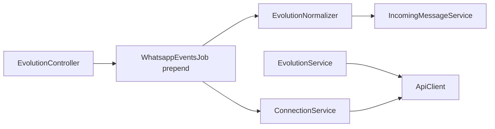

# Spec design — classes do provider Evolution

Contratos públicos das classes em `custom/` para implementação Fase 0–3. Complementa [implementation-plan.md](./implementation-plan.md) e [decisions.md](./decisions.md).

**Padrão de referência upstream:** `Whatsapp::Providers::Whatsapp360DialogService`, `Whatsapp::IncomingMessageService`, `Webhooks::WhatsappEventsJob`.

---

## Visão de dependências



---

## 1. `Custom::Whatsapp::Evolution::ApiClient`

**Arquivo:** `custom/app/services/custom/whatsapp/evolution/api_client.rb`

Cliente HTTP fino — sem regras de negócio Chatwoot.

### Inicialização

```ruby
Custom::Whatsapp::Evolution::ApiClient.new(
  base_url: channel.provider_config['base_url'],
  api_key: channel.provider_config['api_key'],
  instance_name: channel.provider_config['instance_name']
)
```

### API pública

| Método | Evolution endpoint | Retorno |
|--------|-------------------|---------|
| `#create_instance(body)` | `POST /instance/create` | `Hash` parsed |
| `#connect(number: nil)` | `GET /instance/connect/:instance` | `Hash` (qrcode) |
| `#connection_state` | `GET /instance/connectionState/:instance` | `Hash` |
| `#logout` | `DELETE /instance/logout/:instance` | `Hash` |
| `#restart` | `POST /instance/restart/:instance` | `Hash` |
| `#delete_instance` | `DELETE /instance/delete/:instance` | `Hash` |
| `#set_webhook(url, events:)` | `POST /webhook/set/:instance` | `Hash` |
| `#set_settings(settings)` | `POST /settings/set/:instance` | `Hash` |
| `#set_proxy(proxy)` | `POST /proxy/set/:instance` | `Hash` — mapear `provider_config` → `host`/`port` (não `proxyHost` no set) |
| `#send_text(number:, text:, quoted: nil, delay: nil)` | `POST /message/sendText/:instance` | `Hash` messageRaw |
| `#send_media(number:, mediatype:, media:, caption: nil)` | `POST /message/sendMedia/:instance` | `Hash` |
| `#send_buttons(number:, title:, buttons:)` | `POST /message/sendButtons/:instance` | `Hash` |
| `#send_list(number:, title:, button_text:, sections:)` | `POST /message/sendList/:instance` | `Hash` |
| `#mark_message_read(ids)` | `POST /chat/markMessageAsRead/:instance` | `Hash` |
| `#find_contacts` | `POST /chat/findContacts/:instance` | `Array` |
| `#find_messages(remote_jid:, page: 1)` | `POST /chat/findMessages/:instance` | `Array` |
| `#get_base64_from_media(message_key)` | `POST /chat/getBase64FromMediaMessage/:instance` | `Hash` |

### `#send_text` — fallback doc vs código

```ruby
def send_text(number:, text:, quoted: nil, delay: nil)
  body = { number: normalize_number(number), text: text }
  body[:quoted] = quoted if quoted.present?
  body[:delay] = delay if delay.present?

  response = post("/message/sendText/#{instance_name}", body)
  return response if response.success?

  # Fallback OpenAPI shape (older published docs)
  if response.code == 400
    fallback = body.except(:text).merge(textMessage: { text: text })
    response = post("/message/sendText/#{instance_name}", fallback)
  end

  response
end
```

### HTTP interno

```ruby
def post(path, body)
  HTTParty.post(
    "#{normalized_base_url}#{path}",
    headers: { 'apikey' => api_key, 'Content-Type' => 'application/json' },
    body: body.to_json
  )
end
```

Erros: logar body; levantar `Custom::Whatsapp::Evolution::ApiError` com `status`, `body` para o service tratar.

---

## 2. `Custom::Whatsapp::Evolution::ConnectionService`

**Arquivo:** `custom/app/services/custom/whatsapp/evolution/connection_service.rb`

Orquestra lifecycle da instância Evolution e eventos não-mensagem.

### Inicialização

```ruby
ConnectionService.new(channel) # Channel::Whatsapp, provider: 'evolution'
```

### API pública

| Método | Fase | Descrição |
|--------|------|-----------|
| `#provision_new_instance!(attrs)` | 1 | create + **proxy** + set_webhook + settings defaults fork |
| `#link_existing_instance!(instance_name, api_key)` | 1 | Valida `connection_state`; não cria instância |
| `#register_webhook!` | 1 | `POST /webhook/set` com URL [decisions.md](./decisions.md) |
| `#sync_settings!` | 2 | `provider_config` → `POST /settings/set` |
| `#sync_proxy!` | 2 | `provider_config` proxy_* → `POST /proxy/set` (`host`/`port`); tratar 400 Invalid proxy |
| `#fetch_qr_code` | 1 | `GET /instance/connect` → `{ base64:, code: }` |
| `#refresh_connection_status!` | 1 | Poll ou após webhook |
| `#handle_event(envelope)` | 1 | `CONNECTION_UPDATE`, `QRCODE_UPDATED` |
| `#ensure_chatwoot_integration_disabled!` | 1 | Garante que integração legada CW está off |
| `#extract_phone_number(envelope)` | 1 | De `sender` ou state pós-open |

### `#provision_new_instance!` — sequência

```
1. ApiClient#create_instance(integration: WHATSAPP-BAILEYS, qrcode: true, settings from attrs)
2. Persistir api_key (hash), instance_id, instance_name em provider_config
3. #register_webhook!
4. #sync_settings! (groups_ignore, etc.)
5. #ensure_chatwoot_integration_disabled!
6. Retornar qrcode para o wizard
```

### `#handle_event`

```ruby
def handle_event(envelope)
  case envelope['event']
  when 'CONNECTION_UPDATE'
    update_connection_status(envelope.dig('data', 'state'))
    broadcast_connection_event(connection_status: envelope.dig('data', 'state'))
  when 'QRCODE_UPDATED'
    attrs = qrcode_storage_attrs(envelope.dig('data'))
    broadcast_connection_event(qrcode_base64: attrs['last_qr_base64'], qrcode_code: attrs['last_qr_code'])
  end
end
```

**ActionCable** ([decisions.md §17](./decisions.md)):

```ruby
# broadcast_connection_event(payload)
ActionCable.server.broadcast(
  "evolution:connection:#{channel.inbox_id}",
  payload.merge(inbox_id: channel.inbox_id)
)
```

Fallback wizard: polling `GET /instance/connect` a cada 3s até `connection_status == 'open'`.

### `provider_config` keys escritas

| Key | Quando |
|-----|--------|
| `connection_status` | `open` / `close` / `connecting` |
| `phone_number` | Primeiro `open` com `sender` válido (`+5511...`) |
| `last_qr_base64` | `QRCODE_UPDATED` (opcional, cache UI) |

---

## 3. `Custom::Whatsapp::Providers::EvolutionService`

**Arquivo:** `custom/app/services/custom/whatsapp/providers/evolution_service.rb`

Herda `Whatsapp::Providers::BaseService`. Registrado via `MessagingProvider::Registry`.

### API pública (contrato BaseService)

| Método | Implementação |
|--------|---------------|
| `#send_message(phone_number, message)` | Roteia por attachments / input_select / texto |
| `#send_template(phone_number, template_info, message)` | Se `send_templates_as_text` → texto; senão no-op / erro |
| `#sync_templates` | No-op — mark updated |
| `#validate_provider_config?` | `GET connectionState` success |
| `#media_url(media_id)` | N/A ou URL Evolution se Fase 2 |
| `#api_headers` | Não usado (ApiClient encapsula) |

### `#send_message` — fluxo texto (Fase 1)

```ruby
def send_message(phone_number, message)
  @message = message
  body = message.outgoing_content # Fase 2+: apply_outbound_transforms

  response = api_client.send_text(
    number: phone_number,
    text: body
  )

  process_response(response, message)
end
```

### Transformações outbound (`provider_config`) — Fase 2+

| Flag | Comportamento |
|------|---------------|
| `sign_msg` | Prefixar `*Nome Agente:*\n` (delimiter de `sign_delimiter`) |
| `convert_markdown_outbound` | `**bold**` → `*bold*` (WhatsApp) |
| `mark_read_on_reply` | Após send, `mark_message_read` da msg citada |
| `send_delay_random` | `delay: rand(500..2000)` |

### `#process_response` — override

```ruby
def process_response(response, message)
  parsed = response.parsed_response
  if response.success? && parsed['key'].present?
    parsed.dig('key', 'id')
  else
    handle_error(response, message)
    nil
  end
end
```

### `#send_attachment_message` (Fase 2)

```ruby
api_client.send_media(
  number: phone_number,
  mediatype: map_file_type(attachment),
  media: attachment.download_url, # URL pública ActiveStorage
  caption: message.content
)
```

### `#send_interactive_text_message` (Fase 3)

Mapear `message.content_attributes[:items]` → `send_buttons` ou `send_list` conforme contagem de itens (≤3 botões, senão lista).

---

## 4. `Custom::Whatsapp::Webhooks::EvolutionNormalizer`

**Arquivo:** `custom/app/services/custom/whatsapp/webhooks/evolution_normalizer.rb`

Transforma envelope Evolution → payload flat 360dialog-like para `IncomingMessageService`.

### Inicialização

```ruby
EvolutionNormalizer.new(channel, envelope).perform
# envelope: Hash com keys 'event', 'instance', 'data', 'apikey', ...
```

### Retorno

```ruby
# Sucesso — passar para IncomingMessageService
{
  contacts: [{ profile: { name: '...' }, wa_id: '5511...' }],
  messages: [{ from: '...', id: '...', timestamp: '...', type: 'text', text: { body: '...' } }]
}

# Status
{ statuses: [{ id: '...', status: 'read', timestamp: '...', recipient_id: '...' }] }

# Filtrado / ignorado
nil
```

### Pipeline interno

```
1. validate_instance!(envelope['instance'] == channel.provider_config['instance_name'])
2. return nil unless supported_event?
3. Array.wrap(envelope['data']).each do |data|   # batch-safe — decisions.md §13
4.   apply_inbound_filters!(data)
5.   normalize_message_or_status(data)
6. end
```

Retorno: para `MESSAGES_UPSERT` com batch, normalizer pode retornar o **último** payload normalizado ou processar cada item em loop no job — preferir **um item por chamada** a `IncomingMessageService` (job itera).

### Filtros (`apply_inbound_filters!`)

Ordem fixa — ver [webhook-events.md](./webhook-events.md). Ler flags de `channel.provider_config`.

### Resolução de telefone (`resolve_wa_id`)

```ruby
def resolve_wa_id(key)
  if key['addressingMode'] == 'lid' && key['remoteJidAlt'].present?
    jid_to_phone(key['remoteJidAlt'])
  else
    jid_to_phone(key['remoteJid'])
  end
end

def jid_to_phone(jid)
  jid.to_s.split('@').first
end
```

### Mapeamento `messageType` → canônico

| Evolution | `type` | Campos extra |
|-----------|--------|--------------|
| `conversation`, `extendedTextMessage` | `text` | `text.body` |
| `imageMessage` | `image` | `image.id` ou URL/base64 Fase 2 |
| `documentMessage` | `document` | `document.filename` |
| `audioMessage` | `audio` | |
| `videoMessage` | `video` | |
| `stickerMessage` | `sticker` | |
| `locationMessage` | `location` | `location.latitude`, `longitude` |
| `contactMessage` | `contacts` | vCard parse |
| `reactionMessage` | — | `nil` (ignorar MVP) |
| `protocolMessage` (revoke) | — | Fase 2+ delete sync |

### Reply inbound (Fase 2)

Se `message.contextInfo.stanzaId` presente:

```ruby
message_hash[:context] = { id: context_info['stanzaId'] }
```

`IncomingMessageService` mapeia para `content_attributes[:in_reply_to_external_id]`.

### `#build_quoted_context` (outbound, em EvolutionService)

```ruby
{
  key: {
    id: reply_external_id,
    remoteJid: "#{phone}@s.whatsapp.net",
    fromMe: false
  },
  message: { conversation: original_snippet }
}
```

---

## 5. `Custom::Webhooks::EvolutionController`

**Arquivo:** `custom/app/controllers/custom/webhooks/evolution_controller.rb`

```ruby
class Custom::Webhooks::EvolutionController < ActionController::API
  def process_payload
    authenticate_webhook! # decisions.md §2
    Webhooks::WhatsappEventsJob.perform_later(permitted_params.merge(instance_name: params[:instance_name]))
    head :ok
  end
end
```

`permitted_params`: permitir envelope completo (`event`, `data`, `apikey`, `sender`, ...).

---

## 6. Prepend `Webhooks::WhatsappEventsJob`

**Arquivo:** `custom/app/jobs/custom/webhooks/whatsapp_events_job.rb`

Ver pseudocódigo em [decisions.md §12](./decisions.md#12-mutex-no-job-album--concorrência).

Adicionalmente:

```ruby
def evolution_envelope?(params)
  params['event'].present? && params['instance'].present?
end

def find_evolution_channel(params)
  Channel::Whatsapp.find_by(
    provider: 'evolution',
    provider_config: { instance_name: params['instance'] }
  )
  # ou query JSONB: provider_config->>'instance_name'
end
```

---

## 7. Prepend `Channel::Whatsapp`

**Arquivo:** `custom/app/models/custom/channel/whatsapp.rb`

```ruby
def provider_service
  service = MessagingProvider::Registry.resolve(provider, whatsapp_channel: self)
  return service if service

  super
end
```

---

## 8. Prepend `Conversations::MessageWindowService`

**Arquivo:** `custom/app/services/custom/conversations/message_window_service.rb`

```ruby
def reply_window
  return nil if conversation.inbox.channel.is_a?(Channel::Whatsapp) &&
                conversation.inbox.channel.provider == 'evolution'

  super
end
```

---

## 9. `MessagingProvider::Registry`

**Arquivo:** `custom/lib/messaging_provider/registry.rb`

```ruby
module MessagingProvider
  class Registry
    @providers = {}

    def self.register(key, service_class)
      @providers[key] = service_class
    end

    def self.resolve(key, whatsapp_channel:)
      klass = @providers[key]
      klass&.new(whatsapp_channel: whatsapp_channel)
    end
  end
end
```

Initializer:

```ruby
MessagingProvider::Registry.register('evolution', Custom::Whatsapp::Providers::EvolutionService)
```

---

## 10. `MessagingProvider::Capabilities`

```ruby
module MessagingProvider
  module Capabilities
    def self.for(provider)
      {
        'evolution' => {
          unlimited_session: true,
          supports_templates: false,
          supports_embedded_signup: false,
          supports_calling: false
        }
      }[provider] || {}
    end

    def self.unlimited_session?(provider)
      for(provider)[:unlimited_session] == true
    end
  end
end
```

---

## 11. Frontend (Vue) — contrato mínimo

Não é classe Ruby; interface entre wizard e API interna do fork.

### Composable `useEvolutionChannel.js`

| Export | Tipo | Uso |
|--------|------|-----|
| `isEvolutionWhatsAppChannel(channel)` | `boolean` | Gates UI |
| `evolutionCapabilities` | `object` | Esconder cloud-only |
| `connectionStatus` | `ref` | `open` / `connecting` / `close` |
| `qrCodeBase64` | `ref` | Step QR |
| `provisionInstance(payload)` | `async fn` | POST API interna create inbox |
| `refreshQr()` | `async fn` | Poll connect |

### API interna Rails (sugestão Fase 1)

| Método | Path | Ação |
|--------|------|------|
| POST | `/api/v1/accounts/:id/evolution_instances` | `ConnectionService#provision_new_instance!` |
| GET | `/api/v1/accounts/:id/evolution_instances/:inbox_id/qr` | `fetch_qr_code` |
| GET | `/api/v1/accounts/:id/evolution_instances/:inbox_id/status` | `connection_state` |

Controller em `custom/app/controllers/api/v1/accounts/evolution_instances_controller.rb` — fora do escopo deste doc detalhar strong params; ver [inbox-business-rules.md](./inbox-business-rules.md).

### ActionCable

Canal: `EvolutionConnectionChannel` — payload `{ type: 'qrcode' | 'connection', ... }`.

---

## Import (Fase 4)

**Job:** `Custom::Whatsapp::Evolution::ImportJob`

```
1. return unless provider_config['import_contacts'] || import_messages
2. find_contacts → ContactInboxBuilder (dedupe merge_brazil_contacts)
3. find_messages per contact, filter by days_limit_import_messages
4. Para cada msg: EvolutionNormalizer em modo histórico (sem webhook) → IncomingMessageService
5. Checkpoint em provider_config['import_cursor'] para retomar
```

**Diferença da Evolution legada:** sem `chatwoot-import-helper.ts` / SQL no Postgres Chatwoot.

---

## Estrutura de specs (quando implementar)

```
spec/custom/
├── services/whatsapp/evolution/api_client_spec.rb
├── services/whatsapp/evolution/connection_service_spec.rb
├── services/whatsapp/providers/evolution_service_spec.rb
├── services/whatsapp/webhooks/evolution_normalizer_spec.rb
├── requests/webhooks/evolution_spec.rb
└── jobs/webhooks/whatsapp_events_job_spec.rb  # prepend evolution
```

Fixtures: [spec/fixtures/evolution/](../../../spec/fixtures/evolution/README.md)

---

## Checklist pré-implementação

- [ ] Ler [decisions.md](./decisions.md)
- [ ] Substituir fixtures sintéticos por capturas reais do servidor Evolution
- [ ] Validar `sendText` body no staging
- [ ] Confirmar versão Evolution deployada no ambiente alvo
